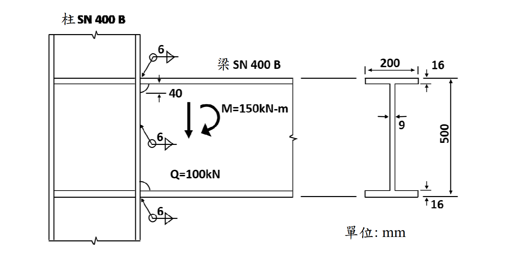

# SS-2018-3 解析

### 考題編號：SS-2018-3

**主分類：** `SS-U1-4` 接合之分析與設計
**副分類：** `SS-U2-3`（涉及 SN 鋼材特性）
**設計法：** ASD
**標籤：** `填角銲` `梁柱接頭` `ASD` `銲道容許應力` `SN400B` `箱型柱` `H型梁` `梁翼彎矩` `梁腹彎矩` `組合應力` `翼板填角銲` `方向性強度` `日本AIJ容許應力`

---

## 1. 原始題目重述 (Problem Restatement)

**題目：** 試以容許應力設計法（ASD）檢核圖中 SN400B 鋼箱型柱-H 型梁接頭之銲接尺寸。梁翼與梁腹負擔彎矩分別為 $M_f = 124.5$ kNm 與 $M_w = 25.5$ kNm。（30 分）

**已知條件（題目給定）：**

| 參數 | 數值 |
|------|------|
| 梁翼負擔彎矩 | $M_f = 124.5$ kNm |
| 梁腹負擔彎矩 | $M_w = 25.5$ kNm |
| 總彎矩 | $M = M_f + M_w = 150$ kNm |
| 設計剪力 | $Q = 100$ kN |
| 銲道容許應力 | $f_a = 90.5$ N/mm² |
| 梁腹銲喉斷面模數 | $S_w = \dfrac{2 \times 6/\sqrt{2} \times 388^2}{6} \times 10^{-3} = 212.9$ cm³ |
| 銲道外側拉應力 | $\tau_{w1} = M_w/S_w = 119.8$ N/mm² |
| 鋼材 | SN400B（JIS G3136：$F_y \ge 235$ N/mm²、$F_u = 400\text{–}510$ N/mm²；基準強度 $F = 235$ N/mm²）|

**梁斷面（H 型，尺寸取自圖形）：**

| 部位 | 尺寸 |
|------|------|
| 總高度 | 500 mm（含翼板）|
| 翼板寬度 $b_f$ | 200 mm |
| 翼板厚度 $t_f$ | 16 mm |
| 腹板厚度 $t_w$ | 9 mm |

**銲接配置（2026-08-22 以 300 dpi 影像重新判讀原始試卷確認）：**
- 梁上翼板：**6 mm 填角銲**（圖中三角形銲接符號 + 「6」）
- 梁腹板：**6 mm 填角銲**（雙面），有效長度 388 mm
- 梁下翼板：**6 mm 填角銲**
- 柱為箱型斷面，於梁翼板高度處設內橫隔板（圖中柱內水平線）

> ⚠️ **重大更正**：舊版解析將梁翼板判為「完全熔透開槽銲（CJP）」並以母材強度 $0.6F_y$ 檢核，得「OK」。經重新判讀，**圖中三處銲接符號皆為填角銲、皆標註 6 mm**（上翼板、腹板、下翼板各一），故梁翼板必須以**填角銲喉面積**檢核。更正後梁翼板銲道亦為 **NG**（見 §4）。

*圖說：梁柱接頭圖。柱為 SN400B 箱型斷面（於梁翼板高度處設內橫隔板，圖中柱內兩條水平線）；梁為 SN400B H 型斷面（總高 500 mm、翼寬 200 mm、翼厚 16 mm、腹厚 9 mm）。圖中共三個銲接符號，**皆為填角銲且皆標註「6」（mm）**：上翼板一處、腹板中央一處、下翼板一處。腹板銲道上端另標「40」（mm），為腹板端部之扇形開孔（scallop）尺寸，故腹板銲道有效長度 $= 500 - 2\times(16+40) = 388$ mm（上下各扣 56 mm），與題目所給 $S_w$ 公式中的 388 mm 相符。作用力：$M = 150$ kN·m（順時針箭頭）、$Q = 100$ kN（向下箭頭）。右側為梁斷面尺寸圖，單位 mm。*

---

## 2. 考題核心精神與出題者意圖 (Core Concepts & Examiner's Intent)

**核心觀念：** 梁柱接頭將梁端彎矩分為「梁翼負擔部分 $M_f$」與「梁腹負擔部分 $M_w$」，兩者分別由不同類型的銲道承擔。腹板銲道同時承受 $M_w$（產生彎曲應力）與 $Q$（產生剪應力），需以向量合成計算組合應力。

**出題者意圖：**
1. 考核梁柱接頭彎矩分配（翼板 vs 腹板）的物理意義
2. 考核腹板填角銲在彎矩＋剪力作用下的組合應力計算
3. 考核翼板填角銲之強度驗算（由 $M_f$ 反算翼板拉／壓力偶）
4. $\tau_{w1} = 119.8 > f_a = 90.5$，引導學生計算所需銲道尺寸

---

## 3. 解題戰略地圖與陷阱分析 (Strategic Roadmap & Trap Analysis)

**作戰計畫：**
1. 確認腹板銲道有效長度（188 mm 起迄計算）
2. 計算腹板銲道組合應力（$\tau_{w1}$：彎矩，$\tau_{w2}$：剪力，向量合成）
3. 判定 6 mm 腹板銲道 → NG，求所需最小銲道尺寸
4. 驗算梁翼接合（CJP 銲道對應翼板應力）

**關鍵陷阱：**

| 陷阱 | 說明 | 應對 |
|------|------|------|
| ❌ $\tau_{w1}$ 直接與 $f_a$ 比較即下結論 | 腹板銲道尚有剪力 $Q$ 貢獻的 $\tau_{w2}$，需向量合成才是真實應力 | 計算 $\tau_{w2}$ 後合成再比較 |
| ❌ 銲喉面積計算錯誤 | 填角銲有效喉厚 = $w/\sqrt{2} = 0.707w$，不是 $w$；且雙面銲需乘 2 | $A_w = 2 \times (w/\sqrt{2}) \times l_w$ |
| ❌ 腹板銲道長度直接用 500 mm | 銲道需留開口或返銲空間（40 mm）及翼板高度（16 mm），有效長 = 388 mm | 按題目所給 $S_w$ 公式中的 388 mm |
| ❌ 憑「彎矩接頭應為 CJP」的印象跳過翼板填角銲計算 | 本題圖面明確標示三處**皆為 6 mm 填角銲**；實務上彎矩接頭梁翼多採 CJP，但**考試須依圖作答** | 先數銲接符號、確認型式，再選公式；並可在答案中評論「實務建議改為 CJP」 |
| ❌ 誤用 $F_y = 245$ N/mm² | 245 是 **SM400A/B**（$t \le 16$ mm）之值；**SN400B 為 235** N/mm² | 由題目 $f_a = 90.5$ 反推 $F = 90.5 \times 1.5\sqrt{3} = 235$ N/mm² 可自我驗證 |

---

## 3.5 變數層次分析（Variable Hierarchy Analysis）

> 複習提示：解題後，在每個卡住的知識點「卡關?」欄標記 `⚠`；第二次複習時只看有 `⚠` 的項目。

**最終目標：** 梁腹 6 mm 填角銲組合應力 → 與容許應力比較 → NG → 求所需銲腳尺寸；梁翼 6 mm 填角銲亦以喉面積檢核 → NG → 求所需銲腳尺寸

### 主要公式（$\boxed{\phantom{x}}$ = 未知，待推導）

$$\boxed{\tau_{w1}} = \frac{M_w}{S_w} \quad \text{（彎矩引起，水平方向）}$$

$$\boxed{\tau_{w2}} = \frac{Q}{A_w} = \frac{Q}{2 \times 0.707w \times l_w} \quad \text{（剪力引起，垂直方向）}$$

$$\boxed{\tau} = \sqrt{\tau_{w1}^2 + \tau_{w2}^2} \leq f_a \quad \text{（向量合成 vs 容許應力）}$$

$$\boxed{w_{req}} = \frac{\sqrt{(M_w/S_{w0})^2 + (Q/A_{w0})^2}}{f_a} \quad \text{（反算所需銲腳尺寸）}$$

### L1：題目直接給定

| 符號 | 數值 | 說明 |
|------|------|------|
| $M_f$ | 124.5 kNm | 梁翼負擔彎矩 |
| $M_w$ | 25.5 kNm | 梁腹負擔彎矩 |
| $Q$ | 100 kN | 設計剪力 |
| $f_a$ | 90.5 N/mm² | 填角銲容許應力（ASD，規範給定） |
| $w$ | 6 mm | 腹板填角銲銲腳尺寸（初始設計） |
| $l_w$ | 388 mm | 腹板銲道有效長度（題目 $S_w$ 公式中反推） |
| $b_f$ | 200 mm | 梁翼板寬度 |
| $t_f$ | 16 mm | 梁翼板厚度 |
| $d$ | 500 mm | 梁總高度 |
| $F_y$ | 235 N/mm² | SN400B 降伏強度（JIS G3136）；基準強度 $F = 235$ N/mm² |

### L2：需知識點推導

**Step 1：腹板銲道幾何**

| 符號 | 公式 / 來源 | 卡關? |
|------|------------|:-----:|
| 喉厚 $t$ | $6/\sqrt{2} = 4.243$ mm（填角銲有效喉厚） | |
| $S_w$（6 mm） | $2 \times 4.243 \times 388^2 / 6 = 212{,}900$ mm³（題目已給） | |
| $A_w$（6 mm） | $2 \times 4.243 \times 388 = 3{,}292$ mm² | |

**Step 2：腹板銲道應力計算與合成**

| 符號 | 公式 / 來源 | 卡關? |
|------|------------|:-----:|
| $\tau_{w1}$ | $M_w / S_w = 25.5 \times 10^6 / 212{,}900 = 119.8$ N/mm²（水平） | |
| $\tau_{w2}$ | $Q / A_w = 100{,}000 / 3{,}292 = 30.4$ N/mm²（垂直） | |
| $\tau$（合成） | $\sqrt{119.8^2 + 30.4^2} = 123.6$ N/mm² > 90.5 → NG ✗ | |

**Step 3：求所需銲腳尺寸**

| 符號 | 公式 / 來源 | 卡關? |
|------|------------|:-----:|
| $S_w(w)$ | $35{,}503\,w$ mm³（線性正比於 $w$） | |
| $A_w(w)$ | $549.0\,w$ mm²（線性正比於 $w$） | |
| $w_{req}$ | $741 / 90.5 = 8.19$ mm → 採用 9 mm | |
| 9 mm 驗算 | $\tau = 82.4$ N/mm² < 90.5 → OK ✓ | |

**Step 4：梁翼 6 mm 填角銲驗算**

| 符號 | 公式 / 來源 | 卡關? |
|------|------------|:-----:|
| 力偶臂 | $d - t_f = 500 - 16 = 484$ mm | |
| $F_f$ | $M_f / 484 = 124.5 \times 10^6 / 484 = 257{,}231$ N | |
| 銲道有效長 $L_f$ | $2 b_f = 400$ mm（翼板上、下表面各一道；保守略去兩側端邊） | |
| 喉面積 | $0.707 \times 6 \times 400 = 1{,}697$ mm² | |
| $\tau_f$ | $257{,}231 / 1{,}697 = 151.6$ N/mm² > $f_a = 90.5$ → **NG ✗** | |
| $w_{req}$ | $6 \times 151.6/90.5 = 10.05$ mm → 採用 **10 mm** | |
| 母材檢核 | $\sigma_f = 257{,}231/(200\times16) = 80.4$ N/mm² < $0.6F_y = 141$ N/mm² → OK ✓ | |

### L3：深層知識（不懂就卡住）

| 知識點 | 說明 | 補強頁 | 卡關? |
|--------|------|:------:|:-----:|
| 填角銲有效喉厚 | 喉厚 = $w/\sqrt{2} = 0.707w$；ASD 應力需對喉截面積計算，不是對銲腳面積 | | |
| 腹板彎矩與剪力應力方向正交 | $\tau_{w1}$（彎矩）水平，$\tau_{w2}$（剪力）垂直，兩者需向量合成才是最大合應力 | | |
| 梁翼 CJP vs 填角銲 | **實務**上彎矩接頭梁翼多用 CJP（按母材強度設計）；**本題圖面為 6 mm 填角銲**，須按喉面積設計。兩者判準完全不同，務必先看銲接符號 | | |
| 腹板銲道有效長度推算 | 總高 500 mm，扣兩側翼板（$2 \times 16$）及返銲空間（$2 \times 40$）= 388 mm；理解每端留 56 mm | | |
| $f_a = 90.5$ N/mm² 之出處 | **日本 AIJ 鋼構造設計規準之長期許容剪應力** $f_s = F/(1.5\sqrt{3})$，$F = 235$ N/mm²（SN400B 基準強度）⇒ $235/2.598 = 90.5$ ✓。**不是**台灣規範值——台灣 ASD 表 10.2-5 為 $0.3F_{EXX} = 144.8$ N/mm²（見 §5、§6） | | |

---

## 4. 步驟化詳細計算過程 (Step-by-Step Detailed Calculation)

### 【梁腹銲道檢核】（6 mm 填角銲，雙面）

#### Step 1：確認腹板銲道幾何

由題目 $S_w$ 公式反推：

$$S_w = \frac{2 \times (6/\sqrt{2}) \times 388^2}{6} \times 10^{-3}$$

可知腹板銲道有效長度 $l_w = 388$ mm（上下各留空 56 mm = 16 mm 翼板 + 40 mm 返銲空間）

有效喉厚：$t = 6/\sqrt{2} = 4.243$ mm

#### Step 2：彎矩引起之銲道應力 $\tau_{w1}$（題目已給）

$$\tau_{w1} = \frac{M_w}{S_w} = \frac{25.5 \times 10^6}{212,900} = 119.8 \text{ N/mm}^2$$

此為腹板銲道**外側極端纖維**的彎曲剪應力（水平向）。

#### Step 3：剪力引起之銲道應力 $\tau_{w2}$

腹板銲道截面積（雙面）：
$$A_w = 2 \times t \times l_w = 2 \times 4.243 \times 388 = 3{,}292 \text{ mm}^2$$

剪力應力（垂直向）：
$$\tau_{w2} = \frac{Q}{A_w} = \frac{100{,}000}{3{,}292} = 30.4 \text{ N/mm}^2$$

#### Step 4：向量合成最大組合應力

$\tau_{w1}$（水平）與 $\tau_{w2}$（垂直）方向正交，向量合成：

$$\tau = \sqrt{\tau_{w1}^2 + \tau_{w2}^2} = \sqrt{119.8^2 + 30.4^2} = \sqrt{14352 + 924} = \sqrt{15276}$$

$$\boxed{\tau = 123.6 \text{ N/mm}^2}$$

#### Step 5：與容許應力比較

$$\tau = 123.6 \text{ N/mm}^2 > f_a = 90.5 \text{ N/mm}^2 \quad \Rightarrow \text{ NG} ✗$$

**6 mm 腹板填角銲不符合 ASD 要求。**

---

#### Step 6：求所需腹板填角銲尺寸

設所需銲腳尺寸為 $w_{\text{req}}$，喉厚 = $0.707 w_{\text{req}}$

$$S_w(w) = \frac{2 \times 0.707 w_{\text{req}} \times 388^2}{6} = 35{,}503 \, w_{\text{req}} \text{ mm}^3$$

$$A_w(w) = 2 \times 0.707 w_{\text{req}} \times 388 = 549.0 \, w_{\text{req}} \text{ mm}^2$$

組合應力：

$$\tau(w) = \sqrt{\left(\frac{M_w}{S_w}\right)^2 + \left(\frac{Q}{A_w}\right)^2} = \sqrt{\left(\frac{718.3}{w_{\text{req}}}\right)^2 + \left(\frac{182.1}{w_{\text{req}}}\right)^2}$$

$$= \frac{1}{w_{\text{req}}}\sqrt{718.3^2 + 182.1^2} = \frac{1}{w_{\text{req}}}\sqrt{515{,}995 + 33{,}160} = \frac{741}{w_{\text{req}}}$$

令 $\tau = f_a = 90.5$：

$$w_{\text{req}} = \frac{741}{90.5} = 8.19 \text{ mm} \quad \Rightarrow \text{採用 } \boxed{w = 9 \text{ mm}}$$

**驗算 9 mm 填角銲：**

| 參數 | 數值 |
|------|------|
| 喉厚 $t$ | $9 \times 0.707 = 6.364$ mm |
| $S_w$ | $2 \times 6.364 \times 388^2 / 6 = 319{,}404$ mm³ |
| $A_w$ | $2 \times 6.364 \times 388 = 4{,}938$ mm² |
| $\tau_{w1} = M_w/S_w$ | $25.5 \times 10^6 / 319{,}404 = 79.8$ N/mm² |
| $\tau_{w2} = Q/A_w$ | $100{,}000 / 4{,}938 = 20.3$ N/mm² |
| $\tau = \sqrt{\tau_{w1}^2 + \tau_{w2}^2}$ | $\sqrt{79.8^2 + 20.3^2} = \sqrt{6368+412} = 82.4$ N/mm² |
| 判定 | $82.4 < 90.5$ → **OK ✓** |

---

### 【梁翼銲道檢核】（6 mm 填角銲 —— 已更正，非 CJP）

#### Step 1：梁翼力偶臂與翼板力

梁總高度 $d = 500$ mm（含翼板），翼板厚度 $t_f = 16$ mm

$$\text{力偶臂} = d - t_f = 500 - 16 = 484 \text{ mm}$$

$$F_f = \frac{M_f}{\text{力偶臂}} = \frac{124.5 \times 10^6}{484} = 257{,}231 \text{ N} = 257.2 \text{ kN}$$

#### Step 2：翼板填角銲之有效銲長與喉面積

翼板端面頂住柱面，填角銲沿翼板**上表面與下表面**各一道：

$$L_f = 2 b_f = 2 \times 200 = 400 \text{ mm} \qquad(\text{保守取法，略去兩側端邊 } 2t_f)$$

$$A_{wf} = 0.707 w \times L_f = 0.707 \times 6 \times 400 = 1{,}697 \text{ mm}^2$$

#### Step 3：翼板銲道應力與判定

$$\tau_f = \frac{F_f}{A_{wf}} = \frac{257{,}231}{1{,}697} = \boxed{151.6 \text{ N/mm}^2} > f_a = 90.5 \text{ N/mm}^2 \;\Rightarrow\; \textbf{NG} ✗$$

#### Step 4：所需翼板銲腳尺寸

$$w_{req} = 6 \times \frac{151.6}{90.5} = 10.05 \text{ mm} \;\Rightarrow\; \text{採用} \boxed{w = 10 \text{ mm}}$$

**最大銲腳尺寸檢核**（沿 16 mm 板緣）：$w \le t_f - 2 = 14$ mm ✓

**若改採較寬鬆之有效長度** $L_f = 2b_f + 2t_f = 432$ mm：

$$\tau_f = \frac{257{,}231}{0.707 \times 6 \times 432} = 140.3 \text{ N/mm}^2 > 90.5 \;\Rightarrow\; \text{仍 NG}，\quad w_{req} = 9.30 \text{ mm} \to 10 \text{ mm}$$

兩種取法均為 NG 且均需 10 mm，結論不受有效長度取法影響。

#### Step 5：翼板母材檢核（不控制）

$$\sigma_f = \frac{F_f}{b_f t_f} = \frac{257{,}231}{200 \times 16} = 80.4 \text{ N/mm}^2 < 0.6F_y = 0.6 \times 235 = 141 \text{ N/mm}^2 \;\checkmark$$

母材有餘裕 —— **不足的是銲道，不是翼板**。這也說明：若把翼板改為 CJP 開槽銲（銲道強度等同母材），則此接頭即可成立，這正是實務上彎矩接頭梁翼採 CJP 的原因。

---

### 總結

| 接合部位 | 圖示型式 | 應力 | 容許應力 | 判定 | 所需尺寸 |
|----------|---------|------|---------|------|---------|
| 梁腹（6 mm 填角銲，雙面） | 填角銲 | 123.6 N/mm² | 90.5 N/mm² | **NG ✗** | ≥ 8.19 → **9 mm** |
| 梁翼（6 mm 填角銲） | 填角銲 | 151.6 N/mm² | 90.5 N/mm² | **NG ✗** | ≥ 10.05 → **10 mm** |
| 梁翼母材（參考） | — | 80.4 N/mm² | 141 N/mm² | OK ✓ | — |

**結論：圖示之 6 mm 填角銲尺寸不足。**

- 梁腹填角銲須由 6 mm 加大至 **9 mm**
- 梁翼填角銲須由 6 mm 加大至 **10 mm**（或改為完全熔透開槽銲 CJP，此時由母材控制，80.4 < 141 N/mm² 即 OK）

實務建議：彎矩接頭之梁翼板應採 **CJP 開槽銲**（配合箱型柱內橫隔板），梁腹板以填角銲或剪力板螺栓接合傳遞剪力，此為台灣與日本規範對抗彎接頭之標準做法。

---

## 5. 關鍵爭議點與進階探討 (Critical Issues & Advanced Discussion)

### 爭議一（本次最重要更正）：梁翼是 CJP 還是填角銲？

| 項目 | 舊版解析 | 本版（依圖面） |
|------|---------|--------------|
| 判定 | CJP 完全熔透開槽銲（「本解析判斷」） | **6 mm 填角銲**（圖中三處銲接符號皆為填角三角形 + 「6」） |
| 檢核對象 | 翼板母材斷面 $200 \times 16 = 3200$ mm² | 銲道喉面積 $0.707(6)(400) = 1697$ mm² |
| 應力 | 80.4 N/mm² | **151.6 N/mm²** |
| 容許 | $0.6F_y = 147$（用錯 $F_y=245$；應為 141） | $f_a = 90.5$ |
| 判定 | OK ✓ | **NG ✗，需 10 mm** |

判定依據：以 300 dpi 放大原始試卷後，柱右側自上而下共三個銲接符號，箭頭分別指向上翼板／腹板中央／下翼板，**三者皆為填角銲符號並標註數字 6**。題目要求「檢核圖中……接頭之銲接尺寸」，正是要考生發現圖示尺寸不足。

### 爭議二：$f_a = 90.5$ N/mm² 的真正出處（舊版說明錯誤）

舊版寫「約為 $0.6F_y \times 0.5/\sqrt{3}$」——代入得 $0.6(245)(0.5)/1.732 = 42.4$ N/mm²，與 90.5 相差甚遠，該式不成立。

**正確出處：日本 AIJ「鋼構造設計規準」之填角銲長期許容剪應力**

$$f_s = \frac{F}{1.5\sqrt{3}}$$

其中 $F$ 為鋼材基準強度。SN400B 之 $F = 235$ N/mm²：

$$f_s = \frac{235}{1.5 \times 1.7321} = \frac{235}{2.598} = \boxed{90.5 \text{ N/mm}^2} \;\checkmark$$

**反向自我驗證**：$F = f_a \times 1.5\sqrt{3} = 90.5 \times 2.598 = 235.1$ N/mm² —— 恰為 SN400B 之基準強度。此同時證明本題 $F_y$ 應取 **235**（非 245）。

$1.5\sqrt{3}$ 之組成：$\sqrt{3}$ 為 von Mises 由拉力轉剪力之係數，$1.5$ 為長期（常時）容許應力之安全係數。短期（地震／風）容許應力則為 $F/\sqrt{3} = 135.7$ N/mm²（1.5 倍）。

### 爭議三：若依台灣 ASD 規範，6 mm 腹板銲道反而合格！

台灣「鋼構造建築物鋼結構設計技術規範」（99 年）**容許應力設計法第十章表 10.2-5**：填角銲之容許剪應力 $= 0.3 \times$ 銲材標稱拉應力強度。

E70 銲條：$F_{EXX} = 70$ ksi $= 482.6$ N/mm²

$$f_{a,\text{TW}} = 0.3 \times 482.6 = \boxed{144.8 \text{ N/mm}^2}$$

| 部位 | 應力 | 日本 $f_a = 90.5$ | 台灣 $f_a = 144.8$ |
|------|------|-----------------|------------------|
| 梁腹 6 mm | 123.6 | **NG**（1.37 倍） | **OK**（0.85 倍） |
| 梁翼 6 mm | 151.6 | **NG**（1.68 倍） | **NG**（1.05 倍，僅超 5%） |

> ⚠️ **這是本題最值得注意的規範差異**：同一組銲道，依日本 AIJ 判 NG、依台灣規範腹板判 OK。差異達 **1.60 倍**（144.8/90.5），源自兩套體系的基準完全不同：
> - 日本：以**母材基準強度** $F$ 除以 $1.5\sqrt{3}$
> - 台灣／AISC：以**銲材強度** $F_{EXX}$ 乘 0.3
>
> 本題既然直接給定 $f_a = 90.5$ N/mm²，作答**必須用 90.5**；但答案中指出此差異可展現對規範體系的理解。

### 爭議四：$\tau_{w1}$ 與 $\tau_{w2}$ 之方向確為正交

腹板銲道為兩條**鉛垂**線（腹板兩側各一）：

| 來源 | 銲道上之力方向 | 相對銲道軸 |
|------|--------------|-----------|
| $M_w$（繞水平軸之彎矩） | 沿梁軸方向（水平，垂直柱面） | **橫向**（$\theta = 90°$） |
| $Q$（鉛垂剪力） | 鉛垂 | **縱向**（$\theta = 0°$） |

兩者正交 ⇒ $\tau = \sqrt{\tau_{w1}^2 + \tau_{w2}^2}$ 成立 ✓。題目稱 $\tau_{w1}$ 為「銲道外側**拉**應力」是就腹板受彎之物理而言；台灣／AISC 對填角銲一律以「喉面上之剪應力」處理，不區分拉／剪，故合成方式不變。

### 爭議五：腹板銲道有效長度 388 mm

$$l_w = d - 2t_f - 2 \times 40 = 500 - 32 - 80 = 388 \text{ mm} \;\checkmark$$

即 $500 - 2 \times (16 + 40) = 388$ mm。圖中「40」為腹板端部扇形開孔（scallop／cope）尺寸，用以避開翼板銲道之銲接可及性與熱影響區。此值與題目所給 $S_w$ 公式中的 $388^2$ 完全一致，可作為圖面判讀的交叉驗核。

### 考場實務建議

- 題目已給 $S_w$ 與 $\tau_{w1}$，核心是補上 $\tau_{w2}$ 並向量合成（1 分鐘可完成）
- **不要因為「彎矩接頭應該是 CJP」的印象而跳過翼板填角銲的計算**——本題 30 分中，翼板部分至少佔一半
- 發現 NG 後務必反算所需尺寸（題目說「檢核銲接尺寸」，隱含要給出可行尺寸）
- 建議在答案末段加一句：「實務上梁翼宜改為 CJP 開槽銲」，可加分

---

## 6. 依最新規範（AISC 360-16／-22）對照

> **本題主答案所依規範**：題目直接給定 $f_a = 90.5$ N/mm²（日本 AIJ 體系），故主答案依此值。以下對照台灣 2010 容許應力設計法與 AISC 360-16／-22。

### 6.1 三套規範之填角銲容許／設計剪應力

| 體系 | 公式 | E70 + SN400B 之值 | 相對 |
|------|------|-----------------|------|
| 日本 AIJ（本題給定） | $F/(1.5\sqrt{3})$，$F = 235$ | **90.5 N/mm²** | 1.00 |
| 台灣 2010 ASD 表 10.2-5 | $0.3 F_{EXX}$ | **144.8 N/mm²** | 1.60 |
| AISC 360-16／-22 ASD | $0.60F_{EXX}/\Omega$，$\Omega = 2.00$ | **144.8 N/mm²** | 1.60 |
| AISC 360-16／-22 LRFD | $\phi \times 0.60F_{EXX}$，$\phi = 0.75$ | 217.2 N/mm²（需因數化載重） | — |

**台灣 ASD 與 AISC 360 ASD 完全相同**：$0.3F_{EXX} \equiv 0.60F_{EXX}/2.00$。這是理解「$0.3$」由來的關鍵恆等式。

### 6.2 AISC 360-16 新增之方向性強度：兩處銲道均變為合格

AISC 360-16 §J2.4(a)（-22 移至 §J2.4b）：

$$F_{nw} = 0.60F_{EXX}\left(1.00 + 0.50\sin^{1.5}\theta\right)$$

| 部位 | 合力與銲軸夾角 $\theta$ | 方向性係數 | ASD 許可應力 | 實際應力 | 判定 |
|------|----------------------|-----------|------------|---------|------|
| 梁腹 6 mm | $\arctan(119.8/30.4) = 75.8°$ | 1.477 | $144.8 \times 1.477 = 213.9$ | 123.6 | **OK ✓** |
| 梁翼 6 mm | $90°$（純橫向拉） | 1.500 | $144.8 \times 1.500 = 217.2$ | 151.6 | **OK ✓** |

$$\Rightarrow \boxed{\text{依 AISC 360-16／-22，圖示之 6 mm 填角銲於兩處均合格}}$$

**規範間差距總覽**（同一組 6 mm 銲道）：

| 判準 | 梁腹 | 梁翼 |
|------|------|------|
| 日本 AIJ（$f_a = 90.5$，本題主答案） | NG（需 9 mm） | NG（需 10 mm） |
| 台灣 2010 ASD（144.8） | OK | NG（需 6.3 mm ≈ 7 mm） |
| AISC 360-16 ASD + 方向性（213.9 / 217.2） | OK | OK |

同一接頭在三套規範下得到三種結論，是本題最具教育價值之處：**「銲道尺寸夠不夠」在很大程度上是規範體系的問題，而非物理的問題**。

### 6.3 箱型柱—H 梁接頭之其他規範要求

| 項目 | 台灣 2010 | AISC 360-16／-22 + AISC 341-16 |
|------|----------|-------------------------------|
| 柱內橫隔板 | §10.1.2、§13（耐震） | §J10、AISC 341 §E3（韌性接頭） |
| 腹板扇形開孔 | 施工規範；本題 40 mm | AISC 341 §I2.4 對開孔幾何有規定（避免脆性破壞） |
| 抗彎接頭型式 | §13.6 要求梁翼採 CJP | AISC 341 §E3.6b 要求預審合格接頭（Prequalified，AISC 358） |
| 銲材韌性 | SN 鋼材＋低溫衝擊值 | AISC 341 §A3.4b：需求 CVN 20 ft-lb @ −20 °F（Demand Critical） |

> 若本接頭位於耐震抗彎構架，AISC 341-16 與台灣規範第十三章都會**要求梁翼採 CJP 且為 Demand Critical 銲道**，6 mm 填角銲在任何規範下都不被允許——這是超越純強度計算的層次。

### 6.4 對照總表

| 項目 | 本題主答案（$f_a = 90.5$，日本 AIJ） | 台灣 2010 ASD | AISC 360-16／-22 |
|------|-----------------------------------|--------------|-----------------|
| 容許剪應力 | 90.5 N/mm² | 144.8 N/mm² | 144.8 N/mm²（ASD）；+方向性最高 217.2 |
| 梁腹 6 mm（123.6） | **NG，需 9 mm** | OK | OK |
| 梁翼 6 mm（151.6） | **NG，需 10 mm** | NG，需 7 mm | OK |
| $F_y$（SN400B） | 235 N/mm² | 235 N/mm² | — |
| 方向性強度 | ✗ | ✗ | ✓ |

---

*修正日期：2026-08-22*
*本次修正內容：①以 300 dpi 影像重新判讀試卷附圖，確認**三處銲接符號皆為 6 mm 填角銲**，更正舊版「梁翼為 CJP 完全熔透銲」之誤判；梁翼改以銲道喉面積檢核，應力由 80.4 → **151.6 N/mm²**，判定由 OK → **NG（需 10 mm）**；②更正 SN400B 之 $F_y$：245 → **235 N/mm²**（245 為 SM400A/B 之值），$0.6F_y$ 由 147 → 141 N/mm²；③更正 $f_a = 90.5$ N/mm² 之出處：舊版「$0.6F_y \times 0.5/\sqrt{3}$」（代入得 42.4，與 90.5 不符）改為正確之日本 AIJ 長期許容剪應力 $F/(1.5\sqrt{3})$，$F = 235$（並以反推 235.1 自我驗證）；④新增「若依台灣 ASD 規範 $0.3F_{EXX} = 144.8$ N/mm²，6 mm 腹板銲反而合格」之規範差異討論；⑤補充腹板銲道 388 mm 之扇形開孔來源、$\tau_{w1}/\tau_{w2}$ 正交性論證、最大銲腳尺寸檢核；⑥新增 §6 依最新規範對照（含方向性強度使兩處銲道皆合格、AISC 341 耐震要求）。梁腹之 123.6 N/mm² 與所需 9 mm 經獨立重算確認無誤。*
*驗證狀態：unverified*
