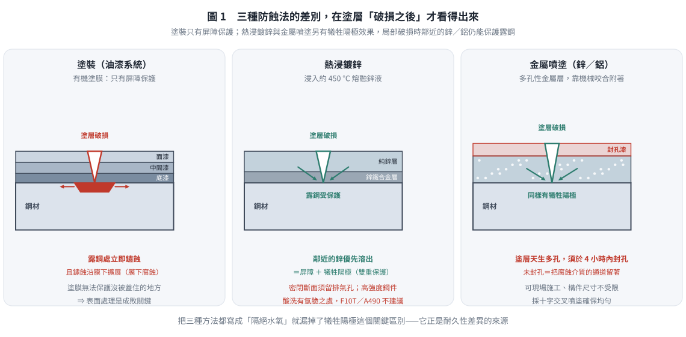
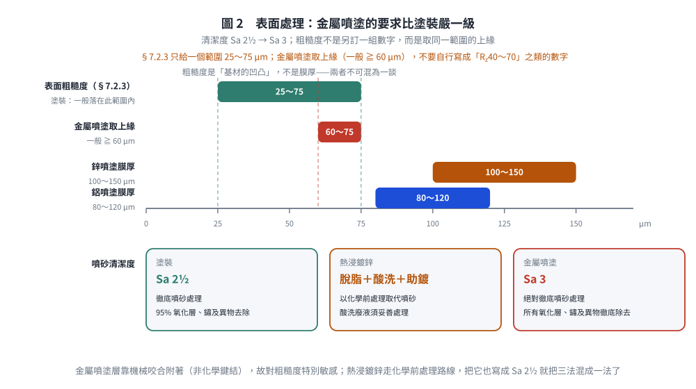
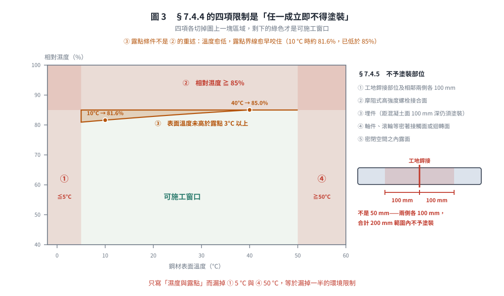

# 考題編號：SS-2019-1

**主分類：** `SS-U2-3` 設計規範對施工之要求
**副分類：** 無
**設計法：** 概念題
**標籤：** `防蝕` `塗裝` `熱浸鍍鋅` `金屬噴塗` `施工注意事項` `腐蝕機制` `表面處理` `犧牲陽極`

---

## 1. 原始題目重述 (Problem Restatement)

**題目：** 試述三種鋼結構常用的防蝕方法，並說明其施工之注意事項。（20 分）

（本題無附圖。）

---

## 2. 考題核心精神與出題者意圖 (Core Concepts & Examiner's Intent)

**核心觀念：** 鋼材腐蝕是電化學反應（鐵與水、氧接觸形成原電池），防蝕的核心策略是「隔絕」（物理屏障）或「改變電位」（犧牲陽極/陰極保護）。施工注意事項側重「防蝕效果的前提條件」。

**出題者意圖：** 三種防蝕方法各 6 分（方法說明 3 分 + 注意事項 3 分）+ 整體架構 2 分，共 20 分。答案需有清楚分類，每種方法名稱、原理、施工重點各到位。

---

## 3. 解題戰略地圖與陷阱分析 (Strategic Roadmap & Trap Analysis)

**記憶架構（三種防蝕方法）：**

| 方法 | 核心機制 | 適用場合 |
|------|---------|---------|
| 塗裝（油漆防蝕） | 物理屏障隔絕腐蝕介質 | 一般室內外鋼構，最普遍 |
| 熱浸鍍鋅 | 鋅保護層（屏障 + 犧牲陽極雙重效果） | 戶外暴露、橋梁、配件 |
| 金屬噴塗（熱噴塗） | 物理屏障 + 鋅/鋁犧牲陽極 | 大型結構、現場修補困難部位 |

---

## 3.5 變數層次分析（Variable Hierarchy Analysis）

> 複習提示：解題後，在每個卡住的知識點「卡關?」欄標記 `⚠`；第二次複習時只看有 `⚠` 的項目。

**最終目標：** 列舉三種防蝕方法（塗裝 / 熱浸鍍鋅 / 金屬噴塗），各說明防蝕機制與施工注意事項（記憶題，無計算）

### 主要公式（$\boxed{\phantom{x}}$ = 未知，待推導）

本題為說明題，無數值計算。核心邏輯框架：

$$\text{防蝕策略} = \begin{cases} \text{物理屏障（隔絕水氧）} \\ \text{犧牲陽極（鋅比鐵先腐蝕）} \\ \text{兩者兼備（最強防護）} \end{cases}$$

### L1：題目直接給定

| 符號 | 數值 | 說明 |
|------|------|------|
| 分值 | 20 分 | 三種方法各 6 分 + 整體架構 2 分 |
| 要求 | 方法名稱 + 施工注意事項 | 每種方法需說明機制與至少 2 項注意事項 |

### L2：需知識點推導

**Step 1：三種防蝕方法對比**

| 方法 | 防蝕機制 | 最關鍵施工注意事項 | 卡關? |
|------|---------|-----------------|:-----:|
| 塗裝（油漆） | 物理屏障 | 表面處理達 Sa 2½；環境限制（見下）；每層充分乾燥再塗下層 | |
| 熱浸鍍鋅 | 屏障 + 犧牲陽極 | 密閉構件預留排氣孔；高強度鋼件酸洗注意氫脆 | |
| 金屬噴塗 | 屏障 + 犧牲陽極 | 表面處理達 Sa 3；噴塗後儘速（一般 4 小時內）封孔 | |

**Step 2：各方法施工重點（考試答題核心）**

| 方法 | 表面處理等級 | 特殊限制 | 卡關? |
|------|------------|---------|:-----:|
| 塗裝 | **Sa 2½**（徹底噴砂，95% 氧化層與鏽除去）；粗糙度依施工規範 §7.2.3 一般為 **25～75 μm** | 不予塗裝之五部位（見 [[SS-2018-4]]）；環境四項限制 | |
| 熱浸鍍鋅 | 脫脂 → 酸洗（鹽酸／硫酸）→ 助鍍 | 鍍槽尺寸限制構件大小；約 450 °C 可能翹曲；密閉斷面須留排氣孔 | |
| 金屬噴塗 | **Sa 3**（絕對徹底噴砂，氧化層、鏽與異物全部除去），粗糙度取規範範圍之上緣 | 表面處理後儘速噴塗（一般 4 h 內）以免再氧化；十字交叉噴法；噴後封孔 | |

**Step 3：塗裝作業之環境限制（施工規範 §7.4.4，四項任一成立即不得塗裝）**

| # | 條件 | 卡關? |
|:-:|------|:-----:|
| ① | 溫度在 **5 °C 以下** | |
| ② | 相對濕度在 **85% 以上** | |
| ③ | 鋼材表面溫度**未高於露點 3 °C 以上** | |
| ④ | 鋼材表面溫度在 **50 °C 以上** | |

### L3：深層知識（不懂就卡住）

| 知識點 | 說明 | 補強頁 | 卡關? |
|--------|------|:------:|:-----:|
| 犧牲陽極保護原理 | 鋅電位比鐵負（更活性），鋅優先被腐蝕，即使塗層局部破損仍可保護周邊鐵 | | |
| 熱浸鍍鋅 450°C 熱影響 | 高溫使薄板翹曲、殘留應力重分布；密閉斷面不預留排氣孔可能爆裂 | | |
| 氫脆（hydrogen embrittlement） | 高強度螺栓酸洗時 H⁺ 滲入鋼中，脆性增加；需控制酸洗時間或事後去氫烘烤 | | |
| 金屬噴塗層多孔性 | 噴塗粒子冷卻後堆疊有微孔隙，需封孔底漆填充；若不封孔，腐蝕介質可由孔隙滲入 | | |
| 表面處理等級比較 | 依施工規範 §7.2.2：**Sa 3**「絕對徹底噴砂處理，所有氧化層、鐵鏽及異物徹底除去」＞ **Sa 2½**「徹底噴砂處理，經處理後 95% 之氧化層、鐵鏽及異物均去除」＞ Sa 2（商業級）。金屬噴塗要求最高，是因為附著機制純靠**機械咬合** | | |

---

## 4. 步驟化詳細計算過程 (Step-by-Step Detailed Calculation)

本題為說明題，依三種方法逐一闡述。

---

### 方法一：塗裝防蝕（油漆系統）

**方法說明：**

塗裝是最常見的鋼結構防蝕方式，透過在鋼材表面形成連續的有機（油漆）或無機（鋅粉）塗膜，隔絕水分與氧氣，阻止電化學腐蝕反應。

塗裝系統通常由三層構成：
- **底漆（Primer）：** 直接附著於鋼材表面，提供附著力與防鏽保護（常用無機鋅粉底漆、環氧底漆）
- **中間漆：** 增厚塗膜、提高屏障效果
- **面漆（Topcoat）：** 對抗紫外線、濕氣、化學侵蝕，兼顧美觀

**施工注意事項：**

1. **表面處理（最關鍵）：** 施工前必須清除油脂、鏽蝕、黑皮（軋延氧化層）、舊漆等污染物。噴砂清潔等級一般要求達 **Sa 2½**（徹底噴砂處理，經處理後 95% 之氧化層、鐵鏽及異物均去除，ISO 8501-1）；**表面粗糙度平均值依施工規範 §7.2.3 一般應在 $25 \sim 75\,\mu\text{m}$ 之間**，或依所用油漆特性另定，以確保底漆之機械附著力
2. **環境條件（施工規範 §7.4.4，任一成立即不得塗裝）：** ① 溫度 **≤ 5 °C** ② 相對濕度 **≥ 85%** ③ 鋼材表面溫度**未高於露點 3 °C 以上** ④ 鋼材表面溫度 **≥ 50 °C**
3. **塗層乾燥：** 每道塗層需充分乾燥（依塗料規格之乾燥時間與再塗間隔），方可施塗下一層，防止層間附著不良或起泡
4. **塗厚管制：** 以乾膜厚度計（DFT gauge）量測，確保達到設計膜厚，並注意最大膜厚上限（過厚易龜裂剝離）
5. **不予塗裝部位（施工規範 §7.4.5）：** ① 工地銲接部位及其**相鄰接兩側各 100 mm** ② 摩阻式高強度螺栓接合面 ③ 埋件（惟距混凝土表面 100 mm 深度內仍須塗裝）④ 軸件、滾輪等密著接觸面或迴轉面 ⑤ 密閉空間之內露面（詳見 [[SS-2018-4]]）

---

### 方法二：熱浸鍍鋅（Hot-Dip Galvanizing）

**方法說明：**

將已清潔的鋼材浸入熔融鋅液（約 450°C）中，使鋅與鋼表面形成鋅鐵合金層（外層為純鋅），提供雙重保護：
- **屏障保護：** 鋅層隔絕腐蝕介質
- **犧牲陽極保護：** 因鋅（電位較負）比鐵優先被腐蝕，即使鍍鋅層局部破損，鄰近鋅仍可保護露鋼區

**施工注意事項：**

1. **前處理：** 鋼材需依序完成脫脂、酸洗（去除氧化皮與鏽）、助鍍處理（fluxing），確保鋅液能均勻附著。酸洗通常使用鹽酸或硫酸，廢液需妥善處理
2. **設計限制：** 鋼構件尺寸受鍍鋅槽大小限制；封閉空間（如密閉箱型斷面）需預留排氣孔，避免鍍鋅時氣體膨脹造成開裂
3. **熱影響：** 450°C 高溫可能使薄板構件發生翹曲或殘留應力重新分布，設計時應注意構件剛性
4. **銲接部位：** 銲道附近的助焊劑、焊濺物需事先清除，否則影響鍍鋅附著品質；現場銲接後的修補採富鋅塗料（zinc-rich paint）補塗
5. **高強度鋼件注意：** 高強度螺栓、彈簧鋼等**高強度鋼件**（抗拉強度愈高愈敏感）酸洗時，氫原子滲入鋼中可能造成**氫脆（hydrogen embrittlement）**，須管控酸洗時間與溫度，或於鍍後儘速施以**烘烤去氫（baking）**處理；F10T／A490 級高強度螺栓一般**不建議**採熱浸鍍鋅

---

### 方法三：金屬噴塗防蝕（Thermal Spraying / Metallizing）

**方法說明：**

利用噴槍以電弧、火焰或電漿等熱源，將金屬線材（鋅、鋁或鋅鋁合金）熔化霧化後高速噴附於鋼材表面，形成多孔性金屬塗層。防蝕機制與鍍鋅類似——屏障保護加犧牲陽極效果。

金屬噴塗較熱浸鍍鋅優點：可現場施工、構件尺寸不受限，適用於大型橋梁主梁、海上結構等。

**施工注意事項：**

1. **表面處理：** 清潔與粗糙度要求皆較油漆嚴格，通常需達 **Sa 3**（絕對徹底噴砂處理，所有氧化層、鐵鏽及異物徹底除去），粗糙度取施工規範 §7.2.3 所定 $25\sim75\,\mu\text{m}$ 範圍之**上緣**（一般 $\ge 60\,\mu\text{m}$，並依噴塗材料規格另定），以確保噴塗粒子與基材的機械嵌合（金屬噴塗層與基材之附著力依靠**機械咬合**，非化學鍵結，故對粗糙度特別敏感）
2. **噴塗後封孔：** 噴塗層天生多孔，需在噴塗完成後 4 小時內塗佈封孔底漆（seal coat），填充孔隙，防止腐蝕介質滲入
3. **環境與時效：** 表面處理後應儘速（一般 4 小時內）噴塗，避免基材再氧化；環境限制比照塗裝（溫度 > 5 °C、相對濕度 < 85%、鋼材表面溫度高於露點 3 °C 以上），雨天或強風不宜施工
4. **塗層厚度：** 鋅噴塗常用 100 ~ 150 µm，鋁噴塗 80 ~ 120 µm；以渦流測厚儀量測，分區均勻噴塗
5. **重疊施工：** 採用十字交叉噴塗方式（兩個方向各噴一遍），確保塗層均勻無遺漏

---

*圖 1　三法的差別要到塗層「破損之後」才看得出來：塗裝只有屏障保護，鍍鋅與金屬噴塗另有犧牲陽極效果。本圖攔的是把三種方法都寫成「隔絕水氧」，因而漏掉耐久性差異的真正來源。*

*圖 2　金屬噴塗的表面處理比塗裝嚴一級：清潔度 Sa 2½ → Sa 3，粗糙度則是取同一範圍的上緣而非另訂一組數字。本圖攔的是自行寫出「$R_z$ 40～70」之類無出處的數字，以及把走化學前處理路線的熱浸鍍鋅也寫成 Sa 2½。*

### 彙整比較

| 項目 | 塗裝（油漆） | 熱浸鍍鋅 | 金屬噴塗 |
|------|------------|---------|---------|
| 防蝕機制 | 屏障 | 屏障 + 犧牲陽極 | 屏障 + 犧牲陽極 |
| 施工場合 | 工廠／現場均可 | 工廠（受鍍槽大小限制） | 工廠／現場均可 |
| 耐久性 | 中（需定期維護） | 高 | 高 |
| 表面處理等級 | **Sa 2½** | 脫脂 + 酸洗 + 助鍍 | **Sa 3**（最嚴格） |
| 最重要施工注意 | 表面處理徹底 + 環境四項限制 + 每層乾燥 | 密閉斷面留排氣孔 + 高強度鋼件氫脆 | 噴塗後儘速封孔（多孔性塗層）|

> 耐久年限受環境腐蝕等級（ISO 12944 C1～CX）、膜厚與維護頻率影響甚大，作答時宜以「鍍鋅／金屬噴塗之耐久性明顯高於一般油漆系統，且局部破損仍有犧牲陽極保護」定性表述，避免直接寫死年數。

---

*圖 3　§7.4.4 的四項是「任一成立即不得塗裝」，各切掉圖上一塊區域，剩下的才是可施工窗口；露點條件並非濕度條件的重述——溫度愈低它咬得愈早。本圖攔的是只寫濕度與露點而漏掉 $5$ °C 與 $50$ °C 兩項，以及把現場銲接兩側寫成 $50$ mm。*

## 5. 關鍵爭議點與進階探討 (Critical Issues & Advanced Discussion)

### 考試計分建議

本題 20 分，**三種方法各 6 分 + 整體 2 分**。每種方法建議：
- 方法名稱（1分）
- 防蝕原理/機制（2分）
- 施工注意事項列出至少 2 點（3分）

答題格式以**分項條列為佳**，閱卷老師容易掌握給分點。切勿只寫大標題而無說明內容。

### 第四種方法（補充知識）

**陰極保護（Cathodic Protection）** 雖非本題考點，但屬重要防蝕方式：
- 外加電流法（Impressed Current）：適用地下管線、海洋平台
- 犧牲陽極法（Sacrificial Anode）：鋅塊/鎂塊做犧牲陽極，適用海洋結構

建築鋼結構較少使用，故考試較不常考，但可作為補充說明。

---

*修正日期：2026-08-22 —— 回查「鋼構造建築物鋼結構施工規範」第七章原文後修訂。主要更正：① 標題格式改為 `# 考題編號：SS-2019-1`（原為「# SS-2019-1 解析」+「### 考題編號」，不符 CLAUDE-SPEC）；② 塗裝環境限制補齊 §7.4.4 之四項（≤5 °C、≥85% RH、未高於露點 3 °C、≥50 °C），原僅列濕度與露點；③ 表面粗糙度由「Sa 2.5 → $R_z$ 40～70 μm、Sa 3 → $R_z \ge 60$ μm」改為引規範 §7.2.3 之「一般 25～75 μm」並註明依油漆特性另定；④ 表面處理等級用語改為規範用語 Sa 2½／Sa 3 並附定義；⑤ 交叉引用之「不予塗裝部位」由「現場銲接兩側各 50 mm」更正為 §7.4.5 之五項與 **100 mm**；⑥「高強度螺栓（SAE 1030 等）」改為「高強度鋼件」並補去氫烘烤與 F10T／A490 不宜鍍鋅之說明；⑦ 耐久年限由寫死年數改為定性表述。詳見 `wiki/log.md` 2026-08-22 第五批。*
*圖解補繪：2026-08-29（向量圖 3 張，腳本 `gen_SS-2019-1.py`，改輸入可原地重跑；SVG 供 wiki／PDF，2× PNG 供 pptx／影片）*
