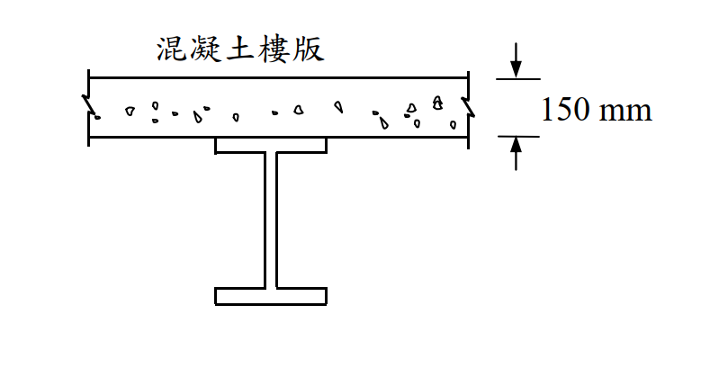

# SS-2019-2 解析

### 考題編號：SS-2019-2

**主分類：** `4.1.2` 梁桿件
**副分類：** 無
**設計法：** LRFD
**標籤：** `合成梁` `複合梁` `混凝土版` `塑性應力分布` `PNA` `正彎矩強度` `Mn` `有效寬度` `完全合成`

---

## 1. 原始題目重述 (Problem Restatement)

**題目：** 下圖所示為一鋼梁上有混凝土樓版，鋼梁有足夠的剪力釘與側向支撐。混凝土樓版的有效寬度為 2.5 m。鋼梁為 H500×200×10×16，鋼材降伏應力 $F_y = 2.5$ tf/cm²。混凝土抗壓強度 $f'_c = 210$ kgf/cm²。試以極限設計法，依合成斷面之塑性應力分布，計算此合成梁正彎矩設計強度 $M_n$。（25 分）

**已知條件：**

| 參數 | 數值 |
|------|------|
| 有效版寬 $b_e$ | 2.5 m = 250 cm |
| 混凝土版厚 $t_s$ | 150 mm = 15 cm |
| 鋼梁型號 | H500×200×10×16 |
| 鋼材降伏強度 $F_y$ | 2.5 tf/cm² |
| 混凝土抗壓強度 $f'_c$ | 210 kgf/cm² = **0.21 tf/cm²** |
| 合成程度 | 完全合成（足夠剪力釘）|

*圖說：混凝土版（有效寬 250cm，厚 15cm）直接置於鋼梁（H500×200×10×16）頂翼板上。足夠剪力釘確保完全合成作用。*

---

## 2. 考題核心精神與出題者意圖 (Core Concepts & Examiner's Intent)

**核心觀念：** 完全合成梁塑性應力分布法（PSD）的核心是「力平衡決定中性軸（PNA）位置，力矩臂決定強度」。當混凝土最大壓力 > 鋼梁全斷面降伏力時，PNA 落在混凝土版內，整個鋼梁全部降伏受拉，計算最為簡潔。

**出題者意圖：**
1. 考核單位換算（kgf/cm² → tf/cm²）
2. 考核 PNA 位置判斷（版內 vs 鋼翼 vs 鋼腹）
3. 考核塑性應力分布計算流程

---

## 3. 解題戰略地圖與陷阱分析 (Strategic Roadmap & Trap Analysis)

**作戰計畫：**
1. 確認鋼梁斷面積 $A_s$ 與全斷面降伏力 $T_{steel}$
2. 計算混凝土最大壓力 $C_{concrete,max}$
3. 比較 $T_{steel}$ 與 $C_{concrete,max}$ → 判斷 PNA 位置
4. 計算應力塊深度 $a$
5. 計算力臂 $d$，求 $M_n = T_{steel} \times d$

**關鍵陷阱：**

| 陷阱 | 說明 | 應對 |
|------|------|------|
| ❌ 單位錯誤 | $f'_c = 210$ kgf/cm²，直接套公式忘記換算 | $f'_c = 0.21$ tf/cm²（除以 1000）|
| ❌ PNA 判斷錯誤 | 直接設 PNA 在鋼翼板，跳過大小比較 | 先算 $C_{max}$ vs $T_{steel}$ |
| ❌ 力臂計算錯誤 | 從版頂到鋼翼板頂，忘記鋼梁自身高度 | 從版頂到**鋼梁形心**的距離 |
| ❌ 誤用 $\phi_b M_n$ 當 $M_n$ | 題目問 $M_n$（標稱強度），非設計強度 $\phi M_n$ | 只算 $M_n$；$\phi_b = 0.9$ 不代入 |

---

## 3.5 變數層次分析（Variable Hierarchy Analysis）

> 複習提示：解題後，在每個卡住的知識點「卡關?」欄標記 `⚠`；第二次複習時只看有 `⚠` 的項目。

**最終目標：** 計算鋼梁 $T_{steel}$ 與混凝土 $C_{max}$ → 判斷 PNA 在版內 → 求應力塊深度 $a$ → 計算力臂 $d$ → 求正彎矩標稱強度 $M_n$

### 主要公式（$\boxed{\phantom{x}}$ = 未知，待推導）

$$\boxed{T_{steel}} = A_s \times F_y \quad \text{（鋼梁全斷面降伏力）}$$

$$C_{concrete,max} = 0.85 f'_c \times b_e \times t_s \quad \text{（混凝土最大壓力，L1 可計算）}$$

$$\text{判斷：} T_{steel} < C_{concrete,max} \Rightarrow \text{PNA 在版內}$$

$$\boxed{a} = \frac{T_{steel}}{0.85 f'_c \times b_e} \quad \text{（應力塊深度）}$$

$$\boxed{d} = \left(t_s + \frac{H}{2}\right) - \frac{a}{2} \quad \text{（力臂）}$$

$$\boxed{M_n} = T_{steel} \times \boxed{d}$$

### L1：題目直接給定

| 符號 | 數值 | 說明 |
|------|------|------|
| $b_e$ | 250 cm | 混凝土版有效寬度 |
| $t_s$ | 15 cm | 混凝土版厚度 |
| 鋼梁型號 | H500×200×10×16 | H（高）×B（寬）×$t_w$×$t_f$ |
| $F_y$ | 2.5 tf/cm² | 鋼材降伏強度 |
| $f'_c$ | 210 kgf/cm² = **0.21 tf/cm²** | 混凝土抗壓強度（需換算單位） |
| 合成程度 | 完全合成 | 足夠剪力釘（$V_h = T_{steel}$） |

### L2：需知識點推導

**Step 1：鋼梁斷面幾何**

| 符號 | 公式 / 來源 | 卡關? |
|------|------------|:-----:|
| $H, b_f, t_f, t_w$ | 50 cm, 20 cm, 1.6 cm, 1.0 cm（由型號讀取） | |
| $h_w$ | $50 - 2 \times 1.6 = 46.8$ cm（腹板淨高） | |
| $A_s$ | $2(20 \times 1.6) + 46.8 \times 1.0 = 64 + 46.8 = 110.8$ cm² | |

**Step 2：PNA 位置判斷**

| 符號 | 公式 / 來源 | 卡關? |
|------|------------|:-----:|
| $T_{steel}$ | $110.8 \times 2.5 = 277$ tf | |
| $C_{concrete,max}$ | $0.85 \times 0.21 \times 250 \times 15 = 669.4$ tf | |
| PNA 判斷 | $277 < 669.4$ → PNA 在版內，鋼梁全斷面降伏受拉 | |

**Step 3：應力塊深度 $a$**

| 符號 | 公式 / 來源 | 卡關? |
|------|------------|:-----:|
| $a$ | $277 / (0.85 \times 0.21 \times 250) = 277 / 44.625 = 6.21$ cm < $t_s = 15$ cm ✓ | |

**Step 4：力臂與正彎矩強度**

| 符號 | 公式 / 來源 | 卡關? |
|------|------------|:-----:|
| $\bar{y}_C$ | $a/2 = 3.105$ cm（混凝土壓力合力距版頂） | |
| $\bar{y}_T$ | $t_s + H/2 = 15 + 25 = 40$ cm（鋼梁形心距版頂） | |
| $d$ | $40 - 3.105 = 36.895$ cm | |
| $M_n$ | $277 \times 36.895 = 10{,}220$ tf-cm $= 102.2$ tf-m | |

### L3：深層知識（不懂就卡住）

| 知識點 | 說明 | 補強頁 | 卡關? |
|--------|------|:------:|:-----:|
| PNA 三段判斷邏輯 | 先比 $T_s$ vs $C_{c,max}$：若 $T_s < C_{c,max}$ → 版內；再比上翼板；最後落腹板——每種情形計算方式不同 | | |
| 混凝土均勻壓應力 $0.85 f'_c$ | 塑性應力分布（PSD）假設混凝土受壓區均勻應力 $0.85f'_c$（非線性分布線化），是 LRFD 極限狀態假設 | | |
| 單位換算 $f'_c$ | $210 \text{ kgf/cm}^2 = 0.21 \text{ tf/cm}^2$；考場忘換算直接代入，$C_{max}$ 會大 1000 倍導致判斷錯誤 | | |
| $M_n$ vs $\phi_b M_n$ | 題目問標稱強度 $M_n$，不乘 $\phi_b = 0.9$；若問設計強度才取 $\phi_b M_n = 0.9 \times 102.2 = 92.0$ tf-m | | |
| 完全合成條件 | 「足夠剪力釘」= 完全合成（full composite）；水平剪力 $V_h = \min(T_s, C_{c,max}) = 277$ tf 全部由剪力釘傳遞 | | |

---

## 4. 步驟化詳細計算過程 (Step-by-Step Detailed Calculation)

### Step 1：鋼梁斷面幾何（H500×200×10×16）

| 尺寸 | 數值 |
|------|------|
| 總高 $H$ | 500 mm = 50 cm |
| 翼板寬度 $b_f$ | 200 mm = 20 cm |
| 翼板厚度 $t_f$ | 16 mm = 1.6 cm |
| 腹板厚度 $t_w$ | 10 mm = 1.0 cm |
| 腹板淨高 $h_w$ | $500 - 2 \times 16 = 468$ mm = 46.8 cm |

**鋼梁面積：**
$$A_s = 2(b_f \times t_f) + h_w \times t_w = 2(20 \times 1.6) + 46.8 \times 1.0 = 64 + 46.8 = 110.8 \text{ cm}^2$$

---

### Step 2：判斷 PNA 位置

**鋼梁全斷面降伏力（受拉）：**
$$T_{steel} = A_s \times F_y = 110.8 \times 2.5 = \mathbf{277 \text{ tf}}$$

**混凝土版最大壓力（版全厚均受壓時）：**
$$C_{concrete,max} = 0.85 f'_c \times b_e \times t_s = 0.85 \times 0.21 \times 250 \times 15 = \mathbf{669.4 \text{ tf}}$$

**判斷：**
$$T_{steel} = 277 \text{ tf} < C_{concrete,max} = 669.4 \text{ tf}$$

→ **PNA 落在混凝土版內**（整個鋼梁全斷面降伏受拉，混凝土版僅部分受壓）✓

---

### Step 3：計算混凝土應力塊深度 $a$

力平衡：混凝土壓力 = 鋼梁拉力

$$0.85 f'_c \times b_e \times a = T_{steel}$$

$$a = \frac{T_{steel}}{0.85 f'_c \times b_e} = \frac{277}{0.85 \times 0.21 \times 250} = \frac{277}{44.625}$$

$$\boxed{a = 6.21 \text{ cm}}$$

驗核：$a = 6.21$ cm $< t_s = 15$ cm ✓（應力塊在版厚內，假設成立）

---

### Step 4：計算力臂 $d$（版頂至各力合力中心之距離差）

**混凝土壓力合力中心（距版頂）：**
$$\bar{y}_C = \frac{a}{2} = \frac{6.21}{2} = 3.105 \text{ cm}$$

**鋼梁拉力合力中心（距版頂）：**
$$\bar{y}_T = t_s + \frac{H}{2} = 15 + \frac{50}{2} = 15 + 25 = 40 \text{ cm}$$

**力臂：**
$$d = \bar{y}_T - \bar{y}_C = 40 - 3.105 = \mathbf{36.895 \text{ cm}}$$

---

### Step 5：計算正彎矩標稱強度 $M_n$

$$M_n = T_{steel} \times d = 277 \times 36.895$$

$$\boxed{M_n = 10{,}220 \text{ tf·cm} = \mathbf{102.2 \text{ tf·m}}}$$

（$\phi_b M_n = 0.9 \times 102.2 = 92.0$ tf·m，若題目問設計強度則取此值）

---

## 5. 關鍵爭議點與進階探討 (Critical Issues & Advanced Discussion)

### 塑性應力分布（PSD）vs. 彈性應力分布

| 方法 | 適用 | 基本假設 |
|------|------|---------|
| **塑性應力分布（PSD）** | LRFD 極限狀態 | 鋼材全斷面均勻降伏；混凝土均勻壓應力 $0.85f'_c$ |
| 彈性應力分布 | ASD（容許應力法）| 平截面假設，應力線性分布 |

本題使用 PSD 法（題目指定），故不需要計算彈性中性軸或模量比 $n$。

### PNA 三種情形對應計算策略

| PNA 位置 | 條件 | 鋼梁狀態 |
|---------|------|---------|
| **混凝土版內**（本題） | $T_s < C_{c,max}$ | 全鋼降伏受拉 |
| 鋼梁上翼板內 | $C_{c,max} < T_s < C_{c,max} + 2t_f b_f F_y$ | 上翼部分受壓 |
| 鋼梁腹板內 | 其餘情形 | 上翼全部受壓，腹板部分受壓 |

本題 $T_s = 277$ tf $\ll C_{c,max} = 669$ tf，差距懸殊，PNA 在版內無疑。

### 單位換算提醒（考場高頻失分點）

$$f'_c = 210 \text{ kgf/cm}^2 = \frac{210}{1000} \text{ tf/cm}^2 = 0.21 \text{ tf/cm}^2$$

若使用 kN/m² 單位：$210 \text{ kgf/cm}^2 \times 98.07 = 20{,}595 \text{ kN/m}^2 \approx 20.6 \text{ MPa}$

### 剪力釘數量（完全合成的隱含條件）

「有足夠剪力釘」= 完全合成（full composite action），表示剪力釘可傳遞所需之水平剪力 $V_h = \min(T_{steel}, C_{c,max}) = 277$ tf。若為部分合成，需插值計算折減的 $M_n$。
