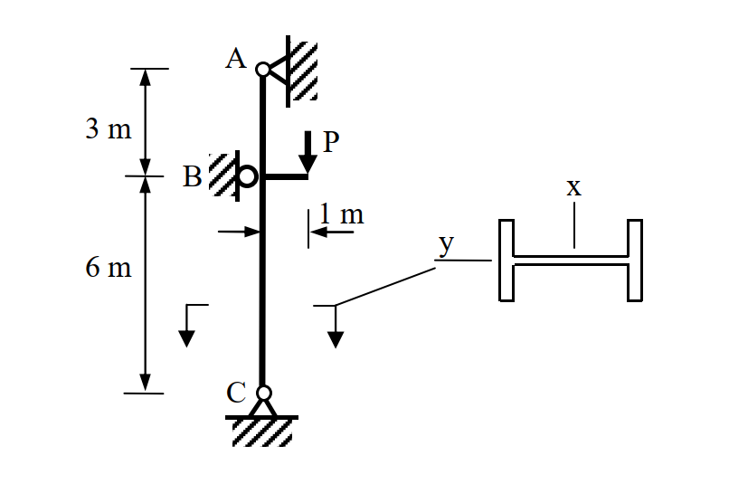

# SS-2019-3 解析

### 考題編號：SS-2019-3

**主分類：** `SS-U1-3` 梁柱桿件
**副分類：** `SS-U1-1`（壓力桿件）
**設計法：** ASD
**標籤：** `梁柱桿件` `偏心載重` `ASD` `互制公式` `Cm` `F'e` `LTB` `Cb` `有效長度` `弱軸挫屈` `彈性挫屈`

---

## 1. 原始題目重述 (Problem Restatement)

**題目：** 下圖所示為一 H 型鋼柱 H400×200×8×13，於 B 點承受偏心工作載重 $P = 12$ tf。鋼柱於 A、B 與 C 點皆有側向支撐。鋼柱為結實斷面，鋼材降伏應力 $F_y = 2.5$ tf/cm²，極限強度 $F_u = 4.1$ tf/cm²，彈性模數 $E = 2040$ tf/cm²。不考慮鋼柱自重，試依容許應力設計法，檢核鋼柱是否滿足設計需求（無需檢核剪力）。（30 分）

**已知斷面性質（H400×200×8×13）：**

| 性質 | 數值 |
|------|------|
| $A$ | 83.4 cm² |
| $I_x$ | 23,500 cm⁴（強軸）|
| $I_y$ | 1,740 cm⁴（弱軸）|
| $r_x$ | 16.8 cm |
| $r_y$ | 4.56 cm |
| $r_T$ | 5.23 cm |
| $S_x$ | 1,170 cm³ |
| $S_y$ | 174 cm³ |

**幾何配置：**
- A（頂部，鉸支）→ B（中間側向支撐，偏心載重施加點）：**3 m**
- B → C（底部，鉸支）：**6 m**
- 偏心距：**$e = 1$ m**（強軸 x 方向）

*圖說：柱長 A-C = 9m（A-B = 3m，B-C = 6m）。P = 12 tf 施加於 B 點，偏心距 1m 朝強軸方向，故彎矩作用於強軸（x 軸，$S_x = 1170$ cm³）。A、B、C 三點均有側向支撐，控制段為 B-C（6m，較長且彎矩較大）。*

**考卷給定參考公式（ASD 梁柱）：**

$$C_c = \sqrt{\frac{2\pi^2 E}{F_y}}, \quad F_a = \frac{\left[1 - \frac{(KL/r)^2}{2C_c^2}\right]F_y}{\frac{5}{3} + \frac{3}{8}\frac{KL/r}{C_c} - \frac{1}{8}\left(\frac{KL/r}{C_c}\right)^3}, \quad F_a = \frac{12\pi^2 E}{23(KL/r)^2}$$

$$L_c = \min\!\left(\frac{20b_f}{\sqrt{F_y}},\; \frac{1400}{(d/A_f)F_y}\right)$$

當 $\sqrt{7160C_b/F_y} \le L/r_T \le \sqrt{35800C_b/F_y}$：
$$F_b = \left(\frac{2}{3} - \frac{F_y(L/r_T)^2}{107600C_b}\right)F_y \le 0.6F_y$$

$$F_b = \frac{840C_b}{Ld/A_f} \le 0.6F_y, \quad C_b = 1.75 + 1.05(M_1/M_2) + 0.3(M_1/M_2)^2 \le 2.3$$

當 $f_a/F_a \le 0.15$：$\dfrac{f_a}{F_a} + \dfrac{f_{bx}}{F_{bx}} + \dfrac{f_{by}}{F_{by}} \le 1.0$

當 $f_a/F_a > 0.15$：
$$\frac{f_a}{F_a} + \frac{C_{mx}f_{bx}}{\left(1-\frac{f_a}{F_{ex}'}\right)F_{bx}} + \frac{C_{my}f_{by}}{\left(1-\frac{f_a}{F_{ey}'}\right)F_{by}} \le 1.0$$
$$\frac{f_a}{0.6F_y} + \frac{f_{bx}}{F_{bx}} + \frac{f_{by}}{F_{by}} \le 1.0$$

$$F_e' = \frac{12\pi^2 E}{23(KL_b/r_b)^2}$$

---

## 2. 考題核心精神與出題者意圖 (Core Concepts & Examiner's Intent)

**核心觀念：** 偏心載重在柱上同時產生軸壓力與彎矩，需以梁柱互制公式（beam-column interaction）綜合檢核。關鍵步驟是：正確分配彎矩圖、判斷控制段、計算 $F_a$（壓力容許應力）與 $F_b$（彎曲容許應力），再代入互制方程式。

**出題者意圖：**
1. 考核偏心載重引起的彎矩分布（矩靜力分析）
2. 考核壓力桿件容許應力 $F_a$（細長比計算、$C_c$ 判斷彈/非彈性）
3. 考核 LTB 容許彎曲應力 $F_b$（$C_b$、$L/r_T$ 計算）
4. 考核梁柱互制公式（$C_m$、$F_e'$ 的應用）

---

## 3. 解題戰略地圖與陷阱分析 (Strategic Roadmap & Trap Analysis)

**作戰計畫（7 步驟）：**
1. 靜力分析→彎矩圖
2. 計算 $f_a$
3. 計算各段 $KL/r$，判斷 $F_a$
4. 計算 $f_{bx}$（控制段最大彎矩）
5. 計算 $C_b$，判斷 LTB 範圍，求 $F_{bx}$
6. 判斷 $f_a/F_a$ 大小，選取互制公式
7. 代入互制公式，判定 OK/NG

**關鍵陷阱：**

| 陷阱 | 說明 | 應對 |
|------|------|------|
| ❌ 彎矩分布算錯 | 偏心載重在 B 點等效為軸力+集中力矩，需用靜力分析 | 分別求 A、C 的水平反力 |
| ❌ 控制段選錯 | A-B（3m，小彎矩）vs B-C（6m，大彎矩），後者控制 | 比較 $KL/r$ 與彎矩大小 |
| ❌ 誤用 $KL/ry = 65.8$（A-B段）計算 $F_a$ | 弱軸最大細長比在B-C段 $KL/r_y = 131.6$ | 取最大細長比控制 |
| ❌ $F_b$ 只用 $840C_b/(Ld/A_f)$ | 需同時計算 $L/r_T$ 對應的公式，取兩者**較大值** | 兩式都算，取 max（但不超過 $0.6F_y$）|
| ❌ $C_m$ 算錯 | B-C 段端點彎矩：B=8 tf·m，C=0 tf·m，為單曲率 | $M_1/M_2 = 0$，$C_m = 0.6$ |

## 3.5 變數層次分析（Variable Hierarchy Analysis）

> 複習提示：解題後，在每個卡住的知識點「卡關?」欄標記 `⚠`；第二次複習時只看有 `⚠` 的項目。

**最終目標：** 靜力分析求彎矩圖 → 計算 $f_a$、$F_a$（壓力容許）、$F_{bx}$（LTB 容許彎曲）→ 代入梁柱互制公式確認 DCR ≤ 1.0

### 主要公式（$\boxed{\phantom{x}}$ = 未知，待推導）

**Step 1：靜力分析（等效集中矩）**
$$\boxed{M_B} = P \times e = 12 \times 1 = 12 \text{ tf·m}$$

**Step 2：軸壓應力與壓力容許應力**
$$\boxed{f_a} = P / A, \quad C_c = \sqrt{2\pi^2 E / F_y}, \quad \boxed{F_a} = \frac{12\pi^2 E}{23(KL/r)^2}$$

**Step 3：LTB 容許彎曲應力**
$$\boxed{F_{bx}} = \max\!\left[\left(\frac{2}{3}-\frac{F_y(L/r_T)^2}{107600C_b}\right)F_y,\; \frac{840C_b}{Ld/A_f}\right] \leq 0.6F_y$$

**Step 4：梁柱互制公式（$f_a/F_a > 0.15$，取控制值）**
$$\text{互制一：}\frac{f_a}{F_a} + \frac{C_{mx}\,f_{bx}}{\left(1-f_a/\boxed{F'_{ex}}\right)F_{bx}} \leq 1.0$$
$$\text{互制二：}\frac{f_a}{0.6F_y} + \frac{f_{bx}}{F_{bx}} \leq 1.0$$

### L1：題目直接給定

| 符號 | 數值 | 說明 |
|------|------|------|
| $P$ | 12 tf | 偏心工作載重 |
| $e$ | 1 m | 偏心距（強軸方向） |
| $F_y$ | 2.5 tf/cm² | 降伏應力 |
| $E$ | 2040 tf/cm² | 彈性模數 |
| $A$ | 83.4 cm² | 斷面積（H400×200×8×13）|
| $r_x$ | 16.8 cm | 強軸迴轉半徑 |
| $r_y$ | 4.56 cm | 弱軸迴轉半徑 |
| $r_T$ | 5.23 cm | 受壓翼板迴轉半徑 |
| $S_x$ | 1,170 cm³ | 強軸彈性斷面模數 |
| $A	ext{-B}$ | 3 m | 上段長度 |
| $B	ext{-C}$ | 6 m | 下段長度（控制段）|

### L2：需知識點推導

**Step 1：靜力分析（彎矩圖）**

| 符號 | 公式 / 來源 | 卡關? |
|------|------------|:-----:|
| $M_B$ | $P 	imes e = 12$ tf·m（B 點等效集中矩）| |
| $R_A = R_C$ | $M_B / L_{AC} = 12/9 = 4/3$ tf（兩端鉸支反力）| |
| $M_{B	ext{上}}$ | $R_A 	imes 3 = 4$ tf·m（A-B 段最大彎矩）| |
| $M_{B	ext{下}}$ | $= 8$ tf·m（B-C 段最大彎矩，控制）| |

**Step 2：軸壓應力與 $F_a$（B-C 段控制）**

| 符號 | 公式 / 來源 | 卡關? |
|------|------------|:-----:|
| $f_a$ | $P/A = 12/83.4 = 0.1439$ tf/cm² | |
| $C_c$ | $\sqrt{2\pi^2 E / F_y} = 126.9$ | |
| $KL/r_y$ | $1.0 	imes 600/4.56 = 131.6 > C_c$ → 彈性挫屈 | |
| $F_a$ | $12\pi^2 E / [23(KL/r)^2] = 0.6067$ tf/cm² | |
| $f_a/F_a$ | $0.237 > 0.15$ → 須用完整互制公式 | |

**Step 3：彎曲應力與 $F_{bx}$**

| 符號 | 公式 / 來源 | 卡關? |
|------|------------|:-----:|
| $f_{bx}$ | $M_{max}/S_x = 800/1170 = 0.684$ tf/cm² | |
| $C_b$ | $1.75 + 1.05(M_1/M_2) = 1.75$（$M_1=0$，單曲率）| |
| $L/r_T$ | $600/5.23 = 114.7$，落在非彈性 LTB 區間 | |
| $F_{b1}$ | $(2/3 - F_y(L/r_T)^2/[107600 C_b]) F_y = 1.230$ tf/cm² | |
| $F_{b2}$ | $840 C_b / (L \cdot d/A_f) = 1.593 → 取上限 0.6F_y = 1.5$ tf/cm² | |
| $F_{bx}$ | $\max(1.230, 1.5) = 1.5$ tf/cm² | |

**Step 4：梁柱互制**

| 符號 | 公式 / 來源 | 卡關? |
|------|------------|:-----:|
| $C_{mx}$ | $0.6 - 0.4(M_1/M_2) = 0.6$（單曲率，$M_1=0$）| |
| $F'_{ex}$ | $12\pi^2 E / [23(KL_b/r_x)^2] = 8.24$ tf/cm²（強軸）| |
| 互制一 | $0.237 + 0.278 = 0.515 \leq 1.0$ ✓ | |
| 互制二 | $0.096 + 0.456 = 0.552 \leq 1.0$ ✓（**控制**）| |

### L3：深層知識（不懂就卡住）

| 知識點 | 說明 | 補強頁 | 卡關? |
|--------|------|:------:|:-----:|
| ASD 梁柱互制公式選擇 | $f_a/F_a$ 是否 $> 0.15$ 決定用哪個公式；兩個互制方程式皆須驗算 | [[pm-interaction]] | |
| $C_c$ 判斷彈/非彈性挫屈 | $KL/r > C_c$ → 彈性（Euler），反之 → 非彈性 | [[asd-column]] | |
| LTB 兩公式取大值 | $F_{b1}$（$L/r_T$ 線性折減）和 $F_{b2}$（$Ld/A_f$）兩式都算，取大值，且不超過 $0.6F_y$ | [[ltb-3zone]] | |
| $C_b$ 單曲率計算 | $M_1/M_2 = 0$ 時 $C_b = 1.75$；B-C 段端部彎矩 8→0，$M_1 = 0$，$M_2 = 8$ | [[cb-factor]] | |
| 偏心載重彎矩分布 | 等效集中矩 $M_B$ 在兩端鉸支柱中的靜力分析，需正確求端部反力及各段彎矩 | | |
| $F'_e$ 強/弱軸分別計算 | 互制公式中 $F'_{ex}$ 用**強軸** $r_x$ 計算（彎矩作用於強軸），不可與弱軸 $r_y$ 混用 | | |

---

## 4. 步驟化詳細計算過程 (Step-by-Step Detailed Calculation)

### Step 1：靜力分析與彎矩圖

偏心載重 $P = 12$ tf 作用在 B 點，偏心距 $e = 1$ m，等效於：
- **軸壓力** $P = 12$ tf（整根柱 A→C）
- **集中彎矩** $M_B = P \times e = 12 \times 1 = 12$ tf·m（施加於 B 點）

柱兩端 A、C 為鉸支，以水平彎矩分析求各端反力：

$$\Sigma M_C = 0 \Rightarrow R_A \times 9 = M_B \Rightarrow R_A = \frac{12}{9} = \frac{4}{3} \text{ tf}$$

$$\Sigma M_A = 0 \Rightarrow R_C \times 9 = M_B \Rightarrow R_C = \frac{4}{3} \text{ tf（方向相反）}$$

**彎矩圖（以絕對值表示）：**

| 位置 | 彎矩 |
|------|------|
| A | 0 tf·m |
| B（上）| $R_A \times 3 = \frac{4}{3} \times 3 = 4$ tf·m |
| B（下）| $4 - 12 = -8$ tf·m（∴ \|M\| = **8 tf·m**，方向相反）|
| C | 0 tf·m |

- **段 A-B（3m）**：彎矩 0 → 4 tf·m（單曲率）
- **段 B-C（6m）**：彎矩 8 → 0 tf·m（單曲率）← **控制段**

---

### Step 2：計算軸壓應力 $f_a$

$$f_a = \frac{P}{A} = \frac{12}{83.4} = \mathbf{0.1439 \text{ tf/cm}^2}$$

---

### Step 3：計算壓力容許應力 $F_a$（B-C 段控制）

**計算 $C_c$：**
$$C_c = \sqrt{\frac{2\pi^2 E}{F_y}} = \sqrt{\frac{2 \times 9.8696 \times 2040}{2.5}} = \sqrt{16{,}110} = \mathbf{126.9}$$

**B-C 段各方向細長比：**

弱軸（控制）：
$$\frac{KL}{r_y} = \frac{1.0 \times 600}{4.56} = \mathbf{131.6} \quad (\text{K=1.0，兩端鉸支})$$

強軸：
$$\frac{KL}{r_x} = \frac{1.0 \times 600}{16.8} = 35.7$$

控制：弱軸 $KL/r_y = 131.6 > C_c = 126.9$ → **彈性挫屈**

$$F_a = \frac{12\pi^2 E}{23(KL/r)^2} = \frac{12 \times 9.8696 \times 2040}{23 \times 131.6^2} = \frac{241{,}650}{398{,}327}$$

$$\boxed{F_a = 0.6067 \text{ tf/cm}^2}$$

$$\frac{f_a}{F_a} = \frac{0.1439}{0.6067} = \mathbf{0.237 > 0.15} \quad \Rightarrow \text{須使用完整互制公式}$$

---

### Step 4：計算彎曲應力 $f_{bx}$（B-C 段最大彎矩）

$$f_{bx} = \frac{M_{max}}{S_x} = \frac{8 \times 100}{1170} = \frac{800}{1170} = \mathbf{0.684 \text{ tf/cm}^2}$$

（$M_{max} = 8$ tf·m = 800 tf·cm，發生於 B 點，作用於強軸）

---

### Step 5：計算容許彎曲應力 $F_{bx}$（B-C 段）

**H400×200×8×13 斷面參數（$t_f = 13$ mm = 1.3 cm）：**

$$d = 40 \text{ cm},\quad A_f = b_f \times t_f = 20 \times 1.3 = 26 \text{ cm}^2$$

$$\frac{d}{A_f} = \frac{40}{26} = 1.538 \text{ cm}^{-1}$$

**$C_b$ 計算（B-C 段，端部彎矩 $M_2 = 8$ tf·m，$M_1 = 0$ tf·m，單曲率）：**

$$C_b = 1.75 + 1.05 \times \frac{M_1}{M_2} + 0.3\left(\frac{M_1}{M_2}\right)^2 = 1.75 + 0 + 0 = \mathbf{1.75}$$

**判斷 $L/r_T$ 範圍（$L$ = 600 cm）：**

$$\sqrt{\frac{7160 C_b}{F_y}} = \sqrt{\frac{7160 \times 1.75}{2.5}} = \sqrt{5012} = 70.8$$

$$\sqrt{\frac{35800 C_b}{F_y}} = \sqrt{\frac{35800 \times 1.75}{2.5}} = \sqrt{25060} = 158.3$$

$$\frac{L}{r_T} = \frac{600}{5.23} = 114.7$$

→ $70.8 \le 114.7 \le 158.3$ → 非彈性 LTB 區間

**LTB 公式 1（$L/r_T$ 線性折減）：**

$$F_{b1} = \left(\frac{2}{3} - \frac{F_y(L/r_T)^2}{107600\,C_b}\right)F_y = \left(\frac{2}{3} - \frac{2.5 \times 114.7^2}{107600 \times 1.75}\right) \times 2.5$$

$$= \left(0.6667 - \frac{32{,}890}{188{,}300}\right) \times 2.5 = (0.6667 - 0.1747) \times 2.5 = 1.230 \text{ tf/cm}^2$$

**LTB 公式 2（$Ld/A_f$）：**

$$F_{b2} = \frac{840\,C_b}{L \cdot d/A_f} = \frac{840 \times 1.75}{600 \times 1.538} = \frac{1470}{922.8} = 1.593 \text{ tf/cm}^2 > 0.6F_y = 1.5$$

$$\Rightarrow F_{b2} = 1.5 \text{ tf/cm}^2$$（上限 $0.6F_y$）

**取較大值：**
$$F_{bx} = \max(F_{b1},\,F_{b2}) = \max(1.230,\, 1.5) = \boxed{1.5 \text{ tf/cm}^2}$$

---

### Step 6：計算 $C_{mx}$ 與 $F'_{ex}$

**$C_{mx}$（B-C 段，$M_1/M_2 = 0$，單曲率）：**
$$C_{mx} = 0.6 - 0.4 \times \frac{M_1}{M_2} = 0.6 - 0 = \mathbf{0.6}$$

**$F'_{ex}$（強軸，B-C 段）：**
$$\frac{KL_b}{r_b} = \frac{1.0 \times 600}{r_x} = \frac{600}{16.8} = 35.71$$

$$F'_{ex} = \frac{12\pi^2 E}{23(KL_b/r_b)^2} = \frac{12 \times 9.8696 \times 2040}{23 \times 35.71^2} = \frac{241{,}650}{29{,}329} = \mathbf{8.24 \text{ tf/cm}^2}$$

---

### Step 7：代入互制公式

#### 互制公式一（$f_a/F_a > 0.15$）：

$$\frac{f_a}{F_a} + \frac{C_{mx}\,f_{bx}}{\left(1-\dfrac{f_a}{F'_{ex}}\right)F_{bx}} \le 1.0$$

$$= 0.237 + \frac{0.6 \times 0.684}{\left(1 - \dfrac{0.1439}{8.24}\right) \times 1.5} = 0.237 + \frac{0.410}{0.9825 \times 1.5}$$

$$= 0.237 + \frac{0.410}{1.474} = 0.237 + 0.278 = \mathbf{0.515} \le 1.0 \quad \checkmark$$

#### 互制公式二：

$$\frac{f_a}{0.6F_y} + \frac{f_{bx}}{F_{bx}} = \frac{0.1439}{1.5} + \frac{0.684}{1.5} = 0.096 + 0.456 = \mathbf{0.552} \le 1.0 \quad \checkmark$$

**（互制公式二控制，DCR = 0.552）**

---

### 結論

$$\boxed{\text{鋼柱 H400×200×8×13 滿足 ASD 設計需求（控制 DCR = 0.552 < 1.0）} \quad \checkmark}$$

---

## 5. 關鍵爭議點與進階探討 (Critical Issues & Advanced Discussion)

### 偏心載重的彎矩分布（最容易出錯處）

偏心載重 $P = 12$ tf，$e = 1$ m，等效集中矩 $M_B = 12$ tf·m 施加於 B。

對一兩端鉸支之柱（A-C），集中矩 $M_B$ 引起之端部反力：

$$R_A = R_C = \frac{M_B}{L} = \frac{12}{9} = \frac{4}{3} \text{ tf（方向相反）}$$

B 點上方（A-B）最大彎矩 = $R_A \times 3 = 4$ tf·m；B 點下方（B-C）最大彎矩 = $R_C \times 6 = 8$ tf·m。

**記憶口訣：** 「近端小、遠端大」——$M_B$ 離 C 較遠（6m），C 端的反力矩 = $M_B \times a/L = 12 \times 3/9 = 4$ tf·m，B 點彎矩從 C 那側看 = $4/3 \times 6 = 8$ tf·m。

### 弱軸細長比跨越 $C_c$ 的處理

$KL/r_y = 131.6$ 略大於 $C_c = 126.9$，代表鋼柱「恰好」在彈性挫屈範圍。若計算 $C_c$ 稍有誤差，可能算成非彈性（對答案影響不大，但務必寫清楚判斷過程）。

### A-B 段（3m）驗算（補充）

弱軸 $KL/r_y = 300/4.56 = 65.8 < C_c$ → 非彈性挫屈：
$$F_a^{AB} \approx 1.175 \text{ tf/cm}^2, \quad f_a/F_a = 0.122 < 0.15$$
→ 簡化互制：$0.122 + 4 \text{ tf·m}/1170 \text{ cm}^3 / 1.5 = 0.122 + 0.228 = 0.350 \le 1.0$ ✓（A-B 段輕鬆通過）
