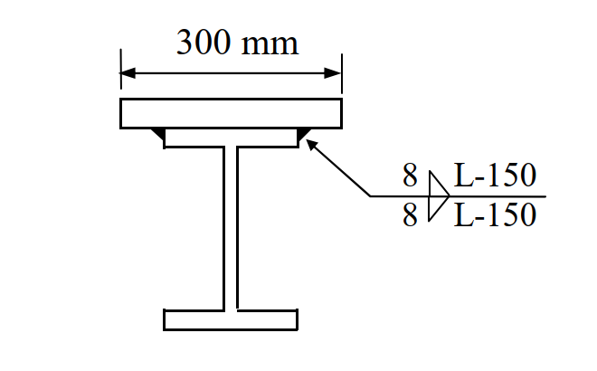

# SS-2019-4 解析

### 考題編號：SS-2019-4

**主分類：** `SS-U1-4` 接合之分析與設計
**副分類：** `SS-U1-2`（梁桿件組合斷面）
**設計法：** LRFD
**標籤：** `填角銲` `斷續銲接` `蓋板` `組合斷面` `剪力流` `水平剪力` `銲道長度` `LRFD` `E70XX` `間斷銲`

---

## 1. 原始題目重述 (Problem Restatement)

**題目：** 下圖所示組合斷面為一 H 型鋼 H500×200×9×16（mm）上翼板銲接一鋼板 PL25×300（mm），該斷面承受因數化載重彎矩 25 tf-m 與剪力 50 tf。型鋼與鋼板之鋼材降伏應力皆為 $F_y = 2.5$ tf/cm²。鋼板與型鋼的銲接使用腳長為 8 mm 的填角銲，銲條為 E70XX，$F_{EXX} = 4.9$ tf/cm²。銲接為斷續銲接，銲道中心至中心距離為 150 mm。試以極限設計法，計算所需斷續銲道長度 $L$ 為何。（25 分）

**已知條件：**

| 參數 | 數值 |
|------|------|
| H 型鋼 | H500×200×9×16（H=500mm，$b_f$=200mm，$t_w$=9mm，$t_f$=16mm）|
| 蓋板 | PL25×300（厚 25mm，寬 300mm）|
| 因數化彎矩 $M_u$ | 25 tf·m |
| 因數化剪力 $V_u$ | 50 tf |
| 填角銲腳長 $w$ | 8 mm = 0.8 cm |
| 銲條 | E70XX，$F_{EXX} = 4.9$ tf/cm² |
| 銲接型式 | 斷續銲（雙面），間距 $s = 150$ mm = 15 cm |
| 計算目標 | 每段所需銲道長度 $L$ |
| 參考公式 | $\phi \cdot 0.6F_{EXX}$，$\phi = 0.75$ |



*圖說：蓋板（PL25×300mm）銲接於 H 型鋼頂翼板上方。兩側各一道 8mm 填角銲（雙面），斷續施工，銲道間距（中心至中心）= 150mm。蓋板寬 300mm > H 翼板寬 200mm，銲道沿 H 翼板邊緣施作。*

---

## 2. 考題核心精神與出題者意圖 (Core Concepts & Examiner's Intent)

**核心觀念：** 蓋板與 H 型鋼之間的水平介面需傳遞「剪力流（shear flow）」。剪力流 $q = V_u Q/I$ 代表單位長度介面所受的水平剪力；斷續銲道每段須承擔一個間距 $s$ 內的剪力流合力。

**出題者意圖：**
1. 考核組合斷面性質計算（$I_{composite}$、$Q$）
2. 考核剪力流公式的應用（$q = VQ/I$）
3. 考核 LRFD 填角銲容許強度計算
4. 考核斷續銲道長度求解

---

## 3. 解題戰略地圖與陷阱分析 (Strategic Roadmap & Trap Analysis)

**作戰計畫：**
1. 計算組合斷面（H + 蓋板）之形心位置 $\bar{y}$
2. 計算組合斷面慣性矩 $I_{composite}$
3. 計算蓋板對形心的靜矩 $Q$
4. 計算剪力流 $q = V_u Q / I$
5. 計算每個間距 $s$ 內的剪力力 $F_s = q \times s$
6. 計算每 cm 銲道的承載力 $\phi R_n$（雙面銲）
7. 求解 $L = F_s / \phi R_n$

**關鍵陷阱：**

| 陷阱 | 說明 | 應對 |
|------|------|------|
| ❌ 忘記加蓋板後形心偏移 | 直接用 H 型鋼自身形心，$Q$ 計算錯誤 | 必須先求組合斷面形心 |
| ❌ $I$ 用 H 型鋼自身 $I_x$ | 組合斷面 $I$ 需含蓋板的平行軸貢獻 | 用平行軸定理 $I = I_H + A_H d_H^2 + I_{PL} + A_{PL} d_{PL}^2$ |
| ❌ 只計一條銲道 | 蓋板兩側各一道（共兩道），容量需乘 2 | $\phi R_n = 2 \times \phi \cdot 0.6F_{EXX} \cdot t_e \cdot L$ |
| ❌ 有效喉厚算錯 | 填角銲喉厚 $t_e = 0.707 \times w$，不是 $w$ 本身 | $t_e = 0.707 \times 0.8 = 0.566$ cm |
| ❌ 用 $M_u$ 計算剪力流 | 剪力流來自剪力 $V_u$，不是彎矩 | $q = V_u Q/I$（僅用剪力）|


## 3.5 變數層次分析（Variable Hierarchy Analysis）

> 複習提示：解題後，在每個卡住的知識點「卡關?」欄標記 `⚠`；第二次複習時只看有 `⚠` 的項目。

**最終目標：** 計算組合斷面 $I_{composite}$、蓋板靜矩 $Q$ → 剪力流 $q = V_u Q/I$ → 每間距剪力合力 $F_s$ → 解出斷續銲道長度 $L$

### 主要公式（$\boxed{\phantom{x}}$ = 未知，待推導）

$$\boxed{\bar{y}} = \frac{\sum A_i y_i}{A_{total}}, \quad \boxed{I_{composite}} = \sum(I_0 + Ad^2)$$
$$\boxed{Q} = A_{PL} \times (\bar{y}_{PL} - \bar{y}_{composite})$$
$$\boxed{q} = \frac{V_u \cdot Q}{I_{composite}}, \quad \boxed{F_s} = q \times s$$
$$\boxed{L} \geq \frac{F_s}{\phi R_n / \text{cm}} = \frac{F_s}{2 \times \phi \times 0.6 F_{EXX} \times t_e}$$

### L1：題目直接給定

| 符號 | 數值 | 說明 |
|------|------|------|
| H 型鋼 | H500×200×9×16 | $H$=50cm，$b_f$=20cm，$t_w$=0.9cm，$t_f$=1.6cm |
| 蓋板 PL | 25×300 mm | 厚 2.5cm，寬 30cm |
| $V_u$ | 50 tf | 因數化剪力 |
| $M_u$ | 25 tf·m | 因數化彎矩（計算剪力流不用）|
| $w$ | 8 mm = 0.8 cm | 填角銲腳長 |
| $F_{EXX}$ | 4.9 tf/cm² | E70XX 銲條強度 |
| $\phi$ | 0.75 | LRFD 銲接折減係數 |
| $s$ | 150 mm = 15 cm | 斷續銲間距（中心至中心）|

### L2：需知識點推導

**Step 1：組合斷面形心**

| 符號 | 公式 / 來源 | 卡關? |
|------|------------|:-----:|
| $A_H$ | $2(20 	imes 1.6) + 46.8 	imes 0.9 = 106.12$ cm² | |
| $A_{PL}$ | $2.5 	imes 30 = 75$ cm² | |
| $ar{y}_{composite}$ | $\sum A_i y_i / A_{total} = 6496.75/181.12 = 35.87$ cm（自 H 底部）| |

**Step 2：組合慣性矩**

| 符號 | 公式 / 來源 | 卡關? |
|------|------------|:-----:|
| $I_H$ | $[20 	imes 50^3 - 19.1 	imes 46.8^3]/12 = 45{,}183$ cm⁴ | |
| $I_{composite}$ | 平行軸定理：$57{,}726 + 17{,}784 = 75{,}510$ cm⁴ | |

**Step 3：靜矩與剪力流**

| 符號 | 公式 / 來源 | 卡關? |
|------|------------|:-----:|
| $Q$ | $A_{PL} 	imes d_{PL} = 75 	imes 15.38 = 1{,}153.5$ cm³ | |
| $q$ | $V_u Q / I = 50 	imes 1153.5 / 75510 = 0.7638$ tf/cm | |
| $F_s$ | $q 	imes s = 0.7638 	imes 15 = 11.46$ tf | |

**Step 4：銲道承載力與銲道長度**

| 符號 | 公式 / 來源 | 卡關? |
|------|------------|:-----:|
| $t_e$ | $0.707 	imes w = 0.707 	imes 0.8 = 0.566$ cm（有效喉厚）| |
| $\phi R_n$/cm | $2 	imes 0.75 	imes 0.6 	imes 4.9 	imes 0.566 = 2.494$ tf/cm（雙面兩道銲）| |
| $L$ | $F_s / (\phi R_n/	ext{cm}) = 11.46/2.494 = 4.59$ cm → 取 **5 cm** | |

### L3：深層知識（不懂就卡住）

| 知識點 | 說明 | 補強頁 | 卡關? |
|--------|------|:------:|:-----:|
| 剪力流公式 $q = VQ/I$ | 來自微元體水平力平衡；$q$ 僅與剪力 $V_u$ 有關，彎矩 $M_u$ 不參與計算 | | |
| 組合斷面形心偏移 | 蓋板貼上後形心上移，必須重新計算 $ar{y}$；否則 $Q$ 和 $I$ 均錯誤 | | |
| 平行軸定理（$I = I_0 + Ad^2$）| 各構件自身慣性矩加上面積乘偏移量平方；蓋板薄但偏移大，$Ad^2$ 貢獻大 | | |
| 填角銲有效喉厚 $t_e = 0.707w$ | 填角銲設計強度基於有效喉面積；$t_e 
eq w$（腳長非喉厚）| | |
| 雙面銲道計算（$	imes 2$）| 蓋板兩側各一道銲，每 cm 承載力為 $2 	imes \phi 	imes 0.6F_{EXX} 	imes t_e$；常忘乘 2 | | |

---

## 4. 步驟化詳細計算過程 (Step-by-Step Detailed Calculation)

### Step 1：組合斷面幾何

**H500×200×9×16 斷面積：**
$$A_H = 2(20 \times 1.6) + (50 - 3.2) \times 0.9 = 64 + 46.8 \times 0.9 = 64 + 42.12 = 106.12 \text{ cm}^2$$

Wait：腹板高 = $500 - 2 \times 16 = 468$ mm = 46.8 cm

$$A_H = 2(20 \times 1.6) + 46.8 \times 0.9 = 64 + 42.12 = 106.12 \text{ cm}^2$$

**蓋板面積：**
$$A_{PL} = 2.5 \times 30 = 75 \text{ cm}^2$$

**總面積：**
$$A_{total} = 106.12 + 75 = 181.12 \text{ cm}^2$$

---

### Step 2：計算組合斷面形心（以 H 型鋼底部纖維為基準，$y = 0$）

| 構件 | 面積 $A$ (cm²) | 形心 $\bar{y}$ (cm) | $A\bar{y}$ (cm³) |
|------|-------------|-------------------|-----------------|
| H 型鋼 | 106.12 | 25.0（H/2）| 2,653.0 |
| 蓋板 PL | 75.00 | 51.25（$50 + 2.5/2$）| 3,843.75 |
| **合計** | **181.12** | — | **6,496.75** |

$$\bar{y}_{composite} = \frac{6496.75}{181.12} = \mathbf{35.87 \text{ cm（自 H 底部）}}$$

---

### Step 3：計算組合斷面慣性矩 $I_{composite}$

**H 型鋼自身慣性矩（$I_x$ 計算）：**
$$I_H = \frac{b_f H^3 - (b_f - t_w)(H - 2t_f)^3}{12} = \frac{20 \times 50^3 - (20-0.9) \times 46.8^3}{12}$$
$$= \frac{20 \times 125000 - 19.1 \times 102503}{12} = \frac{2{,}500{,}000 - 1{,}957{,}807}{12} = \frac{542{,}193}{12} = 45{,}183 \text{ cm}^4$$

**各構件對組合形心的慣性矩（平行軸定理）：**

| 構件 | $I_0$ (cm⁴) | $A$ (cm²) | $d = \bar{y}_i - 35.87$ (cm) | $Ad^2$ (cm⁴) | $I_{total}$ (cm⁴) |
|------|-----------|---------|---------------------------|------------|-----------------|
| H 型鋼 | 45,183 | 106.12 | $25.0 - 35.87 = -10.87$ | $106.12 \times 118.2 = 12{,}543$ | 57,726 |
| 蓋板 PL | $\frac{30 \times 2.5^3}{12} = 39$ | 75.00 | $51.25 - 35.87 = 15.38$ | $75 \times 236.6 = 17{,}745$ | 17,784 |

$$I_{composite} = 57{,}726 + 17{,}784 = \mathbf{75{,}510 \text{ cm}^4}$$

---

### Step 4：計算蓋板靜矩 $Q$（對組合斷面形心）

$$Q = A_{PL} \times d_{PL} = 75 \times (51.25 - 35.87) = 75 \times 15.38 = \mathbf{1{,}153.5 \text{ cm}^3}$$

---

### Step 5：計算剪力流 $q$

$$q = \frac{V_u \times Q}{I_{composite}} = \frac{50 \times 1{,}153.5}{75{,}510} = \frac{57{,}675}{75{,}510} = \mathbf{0.7638 \text{ tf/cm}}$$

---

### Step 6：計算每間距內的剪力合力 $F_s$

$$F_s = q \times s = 0.7638 \times 15 = \mathbf{11.46 \text{ tf}}$$

---

### Step 7：計算每 cm 銲道承載力（雙面填角銲）

**填角銲有效喉厚：**
$$t_e = 0.707 \times w = 0.707 \times 0.8 = 0.566 \text{ cm}$$

**LRFD 填角銲設計強度（每 cm 長度，雙面兩道銲）：**
$$\phi R_n = 2 \times \phi \times 0.6 F_{EXX} \times t_e = 2 \times 0.75 \times 0.6 \times 4.9 \times 0.566$$

$$= 2 \times 0.75 \times 2.94 \times 0.566 = 2 \times 1.247 = \mathbf{2.494 \text{ tf/cm}}$$

---

### Step 8：求解所需銲道長度 $L$

$$F_s \le \phi R_n \times L$$

$$L \ge \frac{F_s}{\phi R_n} = \frac{11.46}{2.494} = \mathbf{4.59 \text{ cm}}$$

**最小銲道長度規定：** $L_{min} = 4w = 4 \times 0.8 = 3.2$ cm（已滿足）

$$\boxed{L = 4.59 \text{ cm} \approx \mathbf{5 \text{ cm（50 mm）}}}$$

**驗核：**
$$\phi R_n \times L = 2.494 \times 5 = 12.47 \text{ tf} > F_s = 11.46 \text{ tf} \quad \checkmark$$

---

### 斷續銲道示意

```
┌───蓋板 PL25×300───┐
│←─ L=5cm ─→← 10cm 空隙 →←─ L=5cm ─→│
└────────────────────────────────────┘
         ←────── s = 15cm ──────→
```

填充率 = $L/s = 5/15 = 33\%$

---

## 5. 關鍵爭議點與進階探討 (Critical Issues & Advanced Discussion)

### 為何剪力流只與 $V_u$ 有關，而非 $M_u$？

剪力流公式 $q = VQ/I$ 的推導來自微元體水平力平衡：

$$q = \frac{dM}{dx} \cdot \frac{Q}{I} = V \cdot \frac{Q}{I}$$

任意截面的水平剪力均由**剪力（V）**而非彎矩直接決定。彎矩影響的是**正應力分布**，而非水平介面剪力。

$M_u = 25$ tf·m 在本題的作用是作為**額外資訊**（可用以驗算斷面彎矩容量是否足夠），但計算銲道時不直接使用。

### 斷續銲道最大間距規定

依規範，斷續填角銲的最大間距有上限（防止版件因局部挫屈而翹起）：

- 壓力構件：$s \le 12t$ 或 200mm（取小值），其中 $t$ 為被連結薄板厚度
- 拉力構件：$s \le 16t$ 或 200mm

本題 $s = 150$ mm，需確認 $\le$ 相關限制值。

### 蓋板寬度（300mm）> 翼板寬度（200mm）的處理

蓋板較翼板寬，代表蓋板會有 $(300-200)/2 = 50$ mm 的懸挑部分。銲道仍沿 H 型鋼頂翼板邊緣施作（兩道），傳力路徑合理。對 $Q$ 和 $I$ 的計算則以蓋板完整面積計算，不影響公式。

### 本題若改用連續銲道

若採連續銲道（$s \to 0$，即每 1cm 都銲），所需的最小腳長：

$$w_{req} = \frac{q}{\phi \times 0.6F_{EXX} \times 0.707 \times 2} = \frac{0.7638}{0.75 \times 0.6 \times 4.9 \times 0.707 \times 2} = \frac{0.7638}{3.119} = 0.245 \text{ cm} = 2.45 \text{ mm}$$

遠小於 8mm，可見斷續銲道在此情形合理，且有多餘容量。
