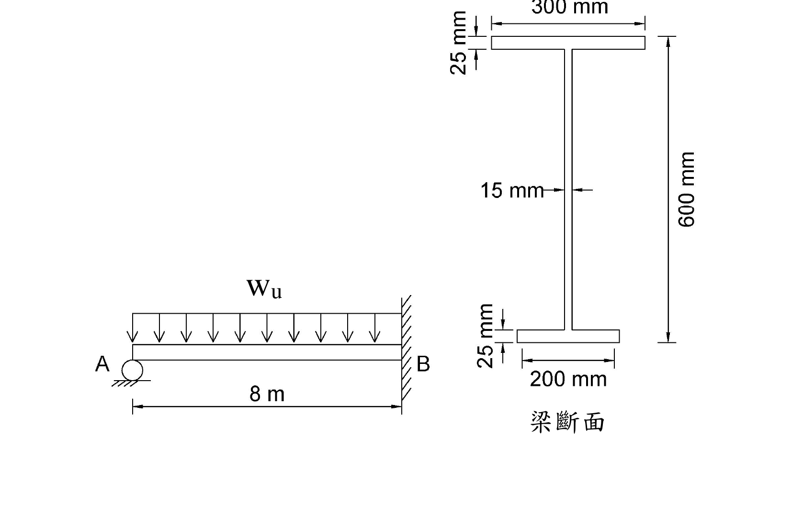

# 考題編號：SS-2020-2

**主分類：** `4.2.1` 塑性分析與設計
**副分類：** `4.1.2` 梁桿件
**設計法：** 塑性分析
**標籤：** `塑性分析` `塑性鉸` `虛功法` `一端固定一端滾支` `懸臂梁` `均佈載重` `極限載重` `非對稱H型鋼` `塑性斷面模數` `中性軸` `半面積法`

---

## 1. 原始題目重述 (Problem Restatement)

下圖所示為一承受均佈載重 $w_u$ 之鋼梁桿件，兩端分別為滾支承（A 端）及固定端（B 端），梁斷面如圖所示（非對稱 H 型鋼），假設鋼梁有充分之側向支撐，且斷面為結實斷面，材料強度 $F_y = 2.5$ tf/cm²，試依塑性分析，求此鋼梁可承受之極限均佈載重 $w_u$。（25 分）

**梁斷面（非對稱 H 型鋼）：**
- 上翼板：寬 300 mm（30 cm），厚 25 mm（2.5 cm）
- 腹板：厚 15 mm（1.5 cm），高 550 mm（55 cm）
- 下翼板：寬 200 mm（20 cm），厚 25 mm（2.5 cm）
- 總高：300 + 550 + 250 mm → 600 mm（60 cm）（兩翼板各25mm + 腹板550mm）

**結構型式：** 跨度 $L = 8$ m = 800 cm，A 端滾支承，B 端固定端，全跨均佈載重 $w_u$（tf/cm）

*圖說：左圖為梁斷面（正視圖），上翼板寬 30 cm、厚 2.5 cm，腹板高 55 cm、厚 1.5 cm，下翼板寬 20 cm、厚 2.5 cm，總高 60 cm。右圖為結構示意，A 端為滾支承（下方），B 端為固定端（右方），跨度 L=8m=800cm，$w_u$ 為均向下作用之均佈載重。*

---

## 2. 考題核心精神與出題者意圖 (Core Concepts & Examiner's Intent)

**核心觀念：塑性機構法（虛功法）+ 非對稱斷面之塑性斷面模數計算**

本題測驗兩個環節：

1. **計算非對稱 H 型鋼的塑性斷面模數 $Z_x$**
   - 等面積中性軸（PNA）不在幾何中心，需用「半面積法」求 PNA 位置
   - PNA 將斷面分為上下等面積，$Z_x = $ 上半面積對 PNA 之一次矩 + 下半面積對 PNA 之一次矩

2. **計算一端固定一端滾支梁（propped cantilever）承受 UDL 之極限載重**
   - 靜定度 = 1（一次靜不定），需形成 **2 個** 塑性鉸才能成為機構
   - 最佳機構：固定端 B 形成第一個鉸（$M = M_p$），跨內距 A 端 $x = L(\sqrt{2}-1)$ 處形成第二個鉸

**出題者測驗重點：**
- 等面積中性軸定位（半面積法）
- $Z_x$ 的積分計算（上下兩部分各自對 PNA 求一次矩）
- 虛功法建立方程式，並對 $x$ 求最小 $w_u$（或最大機構條件）

---

## 3. 解題戰略地圖與陷阱分析 (Strategic Roadmap & Trap Analysis)

**步驟規劃：**
1. 計算各部位面積，求總面積 $A_g$
2. 以半面積法找塑性中性軸（PNA）位置
3. 計算塑性斷面模數 $Z_x$（上下分區求一次矩後相加）
4. 計算塑性彎矩 $M_p = F_y \cdot Z_x$
5. 用虛功法（機構法）推導 $w_u$ 的公式
6. 對機構最優位置求最小 $w_u$（或直接用一次靜不定分析結果）

**關鍵陷阱：**

> ⚠️ **陷阱1：誤將幾何中心當塑性中性軸**
> 本題斷面非對稱，上翼板（30cm×2.5cm=75cm²）≠ 下翼板（20cm×2.5cm=50cm²），幾何中心 ≠ 等面積中性軸。必須用半面積法求 PNA 位置。

> ⚠️ **陷阱2：混淆塑性斷面模數 Zx 與彈性斷面模數 Sx**
> 塑性分析用 $M_p = F_y Z_x$，$Z_x$ ≠ $S_x$（彈性斷面模數）。

> ⚠️ **陷阱3：遺忘腹板貢獻**
> 計算 $Z_x$ 時，腹板上下兩半各自對 PNA 有不小的貢獻，不可只計算翼板。

> ⚠️ **陷阱4：虛功法的角度計算**
> 兩段梁的轉角與 $\delta$（虛位移）的關係：$\theta_1 = \delta/x$（A端到鉸），$\theta_2 = \delta/(L-x)$（鉸到B端），總轉角要正確。

## 3.5 變數層次分析（Variable Hierarchy Analysis）

> 複習提示：解題後，在每個卡住的知識點「卡關?」欄標記 `⚠`；第二次複習時只看有 `⚠` 的項目。

**最終目標：** 以半面積法求非對稱 H 型鋼之 $Z_x$ → 計算 $M_p$ → 虛功法對最優機構位置求極限均佈載重 $w_u$

### 主要公式（$\boxed{\phantom{x}}$ = 未知，待推導）

**Step 1：等面積中性軸（PNA）**
$$\frac{A_g}{2} = 103.75 \text{ cm}^2, \quad \boxed{d_{PNA}} = \frac{A_g/2 - A_{\text{上翼板}}}{t_w}$$

**Step 2：塑性斷面模數**
$$\boxed{Z_x} = \sum A_i |\bar{y}_i - y_{PNA}|$$

**Step 3：塑性彎矩**
$$\boxed{M_p} = F_y \cdot \boxed{Z_x}$$

**Step 4：虛功法（最優機構）**
$$\boxed{x} = L(\sqrt{2}-1), \quad \boxed{w_u} = \frac{2(1+\sqrt{2})^2 M_p}{L^2}$$

### L1：題目直接給定

| 符號 | 數值 | 說明 |
|------|------|------|
| 上翼板 | 30cm × 2.5cm | 寬 300mm，厚 25mm |
| 腹板 | 1.5cm × 55cm | 厚 15mm，高 550mm |
| 下翼板 | 20cm × 2.5cm | 寬 200mm，厚 25mm |
| 總高 | 60 cm | 兩翼板各 2.5cm + 腹板 55cm |
| $L$ | 8 m = 800 cm | 梁跨距 |
| 支承條件 | A 端滾支、B 端固定 | 一次靜不定，需 2 個塑性鉸 |
| $F_y$ | 2.5 tf/cm² | 降伏應力 |

### L2：需知識點推導

**Step 1：斷面面積**

| 符號 | 公式 / 來源 | 卡關? |
|------|------------|:-----:|
| $A_1$（上翼板）| $30 	imes 2.5 = 75$ cm² | |
| $A_2$（腹板）| $1.5 	imes 55 = 82.5$ cm² | |
| $A_3$（下翼板）| $20 	imes 2.5 = 50$ cm² | |
| $A_g$ | $75 + 82.5 + 50 = 207.5$ cm² | |

**Step 2：PNA 位置（半面積法）**

| 符號 | 公式 / 來源 | 卡關? |
|------|------------|:-----:|
| 半面積 | $207.5/2 = 103.75$ cm² | |
| PNA 在腹板 | 上翼板 75 cm² < 103.75 → PNA 落在腹板中 | |
| $d_{PNA}$ | $(103.75 - 75)/1.5 = 19.17$ cm（距上翼板底面）| |
| $ar{y}_{PNA}$ | $2.5 + 19.17 = 21.67$ cm（距頂面）| |

**Step 3：塑性斷面模數 $Z_x$**

| 符號 | 公式 / 來源 | 卡關? |
|------|------------|:-----:|
| $Z_1$（上翼板）| $75 	imes (21.67 - 1.25) = 1{,}531.5$ cm³ | |
| $Z_2$（腹板上半）| $28.755 	imes (19.17/2) = 275.7$ cm³ | |
| $Z_3$（腹板下半）| $53.745 	imes (35.83/2) = 962.9$ cm³ | |
| $Z_4$（下翼板）| $50 	imes (58.75 - 21.67) = 1{,}854.0$ cm³ | |
| $Z_x$ | $1531.5 + 275.7 + 962.9 + 1854.0 = 4{,}624$ cm³ | |
| $M_p$ | $2.5 	imes 4624 = 11{,}560$ tf·cm | |

**Step 4：虛功法求極限載重**

| 符號 | 公式 / 來源 | 卡關? |
|------|------------|:-----:|
| 機構形式 | 固定端 B 一鉸 + 跨內距 A 端 $x$ 處一鉸（共 2 鉸）| |
| $W_{ext}$ | $w_u \cdot L/2$（均布載重虛功）| |
| $W_{int}$ | $M_p(1/x + 2/(L-x))$（兩鉸耗散能量）| |
| 最優 $x$ | $L(\sqrt{2}-1) = 331.4$ cm（微分取最小）| |
| $w_u$ | $2(3+2\sqrt{2}) M_p / L^2 = 0.2106$ tf/cm = 21.1 tf/m | |

### L3：深層知識（不懂就卡住）

| 知識點 | 說明 | 補強頁 | 卡關? |
|--------|------|:------:|:-----:|
| 等面積中性軸（PNA）≠ 幾何形心 | 彈性中性軸 = 形心（ENA）；塑性中性軸 = 等面積點（PNA）；非對稱斷面兩者不重合 | [[plastic-zx]] | |
| 半面積法求 PNA | 從斷面頂部累積面積，超過 $A_g/2$ 的位置即為 PNA | [[plastic-zx]] | |
| $Z_x$ 計算含腹板貢獻 | 腹板上下各半各自對 PNA 求靜矩；忽略腹板將低估 $Z_x$ | [[plastic-zx]] | |
| 一端固定需 2 個塑性鉸 | 靜不定度 = 1，需 1+1 = 2 個鉸形成機構；固定端 B 必然先形成第一鉸 | [[plastic-mechanism]] · [[PLASTIC-HINGE]] | |
| 虛功法中對 $x$ 求最小 $w_u$ | 上界定理需找最危險（最小 $w_u$）機構；令 $dw_u/dx = 0$，解得 $x = L(\sqrt{2}-1)$ | [[plastic-mechanism]] | |

---

## 4. 步驟化詳細計算過程 (Step-by-Step Detailed Calculation)

### Step 1：斷面幾何與面積計算

| 部位 | 尺寸 | 面積 | 形心位置（距頂面）|
|------|------|------|-----------------|
| 上翼板 | $30 \times 2.5$ cm | $A_1 = 75$ cm² | $y_1 = 1.25$ cm |
| 腹板 | $1.5 \times 55$ cm | $A_2 = 82.5$ cm² | $y_2 = 2.5 + 27.5 = 30$ cm |
| 下翼板 | $20 \times 2.5$ cm | $A_3 = 50$ cm² | $y_3 = 2.5 + 55 + 1.25 = 58.75$ cm |

$$A_g = 75 + 82.5 + 50 = 207.5 \text{ cm}^2$$

---

### Step 2：求等面積中性軸（PNA）位置

$$\frac{A_g}{2} = \frac{207.5}{2} = 103.75 \text{ cm}^2$$

**從頂面往下累積面積：**
- 上翼板全部：$75$ cm² $< 103.75$ cm²（PNA 在翼板以下）
- 剩餘面積：$103.75 - 75 = 28.75$ cm²，需在腹板中取得

設 PNA 距上翼板底面（腹板頂部）往下 $d$ cm：

$$d = \frac{28.75}{t_w} = \frac{28.75}{1.5} = 19.17 \text{ cm}$$

**PNA 距頂面距離：**
$$\bar{y}_{PNA} = 2.5 + 19.17 = 21.67 \text{ cm}$$

驗證：PNA 以下面積 = 腹板下半 $(55-19.17) \times 1.5 + 50 = 35.83 \times 1.5 + 50 = 53.75 + 50 = 103.75$ cm² ✓

---

### Step 3：計算塑性斷面模數 $Z_x$

$Z_x = $ 各部分面積對 PNA 之靜矩絕對值之和

**上半部分（PNA 以上，對 PNA 取矩）：**

① 上翼板：
$$Z_1 = A_1 \times (\bar{y}_{PNA} - y_1) = 75 \times (21.67 - 1.25) = 75 \times 20.42 = 1{,}531.5 \text{ cm}^3$$

② 腹板上半（腹板頂部至 PNA，高度 $d = 19.17$ cm）：
$$Z_2 = (1.5 \times 19.17) \times \frac{19.17}{2} = 28.755 \times 9.585 = 275.7 \text{ cm}^3$$

**下半部分（PNA 以下，對 PNA 取矩）：**

③ 腹板下半（高度 $55 - 19.17 = 35.83$ cm）：
$$Z_3 = (1.5 \times 35.83) \times \frac{35.83}{2} = 53.745 \times 17.915 = 962.9 \text{ cm}^3$$

④ 下翼板：
$$Z_4 = A_3 \times (y_3 - \bar{y}_{PNA}) = 50 \times (58.75 - 21.67) = 50 \times 37.08 = 1{,}854.0 \text{ cm}^3$$

**塑性斷面模數：**
$$Z_x = Z_1 + Z_2 + Z_3 + Z_4 = 1531.5 + 275.7 + 962.9 + 1854.0 = \mathbf{4{,}624.1 \text{ cm}^3}$$

---

### Step 4：計算塑性彎矩 $M_p$

$$M_p = F_y \cdot Z_x = 2.5 \times 4{,}624.1 = \mathbf{11{,}560 \text{ tf·cm}}$$

---

### Step 5：虛功法推導極限均佈載重 $w_u$

**機構分析（一次靜不定，需 2 個塑性鉸）：**

設內部塑性鉸距 A 端（滾支承）之距離為 $x$，另一個鉸在固定端 B。

**虛位移法：** 令內部鉸處之虛位移 $\delta = 1$

各段轉角：
$$\theta_1 = \frac{\delta}{x} = \frac{1}{x} \quad \text{（A 至內部鉸，繞 A 旋轉）}$$
$$\theta_2 = \frac{\delta}{L-x} = \frac{1}{L-x} \quad \text{（內部鉸至 B，繞 B 旋轉）}$$

**外虛功（均佈載重 $w_u$ 在兩段梁上）：**

$$W_{ext} = w_u \times \left(\frac{1}{2} \cdot x \cdot 1\right) + w_u \times \left(\frac{1}{2} \cdot (L-x) \cdot 1\right) = w_u \times \frac{L}{2}$$

**內虛功（兩個塑性鉸各自耗散能量）：**

- 內部鉸（兩段轉角之和）：$M_p(\theta_1 + \theta_2) = M_p\!\left(\dfrac{1}{x} + \dfrac{1}{L-x}\right)$
- 固定端 B 的鉸：$M_p \cdot \theta_2 = \dfrac{M_p}{L-x}$

$$W_{int} = M_p\!\left(\frac{1}{x} + \frac{1}{L-x}\right) + \frac{M_p}{L-x} = M_p\!\left(\frac{1}{x} + \frac{2}{L-x}\right)$$

**能量平衡 $W_{ext} = W_{int}$：**

$$w_u \cdot \frac{L}{2} = M_p\!\left(\frac{1}{x} + \frac{2}{L-x}\right)$$

$$\boxed{w_u = \frac{2M_p}{L} \cdot \left(\frac{1}{x} + \frac{2}{L-x}\right)}$$

---

### Step 6：求最優機構位置（最小 $w_u$）

對 $x$ 微分令 $dw_u/dx = 0$（極小值點）：

$$\frac{d}{dx}\!\left(\frac{1}{x} + \frac{2}{L-x}\right) = -\frac{1}{x^2} + \frac{2}{(L-x)^2} = 0$$

$$(L-x)^2 = 2x^2 \quad \Rightarrow \quad L-x = \sqrt{2}\,x$$

$$\boxed{x = \frac{L}{1+\sqrt{2}} = L(\sqrt{2}-1)}$$

代入數值：
$$x = 800 \times (\sqrt{2}-1) = 800 \times 0.4142 = 331.4 \text{ cm}$$

此時 $L-x = 800 - 331.4 = 468.6$ cm

---

### Step 7：代入計算 $w_u$

$$\frac{1}{x} + \frac{2}{L-x} = \frac{1}{L(\sqrt{2}-1)} + \frac{2}{L(2-\sqrt{2})}$$

利用有理化：
$$\frac{1}{\sqrt{2}-1} = \sqrt{2}+1, \qquad \frac{2}{2-\sqrt{2}} = \frac{2}{\sqrt{2}(\sqrt{2}-1)} = \frac{\sqrt{2}}{\sqrt{2}-1} = \sqrt{2}(\sqrt{2}+1) = 2+\sqrt{2}$$

$$\frac{1}{x} + \frac{2}{L-x} = \frac{1}{L}\!\left[(\sqrt{2}+1) + (2+\sqrt{2})\right] = \frac{3+2\sqrt{2}}{L}$$

$$w_u = \frac{2M_p}{L} \cdot \frac{3+2\sqrt{2}}{L} = \frac{2(3+2\sqrt{2})M_p}{L^2}$$

注意：$(1+\sqrt{2})^2 = 1 + 2\sqrt{2} + 2 = 3 + 2\sqrt{2}$，故

$$\boxed{w_u = \frac{2(1+\sqrt{2})^2 \cdot M_p}{L^2}}$$

代入 $M_p = 11{,}560$ tf·cm，$L = 800$ cm：

$$w_u = \frac{2 \times (3 + 2\sqrt{2}) \times 11{,}560}{800^2}$$
$$= \frac{2 \times 5.8284 \times 11{,}560}{640{,}000}$$
$$= \frac{134{,}801}{640{,}000}$$

$$\boxed{w_u = 0.2106 \text{ tf/cm} = 21.06 \text{ tf/m}}$$

---

### 計算彙整

| 項目 | 數值 |
|------|------|
| 總面積 $A_g$ | 207.5 cm² |
| 半面積 | 103.75 cm² |
| PNA 距頂面 $\bar{y}_{PNA}$ | 21.67 cm |
| 塑性斷面模數 $Z_x$ | 4,624 cm³ |
| 塑性彎矩 $M_p$ | 11,560 tf·cm |
| 最優內部鉸位置 $x$ | $800(\sqrt{2}-1) = 331.4$ cm（距 A 端）|
| **極限均佈載重 $w_u$** | **0.2106 tf/cm ≈ 21.1 tf/m** |

---

## 5. 關鍵爭議點與進階探討 (Critical Issues & Advanced Discussion)

### PNA 為何不在幾何形心？

彈性中性軸（ENA）= 幾何形心（面積一次矩等於零的位置），需計算加權平均。
塑性中性軸（PNA）= 等面積點（上下各佔 $A_g/2$），是 $M_p$ 計算的基準軸。

對於對稱斷面，ENA = PNA（相重合）；對非對稱斷面，兩者不同：

$$\bar{y}_{ENA} = \frac{\sum A_i y_i}{A_g} = \frac{75 \times 1.25 + 82.5 \times 30 + 50 \times 58.75}{207.5} = \frac{93.75 + 2475 + 2937.5}{207.5} = \frac{5506.25}{207.5} = 26.5 \text{ cm}$$

而 $\bar{y}_{PNA} = 21.67$ cm，兩者相差 4.83 cm，不可互換。

### 塑性極限載重的力學意義

塑性分析的「極限載重」是結構真實的崩塌載重上界估計（虛功法）或下界估計（平衡法）。本題採虛功法（上界定理），得到的 $w_u$ 為真實極限載重的上界。

由於已找到最優機構（對 $x$ 取最小 $w_u$），此時上界 = 精確解：
$$w_u^* = \frac{2(1+\sqrt{2})^2 M_p}{L^2} \approx \frac{11.657 M_p}{L^2}$$

### 考場安全答法

1. 算面積：$A_1=75$, $A_2=82.5$, $A_3=50$, $A_g=207.5$ cm²
2. PNA：半面積 = 103.75，頂翼板75cm²不夠，PNA在腹板內，深度 = $(103.75-75)/1.5 = 19.17$ cm，距頂面 21.67 cm
3. $Z_x = 75×20.42 + 28.755×9.585 + 53.745×17.915 + 50×37.08 = 4624$ cm³
4. $M_p = 2.5 × 4624 = 11560$ tf·cm
5. 最優 $x = L(\sqrt{2}-1) = 331.4$ cm
6. $w_u = 2(3+2\sqrt{2})×11560/800² = 0.2106$ tf/cm **≈ 21.1 tf/m**
