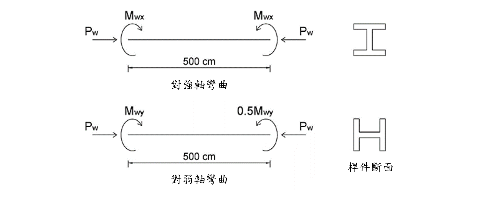
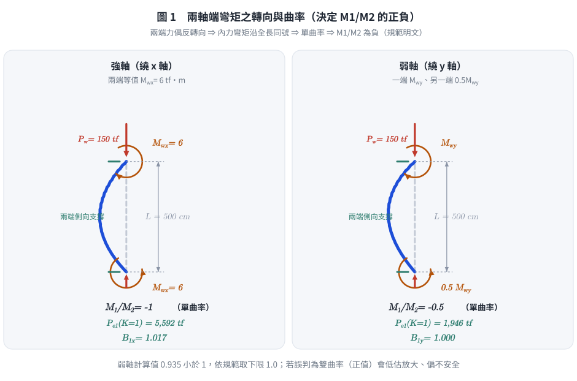
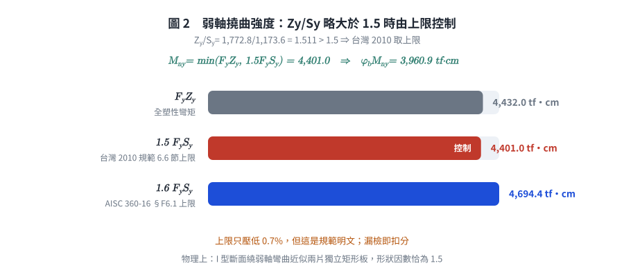
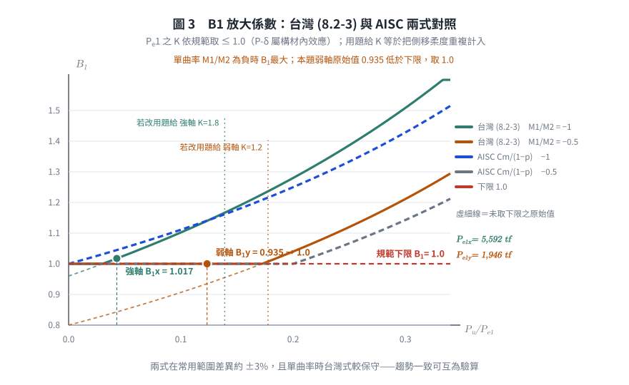
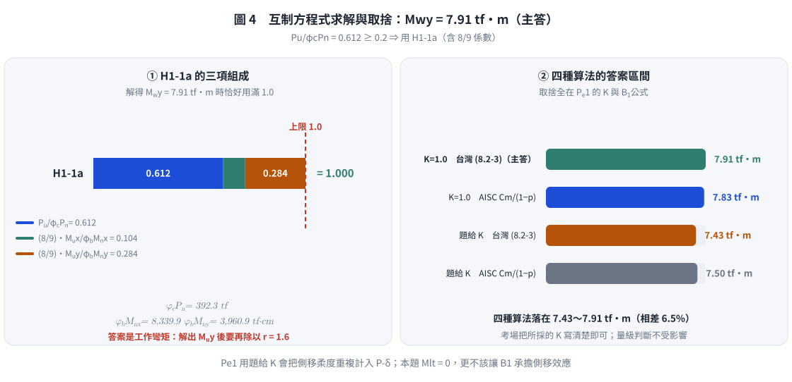

# 考題編號：SS-2020-3

**主分類：** `SS-U1-3` 梁柱桿件
**副分類：** 無
**設計法：** LRFD
**標籤：** `梁柱桿件` `P-M互制` `雙軸彎矩` `載重放大係數` `B1放大法` `有效長度` `柱強度` `弱軸彎矩` `LRFD互制方程式` `斷面性質計算` `弱軸上限1.5FySy` `Pe1有效長度`

---

## 1. 原始題目重述 (Problem Restatement)

有一梁柱桿件承受端點載重如下圖所示：
- 軸力：$P_w = 150$ tf
- 強軸彎矩：$M_{wx} = 6$ tf·m（兩端皆施加，強軸單曲率）
- 弱軸彎矩：$M_{wy}$（一端 $M_{wy}$，另一端 $0.5M_{wy}$，弱軸單曲率）
- 桿件長：$L = 500$ cm
- 斷面：H 400×400×12×22
- 側向支撐：桿件兩端皆有側向支撐
- 有效長度係數：$K_x = 1.8$，$K_y = 1.2$
- 材料強度：$F_y = 2.5$ tf/cm²，$E = 2100$ tf/cm²
- **載重係數：$r = 1.6$**

試依極限設計規範，求弱軸尚可承受之最大彎矩 $M_{wy}$。（25 分）

*圖說：強軸（上圖）：桿件承受等值端彎矩 $M_{wx}$（兩端大小相等、方向使桿件呈單曲率），軸壓力 $P_w$ 由兩端對向施加，桿長 500cm；弱軸（下圖）：兩端分別施加 $M_{wy}$（大端）和 $0.5M_{wy}$（小端），同向（單曲率），軸壓力 $P_w$ 相同。桿件兩端均設有側向支撐。*

---

*圖 1　兩軸端彎矩的轉向與曲率。兩端力偶反轉向 ⇒ 內力彎矩沿全長同號 ⇒ 單曲率 ⇒ $M_1/M_2$ 取負；這張圖攔的是把單曲率誤判成雙曲率而讓 $B_1$ 掉到下限、低估放大量。*

## 2. 考題核心精神與出題者意圖 (Core Concepts & Examiner's Intent)

**核心觀念：LRFD 梁柱互制方程式 + B1 放大係數 + 載重係數轉換**

本題三層考核：

1. **載重係數 $r = 1.6$**：工作載重（$P_w, M_{wx}, M_{wy}$）乘以 $r$ 得設計載重（$P_u, M_{ux}, M_{uy}$）
2. **柱強度 $\phi_c P_n$**：用弱軸控制之 $\lambda_c$ 計算 $F_{cr}$，再求 $\phi_c P_n$
3. **互制方程式**：代入 $P_u/\phi_c P_n \geq 0.2$ 的方程式，解出 $M_{wy}$

> ⚠️ **原卷第三題並未提供任何參考公式**（該頁只有題目文字與兩張載重圖），斷面性質（$A$、$I$、$S$、$Z$、$r$）也**必須自行由 H 400×400×12×22 的尺寸算出**。以下公式一律出自**台灣「鋼構造建築物鋼結構設計技術規範」極限設計法（民國 99 年／2010）**。

**所依據之規範公式：**

$$\lambda_c = \frac{KL}{\pi r}\sqrt{\frac{F_y}{E}} \quad(6.2\text{-}4) \quad \Rightarrow \quad \lambda_c \leq 1.5:\ F_{cr} = \exp\!\left(-0.419\lambda_c^2\right) F_y \ \left(\equiv 0.658^{\lambda_c^2}F_y\right)$$

$$\phi_c P_n = 0.85\, F_{cr}\, A \qquad (\phi_c = 0.85)$$

$$M_u = B_1 M_{nt} + B_2 M_{lt} \quad(8.2\text{-}2)$$

$$B_1 = \frac{0.64}{1 - P_u/P_{e1}}\left(1 - \frac{M_1}{M_2}\right) + 0.32\,\frac{M_1}{M_2} \ \geq 1.0 \quad(8.2\text{-}3)$$

$$P_{e1} = \frac{A_gF_y}{\lambda_c^2} \equiv \frac{\pi^2EI}{(KL)^2}, \quad \textbf{其中彎曲平面上之 } K \leq 1.0$$

$$\frac{P_u}{\phi P_n} \geq 0.2:\quad \frac{P_u}{\phi P_n} + \frac{8}{9}\!\left(\frac{M_{ux}}{\phi_b M_{nx}} + \frac{M_{uy}}{\phi_b M_{ny}}\right) \leq 1.0 \quad(8.2\text{-}1a)$$

$$M_{ny} \leq 1.5\,F_y S_y \quad(\text{弱軸撓曲上限，規範 6.6 節})$$

> **關於 (8.2-3)**：此式**非** AISC 之 $C_m/(1-P_u/P_{e1})$，而是台灣規範自訂的較精確形式；規範解說明言 AISC-LRFD 是「將上式**更簡化**為 $C_m = 0.6-0.4(M_1/M_2)$」。
> ⚠️ **來源註記**：線上公報版與 rootlaw 版 PDF 的**文字層均已破損**，三次獨立擷取給出三種不同的重建式。本知識庫以下列三項交叉檢定確認上式：① $B_1$ 須隨 $P_u/P_{e1}$ **單調遞增**；② 單曲率（$M_1/M_2 = -1$）時最大、雙曲率（$+1$）時最小；③ 與 AISC 之 $C_m/(1-P_u/P_{e1})$ 逐點比對，差異在 $\pm 5\%$ 內（見 §5）。**建議以紙本規範第 8 章覆核。**

---

## 3. 解題戰略地圖與陷阱分析 (Strategic Roadmap & Trap Analysis)

**步驟規劃：**
1. 計算放大設計載重：$P_u = r \cdot P_w$，$M_{ux,0} = r \cdot M_{wx}$
2. 判斷強/弱軸 $\lambda_c$，取較大者控制柱強度
3. 計算 $\phi_c P_n$
4. 計算 $\phi_b M_{nx}$ 和 $\phi_b M_{ny}$（完全側向支撐 → $M_n = M_p$）
5. 計算 $B_{1x}$ 和 $B_{1y}$（各軸方向端彎矩比）
6. 建立互制方程式，解出 $M_{wy}$

**關鍵陷阱：**

> ⚠️ **陷阱1：忽略載重係數 r**
> $P_u = r \times P_w = 1.6 \times 150 = 240$ tf，不可直接用 $P_w = 150$ tf 代入互制方程式。所有工作載重（包含彎矩）均需乘以 $r$。

> ⚠️ **陷阱2：強軸/弱軸 λc 混淆**
> 強軸用 $K_x = 1.8$，$r_x$；弱軸用 $K_y = 1.2$，$r_y$。需分別計算並取大值。

> ⚠️ **陷阱3：B1 公式中 M1/M2 的符號（最常錯！）**
> 本題兩軸端彎矩產生**單曲率**撓曲變形，$M_1/M_2$ 為**負值**。
> 規範原文：「當構材受彎成**雙曲率**彎曲時，$M_1/M_2$ 之比為**正值**；當構材成**單曲率**彎曲時，$M_1/M_2$ 之比為**負值**」。
> **判別依據（450 dpi 目視原卷兩張載重圖）**：左端力偶弧線由下經左至上、箭頭在頂端朝右下（**順時針**）；右端弧線由下經右至上、箭頭在頂端朝左（**逆時針**）。兩端**反轉向** ⇒ 內力彎矩沿全長同號 ⇒ **單曲率** ✓
> 正確代入：強軸 $M_1/M_2 = -1$，弱軸 $M_1/M_2 = -0.5$。
> 若誤判為雙曲率（正值），$B_1$ 會掉到 1.0 以下而取下限，低估放大效應，答案偏不安全。

> ⚠️ **陷阱5：$P_{e1}$ 的 $K$ 不是題目給的 1.8／1.2**
> 規範明定 $P_{e1}$ 之「彎曲平面上之有效長度係數 $K \leq 1.0$」。$B_1$ 處理的是**構材內部**的 P-δ 效應，用側移 $K$ 會與 $B_2$（P-Δ）重複計入。本題無側向載重 ⇒ $M_{lt} = 0$ ⇒ $B_2M_{lt} = 0$，所有彎矩都是 $M_{nt}$。
> 題給 $K_x = 1.8$、$K_y = 1.2$ 用於 $\lambda_c$（求 $\phi_cP_n$）。詳見 §5 之敏感度討論。

> ⚠️ **陷阱6：弱軸撓曲有 $1.5F_yS_y$ 上限**
> $Z_y/S_y = 1772.8/1173.6 = \mathbf{1.511 > 1.5}$ ⇒ **上限控制**，$M_{ny} = 1.5F_yS_y = 4401$ tf·cm（不是 $F_yZ_y = 4432$）。差 0.7%，但這是規範明文，漏掉即扣分。

> ⚠️ **陷阱4：最終解的 $M_{wy}$ 是工作彎矩還是設計彎矩？**
> 題目問「弱軸尚可承受之最大彎矩 $M_{wy}$」，即**工作彎矩**，答案需除以 $r$，即 $M_{wy} = M_{uy}/r$。

---

## 3.5 變數層次分析（Variable Hierarchy Analysis）

> 複習提示：解題後，在每個卡住的知識點「卡關?」欄標記 `⚠`；第二次複習時只看有 `⚠` 的項目。

**最終目標：** 由工作載重換算設計載重 → 求 $\phi_cP_n$、$\phi_bM_n$ → 計算 $B_1$ → 代入互制方程式 → 解出最大工作彎矩 $M_{wy}$

### 主要公式（$\boxed{\phantom{x}}$ = 未知，待推導）

**Step 2：設計載重換算**
$$\boxed{P_u} = r \cdot P_w, \qquad \boxed{M_{ux,0}} = r \cdot M_{wx}, \qquad \boxed{M_{uy,0}} = r \cdot M_{wy}$$

**Step 3：控制軸細長比（強弱軸分別算，取大）**
$$\boxed{\lambda_{cx}} = \frac{K_x L}{\pi r_x}\sqrt{\frac{F_y}{E}}, \qquad \boxed{\lambda_{cy}} = \frac{K_y L}{\pi r_y}\sqrt{\frac{F_y}{E}} \quad \Rightarrow \quad \boxed{\lambda_c} = \max(\boxed{\lambda_{cx}}, \boxed{\lambda_{cy}})$$

**Step 4：柱設計強度**
$$\boxed{F_{cr}} = \exp\!\left(-0.419\,\boxed{\lambda_c}^2\right) F_y, \qquad \boxed{\phi_c P_n} = 0.85 \times \boxed{F_{cr}} \times A$$

**Step 5：撓曲設計強度（確認無 LTB）**
$$\boxed{L_p} = 1.76\,r_y\sqrt{\frac{E}{F_y}}, \qquad L_b < \boxed{L_p} \;\Rightarrow\; \boxed{\phi_b M_{nx}} = 0.9\,F_y\,Z_x,\quad \boxed{\phi_b M_{ny}} = 0.9\,F_y\,Z_y$$

**Step 6：$B_1$ 彎矩放大係數（各軸）**
$$\boxed{P_{e1}} = \frac{\pi^2 E I}{(KL)^2}, \qquad \boxed{B_1} = \frac{0.64}{1 - \boxed{P_u}/\boxed{P_{e1}}}\!\left(1-\frac{M_1}{M_2}\right) + 0.32\frac{M_1}{M_2} \;\geq 1.0$$
$$\boxed{M_{ux}} = \boxed{B_{1x}} \cdot \boxed{M_{ux,0}}, \qquad \boxed{M_{uy}} = \boxed{B_{1y}} \cdot \boxed{M_{uy,0}}$$

**Step 7：互制方程式（H1-1a），解 $M_{wy}$**
$$\frac{\boxed{P_u}}{\boxed{\phi_c P_n}} + \frac{8}{9}\!\left(\frac{\boxed{M_{ux}}}{\boxed{\phi_b M_{nx}}} + \frac{\boxed{M_{uy}}}{\boxed{\phi_b M_{ny}}}\right) \leq 1.0 \quad \Rightarrow \quad \boxed{M_{wy}} = \frac{\boxed{M_{uy}}}{r}$$

### L1：題目直接給定

| 符號 | 數值 | 說明 |
|------|------|------|
| $P_w$ | 150 tf | 工作軸壓力 |
| $M_{wx}$ | 6 tf·m（兩端等值） | 工作強軸彎矩，**單曲率** |
| $M_{wy}$ | 大端：$M_{wy}$，小端：$0.5M_{wy}$ | 工作弱軸彎矩，**單曲率**（**待求**） |
| $L$ | 500 cm | 桿件長度 |
| 斷面 | H 400×400×12×22 | — |
| $K_x$ | 1.8 | 強軸有效長度係數 |
| $K_y$ | 1.2 | 弱軸有效長度係數 |
| $F_y$ | 2.5 tf/cm² | 降伏應力 |
| $E$ | 2100 tf/cm² | 彈性模數 |
| $r$ | 1.6 | 載重係數（題目直接給定） |
| 側向支撐 | 兩端皆有 | — |
| $\phi_c$ / $\phi_b$ | 0.85 / 0.90 | 規範值（非題給） |

> ⚠️ **本題 L1 只有上表這些**。$A$、$I_x$、$I_y$、$S_x$、$S_y$、$Z_x$、$Z_y$、$r_x$、$r_y$ **全部必須由 H 400×400×12×22 的尺寸自行計算**（見 L2 Step 1）；$F_{cr}$、$B_1$、互制式亦均出自規範而非題目。原卷第三題**沒有任何參考公式**。

### L2：需知識點推導

**Step 1：斷面性質（由尺寸自行計算）** ⚠ 常見卡關

| 符號 | 公式 / 來源 | 卡關? |
|------|------------|:-----:|
| $h_w$ | $d - 2t_f = 40 - 2(2.2) = 35.6$ cm | |
| $A$ | $2b_ft_f + h_wt_w = 2(40)(2.2) + 35.6(1.2) = 218.72$ cm² | |
| $I_x$ | $2\!\left[\frac{b_ft_f^3}{12} + b_ft_f\!\left(\frac{h_w+t_f}{2}\right)^{\!2}\right] + \frac{t_wh_w^3}{12} = 67{,}452$ cm⁴ | |
| $S_x$ | $2I_x/d = 3{,}372.6$ cm³ | |
| $Z_x$ | $b_ft_f(d-t_f) + t_wh_w^2/4 = 3{,}706.6$ cm³ | |
| $I_y$ | $\frac{t_fb_f^3}{6} + \frac{h_wt_w^3}{12} = 23{,}472$ cm⁴ | |
| $S_y$ | $2I_y/b_f = 1{,}173.6$ cm³ | |
| $Z_y$ | $\frac{t_fb_f^2}{2} + \frac{h_wt_w^2}{4} = 1{,}772.8$ cm³ | |
| $r_x$ / $r_y$ | $\sqrt{I_x/A} = 17.56$ / $\sqrt{I_y/A} = 10.36$ cm | |
| 結實性 | $b_f/2t_f = 9.09 < 17/\sqrt{F_y} = 10.75$；$h_w/t_w = 29.7 < 170/\sqrt{F_y} = 107.5$ ✓ | |

**Step 2：設計載重換算**

| 符號 | 公式 / 來源 | 卡關? |
|------|------------|:-----:|
| $P_u$ | $r \times P_w = 1.6 \times 150 = 240$ tf | |
| $M_{ux,0}$ | $r \times M_{wx} = 1.6 \times 6 = 9.6$ tf·m | |
| $M_{uy,0}$ | $r \times M_{wy} = 1.6\,M_{wy}$（含未知 $M_{wy}$） | |

**Step 3：控制軸細長比**

| 符號 | 公式 / 來源 | 卡關? |
|------|------------|:-----:|
| $\lambda_{cx}$ | $(K_xL/\pi r_x)\sqrt{F_y/E} = 0.5627$ | |
| $\lambda_{cy}$ | $(K_yL/\pi r_y)\sqrt{F_y/E} = 0.6358$ | |
| $\lambda_c$（控制） | $\max(0.5627,\,0.6358) = 0.6358$（弱軸控制） | |

**Step 4：柱設計強度**

| 符號 | 公式 / 來源 | 卡關? |
|------|------------|:-----:|
| $F_{cr}$ | $\exp(-0.419 \times 0.6358^2) \times 2.5 = 2.111$ tf/cm² | |
| $\phi_cP_n$ | $0.85 \times 2.111 \times 218.7 = 392.4$ tf | |
| $P_u/\phi_cP_n$ | $240/392.4 = 0.612 \geq 0.2$ → H1-1a | |

**Step 5：撓曲設計強度**

| 符號 | 公式 / 來源 | 卡關? |
|------|------------|:-----:|
| $L_p$（台灣 2010） | $80r_y/\sqrt{F_y} = 80(10.36)/1.5811 = 524.1$ cm | |
| $L_b$ vs $L_p$ | $500 < 524.1$ → 無 LTB，$M_{nx} = M_{px}$ | |
| $\phi_bM_{nx}$ | $0.9 \times 2.5 \times 3706.6 = 8{,}339.9$ tf·cm | |
| $Z_y/S_y$ | $1772.8/1173.6 = 1.511 > 1.5$ → **上限控制** ⚠ 常見卡關 | |
| $M_{ny}$ | $\min(F_yZ_y,\ 1.5F_yS_y) = \min(4432.0,\ \mathbf{4401.0}) = 4401.0$ tf·cm | |
| $\phi_bM_{ny}$ | $0.9 \times 4401.0 = \mathbf{3{,}960.9}$ tf·cm | |

**Step 6：$B_1$ 彎矩放大係數**

| 符號 | 公式 / 來源 | 卡關? |
|------|------------|:-----:|
| $K$ for $P_{e1}$ | 規範：彎曲平面上 $K \leq 1.0$ → 取 **1.0**（非題給 1.8／1.2）⚠ 常見卡關 | |
| $P_{e1x}$ | $\pi^2EI_x/(1.0L)^2 = 9.8696(2100)(67{,}452)/500^2 = 5{,}592$ tf | |
| $P_{e1y}$ | $\pi^2EI_y/(1.0L)^2 = 9.8696(2100)(23{,}472)/500^2 = 1{,}946$ tf | |
| $M_1/M_2$（強軸） | $-1$（單曲率等值）→ $B_{1x} = \mathbf{1.017}$ | |
| $M_1/M_2$（弱軸） | $-0.5$（單曲率）→ 計算值 $0.935 < 1$ → 取 $B_{1y} = \mathbf{1.0}$ | |
| $M_{ux}$ | $1.017 \times 960 = \mathbf{976.7}$ tf·cm | |
| $M_{uy}$ | $1.0 \times 160\,M_{wy} = \mathbf{160\,M_{wy}}$ tf·cm（$M_{wy}$ 單位 tf·m） | |

**Step 7：互制方程式解 $M_{wy}$**

| 符號 | 公式 / 來源 | 卡關? |
|------|------------|:-----:|
| H1-1a 代入 | $0.6118 + \frac{8}{9}\!\left(\frac{976.7}{8339.9} + \frac{160M_{wy}}{3960.9}\right) \leq 1.0$ | |
| 解得 | $M_{wy} \leq \mathbf{7.91}$ tf·m（此即工作彎矩） | |
| 敏感度 | 若 $P_{e1}$ 改用題給 $K$（1.8／1.2）→ $M_{wy} = 7.43$ tf·m。答案落在 **7.4～7.9 tf·m**，見 §5 | |

### L3：深層知識（不懂就卡住）

| 知識點 | 說明 | 補強頁 | 卡關? |
|--------|------|:------:|:-----:|
| 載重係數 $r$ 作用對象 | **所有**工作載重均需乘 $r$（包含兩軸彎矩），不只軸力 | | |
| 強弱軸 $\lambda_c$ 分別計算 | $K_x \neq K_y$、$r_x \neq r_y$，需各自算出後取較大者控制柱強度 | [[lrfd-column]] | |
| $\exp(-0.419\lambda^2)$ 的等效形式 | 等效於 $0.658^{\lambda^2}$（因 $\ln 0.658 \approx -0.419$）；本題公式直接給，直接代計算機 | [[lrfd-column]] · [[column-buckling-lambda-boundary]] | |
| $B_1$ 公式中 $M_1/M_2$ 符號 | **單曲率為「$-$」（負值）；雙曲率（S 形）為「$+$」（正值）**；$\|M_1/M_2\| \leq 1$（大者放分母）；$B_1 < 1$ 時取 $B_1 = 1.0$ | [[b1b2-amplification]] · [[b1-m1m2-sign-convention]] | |
| 台灣 (8.2-3) 與 AISC 的差別 | 台灣用 $\frac{0.64}{1-P_u/P_{e1}}(1-\frac{M_1}{M_2}) + 0.32\frac{M_1}{M_2}$；AISC 用 $\frac{0.6-0.4(M_1/M_2)}{1-P_u/P_{e1}}$。**兩者不等價**，規範解說稱 AISC 是「更簡化」的版本 | [[b1b2-amplification]] | |
| $P_{e1}$ 的 $K \leq 1.0$ | $B_1$ 屬構材內 P-δ，故用無側移長度；側移效應歸 $B_2$（$P_{e2}$ 之 $K \geq 1.0$）。混用即重複計入 | [[b1b2-amplification]] | |
| 弱軸上限 $1.5F_yS_y$ | I 型斷面 $Z_y/S_y$ 常略大於 1.5；$M_{ny}$ 須取 $\min(F_yZ_y, 1.5F_yS_y)$。AISC 360-10 起放寬為 $1.6F_yS_y$ | | |
| 斷面性質須自算 | 本題不給 $A$、$Z$、$r$，H 型組合斷面的 $Z_x = b_ft_f(d-t_f)+t_wh_w^2/4$、$Z_y = t_fb_f^2/2 + h_wt_w^2/4$ 必須背得出來 | [[plastic-zx]] | |
| H1-1a vs H1-1b 選擇門檻 | $P_u/\phi_cP_n \geq 0.2$ 用 H1-1a（含 8/9 係數）；$< 0.2$ 用 H1-1b | [[pm-interaction]] · [[BEAM-COLUMN-INTERACTION]] | |
| 最終答案的單位還原 | 題目問工作彎矩 $M_{wy}$；互制式解出的是設計彎矩 $M_{uy}$，須除以 $r$ 才是答案 | | |

---

## 4. 步驟化詳細計算過程 (Step-by-Step Detailed Calculation)

### Step 1：斷面性質（**必須自行由尺寸計算**）

H 400×400×12×22 ⇒ $d = 40$、$b_f = 40$、$t_w = 1.2$、$t_f = 2.2$ cm（單位 mm → cm）

$$h_w = d - 2t_f = 40 - 4.4 = 35.6\ \text{cm}$$

**斷面積：**
$$A = 2b_ft_f + h_wt_w = 2(40)(2.2) + 35.6(1.2) = 176 + 42.72 = \boxed{218.72\ \text{cm}^2}$$

**強軸慣性矩**（翼板形心至中性軸 $= (h_w + t_f)/2 = 18.9$ cm）：
$$I_x = 2\left[\frac{40(2.2)^3}{12} + 40(2.2)(18.9)^2\right] + \frac{1.2(35.6)^3}{12}$$
$$= 2[35.5 + 88(357.21)] + \frac{1.2(45{,}118)}{12} = 2(31{,}470) + 4{,}512 = \boxed{67{,}452\ \text{cm}^4}$$

$$S_x = \frac{2I_x}{d} = \frac{2(67{,}452)}{40} = 3{,}372.6\ \text{cm}^3$$

$$Z_x = b_ft_f(d - t_f) + \frac{t_wh_w^2}{4} = 40(2.2)(37.8) + \frac{1.2(35.6)^2}{4} = 3{,}326.4 + 380.2 = \boxed{3{,}706.6\ \text{cm}^3}$$

**弱軸：**
$$I_y = \frac{t_fb_f^3}{6} + \frac{h_wt_w^3}{12} = \frac{2.2(64{,}000)}{6} + \frac{35.6(1.728)}{12} = 23{,}466.7 + 5.1 = \boxed{23{,}472\ \text{cm}^4}$$

$$S_y = \frac{2I_y}{b_f} = \frac{2(23{,}472)}{40} = 1{,}173.6\ \text{cm}^3$$

$$Z_y = \frac{t_fb_f^2}{2} + \frac{h_wt_w^2}{4} = \frac{2.2(1600)}{2} + \frac{35.6(1.44)}{4} = 1{,}760 + 12.8 = \boxed{1{,}772.8\ \text{cm}^3}$$

**迴轉半徑：**
$$r_x = \sqrt{\frac{67{,}452}{218.72}} = 17.56\ \text{cm}, \qquad r_y = \sqrt{\frac{23{,}472}{218.72}} = 10.36\ \text{cm}$$

**斷面結實性檢核：**
$$\frac{b_f}{2t_f} = \frac{40}{4.4} = 9.09 < \frac{17}{\sqrt{F_y}} = 10.75 \ \checkmark \qquad \frac{h_w}{t_w} = \frac{35.6}{1.2} = 29.7 < \frac{170}{\sqrt{F_y}} = 107.5 \ \checkmark$$

⇒ **結實斷面**，可取 $M_n = M_p$（若無 LTB）

| 性質 | 數值 | 性質 | 數值 |
|------|------|------|------|
| $A$ | 218.72 cm² | $I_y$ | 23,472 cm⁴ |
| $I_x$ | 67,452 cm⁴ | $S_y$ | 1,173.6 cm³ |
| $S_x$ | 3,372.6 cm³ | $Z_y$ | 1,772.8 cm³ |
| $Z_x$ | 3,706.6 cm³ | $r_y$ | 10.36 cm |
| $r_x$ | 17.56 cm | $Z_y/S_y$ | **1.511** |

---

### Step 2：計算設計載重

$$P_u = r \cdot P_w = 1.6 \times 150 = 240 \text{ tf}$$
$$M_{ux,0} = r \cdot M_{wx} = 1.6 \times 6 \times 100 = 960 \text{ tf·cm}$$（工作彎矩）
$$M_{uy,0} = r \cdot M_{wy} = 1.6 \times M_{wy} \times 100 \text{ tf·cm}$$

---

### Step 3：計算細長比 $\lambda_c$，確認控制軸

$$\lambda_{cx} = \frac{K_x L}{\pi r_x}\sqrt{\frac{F_y}{E}} = \frac{1.8 \times 500}{\pi \times 17.56}\sqrt{\frac{2.5}{2100}} = \frac{900}{55.18} \times 0.03450 = 16.31 \times 0.03450 = 0.5627$$

$$\lambda_{cy} = \frac{K_y L}{\pi r_y}\sqrt{\frac{F_y}{E}} = \frac{1.2 \times 500}{\pi \times 10.36}\sqrt{\frac{2.5}{2100}} = \frac{600}{32.55} \times 0.03450 = 18.43 \times 0.03450 = 0.6358$$

$$\lambda_{cy} = 0.6358 > \lambda_{cx} = 0.5627 \quad \Rightarrow \quad \text{弱軸控制}$$

---

### Step 4：計算柱設計強度 $\phi_c P_n$

$$F_{cr} = \exp(-0.419 \times \lambda_{cy}^2) \times F_y = \exp(-0.419 \times 0.6358^2) \times 2.5$$
$$= \exp(-0.419 \times 0.4042) \times 2.5 = \exp(-0.1694) \times 2.5 = 0.8445 \times 2.5 = 2.111 \text{ tf/cm}^2$$

$$\phi_c P_n = 0.85 \times F_{cr} \times A = 0.85 \times 2.111 \times 218.7 = 0.85 \times 461.7 = \mathbf{392.4 \text{ tf}}$$

$$\frac{P_u}{\phi_c P_n} = \frac{240}{392.4} = 0.612 \geq 0.2 \quad \Rightarrow \quad \text{用} \frac{8}{9} \text{互制方程式}$$

---

### Step 5：計算設計撓曲強度 $\phi_b M_{nx}$，$\phi_b M_{ny}$

兩端側向支撐 → $L_b = 500$ cm

計算 $L_p$（台灣 2010 規範形式）：

$$L_p = \frac{80\,r_y}{\sqrt{F_y}} = \frac{80 \times 10.36}{\sqrt{2.5}} = \frac{828.8}{1.5811} = 524.1 \text{ cm}$$

$$L_b = 500 \text{ cm} < L_p = 524.1 \text{ cm} \quad \Rightarrow \quad \text{無 LTB（餘裕僅 4.6\%）}$$

**強軸：**
$$M_{nx} = M_{px} = F_y Z_x = 2.5 \times 3706.6 = 9{,}266.5 \text{ tf·cm}$$
$$\boxed{\phi_b M_{nx} = 0.9 \times 9{,}266.5 = 8{,}339.9 \text{ tf·cm}}$$

**弱軸（⚠ 必須檢查 $1.5F_yS_y$ 上限）：**
$$F_yZ_y = 2.5 \times 1772.8 = 4{,}432.0 \text{ tf·cm}$$
$$1.5F_yS_y = 1.5 \times 2.5 \times 1173.6 = 4{,}401.0 \text{ tf·cm}$$
$$\frac{Z_y}{S_y} = \frac{1772.8}{1173.6} = 1.511 > 1.5 \quad \Rightarrow \quad \textbf{上限控制}$$
$$M_{ny} = \min(4432.0,\ 4401.0) = 4{,}401.0 \text{ tf·cm}$$
$$\boxed{\phi_b M_{ny} = 0.9 \times 4{,}401.0 = 3{,}960.9 \text{ tf·cm}}$$

> ⚠️ 上限只把 $M_{ny}$ 壓低 0.7%，但這是規範 6.6 節的明文；漏檢即扣分。物理上，I 型斷面繞弱軸彎曲時兩片翼板近似「兩塊獨立矩形板」（形狀因數恰為 1.5），若放行到 $F_yZ_y$ 會在工作載重下產生大範圍永久變形。

---

*圖 2　弱軸撓曲強度由上限控制。$Z_y/S_y = 1.511$ 只略大於 1.5，上限僅壓低 0.7%；這張圖攔的是漏檢規範 6.6 節的 $1.5F_yS_y$ 上限而直接用 $F_yZ_y$。*

### Step 6：計算 $B_1$ 彎矩放大係數

**先確認 $M_{lt} = 0$：** 本題只有端彎矩、無側向載重，故沒有側移彎矩

$$M_u = B_1 M_{nt} + B_2 M_{lt} = B_1 M_{nt} + 0 \quad \Rightarrow \quad \text{只需 } B_1$$

**$P_{e1}$ 之有效長度：** 規範明定「$P_{e1} = A_gF_y/\lambda_c^2$，其中彎曲平面上之 $K \leq 1.0$」。$B_1$ 處理的是**構材兩端之間**的 P-δ 效應，屬「無側移」現象，故取 $K = 1.0$：

$$P_{e1x} = \frac{\pi^2 E I_x}{(1.0 \times L)^2} = \frac{9.8696 \times 2100 \times 67{,}452}{500^2} = \frac{1.39825 \times 10^9}{250{,}000} = \boxed{5{,}592 \text{ tf}}$$

$$P_{e1y} = \frac{9.8696 \times 2100 \times 23{,}472}{500^2} = \frac{4.8648 \times 10^8}{250{,}000} = \boxed{1{,}946 \text{ tf}}$$

**$B_{1x}$（強軸，兩端等值反轉向 → 單曲率 → $M_1/M_2 = -1$）：**

$$\frac{P_u}{P_{e1x}} = \frac{240}{5592} = 0.04291$$

$$B_{1x} = \frac{0.64}{1 - 0.04291}\left(1-(-1)\right) + 0.32(-1) = \frac{0.64}{0.95709}(2) - 0.32$$
$$= 0.66869 \times 2 - 0.32 = 1.33738 - 0.32 = \boxed{1.017} > 1.0 \ \checkmark$$

**$B_{1y}$（弱軸，$M_{wy}$ 與 $0.5M_{wy}$ 反轉向 → 單曲率 → $M_1/M_2 = -0.5$）：**

$$\frac{P_u}{P_{e1y}} = \frac{240}{1946} = 0.12333$$

$$B_{1y} = \frac{0.64}{1 - 0.12333}\left(1-(-0.5)\right) + 0.32(-0.5) = \frac{0.64}{0.87667}(1.5) - 0.16$$
$$= 0.73003 \times 1.5 - 0.16 = 1.09505 - 0.16 = 0.935 < 1.0 \quad \Rightarrow \quad \boxed{B_{1y} = 1.0}$$

**放大後設計彎矩：**
$$M_{ux} = B_{1x} \times M_{ux,0} = 1.017 \times 960 = \boxed{976.7 \text{ tf·cm}}$$
$$M_{uy} = B_{1y} \times 1.6\,M_{wy} \times 100 = 1.0 \times 160\,M_{wy} = \boxed{160\,M_{wy} \text{ tf·cm}}\quad(M_{wy}\text{ 單位 tf·m})$$

---

*圖 3　$B_1$ 兩式對照與下限。弱軸原始值 0.935 低於 1，必須取下限；虛線標出改用題給 $K$ 會把 $P_u/P_{e1}$ 右推到哪裡——這張圖攔的是 $P_{e1}$ 誤用側移 $K$ 而把側移柔度重複計入 P-δ。*

### Step 7：代入互制方程式，求 $M_{wy}$

$$\frac{P_u}{\phi_c P_n} + \frac{8}{9}\left(\frac{M_{ux}}{\phi_b M_{nx}} + \frac{M_{uy}}{\phi_b M_{ny}}\right) \leq 1.0$$

$$0.6118 + \frac{8}{9}\left(\frac{976.7}{8{,}339.9} + \frac{160\,M_{wy}}{3{,}960.9}\right) \leq 1.0$$

$$0.6118 + \frac{8}{9}\left(0.11711 + 0.040395\,M_{wy}\right) \leq 1.0$$

$$0.6118 + 0.10410 + 0.035907\,M_{wy} \leq 1.0$$

$$0.7159 + 0.035907\,M_{wy} \leq 1.0$$

$$0.035907\,M_{wy} \leq 0.2841$$

$$\boxed{M_{wy} \leq \frac{0.2841}{0.035907} = 7.91 \text{ tf·m}}$$

**驗算（回代）：**
$$M_{uy} = 1.6 \times 7.91 \times 100 = 1{,}266\ \text{tf·cm}, \quad \frac{1266}{3960.9} = 0.3196$$
$$0.6118 + \frac{8}{9}(0.11711 + 0.3196) = 0.6118 + 0.3882 = 1.000 \ \checkmark$$

---

*圖 4　互制方程式的求解與取捨。左格顯示 $M_{wy} = 7.91$ 時恰好用滿 1.0，右格把四種 $K$／$B_1$ 組合攤開；這張圖攔的是忘記把 $M_{uy}$ 除回 $r = 1.6$ 才是題目要的工作彎矩。*

### 計算彙整

| 項目 | 數值 |
|------|------|
| 設計軸力 $P_u = r \cdot P_w$ | $1.6 \times 150 = 240$ tf |
| 弱軸細長比 $\lambda_{cy}$（控制） | 0.6358 |
| 柱臨界應力 $F_{cr}$ | 2.111 tf/cm² |
| 柱設計強度 $\phi_c P_n$ | 392.4 tf |
| $P_u / \phi_c P_n$ | 0.612（≥ 0.2，用 8/9 方程式）|
| $L_p$（台灣 $80r_y/\sqrt{F_y}$） | 524.1 cm > $L_b$ = 500 cm → 無 LTB |
| 強軸設計彎矩強度 $\phi_b M_{nx}$ | 8,339.9 tf·cm（= $\phi_b M_{px}$）|
| $Z_y/S_y$ | **1.511 > 1.5 → 弱軸上限控制** |
| 弱軸設計彎矩強度 $\phi_b M_{ny}$ | **3,960.9 tf·cm**（$= 0.9 \times 1.5F_yS_y$）|
| $P_{e1x}$，$P_{e1y}$（$K = 1.0$） | 5,592 tf，1,946 tf |
| $B_{1x}$，$B_{1y}$ | $B_{1x} = \mathbf{1.017}$；$B_{1y}$ 計算值 0.935 → 取 $\mathbf{1.0}$ |
| **最大弱軸彎矩 $M_{wy}$** | **7.91 tf·m**（$P_{e1}$ 改用題給 $K$ 則為 7.43；見 §5）|

---

## 5. 關鍵爭議點與進階探討 (Critical Issues & Advanced Discussion)

### 載重係數 $r$ 的意義

本題的 $r = 1.6$ 是**統一載重係數**（相當於 LRFD 的 $\gamma = 1.6$），代表「工作載重 × 1.6 = 設計極限載重」。題目以工作載重表示（$P_w, M_{wx}$），計算時必須先乘以 $r$ 才能使用 LRFD 互制方程式。

**最終答案 $M_{wy}$ 的定義：** 由互制方程式求出的 $M_{wy}$ 是**工作彎矩**（以 tf·m 為單位），因為題目說「求其弱軸尚可承受之最大彎矩 $M_{wy}$」。在本題設定中，$M_{uy} = 1.6 M_{wy}$，算出的 $M_{wy}$ 就是工作彎矩，已是正確答案。

### B1 放大係數與 Pe1 的物理意義

$P_{e1}$ 是 Euler 彈性挫屈載重（以 $KL$ 計算）。$B_1$ 是考慮二階效應（P-δ）的彎矩放大係數：

$$B_1 = \frac{C_m}{1 - P_u/P_{e1}} \geq 1.0$$

其中 $C_m = 0.6 - 0.4(M_1/M_2)$ 是等效均勻彎矩係數（來自 AISC）。

**⚠️ 台灣規範 (8.2-3) 與 AISC 的關係（前版此處敘述有誤，已更正）：**

台灣極限設計法規範 (8.2-3) 為

$$B_1 = \frac{0.64}{1 - P_u/P_{e1}}\left(1 - \frac{M_1}{M_2}\right) + 0.32\,\frac{M_1}{M_2} \geq 1.0$$

**這不是** $C_m/(1-P_u/P_{e1})$ 的改寫，也**不等效於** $C_m = 0.6-0.4(M_1/M_2)$（前版誤稱「其實等效」，已刪除）。注意結構上的差別：第二項 $0.32(M_1/M_2)$ **沒有除以** $(1-P_u/P_{e1})$，所以整個式子無法整理成「某個 $C_m$ 除以放大分母」的形式。

規範**解說**明言：AISC-LRFD 是「將上式**更簡化**為 $C_m = 0.6 - 0.4(M_1/M_2)$」——即台灣採用推導較嚴謹的原式，AISC 採用簡化式。

**兩式逐點比對（本題條件下）：**

| $M_1/M_2$ | $P_u/P_{e1}$ | 台灣 (8.2-3) | AISC $\frac{0.6-0.4(M_1/M_2)}{1-P_u/P_{e1}}$ | 差異 |
|:---:|:---:|:---:|:---:|:---:|
| $-1$（單曲率等值） | 0.0429（本題強軸） | **1.017** | 1.045 | −2.6% |
| $-0.5$ | 0.1233（本題弱軸） | 0.935→**1.0** | 1.000→**1.0** | 相同 |
| $-1$ | 0.20 | 1.280 | 1.250 | +2.4% |
| $0$ | 0.20 | 0.800→1.0 | 0.750→1.0 | 相同 |
| $+1$（雙曲率） | 0.20 | 0.320→1.0 | 0.250→1.0 | 相同 |

兩式在常用範圍內差異 $\pm 3\%$ 以內，且**單曲率時台灣式較大（較保守）**，趨勢正確。這也是本知識庫用來反證 (8.2-3) 重建式無誤的依據之一。

當計算值 $B_1 < 1.0$（如本題弱軸的 0.935）時取 $B_1 = 1.0$：物理上代表端彎矩型態使構材中段的二階撓曲並未使最大彎矩超過端點值，故不需放大——但規範不允許低於 1.0。

### 爭議：$P_{e1}$ 的 $K$ 該用 1.0 還是題給的 1.8／1.2？（答案落在 7.4～7.9）

這是本題唯一的取捨。四種組合的結果：

| $P_{e1}$ 之 $K$ | $B_1$ 公式 | $P_{e1x}$ / $P_{e1y}$ (tf) | $B_{1x}$ | $B_{1y}$ | $M_{wy}$ (tf·m) |
|------|------|:---:|:---:|:---:|:---:|
| **1.0（規範明文，主答）** | **台灣 (8.2-3)** | **5,592 / 1,946** | **1.017** | **1.0** | **7.91** |
| 1.0 | AISC $C_m/(1-p)$ | 5,592 / 1,946 | 1.045 | 1.0 | 7.83 |
| 題給 1.8 / 1.2 | 台灣 (8.2-3) | 1,726 / 1,351 | 1.167 | 1.007 | 7.43 |
| 題給 1.8 / 1.2 | AISC $C_m/(1-p)$ | 1,726 / 1,351 | 1.162 | 1.0 | 7.50 |

**採 $K = 1.0$ 為主答的三個理由：**

1. **規範明文**：極限設計法規範對 $P_{e1}$ 的定義後面直接寫「**其有效長度取彎曲平面上之值，$K \leq 1.0$**」；對 $P_{e2}$（$B_2$ 用）則寫「$K$ 應依 4.8 節決定，**且不得小於 1.0**」。兩者刻意分開。
2. **物理上不重複計入**：$B_1$ 放大的是**構材兩端之間**的撓曲（P-δ），這是「把兩端當作不動點」的現象；側移（P-Δ）已由 $B_2$ 負責。若 $P_{e1}$ 用 $K = 1.8$，等於把側移柔度算進 P-δ，重複計入。
3. **本題 $M_{lt} = 0$**：題目只有端彎矩、無側向載重，$B_2M_{lt} = 0$，所有彎矩都走 $B_1M_{nt}$ 這條路。此時更不該讓 $B_1$ 承擔側移效應。

**反方理由（供參考）：** 題目既然給了 $K_x = 1.8$，可能期望考生一路用它。但 $K_x = 1.8$ 在本題**已有用途**——用來算 $\lambda_{cx} = 0.563$，證明「弱軸 $\lambda_{cy} = 0.636$ 控制」，所以並非多餘資訊。

**實務結論：** 四種算法的答案都在 **7.4～7.9 tf·m**（相差 6.5%），**「$M_{wy}$ 約 7.5～7.9 tf·m」的量級判斷不受影響**。考場作答時把所採 $K$ 寫清楚即可。

### Lb 與 Lp 的比較

H400×400×12×22 是正方形翼板斷面（$b_f = d = 400$ mm），弱軸迴轉半徑大（$r_y = 10.36$ cm），$L_p$ 相當長（台灣式 **524.1** cm；AISC 式 528.4 cm）。本題 $L_b = 500$ cm 恰好略小於 $L_p$（餘裕僅 4.6%），剛好在塑性範圍內。這是出題者刻意設計的——若 $L_b > L_p$ 則需進行 LTB 計算，大幅增加複雜度。

> ⚠️ 餘裕只有 4.6%，故 $L_p$ 用哪一個規範形式都必須算準；若把 $r_y$ 算錯 5%（例如 $I_y$ 漏掉腹板項或用錯 $b_f$），$L_p$ 就會掉到 500 cm 以下，整題要改走非彈性 LTB。

### 考場安全答法

0. **先算斷面性質**（題目不給）：$A = 218.72$、$I_x = 67{,}452$、$S_x = 3372.6$、$Z_x = 3706.6$、$I_y = 23{,}472$、$S_y = 1173.6$、$Z_y = 1772.8$、$r_x = 17.56$、$r_y = 10.36$
1. $P_u = 1.6×150 = 240$ tf；$M_{ux,0} = 1.6×6×100 = 960$ tf·cm
2. $\lambda_{cy} = (1.2×500)/(π×10.36)×\sqrt{2.5/2100} = 0.636$（弱軸控制；$\lambda_{cx} = 0.563$）
3. $F_{cr} = \exp(-0.419×0.636²)×2.5 = 2.110$ tf/cm²；$\phi_c P_n = 0.85×2.110×218.72 = 392.3$ tf
4. $P_u/\phi_c P_n = 240/392.3 = 0.612 \geq 0.2$，用 H1-1a（8/9 式）
5. $L_p = 80(10.36)/\sqrt{2.5} = 524.1 > L_b = 500$ → 無 LTB
   $\phi_b M_{nx} = 0.9(2.5)(3706.6) = 8340$ tf·cm
   $Z_y/S_y = 1.511 > 1.5$ ⇒ **上限控制**：$\phi_b M_{ny} = 0.9(1.5)(2.5)(1173.6) = \mathbf{3961}$ tf·cm
6. **兩軸均為單曲率**：$M_1/M_2(x) = -1$，$M_1/M_2(y) = -0.5$
   $P_{e1}$ 用 **$K = 1.0$**（規範明文）：$P_{e1x} = 5592$、$P_{e1y} = 1946$ tf
   → $B_{1x} = (0.64/0.9571)×2 - 0.32 = \mathbf{1.017}$；$B_{1y} = (0.64/0.8767)×1.5 - 0.16 = 0.935 \to \mathbf{1.0}$
   → $M_{ux} = 1.017×960 = 977$ tf·cm；$M_{uy} = 160\,M_{wy}$ tf·cm
7. $0.612 + (8/9)(977/8340 + 160\,M_{wy}/3961) = 1.0$ → $\boxed{M_{wy} \approx 7.9\ \text{tf·m}}$
8. 一句話交代取捨：「$P_{e1}$ 依規範取 $K \leq 1.0$；若改用題給 $K$ 則 $M_{wy} = 7.4$ tf·m」

---

## 6. 依最新規範（AISC 360-16／-22）對照

> **主答依據**：內政部「鋼構造建築物鋼結構設計技術規範」**極限設計法（民國 99 年／2010 修正版）**——本題（109 年／2020）明示「試依極限設計規範」。以 AISC 360-16 為基礎之修訂版**尚未發布**，故僅列為對照。

### 6.1 四處實質差異

| 項目 | 台灣 2010（主答） | AISC 360-16／-22 | 本題影響 |
|------|------|------|:---:|
| 壓力折減係數 | $\phi_c = \mathbf{0.85}$ | $\phi_c = \mathbf{0.90}$ | $\phi_cP_n$ 392.3 → **415.4** tf（+5.9%） |
| $F_{cr}$ 形式 | $\exp(-0.419\lambda_c^2)F_y$（$\lambda_c \leq 1.5$） | $0.658^{F_y/F_e}F_y$（$F_y/F_e \leq 2.25$） | **數學上同一式**（$\ln 0.658 = -0.4187$，$F_y/F_e \equiv \lambda_c^2$） |
| 弱軸撓曲上限 | $M_{ny} \leq \mathbf{1.5}F_yS_y$（6.6 節） | $M_{ny} \leq \mathbf{1.6}F_yS_y$（§F6.1） | 上限 4,401 → 4,694；**改由 $F_yZ_y = 4{,}432$ 控制** |
| $B_1$ 之 $C_m$ | 規範 (8.2-3) 之 0.64／0.32 式 | $C_m = 0.6-0.4(M_1/M_2)$（App. 8 式 A-8-4） | $B_{1x}$ 1.017 → 1.045 |
| $L_p$ | $80r_y/\sqrt{F_y} = 524.1$ cm | $1.76r_y\sqrt{E/F_y} = 528.4$ cm | +0.8%，皆 > $L_b$ = 500 ✓ |
| 二階分析 | ELM ＋ $B_1B_2$（8.2 節本體） | **DAM**（Ch. C）為主；$B_1B_2$ 移入 App. 8 | 觀念改變 |

$80/\sqrt{F_y}$ 與 $1.76\sqrt{E/F_y}$ 在 $E = 2100$ tf/cm² 時本質等價（$1.76\sqrt{2100} = 80.7 \approx 80$）。

### 6.2 依 AISC 360-16 重算

**軸壓：** $KL/r_y = 1.2(500)/10.36 = 57.9$
$$F_e = \frac{\pi^2E}{(KL/r)^2} = \frac{9.8696(2100)}{57.9^2} = 6.181\ \text{tf/cm}^2, \quad \frac{F_y}{F_e} = 0.4044 \leq 2.25$$
$$F_{cr} = 0.658^{0.4044}(2.5) = 2.110\ \text{tf/cm}^2 \ (\text{與台灣式同值 } \checkmark)$$
$$\phi_cP_n = 0.90 \times 2.110 \times 218.72 = \mathbf{415.4\ \text{tf}}, \qquad \frac{P_u}{\phi_cP_n} = \frac{240}{415.4} = 0.5778$$

**撓曲：**
$$\phi_bM_{nx} = 0.9F_yZ_x = 8{,}339.9\ \text{tf·cm （同）}$$
$$M_{ny} = \min(F_yZ_y,\ 1.6F_yS_y) = \min(4{,}432.0,\ 4{,}694.4) = \mathbf{4{,}432.0}\ \text{tf·cm} \Rightarrow \phi_bM_{ny} = 3{,}988.8\ \text{tf·cm}$$

**$B_1$（App. 8，LRFD $\alpha = 1.0$，$L_{c1} = L$）：**
$$B_{1x} = \frac{0.6-0.4(-1)}{1-240/5592} = \frac{1.0}{0.9571} = 1.045, \qquad B_{1y} = \frac{0.6-0.4(-0.5)}{1-240/1946} = \frac{0.8}{0.8767} = 0.913 \to 1.0$$

**H1-1a：**
$$0.5778 + \frac{8}{9}\!\left(\frac{1.045 \times 960}{8339.9} + \frac{160M_{wy}}{3988.8}\right) = 1.0 \qquad (1.045 \times 960 = 1003.0\ \text{tf·cm})$$
$$0.5778 + \frac{8}{9}(0.12026 + 0.040113\,M_{wy}) = 1.0$$
$$0.12026 + 0.040113\,M_{wy} = 0.47498 \ \Rightarrow \ M_{wy} = \frac{0.35472}{0.040113} = \mathbf{8.84\ \text{tf·m}}$$

### 6.3 對照結論

| 項目 | 台灣 2010（主答） | AISC 360-16／-22 | 差異 |
|------|:---:|:---:|:---:|
| $F_{cr}$ | 2.110 tf/cm² | 2.110 tf/cm² | **0%（同一式）** |
| $\phi_cP_n$ | 392.3 tf | 415.4 tf | +5.9% |
| $P_u/\phi_cP_n$ | 0.612 | 0.578 | −5.6% |
| $\phi_bM_{nx}$ | 8,339.9 tf·cm | 同 | 0% |
| $\phi_bM_{ny}$ | 3,960.9（1.5 上限控制） | 3,988.8（$F_yZ_y$ 控制） | +0.7% |
| $B_{1x}$ | 1.017 | 1.045 | +2.8% |
| **$M_{wy,\max}$** | **7.91 tf·m** | **8.84 tf·m** | **+11.8%** |

**AISC 360-16 允許的弱軸彎矩比台灣 2010 高約 12%**，主因有二：① $\phi_c$ 由 0.85 放寬到 0.90，軸壓項由 0.612 降到 0.578，直接把 0.034 的餘裕讓給彎矩項；② 弱軸上限由 $1.5F_yS_y$ 放寬到 $1.6F_yS_y$ 後改由 $F_yZ_y$ 控制，$\phi_bM_{ny}$ 由 3,961 升到 3,989 tf·cm。$F_{cr}$ 本身完全相同——兩規範的柱曲線是同一條，差別只在折減係數與上限。

**作答建議：** 本題明示「依極限設計規範」且屬 109 年考題，**主答須用 $\phi_c = 0.85$、$1.5F_yS_y$ 上限，得 $M_{wy} \approx 7.9$ tf·m**。可補述「若依 AISC 360-16（$\phi_c = 0.90$、$1.6F_yS_y$），可放寬至約 8.8 tf·m」。

---

*修正日期：2026-08-22（勘誤：①$\phi_bM_{ny}$ 漏掉規範 6.6 節之 **$1.5F_yS_y$ 上限**（$Z_y/S_y = 1.511 > 1.5$ ⇒ 上限控制），3,989.3 → **3,960.9** tf·cm；②$P_{e1}$ 之有效長度依規範明文改用 **$K = 1.0$**（原用題給 1.8／1.2，屬把側移柔度重複計入 P-δ），$B_{1x}$ 1.167 → **1.017**、$B_{1y}$ 1.007 → **1.0**；③**答案 7.48 → 7.91 tf·m**（四種算法區間 7.4～7.9，已列敏感度表）；④L1 表把 $A$／$r$／$Z$／$F_{cr}$ 公式／$B_1$ 公式誤標為「題目提供」——原卷第三題**未給任何公式與斷面性質**，改列入 L2 並補上完整斷面性質推導（含 $I_x$、$S_x$、$I_y$、$S_y$、結實性檢核）；⑤$L_p$ 由 AISC 形式改為台灣 $80r_y/\sqrt{F_y} = 524.1$ cm；⑥**刪除 §5「(8.2-3) 其實等效於 $0.6-0.4(M_1/M_2)$」之錯誤敘述**——規範解說明言 AISC 式是「更簡化」的版本，兩式不等價；並補上 (8.2-3) 的來源註記與逐點比對表；⑦補單曲率判定的目視依據；⑧新增 §6 最新規範對照）*
*圖解補繪：2026-08-29（向量圖 4 張，腳本 `gen_SS-2020-3.py`，改輸入可原地重跑；SVG 供 wiki／PDF，2× PNG 供 pptx／影片）*
*驗證狀態：unverified*
