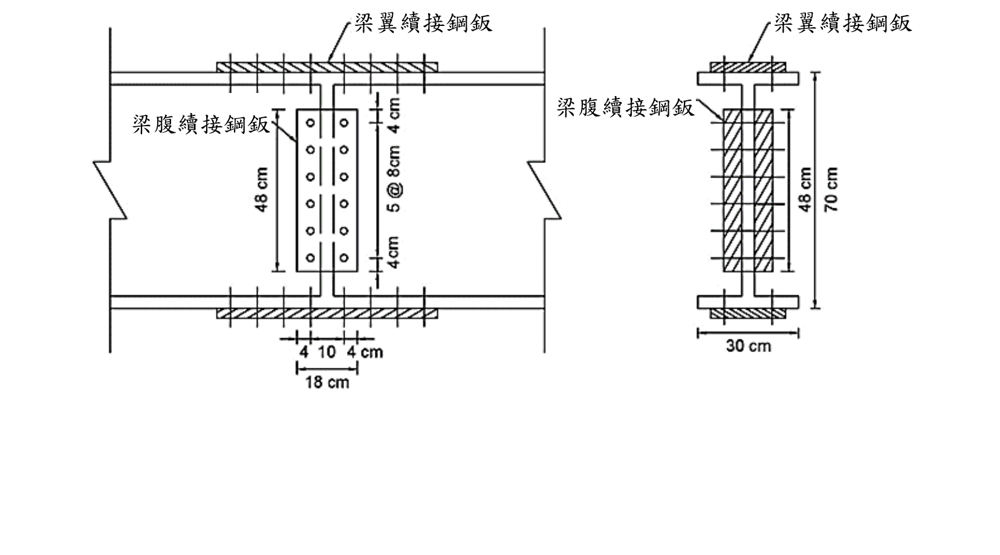

# 考題編號：SS-2020-4

**主分類：** `4.1.4` 接合之分析與設計
**副分類：** `4.1.2` 梁桿件
**設計法：** ASD
**標籤：** `接合設計` `腹板續接` `四鈑接合` `ASD` `高強度螺栓` `A490螺栓` `螺栓尺寸` `鈑厚設計` `容許剪應力` `最小接合強度規定` `剪力設計`

---

## 1. 原始題目重述 (Problem Restatement)

下圖為以四鈑接合之鋼梁續接圖，梁斷面為 H700×300×14×25，材料強度 $F_y = 2.5$ tf/cm²，螺栓為 A490 螺栓，容許剪應力 $F_{va} = 2.8$ tf/cm²，梁在續接位置承受之 $M_w = 60$ tf·m，$V_w = 70$ tf，若規範規定：**梁續接之接合強度不得小於梁桿件強度之一半**，試依容許應力設計規範，設計梁腹鈑續接接合鈑需要之**螺栓尺寸**及需要之**鈑厚**。（25分）

**梁斷面幾何（H700×300×14×25）：**
- 總高：$H = 700$ mm → 70 cm
- 翼板寬：$b_f = 300$ mm → 30 cm
- 腹板厚：$t_w = 14$ mm → 1.4 cm
- 翼板厚：$t_f = 25$ mm → 2.5 cm
- 腹板淨高：$h_w = H - 2t_f = 700 - 50 = 650$ mm → 65 cm

*圖說：左圖（正視圖）：腹板續接鈑（長方形，鈑高 48cm，寬 18cm=4+10+4cm），螺栓 2 列（左右各 1 列，間距 10cm）× 6 排（上下方向，@8cm），上下各留 4cm 邊距；左右各有梁翼板續接鈑（水平條帶）。右圖（斷面視圖）：梁總高 70cm，上下翼板各 2.5cm 厚、30cm 寬，腹板 1.4cm 厚，65cm 高；腹板兩側各一片腹板鈑（虛線）；翼板上下各一片翼板鈑（陰影）。*

---

## 2. 考題核心精神與出題者意圖 (Core Concepts & Examiner's Intent)

**核心觀念：梁腹板續接設計——最小接合強度規定 + 螺栓剪力 + 板材剪力降伏**

本題測驗兩個主軸：

1. **設計剪力的確定**：依「不得小於梁腹板強度之一半」規定，計算腹板容許剪力 $V_a$，與實際剪力 $V_w$ 比較，取大值作為設計剪力
2. **螺栓尺寸與鈑厚計算**：依設計剪力，計算所需螺栓截面積（決定尺寸）及接合鈑所需最小厚度（剪力降伏控制）

**出題者考查重點：**
- 最小接合強度規定（$V_{design} \geq 0.5 \times V_{a,web}$）的應用
- ASD 螺栓設計：$n \times 2 \times A_b \times F_{va} \geq V_{design}$（雙剪）
- 接合鈑剪力降伏：$2 \times 0.4F_y \times t \times h_{plate} \geq V_{design}$

---

## 3. 解題戰略地圖與陷阱分析 (Strategic Roadmap & Trap Analysis)

**步驟規劃：**
1. 計算腹板面積 $A_w$ 與腹板容許剪力 $V_{a,web}$
2. 確定設計剪力 $V_{design} = \max(V_w, 0.5 V_{a,web})$
3. 確定螺栓配置（由題目圖面讀取列數與排數）
4. 計算所需螺栓截面積 $A_b$，選定螺栓尺寸
5. 計算腹板鈑所需厚度 $t$（剪力降伏控制）

**關鍵陷阱：**

> ⚠️ **陷阱1：誤用全斷面面積 $A_g$ 計算 $V_{a,web}$**
> 腹板容許剪力用**腹板面積** $A_w = h_w \times t_w$，不可用全斷面積 $A_g$。

> ⚠️ **陷阱2：忽略雙剪設計（兩片腹板鈑）**
> 四鈑接合中，腹板兩側各有一片接合鈑，每根螺栓穿過兩片接合鈑與腹板，形成**雙剪（double shear）**。公式分母需含 $\times 2$。

> ⚠️ **陷阱3：板厚計算用腹板高度還是鈑高度**
> 接合鈑的有效剪力面積為鈑的實際高度（約等於螺栓排列高度加邊距），需從圖面讀取或合理假設，非腹板淨高 65 cm。

> ⚠️ **陷阱4：只看 $V_w$，忽略最小強度規定**
> 規範要求設計剪力 $\geq 0.5 V_{a,web}$，若實際 $V_w < 0.5 V_{a,web}$，必須用 $0.5 V_{a,web}$ 設計。

## 3.5 變數層次分析（Variable Hierarchy Analysis）

> 複習提示：解題後，在每個卡住的知識點「卡關?」欄標記 `⚠`；第二次複習時只看有 `⚠` 的項目。

**最終目標：** 確定設計剪力（取實際剪力與最小接合強度規定之較大值）→ 計算螺栓所需截面積並選定尺寸 → 計算腹板接合鈑所需厚度

### 主要公式（$\boxed{\phantom{x}}$ = 未知，待推導）

**Step 1：腹板容許剪力（最小接合強度基準）**
$$A_w = h_w \times t_w, \quad V_{a,web} = 0.4 F_y A_w$$
$$\boxed{V_{design}} = \max(V_w,\; 0.5 V_{a,web})$$

**Step 2：螺栓尺寸（ASD 雙剪）**
$$n \times 2 \times \boxed{A_b} \times F_{va} \geq V_{design} \quad \Rightarrow \quad \boxed{d_b} = \sqrt{4A_b/\pi}$$

**Step 3：腹板接合鈑厚度（剪力降伏）**
$$2 \times 0.4 F_y \times \boxed{t} \times h_{plate} \geq V_{design}$$

### L1：題目直接給定

| 符號 | 數值 | 說明 |
|------|------|------|
| 梁斷面 | H700×300×14×25 | $H$=70cm，$b_f$=30cm，$t_w$=1.4cm，$t_f$=2.5cm |
| $F_y$ | 2.5 tf/cm² | 降伏應力 |
| $F_{va}$ | 2.8 tf/cm² | A490 螺栓容許剪應力（ASD）|
| $M_w$ | 60 tf·m | 續接位置彎矩（不直接用於本題計算）|
| $V_w$ | 70 tf | 續接位置實際剪力 |
| 最小強度規定 | $\geq 0.5 V_{a,web}$ | 梁續接接合強度下限 |
| 螺栓配置 | 2 列 × 6 排（讀圖）| 每端 6 個螺栓，雙剪 |
| 鈑高 $h_{plate}$ | 48 cm | 由圖面讀取（5@8+4+4=48cm）|

### L2：需知識點推導

**Step 1：設計剪力**

| 符號 | 公式 / 來源 | 卡關? |
|------|------------|:-----:|
| $h_w$ | $H - 2t_f = 70 - 5 = 65$ cm（腹板淨高）| |
| $A_w$ | $h_w 	imes t_w = 65 	imes 1.4 = 91$ cm² | |
| $V_{a,web}$ | $0.4 	imes F_y 	imes A_w = 0.4 	imes 2.5 	imes 91 = 91$ tf | |
| $V_{min}$ | $0.5 	imes 91 = 45.5$ tf | |
| $V_{design}$ | $\max(70, 45.5) = 70$ tf（實際剪力控制）| |

**Step 2：螺栓尺寸**

| 符號 | 公式 / 來源 | 卡關? |
|------|------------|:-----:|
| $n$ | 6 個（每端，2列×3排）| |
| $A_b$ | $\geq 70/(6 	imes 2 	imes 2.8) = 2.083$ cm² | |
| 選用 | M20（$A_b = \pi 	imes 2^2/4 = 3.14$ cm²）$\checkmark$ | |

**Step 3：接合鈑厚度**

| 符號 | 公式 / 來源 | 卡關? |
|------|------------|:-----:|
| $t$ | $\geq 70/(2 	imes 0.4 	imes 2.5 	imes 48) = 0.729$ cm = 7.29 mm | |
| 選用 | $t = 8$ mm（向上進位至標準板厚）$\checkmark$ | |

### L3：深層知識（不懂就卡住）

| 知識點 | 說明 | 補強頁 | 卡關? |
|--------|------|:------:|:-----:|
| 最小接合強度規定 | 設計剪力不得小於梁腹板容許剪力的一半；實際剪力偏小時，此規定控制設計 | | |
| 腹板容許剪力用 $A_w = h_w t_w$（淨高）| 不可用全斷面積；$h_w$ 為兩翼板內側之淨高，不含翼板厚 | | |
| 雙剪（double shear）| 四鈑接合腹板鈑兩側各一片，每根螺栓有兩個剪力面；公式含 $	imes 2$ | | |
| ASD 螺栓設計：$n 	imes 2 	imes A_b 	imes F_{va}$ | 螺栓數 × 剪力面數 × 截面積 × 容許剪應力 ≥ 設計剪力 | | |
| 接合鈑剪力降伏：$0.4 F_y$ | 鈑材在剪力下的容許應力為 $0.4 F_y$；兩片鈑承擔全部設計剪力 | | |

---

## 4. 步驟化詳細計算過程 (Step-by-Step Detailed Calculation)

### Step 1：斷面幾何計算

**腹板面積：**
$$A_w = h_w \times t_w = 65 \times 1.4 = 91 \text{ cm}^2$$

**全斷面積（參考）：**
$$A_g = 2 \times (b_f \times t_f) + A_w = 2 \times (30 \times 2.5) + 91 = 150 + 91 = 241 \text{ cm}^2$$

---

### Step 2：確定設計剪力

**腹板容許剪力（ASD）：**
$$V_{a,web} = 0.4 \times F_y \times A_w = 0.4 \times 2.5 \times 91 = \mathbf{91 \text{ tf}}$$

**規範最小接合強度要求：**
$$V_{min} = 0.5 \times V_{a,web} = 0.5 \times 91 = 45.5 \text{ tf}$$

**設計剪力：**
$$V_{design} = \max(V_w,\ V_{min}) = \max(70, 45.5) = \boxed{70 \text{ tf}}$$

（實際剪力 $V_w = 70$ tf 控制）

---

### Step 3：螺栓配置（讀取圖面）

由題目圖面，腹板鈑螺栓配置為：

- **列數：** 2 列（腹板左右方向，列間距 10 cm）
- **排數：** 6 排（梁高方向，@8 cm，共 5 個間距 = 40 cm）
- **邊距：** 上下各 4 cm
- **腹板鈑高度：** $h_{plate} = 5 \times 8 + 4 + 4 = 48$ cm

每側（連接一端梁）之螺栓數：
$$n = 2 \text{ 列} \times 3 \text{ 排} = 6 \text{ 個}$$

（6 個螺栓連接至其中一端梁，另外 6 個連接另一端梁；鈑高 48 cm 的一半各放 3 排）

**注意：** 四鈑接合腹板鈑為兩片（左右各一片），每個螺栓穿過左鈑、腹板、右鈑，形成**雙剪（2 個剪力面）**。

---

### Step 4：計算所需螺栓截面積，選定螺栓尺寸

**螺栓設計公式（ASD 雙剪）：**

$$n \times 2 \times A_b \times F_{va} \geq V_{design}$$

$$6 \times 2 \times A_b \times 2.8 \geq 70$$

$$33.6 \times A_b \geq 70$$

$$A_b \geq \frac{70}{33.6} = \frac{70}{12 \times 2.8} = 2.083 \text{ cm}^2$$

**選定螺栓直徑：**
$$A_b = \frac{\pi d^2}{4} \geq 2.083 \text{ cm}^2 \quad \Rightarrow \quad d \geq \sqrt{\frac{4 \times 2.083}{\pi}} = \sqrt{2.653} = 1.629 \text{ cm}$$

選用 **M20 螺栓**（$d = 2.0$ cm）：
$$A_b = \frac{\pi \times 2^2}{4} = 3.14 \text{ cm}^2 > 2.083 \text{ cm}^2 \quad \checkmark$$

驗算：
$$6 \times 2 \times 3.14 \times 2.8 = 105.5 \text{ tf} > 70 \text{ tf} \quad \checkmark$$

$$\boxed{\text{選用 M20（A490）高強度螺栓}}$$

---

### Step 5：計算腹板鈑所需厚度（剪力降伏控制）

腹板鈑（兩片，左右各一）需能承受全部設計剪力，由剪力降伏控制：

$$2 \times \left(0.4 F_y \times t \times h_{plate}\right) \geq V_{design}$$

$$2 \times 0.4 \times 2.5 \times t \times 48 \geq 70$$

$$2 \times 48t = 96t \geq 70$$

$$t \geq \frac{70}{96} = 0.729 \text{ cm} = 7.29 \text{ mm}$$

取最近可用板厚，選用 **$t = 8$ mm（0.8 cm）**：

驗算：
$$2 \times 0.4 \times 2.5 \times 0.8 \times 48 = 2 \times 38.4 = 76.8 \text{ tf} > 70 \text{ tf} \quad \checkmark$$

$$\boxed{\text{腹板鈑厚度 } t = 8 \text{ mm}}$$

---

### 計算彙整

| 項目 | 數值 |
|------|------|
| 腹板面積 $A_w$ | 91 cm² |
| 腹板容許剪力 $V_{a,web}$ | 91 tf |
| 最小設計剪力 $0.5 V_{a,web}$ | 45.5 tf |
| 設計剪力 $V_{design}$ | **70 tf**（實際剪力控制）|
| 螺栓配置 | 2 列 × 6 排（每端 6 個，雙剪）|
| 所需螺栓截面積 $A_b$ | ≥ 2.083 cm² |
| **選用螺栓** | **M20（$A_b = 3.14$ cm²）A490 螺栓** |
| 鈑高 $h_{plate}$ | 48 cm（螺栓排列高度）|
| 所需鈑厚 $t$ | ≥ 0.729 cm = 7.29 mm |
| **選用鈑厚** | **8 mm（0.8 cm）** |

---

## 5. 關鍵爭議點與進階探討 (Critical Issues & Advanced Discussion)

### 最小接合強度規定的設計意義

規範規定「梁續接之接合強度不得小於梁桿件強度之一半」，是為了**防止接合設計過於薄弱**。在實際工程中，梁的續接位置可能因分析誤差、荷載重分配或地震等因素承受更大力量。若接合強度僅恰好等於設計剪力（如 $V_w = 20$ tf），卻遠低於梁本身剪力容量（$V_{a,web} = 91$ tf），日後使用不安全。

本題 $V_w = 70$ tf > $0.5 V_{a,web} = 45.5$ tf，實際剪力控制，最小強度規定未左右設計；但若 $V_w = 30$ tf，則最小強度規定（45.5 tf）將控制設計，需按 45.5 tf 計算螺栓數量。

### 腹板彎矩成分的處理

本題只問「腹板鈑續接」，通常假設：
- **翼板鈑**承擔力矩 $M_w$（翼板拉壓力偶：$C = T = M_w / d_{flange}$）
- **腹板鈑**承擔全部剪力 $V_w$ 及腹板承擔的部分彎矩

嚴格分析應將腹板彎矩分量納入，以偏心剪力合成設計（向量疊加法）。但本題依標準 ASD 腹板續接的簡化方法，僅以剪力 $V_{design}$ 設計螺栓，符合一般考試解法。

若採精確法：腹板彎矩分量
$$M_{web} = M_w \times \frac{I_w}{I_x}$$

其中 $I_w = t_w h_w^3/12 = 1.4 \times 65^3/12 = 32{,}039$ cm⁴，$I_x = 202{,}898$ cm⁴

$$M_{web} = 6000 \times \frac{32{,}039}{202{,}898} = 6000 \times 0.1579 = 947.6 \text{ tf·cm}$$

再以偏心群螺栓法計算合成力，但本題不要求此層次。

### 接合鈑規格選用說明

鈑厚 8 mm 是鋼結構常用的標準板厚之一（常見系列：6、8、10、12、14、16 mm）。計算所需 7.29 mm，向上進位取 8 mm 為最接近且安全的選擇。

### 考場安全答法

1. $A_w = 65 \times 1.4 = 91$ cm²，$V_{a,web} = 0.4 \times 2.5 \times 91 = 91$ tf
2. $V_{design} = \max(70, 0.5 \times 91) = \max(70, 45.5) = 70$ tf
3. 由圖：$n = 6$ 螺栓（每端），雙剪（2 片腹板鈑）
4. $A_b \geq 70/(6 \times 2 \times 2.8) = 70/33.6 = 2.083$ cm² → 選 **M20**（$A_b = 3.14$ cm²）
5. $h_{plate} = 48$ cm（$5 \times 8 + 4 + 4$）；$t \geq 70/(2 \times 0.4 \times 2.5 \times 48) = 70/96 = 0.729$ cm → 選 **$t = 8$ mm**
