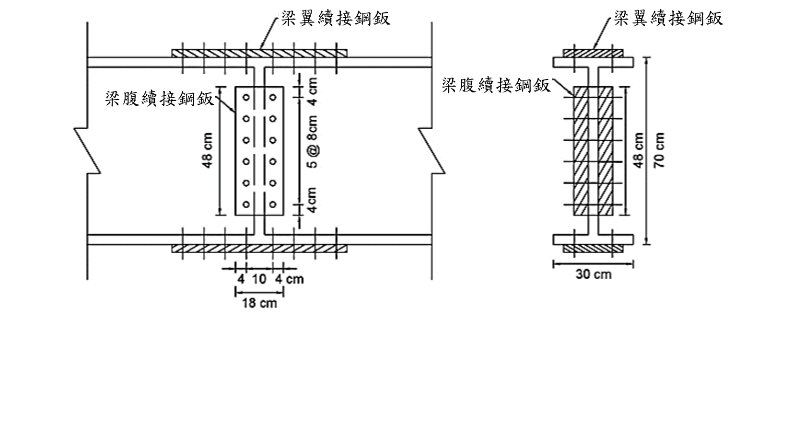

# 考題編號：SS-2020-4

**主分類：** `SS-U1-4` 接合之分析與設計
**副分類：** `SS-U1-2` 梁桿件
**設計法：** ASD
**標籤：** `接合設計` `腹板續接` `四鈑接合` `ASD` `高強度螺栓` `A490螺栓` `螺栓尺寸` `鈑厚設計` `容許剪應力` `最小接合強度規定` `剪力設計` `偏心螺栓群` `腹板彎矩分擔` `Iw/Ix`

---

## 1. 原始題目重述 (Problem Restatement)

下圖為以四鈑接合之鋼梁續接圖，梁斷面為 H700×300×14×25，材料強度 $F_y = 2.5$ tf/cm²，螺栓為 A490 螺栓，容許剪應力 $F_{va} = 2.8$ tf/cm²，梁在續接位置承受之 $M_w = 60$ tf·m，$V_w = 70$ tf，若規範規定：**梁續接之接合強度不得小於梁桿件強度之一半**，試依容許應力設計規範，設計梁腹鈑續接接合鈑需要之**螺栓尺寸**及需要之**鈑厚**。（25分）

**梁斷面幾何（H700×300×14×25）：**
- 總高：$H = 700$ mm → 70 cm
- 翼板寬：$b_f = 300$ mm → 30 cm
- 腹板厚：$t_w = 14$ mm → 1.4 cm
- 翼板厚：$t_f = 25$ mm → 2.5 cm
- 腹板淨高：$h_w = H - 2t_f = 700 - 50 = 650$ mm → 65 cm

*圖說（2026-08-22 重新判讀原始試卷確認）：左圖（正視圖）為續接處立面。**腹板續接鈑**為長方形，高 48 cm、寬 18 cm（= 4 + 10 + 4 cm）；螺栓為 **2 縱列 × 6 橫排**：兩縱列相距 10 cm、對稱跨越續接中心線（每列距中心線 5 cm），兩側各留 4 cm 邊距；6 橫排間距 5@8 cm = 40 cm，上下各留 4 cm 邊距，故鈑高 4 + 40 + 4 = 48 cm。**左列 6 支螺栓接左段梁、右列 6 支螺栓接右段梁**，故每側之設計螺栓數為 6 支。上、下另各有一片**梁翼板續接鈑**（水平條帶）。右圖（斷面視圖）：梁總高 70 cm、上下翼板各 30 cm 寬 × 2.5 cm 厚、腹板 1.4 cm 厚 × 65 cm 高；**腹板兩側各一片腹板續接鈑**（故螺栓為雙剪）、翼板上下各一片翼板續接鈑——合計 4 片，即題目所稱「四鈑接合」。*

> 🔍 **關鍵圖面判讀更正**：舊版曾在同一份解析中寫「2 列 × 6 排」又寫「$n$ = 2 列 × 3 排 = 6 個」，前後矛盾。正確理解為：**鈑上共 12 支螺栓（2 列 × 6 排），每一縱列的 6 支負責一端梁**，故單側設計螺栓數 $n = 6$；且該縱列距續接中心線 $e = 5$ cm，會產生**偏心彎矩 $V \cdot e$**（舊版完全未計入，見 §4 Step 4）。

---

## 2. 考題核心精神與出題者意圖 (Core Concepts & Examiner's Intent)

**核心觀念：梁腹板續接設計 —— 最小接合強度規定 + 偏心螺栓群 + 腹板彎矩分擔 + 鈑材應力**

本題測驗四個主軸：

1. **設計力的確定**：依「接合強度不得小於梁桿件強度之一半」規定，比較 $\max(M_w,\ 0.5M_a)$ 與 $\max(V_w,\ 0.5V_a)$
2. **腹板鈑所承擔的作用力**：$V$ 之外還有 ①螺栓列偏離續接中心線 5 cm 所生之 $V\!\cdot\!e$、②腹板依剛度分擔之彎矩 $M_w \cdot I_w/I_x$
3. **偏心螺栓群分析**：直接剪力（$V/n$，鉛垂）+ 彎矩剪力（$M y_{\max}/\Sigma y^2$，水平）向量疊加
4. **鈑厚設計**：剪力（$0.4F_y$）與彎矩（$0.6F_y$）雙重控制

**出題者考查重點：**
- 最小接合強度規定的**雙向**應用（$M$ 與 $V$ 都要比）
- 由圖面正確判讀「每側 6 支螺栓、雙剪、偏心 5 cm」
- 題目既然給了 $M_w = 60$ tf·m，就不會只是拿來比最小強度——腹板必須分擔一部分彎矩
- ASD 螺栓雙剪：$2 A_b F_{va} \ge R_{\max}$（**逐支**檢核最不利螺栓，非總和）

---

## 3. 解題戰略地圖與陷阱分析 (Strategic Roadmap & Trap Analysis)

**步驟規劃：**
1. 斷面性質：$I_x$、$S_x$、$I_w$、$A_w$
2. 最小接合強度：$M_a = 0.66F_yS_x$、$V_a = 0.4F_y d t_w$，各取一半與 $M_w$、$V_w$ 比較
3. 由圖面確定螺栓配置：每側 6 支、雙剪、偏心 $e = 5$ cm、$\Sigma y^2$
4. 腹板鈑承受之總彎矩 $M_{\text{bolt}} = M_w \dfrac{I_w}{I_x} + V\!\cdot\!e$
5. 最不利螺栓合力 → 所需 $A_b$ → 選定螺栓尺寸
6. 鈑厚：剪力控制 + 彎矩控制，取大者

**關鍵陷阱：**

> ⚠️ **陷阱1：漏掉偏心彎矩 $V \cdot e$**
> 螺栓列距續接中心線 5 cm，$V = 70$ tf 造成 $350$ tf·cm 的附加彎矩。忽略後最不利螺栓合力由 13.24 tf 低估為 11.67 tf。

> ⚠️ **陷阱2：漏掉腹板分擔之彎矩**
> 題目給 $M_w = 60$ tf·m，腹板依剛度分擔 $I_w/I_x = 15.8\%$，即 947 tf·cm——比偏心彎矩大 2.7 倍！忽略後螺栓由 D25 誤選為 M20（低估 44%）。

> ⚠️ **陷阱3：螺栓數目讀錯**
> 鈑上共 12 支（2 列 × 6 排），但**每一縱列的 6 支負責一端梁**，故設計用 $n = 6$。不可寫成「2 列 × 3 排」。

> ⚠️ **陷阱4：$A_w$ 用 $h_w t_w$ 還是 $d\,t_w$**
> 台灣 ASD 規範剪應力 $f_v = V/(d\,t_w)$ 用**全高**；部分教科書用 $h_w t_w$。本題兩者之一半（49.0 / 45.5 tf）都小於 $V_w = 70$ tf，結論不變。

> ⚠️ **陷阱5：鈑厚只算剪力**
> 腹板鈑同時受彎，$0.6F_y$ 之彎矩檢核在本題**控制**（1.126 cm > 0.729 cm）。

> ⚠️ **陷阱6：ASD 螺栓檢核是「逐支」不是「總和」**
> 偏心群中各螺栓受力不等，必須用最不利（最外排）螺栓之合力除以 $2F_{va}$ 求 $A_b$。

---

## 3.5 變數層次分析（Variable Hierarchy Analysis）

> 複習提示：解題後，在每個卡住的知識點「卡關?」欄標記 `⚠`；第二次複習時只看有 `⚠` 的項目。

**最終目標：** 確定腹板鈑所受之 $V$ 與總彎矩 → 偏心螺栓群最不利合力 → 選定螺栓尺寸 → 鈑厚（剪力／彎矩雙控）

### 主要公式（$\boxed{\phantom{x}}$ = 未知，待推導）

**Step 1：最小接合強度規定（雙向）**
$$M_a = 0.66F_yS_x,\qquad V_a = 0.4F_y\,d\,t_w$$
$$\boxed{M_{\text{des}}} = \max(M_w,\ 0.5M_a),\qquad \boxed{V_{\text{des}}} = \max(V_w,\ 0.5V_a)$$

**Step 2：腹板鈑承受之總彎矩**
$$\boxed{M_{\text{bolt}}} = M_{\text{des}}\cdot\frac{I_w}{I_x} + V_{\text{des}}\cdot e$$

**Step 3：偏心螺栓群（ASD 雙剪，逐支）**
$$f_v = \frac{V_{\text{des}}}{n},\quad f_h = \frac{M_{\text{bolt}}\,y_{\max}}{\sum y^2},\quad \boxed{R_{\max}} = \sqrt{f_v^2 + f_h^2}$$
$$2\boxed{A_b}F_{va} \ge R_{\max} \;\Rightarrow\; \boxed{d_b} = \sqrt{4A_b/\pi}$$

**Step 4：鈑厚（兩片，$0.4F_y$ 剪力 / $0.6F_y$ 彎矩）**
$$\boxed{t} \ge \max\left(\frac{V_{\text{des}}}{2 h_{pl}(0.4F_y)},\ \frac{M_{\text{bolt}}}{\left(2h_{pl}^2/6\right)(0.6F_y)}\right)$$

### L1：題目直接給定

| 符號 | 數值 | 說明 |
|------|------|------|
| 梁斷面 | H700×300×14×25 | $d$=70cm，$b_f$=30cm，$t_w$=1.4cm，$t_f$=2.5cm |
| $F_y$ | 2.5 tf/cm² | 降伏應力 |
| $F_{va}$ | 2.8 tf/cm² | A490 螺栓容許剪應力（= 40 ksi，即**螺紋不在剪力面之承壓型**，見 §5） |
| $M_w$ | 60 tf·m | 續接位置之工作彎矩（下標 w = working） |
| $V_w$ | 70 tf | 續接位置之工作剪力 |
| 最小強度規定 | 接合強度 $\ge$ 梁桿件強度之 1/2 | $M$ 與 $V$ 皆需比較 |
| 螺栓配置 | 2 縱列 × 6 橫排；**每側 6 支** | 雙剪（腹板兩側各一片鈑） |
| 螺栓間距 | 縱向（沿梁高）@8 cm；橫向 10 cm | 端距 4 cm |
| 偏心距 $e$ | 5 cm | 螺栓列至續接中心線 |
| 鈑高 $h_{pl}$ | 48 cm | 4 + 5@8 + 4 = 48 cm |
| 鈑寬 | 18 cm | 4 + 10 + 4 = 18 cm |

### L2：需知識點推導

**Step 1：斷面性質**

| 符號 | 公式 / 來源 | 卡關? |
|------|------------|:-----:|
| $h_w$ | $d - 2t_f = 70 - 5 = 65$ cm | |
| $I_x$ | $\dfrac{b_f d^3 - (b_f-t_w)h_w^3}{12} = \dfrac{30(70^3) - 28.6(65^3)}{12} = 202{,}977$ cm⁴ | |
| $S_x$ | $I_x/(d/2) = 202977/35 = 5{,}799$ cm³ | |
| $I_w$ | $t_w h_w^3/12 = 1.4(65^3)/12 = 32{,}040$ cm⁴ | |
| $I_w/I_x$ | $0.1578$（腹板僅分擔 15.8% 彎矩） | |

**Step 2：最小接合強度規定**

| 符號 | 公式 / 來源 | 卡關? |
|------|------------|:-----:|
| 斷面分類 | 翼板 $b_f/2t_f = 6.0 < 17/\sqrt{F_y} = 10.75$；腹板 $h_w/t_w = 46.4 < 170/\sqrt{F_y} = 107.5$ → **結實斷面** | |
| $M_a$ | $0.66 F_y S_x = 1.65 \times 5799 = 9{,}569$ tf·cm $= 95.7$ tf·m | |
| $0.5M_a$ | 47.8 tf·m $< M_w = 60$ tf·m → **$M_w$ 控制** | |
| $V_a$ | $0.4F_y d t_w = 0.4(2.5)(70)(1.4) = 98$ tf | |
| $0.5V_a$ | 49.0 tf $< V_w = 70$ tf → **$V_w$ 控制** | |

**Step 3：腹板鈑承受之作用力**

| 符號 | 公式 / 來源 | 卡關? |
|------|------------|:-----:|
| $M_{\text{web}}$ | $M_w \cdot I_w/I_x = 6000 \times 0.1578 = 947$ tf·cm | |
| $V\!\cdot\!e$ | $70 \times 5 = 350$ tf·cm | |
| $M_{\text{bolt}}$ | $947 + 350 = 1{,}297$ tf·cm | |
| $\sum y^2$ | $2(4^2 + 12^2 + 20^2) = 1{,}120$ cm² | |

**Step 4：螺栓尺寸**

| 符號 | 公式 / 來源 | 卡關? |
|------|------------|:-----:|
| $f_v$ | $70/6 = 11.67$ tf（鉛垂） | |
| $f_h$ | $1297 \times 20/1120 = 23.16$ tf（水平） | |
| $R_{\max}$ | $\sqrt{11.67^2 + 23.16^2} = 25.93$ tf | |
| $A_b$ | $\ge 25.93/(2 \times 2.8) = 4.631$ cm² | |
| $d_b$ | $\ge \sqrt{4(4.631)/\pi} = 2.428$ cm | |
| 選用 | **D25**（$d = 2.5$ cm，$A_b = 4.909$ cm²）；容量 $2(4.909)(2.8) = 27.49 > 25.93$ ✓ | |
| 間距檢核 | $8 > 3d = 7.5$ cm ✓；端距 $4 > 1.25d = 3.13$ cm ✓ | |

**Step 5：鈑厚**

| 符號 | 公式 / 來源 | 卡關? |
|------|------------|:-----:|
| 剪力控制 | $t \ge 70/[2(48)(0.4 \times 2.5)] = 0.729$ cm | |
| 彎矩控制 | $S = 2(48^2/6)t = 768t$；$t \ge 1297/(768 \times 1.5) = 1.126$ cm ← **控制** | |
| 選用 | $t = 12$ mm；驗算 $f_b = 1.41 < 1.5$ ✓，$f_v = 0.61 < 1.0$ ✓ | |

### L3：深層知識（不懂就卡住）

| 知識點 | 說明 | 補強頁 | 卡關? |
|--------|------|:------:|:-----:|
| 最小接合強度規定 | 接合強度不得小於梁桿件強度之一半；**$M$ 與 $V$ 都要比**。實際作用力偏小時此規定控制 | | |
| 四鈑續接之力量分配 | 翼板鈑承擔 $M \cdot (1 - I_w/I_x)$；腹板鈑承擔 $M \cdot I_w/I_x$ + 全部 $V$ + 偏心 $V\!\cdot\!e$ | | |
| 腹板彎矩分擔比 $I_w/I_x$ | 深梁之腹板慣性矩佔比小（本題 15.8%），但乘上 $M$ 後仍是螺栓群最大的彎矩來源 | | |
| 螺栓群偏心 $e$ | 螺栓列至續接中心線之距離；ASD 續接必計，是最常被忽略的項 | | |
| 偏心螺栓群向量法 | $f_v = V/n$（均勻）+ $f_h = My/\Sigma y^2$（線性），正交疊加；**逐支檢核最不利者** | | |
| 雙剪（double shear） | 四鈑接合腹板兩側各一片鈑，每支螺栓有 2 個剪力面；容量 $= 2A_bF_{va}$ | | |
| 鈑材 $0.4F_y$ / $0.6F_y$ | 剪力容許應力 $0.4F_y$、彎曲容許應力 $0.6F_y$（鈑件非結實斷面，不用 0.66） | | |
| $A_w = d\,t_w$（ASD） | 台灣 ASD 規範 $f_v = V/(d t_w)$ 用全高；LRFD 則常用 $(d-2t_f)t_w$ | | |

---

## 4. 步驟化詳細計算過程 (Step-by-Step Detailed Calculation)

### Step 1：斷面幾何與斷面性質

$$h_w = d - 2t_f = 70 - 2(2.5) = 65 \text{ cm}$$

$$I_x = \frac{b_f d^3 - (b_f - t_w)h_w^3}{12} = \frac{30(343{,}000) - 28.6(274{,}625)}{12} = \frac{10{,}290{,}000 - 7{,}854{,}275}{12} = \boxed{202{,}977 \text{ cm}^4}$$

$$S_x = \frac{I_x}{d/2} = \frac{202{,}977}{35} = 5{,}799 \text{ cm}^3$$

$$I_w = \frac{t_w h_w^3}{12} = \frac{1.4 \times 274{,}625}{12} = 32{,}040 \text{ cm}^4 \qquad \frac{I_w}{I_x} = \frac{32{,}040}{202{,}977} = 0.1578$$

$$A_g = 2(30)(2.5) + 65(1.4) = 150 + 91 = 241 \text{ cm}^2$$

**斷面分類（確認可用 $0.66F_y$）：**

$$\frac{b_f}{2t_f} = \frac{30}{5} = 6.0 \;<\; \frac{17}{\sqrt{F_y}} = \frac{17}{\sqrt{2.5}} = 10.75 \;\checkmark \qquad \frac{h_w}{t_w} = \frac{65}{1.4} = 46.4 \;<\; \frac{170}{\sqrt{2.5}} = 107.5 \;\checkmark$$

⇒ **結實斷面（compact）**，$F_b = 0.66F_y$

---

### Step 2：最小接合強度規定（$M$ 與 $V$ 雙向檢查）

規範規定：「梁續接之接合強度不得小於梁桿件強度之一半」——**彎矩與剪力都要比**。

**(a) 彎矩**

$$M_a = F_b S_x = 0.66(2.5)(5{,}799) = 1.65 \times 5{,}799 = 9{,}569 \text{ tf·cm} = 95.7 \text{ tf·m}$$

$$0.5 M_a = 47.8 \text{ tf·m} \;<\; M_w = 60 \text{ tf·m} \;\Rightarrow\; M_{\text{des}} = \boxed{60 \text{ tf·m}}$$

**(b) 剪力**

$$V_a = 0.4 F_y \, d \, t_w = 0.4(2.5)(70)(1.4) = \boxed{98 \text{ tf}}$$

$$0.5 V_a = 49.0 \text{ tf} \;<\; V_w = 70 \text{ tf} \;\Rightarrow\; V_{\text{des}} = \boxed{70 \text{ tf}}$$

*若改採 $A_w = h_w t_w = 91$ cm²：$V_a = 91$ tf，$0.5V_a = 45.5$ tf，仍 $< 70$ tf，結論不變。*

**⇒ 本題實際作用力（60 tf·m、70 tf）皆大於桿件強度之一半，最小強度規定不控制設計。**

---

### Step 3：螺栓配置（讀取圖面）

| 項目 | 數值 |
|------|------|
| 縱列數（跨越續接線） | 2 列（左列接左段梁、右列接右段梁），列間距 10 cm |
| 每列螺栓數（沿梁高） | **6 支**，間距 5@8 = 40 cm |
| 上下邊距 | 各 4 cm ⇒ 鈑高 $h_{pl} = 4 + 40 + 4 = 48$ cm |
| 左右邊距 | 各 4 cm ⇒ 鈑寬 $= 4 + 10 + 4 = 18$ cm |
| **設計螺栓數 $n$** | **6 支**（單側） |
| **偏心距 $e$** | **5 cm**（螺栓列至續接中心線） |
| 剪力面數 | **2**（腹板兩側各一片鈑 ⇒ 雙剪） |

**螺栓縱座標（以鈑中高為原點）：** $y = \pm 4,\ \pm 12,\ \pm 20$ cm

$$\sum y^2 = 2\left(4^2 + 12^2 + 20^2\right) = 2(16 + 144 + 400) = \boxed{1{,}120 \text{ cm}^2}$$

---

### Step 4：腹板續接鈑所承受之作用力

四鈑續接之力量分配原則：

$$\underbrace{\text{翼板鈑}}_{\text{承擔 } M(1 - I_w/I_x)} \qquad\qquad \underbrace{\text{腹板鈑}}_{\text{承擔 } M \cdot I_w/I_x \;+\; V \;+\; V\!\cdot\!e}$$

**(a) 腹板依剛度分擔之彎矩**

$$M_{\text{web}} = M_{\text{des}} \times \frac{I_w}{I_x} = 6{,}000 \times 0.1578 = \boxed{947 \text{ tf·cm}}$$

**(b) 螺栓列偏心所生之附加彎矩**

$$M_e = V_{\text{des}} \times e = 70 \times 5 = \boxed{350 \text{ tf·cm}}$$

**(c) 螺栓群所受之總彎矩**

$$M_{\text{bolt}} = M_{\text{web}} + M_e = 947 + 350 = \boxed{1{,}297 \text{ tf·cm}}$$

> 📌 兩項之相對量級值得記住：**腹板分擔彎矩（947）是偏心彎矩（350）的 2.7 倍**。舊版解析兩者都漏掉，只用 $V/n$，故嚴重低估。

---

### Step 5：最不利螺栓之合力與螺栓尺寸

**直接剪力（均勻分配，鉛垂）：**
$$f_v = \frac{V_{\text{des}}}{n} = \frac{70}{6} = 11.67 \text{ tf}$$

**彎矩剪力（線性分配，水平；最外排 $y_{\max} = 20$ cm）：**
$$f_h = \frac{M_{\text{bolt}} \cdot y_{\max}}{\sum y^2} = \frac{1{,}297 \times 20}{1{,}120} = 23.16 \text{ tf}$$

**向量合成（兩者正交）：**
$$R_{\max} = \sqrt{f_v^2 + f_h^2} = \sqrt{11.67^2 + 23.16^2} = \sqrt{136.2 + 536.5} = \boxed{25.93 \text{ tf}}$$

**所需螺栓截面積（雙剪）：**
$$2 A_b F_{va} \ge R_{\max} \;\Rightarrow\; A_b \ge \frac{25.93}{2 \times 2.8} = \boxed{4.631 \text{ cm}^2}$$

$$d_b \ge \sqrt{\frac{4 \times 4.631}{\pi}} = \sqrt{5.897} = 2.428 \text{ cm} = 24.3 \text{ mm}$$

**選用 D25（$d = 25$ mm）A490 螺栓：**
$$A_b = \frac{\pi (2.5)^2}{4} = 4.909 \text{ cm}^2 \;>\; 4.631 \;\checkmark$$
$$\text{容量} = 2 \times 4.909 \times 2.8 = 27.49 \text{ tf} \;>\; 25.93 \text{ tf} \;\checkmark \quad(\text{使用率 } 94.3\%)$$

**間距與端距檢核（$d = 2.5$ cm）：**

| 項目 | 圖面值 | 規範下限 | 判定 |
|------|-------|---------|------|
| 螺栓中心距（沿梁高） | 8 cm | $3d = 7.5$ cm（沿力方向）；絕對下限 $\frac{8}{3}d = 6.67$ cm | ✓ |
| 螺栓中心距（橫向） | 10 cm | 同上 | ✓ |
| 端距 | 4 cm | $\approx 1.25d = 3.13$ cm | ✓ |

$$\boxed{\text{選用 D25（}\phi 25\text{ mm）A490 螺栓，每側 6 支，雙剪}}$$

---

### Step 6：腹板續接鈑厚度

腹板鈑為**兩片**（腹板兩側各一），高 $h_{pl} = 48$ cm，須同時滿足剪力與彎矩：

**(a) 剪力控制（$F_v = 0.4F_y = 1.0$ tf/cm²）**

$$f_v = \frac{V_{\text{des}}}{2 h_{pl} t} \le 0.4F_y \;\Rightarrow\; t \ge \frac{70}{2(48)(1.0)} = 0.729 \text{ cm}$$

**(b) 彎矩控制（$F_b = 0.6F_y = 1.5$ tf/cm²）**

兩片鈑之斷面模數：$\displaystyle S = 2 \times \frac{t\,h_{pl}^2}{6} = 2 \times \frac{t (48)^2}{6} = 768\,t \text{ cm}^3$

$$f_b = \frac{M_{\text{bolt}}}{S} = \frac{1{,}297}{768\,t} \le 1.5 \;\Rightarrow\; t \ge \frac{1{,}297}{768 \times 1.5} = \boxed{1.126 \text{ cm}} \;\leftarrow \textbf{控制}$$

**(c) 選用 $t = 12$ mm（1.2 cm）並驗算**

| 項目 | 計算 | 容許 | 判定 |
|------|------|------|------|
| $f_b$ | $1297/(768 \times 1.2) = 1.408$ tf/cm² | $0.6F_y = 1.5$ | ✓（93.9%） |
| $f_v$ | $70/[2(48)(1.2)] = 0.608$ tf/cm² | $0.4F_y = 1.0$ | ✓（60.8%） |

$$\boxed{\text{腹板續接鈑厚度 } t = 12 \text{ mm（兩片，各 } 48 \times 18 \times 12 \text{ mm）}}$$

*（組合應力參考：$\sqrt{f_b^2 + 3f_v^2} = \sqrt{1.408^2 + 3(0.608)^2} = 1.758$ tf/cm²，略高於 $0.6F_y = 1.5$。台灣 ASD 對續接鈑並未要求此 von Mises 型檢核；若設計者自願採用，則需 $t \ge 1.406$ cm ⇒ **16 mm**。詳 §5。）*

---

### 計算彙整

| 項目 | 數值 |
|------|------|
| $I_x$ / $S_x$ | 202,977 cm⁴ / 5,799 cm³ |
| $I_w$ / $(I_w/I_x)$ | 32,040 cm⁴ / 0.1578 |
| $M_a$（桿件） / $0.5M_a$ | 95.7 / 47.8 tf·m |
| $V_a$（桿件） / $0.5V_a$ | 98 / 49.0 tf |
| 設計彎矩 $M_{\text{des}}$ | **60 tf·m**（實際作用力控制） |
| 設計剪力 $V_{\text{des}}$ | **70 tf**（實際作用力控制） |
| 腹板分擔彎矩 $M_{\text{web}}$ | 947 tf·cm |
| 偏心彎矩 $V\!\cdot\!e$ | 350 tf·cm |
| 螺栓群總彎矩 $M_{\text{bolt}}$ | **1,297 tf·cm** |
| 螺栓配置 | 2 列 × 6 排；**每側 6 支**，雙剪，$e = 5$ cm |
| $\sum y^2$ | 1,120 cm² |
| 最不利螺栓合力 $R_{\max}$ | **25.93 tf**（$f_v = 11.67$、$f_h = 23.16$） |
| 所需 $A_b$ / $d_b$ | ≥ 4.631 cm² / ≥ 24.3 mm |
| **選用螺栓** | **D25（$\phi$25 mm）A490，$A_b = 4.909$ cm²** |
| 所需鈑厚（剪力 / 彎矩） | 0.729 cm / **1.126 cm** |
| **選用鈑厚** | **12 mm** |

---

## 5. 關鍵爭議點與進階探討 (Critical Issues & Advanced Discussion)

### 爭議一（本次最重要更正）：腹板鈑到底承受哪些作用力？

三種假設層次及其結果：

| 假設 | 螺栓群總彎矩 | $f_h$ | $R_{\max}$ | 所需 $A_b$ | 螺栓 | 鈑厚 |
|------|------------|-------|-----------|-----------|------|------|
| **A** 僅 $V$，忽略偏心（舊版） | 0 | 0 | 11.67 tf | 2.083 cm² | M20 | 8 mm |
| **B** $V$ + 偏心 $V\!\cdot\!e$ | 350 tf·cm | 6.25 tf | 13.24 tf | 2.364 cm² | M20 | 8 mm |
| **C** $V$ + $V\!\cdot\!e$ + 腹板分擔彎矩（本文） | 1,297 tf·cm | 23.16 tf | **25.93 tf** | **4.631 cm²** | **D25** | **12 mm** |

> ⚠️ **本文採 C 為主答案**，理由：
> 1. 題目**明確給出 $M_w = 60$ tf·m**。若腹板鈑完全不分擔彎矩，此值僅用於最小強度比較（47.8 < 60），對「設計腹板鈑」毫無作用——25 分的題目不太可能如此設計。
> 2. 腹板鈑跨越續接面，該面上必然存在彎矩；由變形相容性，腹板與翼板依剛度比 $I_w/I_x$ 分擔，是續接設計的標準做法（AISC Manual Part 12「Beam and Girder Splices」亦採此原則）。
> 3. 假設 A 忽略偏心在物理上不成立（螺栓列確實偏離續接線 5 cm）。
>
> **但需誠實說明**：若命題者原意為「翼板鈑承擔全部彎矩、腹板鈑僅承擔剪力」（此為部分教科書之簡化法），則答案為假設 B 之 **M20 + 8 mm**。A 與 C 的螺栓尺寸差 44%（M20 vs D25），差異相當大。**本項屬需向使用者確認之判斷**（已記入 `wiki/log.md`）。
>
> 考場策略：**寫 C，並在旁註明「若假設翼板鈑承擔全部彎矩，則腹板鈑僅需 M20 與 8 mm」**，兩種答案都寫出，最為安全。

### 爭議二：$F_{va} = 2.8$ tf/cm² 對應哪一種 A490？

由台灣 ASD 規範第十章表 C10.3-2（螺栓容許剪應力）換算：

| 螺栓／狀態 | 容許剪應力 |
|-----------|-----------|
| A325 摩阻型（標準孔） | 17 ksi = 1.196 tf/cm² |
| A490 摩阻型（標準孔） | 21 ksi = 1.476 tf/cm² |
| A490-N 承壓型（螺紋**在**剪力面） | 28 ksi = 1.968 tf/cm² |
| **A490-X 承壓型（螺紋**不在**剪力面）** | **40 ksi = 2.812 tf/cm²** |

$$F_{va} = 2.8 \text{ tf/cm}^2 \;\approx\; 40 \text{ ksi} \;\Rightarrow\; \boxed{\text{A490-X，承壓型接合，螺紋不在剪力面}}$$

**設計意涵**：既然是承壓型（非摩阻型），本題**不需**檢核滑動，但**應**檢核孔壁承壓（見爭議三）。同時，「螺紋不在剪力面」要求螺栓長度與夾持厚度配合得當，須在施工圖上明確標註。

### 爭議三：補充檢核（題目未問，但實務必要）

**(a) 孔壁承壓**（$d = 2.5$ cm，$d_h = 2.8$ cm；$F_u$ 未給，設 $F_u = 4.1$ tf/cm²）

台灣 ASD 式(10.3-1a)：$F_p = 1.2F_u = 4.92$ tf/cm²

- 腹板（$t_w = 1.4$ cm）：每支 $R = 4.92 \times 2.5 \times 1.4 = 17.2$ tf $>$ 25.93/2（每剪力面 12.97 tf）✓
- 續接鈑（$t = 1.2$ cm，兩片共同承受）：每支每片 $R = 4.92 \times 2.5 \times 1.2 = 14.8$ tf $>$ 12.97 tf ✓

**(b) 續接鈑淨斷面剪力**（一列 6 孔）

$$h_{net} = 48 - 6 \times 2.8 = 31.2 \text{ cm}$$
$$f_v = \frac{70}{2(31.2)(1.2)} = 0.935 \text{ tf/cm}^2 \le 0.3F_u = 1.23 \;\checkmark$$

*（所需 $t \ge 70/[2(31.2)(1.23)] = 0.912$ cm，小於彎矩控制之 1.126 cm，不控制。）*

**(c) 續接鈑淨斷面彎曲**

$$I_{net}\big|_{\text{兩片}} = 2t\left[\frac{48^3}{12} - 2.8\sum y^2 - \frac{6(2.8)^3}{12}\right] = 2t\left[9{,}216 - 3{,}136 - 11\right] = 12{,}138\,t$$
$$S_{net} = \frac{12{,}138\,t}{24} = 505.8\,t \;\Rightarrow\; f_b = \frac{1{,}297}{505.8 \times 1.2} = 2.14 \text{ tf/cm}^2$$

以 $0.5F_u = 2.05$ tf/cm²（淨斷面拉力斷裂）判定則略為不足（$t \ge 1.25$ cm ⇒ **14 mm**）。惟：
- 題目未給 $F_u$，此檢核之依據不完整
- 螺栓孔位置之彎矩已因偏心而被保守放大
- 台灣 ASD 規範對續接鈑並未明列淨斷面彎曲檢核

故本文主答案仍取 **12 mm**，並註明「若一併檢核淨斷面彎曲與組合應力，宜提高至 14 mm」。**保守設計者可直接採 14 mm。**

### 爭議四：最小接合強度規定在什麼情況下才會控制？

本題 $M_w = 60 > 0.5M_a = 47.8$、$V_w = 70 > 0.5V_a = 49.0$，故不控制。臨界點：

$$M_w < 47.8 \text{ tf·m} \quad\text{或}\quad V_w < 49.0 \text{ tf}$$

例如若 $V_w = 30$ tf、$M_w = 30$ tf·m，則須改以 $M = 47.8$ tf·m、$V = 49.0$ tf 設計：

$$M_{\text{bolt}} = 4780(0.1578) + 49(5) = 754 + 245 = 999 \text{ tf·cm},\quad f_h = 17.84,\ f_v = 8.17$$
$$R_{\max} = 19.62 \text{ tf} \;\Rightarrow\; A_b \ge 3.504 \text{ cm}^2 \;\Rightarrow\; d \ge 2.11 \text{ cm} \;\Rightarrow\; \text{仍需 D22 以上}$$

此規定之目的：**防止接合成為結構中的「弱鏈」**。續接位置的內力受分析假設、載重重分配與地震影響甚大，若接合僅按名目內力設計，一旦內力超出預期便可能發生非韌性破壞。

### 爭議五：鈑厚之「彎矩」為何用 $0.6F_y$ 而非 $0.66F_y$？

$0.66F_y$ 適用於**結實斷面之型鋼繞強軸受彎且有側撐**。續接鈑為單片矩形鈑，不符「結實斷面」之翼板／腹板肢材定義，故採 $F_b = 0.6F_y$（一般容許彎曲應力）。這是 3 個百分點以上的差異（1.5 vs 1.65 tf/cm²），會使所需鈑厚由 1.126 降為 1.024 cm——但仍需 12 mm，結論不變。

---

## 6. 依最新規範（AISC 360-16／-22）對照

> **本題主答案所依規範**：內政部「鋼構造建築物鋼結構設計技術規範」民國 99 年（2010）修正版之**鋼結構容許應力設計法**（題目明示「試依容許應力設計規範」）。以下對照 AISC 360-16／-22。

### 6.1 ASD 哲學的根本改變：容許應力法 → 強度法除以 $\Omega$

| 項目 | 台灣 2010 ASD（＝AISC ASD-89） | AISC 360-16／-22 ASD |
|------|------------------------------|---------------------|
| 基本形式 | $f \le F_{\text{allow}}$（**應力**比較） | $R_a \le R_n/\Omega$（**強度**比較） |
| 剪力 | $f_v = V/(d t_w) \le 0.4F_y$ | $V_n = 0.6F_y A_w C_{v1}$，$\Omega = 1.67$ |
| 彎矩 | $f_b \le 0.66F_y$（結實） | $M_n = M_p = F_y Z_x$，$\Omega = 1.67$ |
| 螺栓剪力 | 查表 $F_{va}$（A490-X = 40 ksi） | $F_{nv} = 0.563F_u^b$（X）／$0.450F_u^b$（N），$\Omega = 2.00$ |

**梁桿件強度之一半（作為對照）：**

| 項目 | 台灣 ASD | AISC 360-16 ASD |
|------|---------|----------------|
| $M$ 容量 | $0.66F_yS_x = 95.7$ tf·m | $F_yZ_x/1.67$；$Z_x = b_ft_f(d-t_f) + t_wh_w^2/4 = 5062.5 + 1478.8 = 6{,}541$ cm³ ⇒ $\dfrac{2.5 \times 6541}{1.67} = 97.9$ tf·m |
| $V$ 容量 | $0.4F_y d t_w = 98$ tf | 組合斷面 $\Omega_v = 1.67$：$\dfrac{0.6(2.5)(98)}{1.67} = 88.0$ tf （若為軋製 I 型且 $h/t_w = 46.4 \le 2.24\sqrt{E/F_y} = 64.0$，則 $\Omega_v = 1.50$ ⇒ **98.0 tf，與台灣完全相同**） |
| 一半 | 47.8 / 49.0 | 49.0 / 44.0（或 49.0，$\Omega_v = 1.50$） |

兩套規範之桿件容量僅差 ±10%，**最小強度規定仍不控制**（$M_w = 60 > 49.0$、$V_w = 70 > 44.0$）。

### 6.2 螺栓剪力強度：查表 → 公式

AISC 360-16 表 J3.2：A490 之 $F_u^b = 150$ ksi

$$F_{nv}(\text{X}) = 0.563 \times 150 = 84.4 \text{ ksi} \;\Rightarrow\; \frac{F_{nv}}{\Omega} = \frac{84.4}{2.00} = 42.2 \text{ ksi} = 2.97 \text{ tf/cm}^2$$

比題目給定之 $F_{va} = 2.8$ tf/cm²（40 ksi）**高 6%**。若採 AISC 360-16：

$$A_b \ge \frac{25.93}{2 \times 2.97} = 4.368 \text{ cm}^2 \;\Rightarrow\; d \ge 2.358 \text{ cm} \;\Rightarrow\; \text{仍選 D25}$$

**選用尺寸不變**（D25 為最接近之標準規格）。

### 6.3 承壓 vs 撕出：360-22 拆為兩個極限狀態

| 規範 | 條文 | 形式 |
|------|------|------|
| 台灣 2010 ASD | 式 (10.3-1a)～(10.3-1c) | $F_p = 1.2F_u$；端螺栓 $F_p = L F_u/(2d) \le 1.2F_u$ |
| AISC 360-16 | §J3.10 | **合併**：$R_n = 1.2L_c t F_u \le 2.4 d t F_u$ |
| AISC 360-22 | §J3.11 承壓 + **§J3.12 撕出** | **分列**為兩個獨立極限狀態 |

360-22 的拆分是概念釐清（撕出屬剪力破壞、承壓屬壓陷變形），計算結果與 -16 之合併式相同。本題兩者皆通過。

### 6.4 螺栓間距規定

| 項目 | 台灣 2010 §10.3.9 | AISC 360-16／-22 §J3.3 |
|------|------------------|----------------------|
| 一般下限 | $\dfrac{8}{3}d$（$= 6.67$ cm） | $2\dfrac{2}{3}d$（相同） |
| 沿力方向（$F_p$ 由式 10.3-1a/b 計得時） | **$3d$**（$= 7.5$ cm） | $3d$ 為「建議值（preferred）」 |
| 本題圖面 8 cm | ✓ 兩者皆滿足 | ✓ |

### 6.5 續接設計方法：AISC Manual Part 12

AISC 手冊 Part 12「Beam and Girder Splices」對腹板續接之規定與本文假設 C 一致：

1. 腹板鈑承擔**全部剪力** $V$
2. 腹板鈑承擔**依剛度分擔之彎矩** $M \cdot I_w/I_x$（或保守地令翼板鈑承擔全部 $M$）
3. **另加螺栓群偏心彎矩** $V \cdot e$
4. 螺栓群以彈性向量法（或瞬心法）分析
5. 續接鈑須檢核：全斷面／淨斷面剪力、彎曲、以及**塊狀撕裂**

其中第 5 項的塊狀撕裂在台灣 ASD 規範第十章 10.4 節亦有（$F_v = 0.30F_u$ 於剪力淨斷面、$F_t = 0.50F_u$ 於張力淨斷面），本題因 $F_u$ 未給而未量化。

### 6.6 對照總表

| 項目 | 台灣 2010 ASD（本文主答案） | AISC 360-16／-22 |
|------|--------------------------|-----------------|
| 設計彎矩／剪力 | 60 tf·m / 70 tf | 同（最小強度規定皆不控制） |
| 螺栓容許剪應力 | 2.8 tf/cm²（40 ksi，題給） | $0.563F_u^b/2.00 = 2.97$ tf/cm² |
| 最不利螺栓合力 | 25.93 tf | 同（分析法相同） |
| **選用螺栓** | **D25 A490** | **D25 A490**（同） |
| **選用鈑厚** | **12 mm** | 12 mm（$V_n/\Omega$ 略異但不控制） |
| 承壓／撕出 | 合併於 $F_p$ | -16 合併；**-22 分列** |
| 螺栓間距下限 | $8/3\,d$；沿力方向 $3d$ | $2\frac{2}{3}d$；$3d$ 為建議值 |

---

*修正日期：2026-08-22*
*本次修正內容：①以 300 dpi 影像重新判讀試卷附圖，釐清螺栓配置為「2 縱列 × 6 橫排，每一縱列 6 支負責一端梁」，更正舊版「$n$ = 2 列 × 3 排 = 6 個」之矛盾敘述（舊版 L1 表寫「2 列 × 6 排」、Step 3 寫「2 列 × 3 排」，前後不一致）；②**補入舊版完全遺漏的兩項作用力**：螺栓列偏離續接中心線 $e = 5$ cm 所生之 $V\!\cdot\!e = 350$ tf·cm，以及腹板依剛度分擔之彎矩 $M_w \cdot I_w/I_x = 947$ tf·cm，螺栓群總彎矩 $M_{\text{bolt}} = 1{,}297$ tf·cm；最不利螺栓合力由 11.67 → **25.93 tf**，所需 $A_b$ 由 2.083 → **4.631 cm²**，螺栓由 M20 → **D25**；③鈑厚增列彎矩控制（$0.6F_y$），由剪力控制之 0.729 cm 改為彎矩控制之 **1.126 cm**，鈑厚由 8 mm → **12 mm**；④更正 $I_x$：202,898 → **202,977 cm⁴**（重算）；⑤最小接合強度規定改為 $M$、$V$ **雙向**檢查（原僅查 $V$），並補入 $A_w = d\,t_w$（台灣 ASD）與 $h_w t_w$ 兩種取法之對照；⑥補入斷面分類（確認結實）、$F_{va} = 2.8$ tf/cm² = 40 ksi = A490-X 之查證、間距／端距檢核、孔壁承壓與淨斷面補充檢核；⑦於 §5 爭議一以表列出假設 A/B/C 三層次之答案差異（M20+8mm vs D25+12mm）並說明選 C 之理由與保留意見；⑧新增 §6 依最新規範對照。*
*驗證狀態：unverified*
