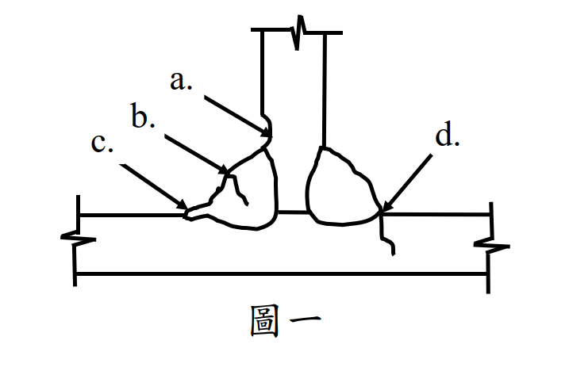

# 考題編號：SS-2021-1

**主分類：** `4.2.3` 設計規範對施工之要求
**副分類：** 無
**設計法：** 概念題
**標籤：** `施工規範` `非破壞檢測` `NDT` `銲道瑕疵` `超音波檢測` `放射線檢測` `磁粒檢測` `液滲檢測` `目視檢測` `填角銲`

---

## 1. 原始題目重述 (Problem Restatement)

請說明鋼結構銲道檢測常採用之**五種非破壞檢測方法**，若圖一中填角銲道銲接發現 a、b、c、d 四種瑕疵，請說明此四種瑕疵之**名稱**及其對應適合之**一種非破壞檢測方式**。（25 分）

*圖說：圖一為 T 型接頭填角銲斷面圖（正視截面）。垂直板（腹板）由上方插入水平板（翼板），填角銲位於兩板交角（左側與右側各一道）。四種瑕疵標示位置：a = 銲道面靠左斜裂紋（銲趾區）；b = 填角銲內部夾渣（斜線標示，位於銲道左上角）；c = 左側填角銲根部低端（咬邊或根部裂縫）；d = 右側填角銲外側（基材熱影響區氣孔，圓形缺陷）。左右翼板底部各有斜線支承標示（固定端示意）。*

---

## 2. 考題核心精神與出題者意圖 (Core Concepts & Examiner's Intent)

**核心觀念：工地品管——缺陷「在哪裡」決定用什麼方法檢測**

NDT 選擇邏輯：
- **表面或近表面缺陷** → 磁粒（MT）、液滲（PT）、目視（VT）
- **內部體積型缺陷**（氣孔、夾渣）→ 放射線（RT）
- **內部面積型缺陷**（裂縫、未熔合）+ 較深 → 超音波（UT）

**出題者測驗重點：**
1. 能說明五種常用 NDT 方法的原理與適用條件
2. 能從圖面位置辨識缺陷名稱（表面/內部/根部/HAZ）
3. 能為各缺陷配對最合適的 NDT 方法，並說明理由

---

## 3. 解題戰略地圖與陷阱分析 (Strategic Roadmap & Trap Analysis)

**答題架構：**
1. 五種 NDT 方法（各自原理 + 適用缺陷 + 限制）
2. 四種瑕疵辨識 + 對應 NDT 選擇

**關鍵陷阱：**

> ⚠️ **陷阱1：磁粒 vs 液滲的適用材料**
> MT（磁粒）只適用於**磁性材料**（碳鋼、低合金鋼），不適用於不銹鋼或鋁合金。PT（液滲）適用於**所有非多孔性材料**（含磁性與非磁性）。一般鋼結構兩種均可，但題目問「最適合」，需依缺陷位置與特性選擇。

> ⚠️ **陷阱2：RT 與 UT 的偵測能力差異**
> RT（放射線）對**體積型缺陷**（氣孔、夾渣）靈敏，對**面積型缺陷**（裂縫）若方向與 X 光垂直則難以偵測。UT（超音波）對**面積型缺陷**（裂縫、未熔合）最靈敏，因其反射面大。

> ⚠️ **陷阱3：填角銲不能用 RT 嗎？**
> 填角銲（fillet weld）因幾何複雜，RT 困難（厚度變化），通常不用。UT 和 MT/PT 較常用於填角銲。但 RT 仍可偵測圓形氣孔（題中 d 位置），出題者接受 RT 作答。

## 3.5 變數層次分析（Variable Hierarchy Analysis）

> 複習提示：解題後，在每個卡住的知識點「卡關?」欄標記 `⚠`；第二次複習時只看有 `⚠` 的項目。

**最終目標：** 說明五種 NDT 方法原理 → 依圖一瑕疵位置（表面/內部/根部/HAZ）判斷名稱 → 為各瑕疵配對最適合的 NDT 方法

### 主要公式（$\boxed{\phantom{x}}$ = 未知，待推導）

本題為概念題，核心判斷邏輯：

$$\text{瑕疵位置} \rightarrow \text{表面開口？} \xrightarrow{\text{是}} \text{MT 或 PT}$$
$$\text{瑕疵位置} \rightarrow \text{內部體積型？} \xrightarrow{\text{是}} \text{RT（氣孔、夾渣）}$$
$$\text{瑕疵位置} \rightarrow \text{內部面積型？} \xrightarrow{\text{是}} \text{UT（裂縫、未熔合）}$$

### L1：題目直接給定

| 符號 | 數值 | 說明 |
|------|------|------|
| NDT 方法數 | 5 種 | VT、PT、MT、RT、UT |
| 瑕疵標號 | a、b、c、d | 圖一四種位置 |
| 接頭型式 | T 型接頭填角銲 | 腹板垂直插入水平翼板 |

### L2：需知識點推導

**五種 NDT 方法**

| NDT 方法 | 原理 | 適用缺陷 | 卡關? |
|----------|------|---------|:-----:|
| VT（目視）| 肉眼或光學輔助直接觀察 | 表面可見缺陷（咬邊、餘高不良）| |
| PT（液滲）| 毛細作用滲入表面開口，顯像劑吸出 | 表面開口缺陷，適用所有非多孔材料 | |
| MT（磁粒）| 磁場洩漏使磁粉聚集於缺陷處 | 表面/近表面缺陷，限磁性材料 | |
| RT（放射線）| X/γ 射線穿透，底片記錄密度差 | 內部體積型缺陷（氣孔、夾渣）| |
| UT（超音波）| 高頻聲波反射回波定位缺陷 | 內部面積型缺陷（裂縫、未熔合）| |

**四種瑕疵辨識與 NDT 配對**

| 標號 | 位置 | 瑕疵名稱 | 最適 NDT | 卡關? |
|------|------|---------|---------|:-----:|
| a | 銲趾（表面斜裂紋）| 銲趾裂縫 | MT（磁粒）| |
| b | 銲道內部（不規則形）| 夾渣 | RT（放射線）| |
| c | 根部低端凹槽 | 咬邊 | VT（目視）| |
| d | 外側圓形空洞（HAZ）| 氣孔 | RT（放射線）| |

### L3：深層知識（不懂就卡住）

| 知識點 | 說明 | 補強頁 | 卡關? |
|--------|------|:------:|:-----:|
| MT 限磁性材料，PT 不限 | MT 適用碳鋼/低合金鋼；PT 適用所有非多孔材料（含不銹鋼）；鋼結構兩者均可，但 MT 更靈敏 | | |
| RT vs UT 的偵測差異 | RT 對**體積型**（氣孔、夾渣）靈敏；UT 對**面積型**（裂縫、未熔合）靈敏 | | |
| 填角銲不常用 RT | 填角銲幾何複雜（三角截面），厚度不均，RT 底片品質差；MT 和 UT 為主 | | |
| 咬邊（Undercut）是表面缺陷 | 咬邊為基材被電弧熔蝕形成的表面凹槽，VT 可直接觀察量測深度 | | |
| 「目磁液放超」記憶口訣 | 目視→磁粒→液滲→放射線→超音波；由表面到內部，由粗到精 | | |

---

## 4. 步驟化詳細計算過程 (Step-by-Step Detailed Calculation)

### 一、五種常用非破壞檢測方法（NDT）

#### ① 目視檢測（VT, Visual Testing）

**原理：** 以肉眼或輔助光學工具（放大鏡、內視鏡）直接觀察銲道表面及其周邊。

**適用缺陷：** 表面裂縫、咬邊、銲接幾何不良（餘高過大/不足、熔融金屬飛濺）、銲道尺寸不合格。

**限制：** 只能偵測**表面可見**缺陷，無法偵測內部缺陷。

**特點：** 最快速、最低成本，所有銲接完成後應首先執行 VT。

---

#### ② 液滲檢測（PT, Penetrant Testing）

**原理：** 在清潔的銲道表面施加有色或螢光滲透液，毛細作用使液體滲入表面開口缺陷；再以顯像劑吸出滲透液，使缺陷可見。

**適用缺陷：** **表面開口缺陷**（表面裂縫、銲趾裂縫、氣孔開口），適用所有非多孔性材料。

**限制：** 只偵測表面開口缺陷，無法偵測閉合裂縫或內部缺陷。

**特點：** 操作簡便，可用於非磁性材料（不銹鋼等）；費時（需等待滲透時間）。

---

#### ③ 磁粒檢測（MT, Magnetic Particle Testing）

**原理：** 在磁化的鐵磁性工件上施加磁粉，表面或近表面缺陷會造成磁場洩漏，磁粉聚集於洩漏位置形成可見圖案。

**適用缺陷：** **表面與近表面缺陷**（表面裂縫、銲趾裂縫、近表面裂縫），靈敏度高於 PT。

**限制：** 僅適用**磁性材料**（碳鋼、低合金鋼）；近表面（約3mm內）有效；需消磁後處理。

**特點：** 比 PT 靈敏，可偵測近表面細小裂縫；台灣鋼結構廣泛使用。

---

#### ④ 放射線檢測（RT, Radiographic Testing）

**原理：** 以 X 射線或 γ 射線穿透工件，底片或數位探測器記錄穿透影像；密度較低的缺陷（氣孔、夾渣）呈暗色陰影。

**適用缺陷：** **內部體積型缺陷**——氣孔（圓形暗點）、夾渣（不規則暗區），亦可偵測裂縫（當裂縫面平行射線方向時效果最好）。

**限制：** 對**面積型缺陷**（方向不對的裂縫）靈敏度低；需輻射防護；不適用幾何複雜的填角銲。

**特點：** 可留存永久底片紀錄，是對接銲最常用方法。

---

#### ⑤ 超音波檢測（UT, Ultrasonic Testing）

**原理：** 以高頻超音波（1-10 MHz）射入工件，缺陷的聲阻抗界面產生反射回波；由回波時間與強度判斷缺陷位置與大小。

**適用缺陷：** **內部面積型缺陷**——裂縫（反射面大，回波強）、未熔合（LF）、未滲透（IP），亦可偵測夾渣；可探測較深缺陷。

**限制：** 需要技術訓練，結果判讀困難；表面粗糙度影響接觸效果；對球形氣孔靈敏度低於 RT。

**特點：** 對裂縫最靈敏，可定量（深度、尺寸）；對接銲與填角銲均適用。

---

### 二、四種瑕疵辨識與 NDT 方法選擇

#### 圖一瑕疵說明（依位置分析）

| 標號 | 位置 | 瑕疵名稱 | 說明 | 適合 NDT |
|------|------|---------|------|---------|
| **a** | 填角銲左側銲趾（weld toe），斜裂紋 | **銲趾裂縫**（Weld Toe Crack） | 位於銲道與基材交界之應力集中區，熱裂或冷裂均可發生；屬**表面開口缺陷** | **MT（磁粒檢測）** 或 PT |
| **b** | 填角銲內部（斜線區域不規則形） | **夾渣**（Slag Inclusion） | 銲接過程中熔渣未完全逸出而留在凝固金屬內，呈不規則形；屬**內部體積型缺陷** | **RT（放射線檢測）** |
| **c** | 左側填角銲根部低端（銲趾/咬邊位置） | **咬邊**（Undercut） | 基材在銲道根部或銲趾處被電弧熔蝕而未填補，形成凹槽；屬**表面缺陷** | **VT（目視檢測）** 或 MT |
| **d** | 右側填角銲外側（圓形缺陷，在熱影響區） | **氣孔**（Porosity） | 銲接熔池中氣體未逸出而形成球形空洞；屬**內部體積型缺陷** | **RT（放射線檢測）** |

#### 各選擇之理由

**a（銲趾裂縫）→ MT（磁粒）：**
- 位於銲道表面，為開口型缺陷，MT 對表面及近表面裂縫最靈敏
- 鋼材為磁性材料，符合 MT 適用範圍
- 比 VT 靈敏，比 PT 省時，是台灣實務中最常用方法

**b（夾渣）→ RT（放射線）：**
- 位於銲道內部，屬體積型缺陷
- RT 可清楚呈現夾渣的形狀與位置（在底片上呈不規則暗區）
- UT 亦可偵測，但 RT 對體積型缺陷的可視化更直觀

**c（咬邊）→ VT（目視）：**
- 咬邊是表面可見的凹槽，VT 可直接觀察與量測深度
- 若懷疑咬邊底部有微裂縫，可補充 MT 檢測

**d（氣孔）→ RT（放射線）：**
- 球形氣孔在 RT 底片上呈圓形暗點，辨識度高
- UT 對球形氣孔靈敏度較低（反射面積小），不如 RT 適合

---

## 5. 關鍵爭議點與進階探討 (Critical Issues & Advanced Discussion)

### NDT 方法選擇綜合原則

| 缺陷類型 | 位置 | 最佳 NDT | 次選 |
|---------|------|---------|------|
| 表面裂縫 | 表面 | MT（磁性）/ PT（非磁性）| VT |
| 近表面裂縫 | 表面以下3mm | MT | UT |
| 氣孔 | 內部 | RT | UT（靈敏度較差）|
| 夾渣 | 內部 | RT | UT |
| 未熔合（LF） | 熔合線 | UT | RT |
| 未滲透（IP） | 根部 | UT | RT |
| 咬邊 | 表面 | VT | MT |

### 填角銲 NDT 的特殊性

對接銲（Butt weld）幾何規則，RT 和 UT 均適用。填角銲幾何複雜（三角形截面），RT 因厚度不均一而困難，實務上以 **MT（磁粒）和 UT（超音波）** 為主。

### 考場安全答法

**五種方法（記憶口訣：目磁液放超）：**
1. VT 目視：表面可見缺陷
2. MT 磁粒：表面/近表面，限磁性材料
3. PT 液滲：表面開口，適用所有非多孔材料
4. RT 放射線：內部體積型（氣孔、夾渣），需輻射防護
5. UT 超音波：內部面積型（裂縫、未熔合），對裂縫最靈敏

**四種瑕疵（位置 → NDT）：**
- a 銲趾裂縫（表面）→ MT
- b 夾渣（內部不規則）→ RT
- c 咬邊（表面凹槽）→ VT
- d 氣孔（內部球形）→ RT
