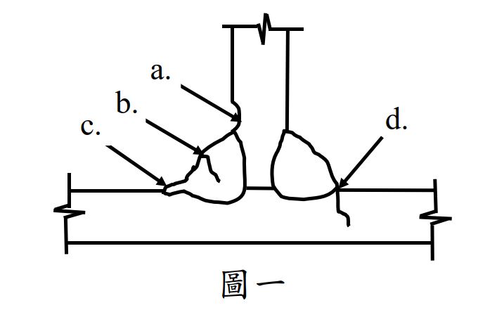

# 考題編號：SS-2021-1

**主分類：** `SS-U2-3` 設計規範對施工之要求
**副分類：** 無
**設計法：** 概念題
**標籤：** `施工規範` `非破壞檢測` `NDT` `銲道瑕疵` `咬邊` `重疊` `銲道裂縫` `層狀撕裂` `超音波檢測` `磁粒檢測` `液滲檢測` `目視檢測` `填角銲`

---

## 1. 原始題目重述 (Problem Restatement)

請說明鋼結構銲道檢測常採用之**五種非破壞檢測方法**，若圖一中填角銲道銲接發現 a、b、c、d 四種瑕疵，請說明此四種瑕疵之**名稱**及其對應適合之**一種非破壞檢測方式**。（25 分）

*圖說：圖一為 T 型接頭填角銲之斷面示意（手繪）。直立板（腹板）立於水平底板（翼板）之上，左右各一道填角銲，兩板均以折斷符號表示延續。四處標號的幾何特徵如下：*

- ***a** — 左側銲道**上銲趾**（銲道與直立板交會處）：直立板的輪廓線在該處被「挖」出一個內凹的缺口，母材斷面被削減。*
- ***b** — 左側銲道**銲面中段**：一條自銲道表面開口、向銲道內部延伸並分岔的鋸齒狀線條，位於銲材本體內。*
- ***c** — 左側銲道**下銲趾**（銲道與底板交會處）：銲材未與底板熔合，而是翻捲成一片唇狀突出、平舖在底板上表面之外側。*
- ***d** — 右側銲道**下銲趾正下方**：一條自銲趾起始、往**底板厚度方向**向下延伸且帶一個轉折的鋸齒狀線條，位置在**母材（底板）之內**，不在銲材內。*

*（圖中並無任何圓形空洞或斜線填充的內部夾雜物標示。）*

---

## 2. 考題核心精神與出題者意圖 (Core Concepts & Examiner's Intent)

**核心觀念：先讀「幾何」再讀「位置」——瑕疵長什麼樣決定它叫什麼，瑕疵在哪裡決定用什麼方法查**

本題圖中四個瑕疵**全部是表面或自表面起始的缺陷**，沒有一個是包在銲道內部的體積型缺陷。這正是出題者刻意設計的：填角銲的幾何（三角形斷面、厚度不均）使 **RT（放射線）幾乎不可用**，考生若反射性地把「氣孔／夾渣 → RT」套上去，等於沒有看圖。

**出題者測驗重點：**

1. 能完整說明五種常用 NDT 方法的原理、適用缺陷與限制
2. 能由**斷面幾何**辨識瑕疵名稱：母材被削 → 咬邊；銲材翻捲外舖 → 重疊；銲材內鋸齒線 → 裂縫；母材內鋸齒線 → 母材／熱影響區裂縫
3. 能為各缺陷配對「**適合之一種**」方法——「適合」二字是在考**限制條件**（材質是否磁性、缺陷是否表面開口、是否需要深度資訊）

---

## 3. 解題戰略地圖與陷阱分析 (Strategic Roadmap & Trap Analysis)

**答題架構：**

1. 五種 NDT 方法（原理 + 適用缺陷 + 限制），建議以「由表面到內部」排序
2. 逐一辨識 a～d 之名稱（先描述幾何、再定名），各配一種方法並說明**為什麼是這一種**

**關鍵陷阱：**

> ⚠️ **陷阱 1（本題最大的坑）：把四個標號直接套「氣孔／夾渣」**
> 圖中**沒有圓形空洞、也沒有斜線填充的不規則夾雜**。四處都是**表面幾何缺陷或裂縫**。填角銲斷面厚度連續變化，射線路徑長度不一致，底片對比失真，**RT 在填角銲上實務不採用**——本題四小題正確答案中不應出現 RT。

> ⚠️ **陷阱 2：咬邊（Undercut）vs 重疊（Overlap）分不清**
> 兩者都在銲趾、都是表面幾何缺陷，方向卻相反：
> - **咬邊**＝母材被電弧熔蝕掉、銲材**沒有填回來** ⇒ 斷面出現**凹口**（缺料）
> - **重疊**＝銲材流出銲趾、**未與母材熔合**而覆蓋其上 ⇒ 斷面出現**唇狀突出**（多料，但接不上）
>
> 記法：「**咬邊少肉、重疊多肉；少肉是缺口、多肉是假接**。」

> ⚠️ **陷阱 3：MT 與 PT 不是可以互換的同義詞**
> MT 限**鐵磁性材料**（碳鋼、低合金鋼），可測表面**及近表面約 3 mm 內**，靈敏度高，但檢後須消磁；PT 材質不限，卻**只能測表面開口**的瑕疵。本題母材為鋼，兩者皆可用，但要能講出「為什麼在這一處選它」。

> ⚠️ **陷阱 4：d 在母材裡，不是銲道問題**
> d 的鋸齒線起於銲趾但**往底板厚度方向走**，屬**母材／熱影響區裂縫**（板厚方向受拘束時即為層狀撕裂 Lamellar Tearing）。它會延伸到表面以下，**VT／MT 只看得到開口的那一小段**，要掌握深度與範圍必須用 **UT**。

---

## 3.5 變數層次分析（Variable Hierarchy Analysis）

> 複習提示：解題後，在每個卡住的知識點「卡關?」欄標記 `⚠`；第二次複習時只看有 `⚠` 的項目。

**最終目標：** 說明五種 NDT 方法之原理與限制 → 依圖一各標號之**斷面幾何**判定瑕疵名稱 → 為各瑕疵配對最適合的一種 NDT 方法並說明理由

### 主要判斷邏輯（概念題，無計算式）

$$\text{瑕疵} \rightarrow \text{在銲材還是母材？} \rightarrow \text{開口於表面還是延伸入內部？} \rightarrow \text{材質是否鐵磁性？} \Rightarrow \text{NDT}$$

$$\text{表面幾何（咬邊、重疊、餘高）} \Rightarrow \textbf{VT}$$

$$\text{表面／近表面裂縫（鐵磁性材）} \Rightarrow \textbf{MT}\ ;\qquad \text{表面開口（不限材質）} \Rightarrow \textbf{PT}$$

$$\text{內部面積型（裂縫、未熔合、層狀撕裂）} \Rightarrow \textbf{UT}$$

$$\text{內部體積型（氣孔、夾渣）} \Rightarrow \textbf{RT}\quad \text{（但填角銲幾何不適用）}$$

### L1：題目直接給定

| 符號 | 數值 | 說明 |
|------|------|------|
| NDT 方法數 | 5 種 | 須自行列舉：VT、PT、MT、RT、UT |
| 瑕疵標號 | a、b、c、d | 圖一四處，各配「**一種**」方法 |
| 接頭型式 | T 型接頭**填角銲**（左右各一道） | 「填角銲」三字即為 RT 不適用之伏筆 |
| 配分 | 25 分 | 五法約 12～13 分、四瑕疵約 12～13 分 |

### L2：需知識點推導

**Step 1：五種 NDT 方法**

| NDT | 原理 | 適用缺陷 | 主要限制 | 卡關? |
|-----|------|---------|---------|:-----:|
| VT（目視）| 肉眼／放大鏡／銲道量規直接觀察量測 | 咬邊、重疊、餘高、銲腳不足、開口裂縫 | 只看得到表面；深度靠量規 | |
| PT（液滲）| 毛細作用滲入表面開口，顯像劑吸出 | **表面開口**缺陷；材質不限 | 封閉或內部缺陷完全測不到 | |
| MT（磁粒）| 磁化後缺陷處磁力線洩漏，磁粉聚集 | 表面**及近表面（約 3 mm）**裂縫 | **限鐵磁性材料**；檢後須消磁 | |
| RT（放射線）| X／γ 射線穿透，底片記錄衰減差 | 內部**體積型**（氣孔、夾渣）| 面積型缺陷方向不對照不出；輻射防護；**填角銲厚度不均難用** | |
| UT（超音波）| 高頻聲波（1–10 MHz）於聲阻抗界面反射 | 內部**面積型**（裂縫、未熔合、層狀撕裂）| 判讀靠技術員；對球形氣孔靈敏度低於 RT | |

**Step 2：四處瑕疵之幾何 → 名稱 → 方法**

| 標號 | 斷面幾何特徵 | 瑕疵名稱 | 建議 NDT | 次選 | 卡關? |
|------|------------|---------|---------|------|:-----:|
| a | 上銲趾處**母材被熔蝕出凹口**（缺料）| **咬邊**（Undercut）| **VT**（銲道量規量深度）| MT（查凹槽底部有無微裂）| |
| b | 銲材本體內、**自銲面開口並分岔**的鋸齒線 | **銲道（表面）裂縫**（Weld Crack）| **MT**（表面／近表面裂縫最靈敏）| PT | |
| c | 下銲趾處銲材**翻捲外舖於母材上、未熔合**（多料）| **重疊**（Overlap）| **VT**（外觀即可判定）| PT（翻捲下緣為表面開口縫隙）| |
| d | 銲趾下方、**往母材板厚方向**延伸的鋸齒線 | **母材／熱影響區裂縫**（銲趾裂縫；板厚方向受拘束時即**層狀撕裂** Lamellar Tearing）| **UT**（唯一能量測入侵深度與範圍）| MT（僅能查到開口的一小段）| |

### L3：深層知識（不懂就卡住）

| 知識點 | 說明 | 補強頁 | 卡關? |
|--------|------|:------:|:-----:|
| 咬邊 vs 重疊的方向性 | 咬邊＝母材缺料形成凹口（應力集中）；重疊＝銲材多料但未熔合（假接合，等同預置裂縫）。國內銲接施工規範對咬邊訂**深度上限**（常見管制值 0.8 mm 級），對重疊則採「**不得有重疊銲接之情形存在**」的零容忍 | [[WELD-DEFECTS]] | |
| 填角銲為何不用 RT | 填角銲斷面為三角形，射線路徑長度沿銲道連續變化，底片密度無基準可比；且銲趾裂縫平面與射線多不平行。實務上填角銲以 **VT + MT／PT** 為主，需查深度時用 UT | [[WELD-INSPECTION-NDT]] | |
| MT 的三個限制 | ① 限鐵磁性材料（不鏽鋼、鋁須改 PT）② 有效深度僅表面下約 3 mm ③ 檢後須消磁，否則殘磁干擾後續銲接電弧 | [[WELD-INSPECTION-NDT]] | |
| 面積型 vs 體積型的物理差異 | UT 量「反射」：平面缺陷垂直入射時回波最強，球形氣孔散射故回波弱；RT 量「衰減」：有體積的空腔少掉一段厚度故對比明顯，無厚度的裂縫可能整片穿過看不到 | [[WELD-INSPECTION-NDT]] | |
| 層狀撕裂發生在母材 | 沿鋼板軋延方向之非金屬夾雜物面撕開，發生在**母材板厚方向**，非銲材問題；解法是選用 Z 向鋼材（如 SN-C 類）與改善銲接順序、降低拘束，不是換銲條 | [[SEISMIC-STEEL-SN]] | |
| 「目液磁放超」記憶順序 | 由表面到內部、由粗到精：VT → PT → MT → RT → UT | | |

---

## 4. 步驟化詳細計算過程 (Step-by-Step Detailed Calculation)

### 一、五種常用非破壞檢測方法（NDT）

#### ① 目視檢測（VT, Visual Testing）

**原理：** 以肉眼或輔助工具（放大鏡、內視鏡、**銲道量規**）直接觀察並量測銲道表面及其周邊母材。

**適用缺陷：** 咬邊、重疊、餘高過大／不足、銲腳尺寸不足、弧擊（銲蝕）、開口表面裂縫、飛濺與未清除之銲渣。

**限制：** 只能偵測**表面可見**缺陷，無法得知內部狀況。

**特點：** 最快速、成本最低，是**所有銲道的最低要求，不是可選項**；其他 NDT 都建立在 VT 已通過的前提上。

---

#### ② 液滲檢測（PT, Penetrant Testing）

**原理：** 於清潔的銲道表面施加有色或螢光滲透液，藉毛細作用滲入表面開口缺陷；清除多餘滲透液後施加顯像劑，將滲透液吸出而顯示缺陷。

**適用缺陷：** **表面開口**缺陷（表面裂縫、銲趾裂縫、開口氣孔、重疊翻捲下之縫隙），**材質不限**（含不鏽鋼、鋁等非磁性材料）。

**限制：** 只測表面開口；表面粗糙或多孔會產生假指示；需等待滲透與顯像時間，較費時。

---

#### ③ 磁粒檢測（MT, Magnetic Particle Testing）

**原理：** 將鐵磁性工件磁化後施加磁粉，表面或近表面缺陷使磁力線洩漏，磁粉聚集於洩漏處形成可見圖案。

**適用缺陷：** **表面及近表面（約 3 mm 內）裂縫**，靈敏度高於 PT，且可偵測尚未開口至表面的淺層裂縫。

**限制：** ① 僅適用**磁性材料**（碳鋼、低合金鋼）② 有效深度淺 ③ 檢測後須**消磁**，避免殘磁干擾後續銲接電弧。

---

#### ④ 放射線檢測（RT, Radiographic Testing）

**原理：** 以 X 射線或 γ 射線穿透工件，底片或數位偵檢器記錄衰減差異；缺陷處材料較少，影像呈暗色。

**適用缺陷：** 內部**體積型**缺陷——氣孔（圓形暗點）、夾渣（不規則暗區）、未填滿。

**限制：** 對**面積型**缺陷（裂縫方向與射線不平行時）靈敏度低；需輻射防護與管制區；**斷面厚度須均勻**，故適用於對接銲（Butt Weld），**填角銲因幾何不均而實務不採用**。

**特點：** 可留存永久影像紀錄，是對接銲的傳統驗收方法。

---

#### ⑤ 超音波檢測（UT, Ultrasonic Testing）

**原理：** 以高頻超音波（1–10 MHz）射入工件，於缺陷之聲阻抗界面產生反射回波，由回波時間與波高判定缺陷之**位置、深度與大小**。

**適用缺陷：** 內部**面積型**缺陷——裂縫、未熔合（LF）、未滲透（IP）、**層狀撕裂**；亦可檢查母材夾層。

**限制：** 需受訓合格人員判讀；表面粗糙度影響耦合；對球形氣孔靈敏度低於 RT。

**特點：** **唯一能定量給出缺陷深度**的方法，故耐震規範對梁柱全滲透銲道指定 UT 100% 全檢而非 RT。

---

### 二、圖一四種瑕疵之辨識與 NDT 選擇

> **判讀原則：先描述幾何、再定名稱。** 「缺料還是多料」「在銲材還是在母材」這兩個問題一答完，名稱就唯一了。

| 標號 | 位置與幾何 | 瑕疵名稱 | 成因 | 適合之一種 NDT |
|------|-----------|---------|------|---------------|
| **a** | 左側銲道**上銲趾**，直立板母材被熔蝕出**內凹缺口**，銲材未填回 | **咬邊（Undercut）** | 電流過大、電弧過長、運行角度不當、運行速度過快 | **VT（目視檢測）** |
| **b** | 左側銲道**銲面中段**，自表面開口向銲材內部延伸並分岔之鋸齒狀裂紋 | **銲道裂縫（Weld Crack，表面開口型）** | 拘束應力大、氫致冷裂、銲材與母材匹配不當、冷卻過快 | **MT（磁粒檢測）** |
| **c** | 左側銲道**下銲趾**，銲材翻捲成唇狀**平舖於底板表面之上而未熔合** | **重疊（Overlap）** | 電流過小、運行速度過慢、母材表面有鏽皮油污、運行角度不當 | **VT（目視檢測）** |
| **d** | 右側銲道**下銲趾正下方之母材內**，鋸齒狀裂紋沿**底板厚度方向**向下延伸並轉折 | **母材／熱影響區裂縫（銲趾裂縫）；板厚方向受拘束時即為層狀撕裂（Lamellar Tearing）** | 銲接殘留應力使母材承受板厚（Z）方向拉力，沿非金屬夾雜物面撕開；HAZ 硬化 + 氫 | **UT（超音波檢測）** |

#### 各選擇之理由

**a（咬邊）→ VT：**

- 咬邊是**表面幾何缺陷**，凹槽形狀與深度肉眼即可辨識，並以**銲道量規**直接量測深度與規範容許值比對（國內銲接施工規範對咬邊深度訂有上限，常見管制值為 0.8 mm 級）。
- 用 MT／PT 只會顯示「這裡有指示」，卻**量不出深度**，無法據以判定合格與否；用 UT／RT 更是殺雞用牛刀，且填角銲不宜 RT。
- 補充：若懷疑咬邊凹槽底部因應力集中已萌生微裂縫，可**再以 MT 複驗**。

**b（銲道裂縫）→ MT：**

- 裂縫為**面積型表面缺陷**，母材與銲材皆為鐵磁性鋼材，MT 對表面及近表面裂縫**靈敏度最高**，且磁粉沿裂縫排列成線狀指示，可直接顯示裂縫走向與長度。
- 相較 PT：MT 可測**尚未開口至表面**的近表面裂縫，且不需等待滲透時間，工地效率高。
- 相較 VT：細裂縫肉眼常看不到，VT 會漏檢。
- 相較 RT：填角銲厚度不均，且裂縫平面多與射線不平行，照不出來。

**c（重疊）→ VT：**

- 重疊是**外觀即可判定**的表面幾何缺陷（銲材翻捲、銲趾角接近或超過 90°），VT 為最直接、最經濟的方法；規範對重疊採「**不得有重疊銲接之情形存在**」的絕對標準，故 VT 一判定有重疊即應鏟除重銲，不必再做定量檢測。
- 若欲確認翻捲下方是否已形成表面開口的未熔合縫隙，可補以 **PT**（顯示線狀指示）或 MT。

**d（母材／HAZ 裂縫、層狀撕裂）→ UT：**

- 此裂縫**位於母材內並往板厚方向延伸**，表面可見的只是起始的一小段；**必須知道它伸入多深、範圍多大**才能決定是刨除重銲或整片母材換新。
- **UT 是五種方法中唯一能定量給出缺陷深度與範圍者**（由回波時間換算聲程），故為本處唯一適當選擇。
- MT／PT 只能查到開口的一小段，會嚴重低估嚴重性；RT 在填角銲不適用，且裂縫面與射線不平行時照不出；VT 完全看不到內部。

---

### 三、答案速記表

| 標號 | 名稱 | 判別關鍵字 | NDT |
|------|------|-----------|-----|
| a | 咬邊 Undercut | 母材**缺料**、凹口 | **VT** |
| b | 銲道裂縫 Weld Crack | **銲材內**鋸齒線、表面開口 | **MT** |
| c | 重疊 Overlap | 銲材**多料**、翻捲外舖未熔合 | **VT** |
| d | 母材／HAZ 裂縫（層狀撕裂） | **母材內**鋸齒線、往板厚方向 | **UT** |

> 四小題用掉 VT×2、MT、UT，**RT 一次都沒用到**——這正是題幹「填角銲」三個字的意義。

---

## 5. 關鍵爭議點與進階探討 (Critical Issues & Advanced Discussion)

### 5.1 a／c 若採 MT、PT 作答是否給分？

咬邊與重疊都是**表面幾何**缺陷，最正統的驗收手段是 VT + 量規。但兩者都會在銲趾形成缺口效應，實務上常要求「VT 判定合格後，銲趾再做 MT 抽驗有無微裂」。因此：

- 寫 **VT** 並說明「以銲道量規量測深度／以外觀判定」→ 最完整
- 寫 **MT** 並說明「查銲趾應力集中處是否已萌生裂縫」→ 可接受，但須把「量測幾何」的部分交代掉
- 只寫 RT 或 UT → 明顯不合適（幾何缺陷不需穿透檢測，且填角銲不宜 RT）

**考場策略：每一小題寫「主選 + 一句理由 +（必要時）次選」。** 題目雖只要求一種，多寫一句理由不會扣分，卻能保住判斷分。

### 5.2 d 判為「銲趾裂縫」或「層狀撕裂」？

兩者不衝突，是同一條裂縫的**不同描述層次**：

- 由**位置**描述 → 銲趾裂縫（Toe Crack）／熱影響區裂縫
- 由**機制**描述 → 若沿板材軋延面呈階梯狀撕開、且母材承受板厚（Z）方向拉力 → 層狀撕裂（Lamellar Tearing）

圖中該線條起於銲趾、往板厚方向延伸並帶轉折（階梯特徵），兩種答法皆可，**但必須指出它在母材而非銲材**——這是本小題的判分關鍵。預防對策也隨之不同：層狀撕裂要選 **Z 向鋼材（Z25／Z35，SN-C 類）**、改善銲接順序與降低拘束，而非更換銲條。

### 5.3 為什麼填角銲實務上不做 RT？

| 因素 | 對接銲（Butt） | 填角銲（Fillet） |
|------|--------------|-----------------|
| 斷面厚度 | 均勻，可設定單一曝光參數 | 三角形，沿射線路徑連續變化 |
| 底片對比基準 | 有 | 無（密度差被幾何效應淹沒） |
| 幾何可及性 | 兩側可分置射源與底片 | 直立板阻擋，難以擺放 |
| 實務作法 | RT 或 UT | **VT + MT／PT**；需深度資訊時 UT |

### 5.4 考場安全答法

**五種方法（記憶順序「目液磁放超」，由表面到內部）：**

1. **VT 目視**：表面幾何與開口裂縫；所有銲道的最低要求
2. **PT 液滲**：表面**開口**缺陷；材質不限，但內部完全測不到
3. **MT 磁粒**：表面及近表面（約 3 mm）裂縫；限磁性材料，檢後須消磁
4. **RT 放射線**：內部**體積型**（氣孔、夾渣）；需輻射防護，填角銲不適用
5. **UT 超音波**：內部**面積型**（裂縫、未熔合、層狀撕裂）；**唯一能定量深度**

**四種瑕疵（先講幾何、再定名、最後配方法）：**

- **a 咬邊**（母材被熔蝕成凹口，缺料）→ **VT**（銲道量規量深度）
- **b 銲道裂縫**（銲材內、自銲面開口分岔）→ **MT**（鋼為鐵磁性，表面裂縫最靈敏）
- **c 重疊**（銲材翻捲平舖母材上、未熔合，多料）→ **VT**（規範對重疊零容忍）
- **d 母材／HAZ 裂縫（層狀撕裂）**（母材內、往板厚方向）→ **UT**（唯一能測深度與範圍）

---

*修正日期：2026-08-22 —— 依考卷原圖以 450 dpi 逐處重判 a～d 之斷面幾何，全面改寫瑕疵辨識與 NDT 配對。原解析誤判為「銲趾裂縫／夾渣／咬邊／氣孔」並三處配 RT，惟圖中並無任何內部體積型缺陷，且填角銲不宜用 RT。詳見 `wiki/log.md` 2026-08-22 第五批。*
