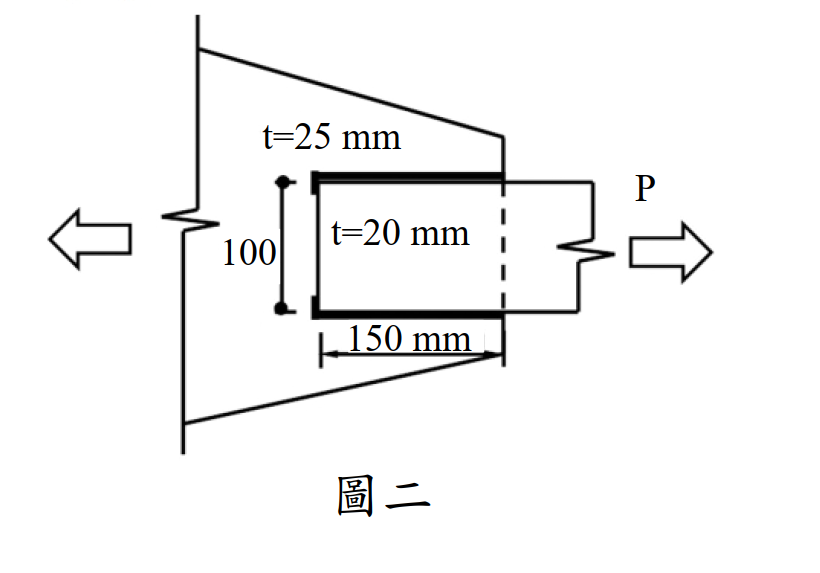

# 考題編號：SS-2021-2

**主分類：** `4.1.1` 拉力及壓力桿件
**副分類：** `4.1.4` 接合之分析與設計
**設計法：** LRFD
**標籤：** `拉力桿件` `塊狀剪力` `銲接拉力接合` `填角銲` `疊接` `斷裂模式` `0.6Fy意義` `剪力降伏` `LRFD` `概念題`

---

## 1. 原始題目重述 (Problem Restatement)

圖二所示拉力構材為 SM400 鋼材，$F_y = 2.5$ tf/cm²，$F_u = 4.1$ tf/cm²，$E = 2040$ tf/cm²，板厚分別為 $t = 20$ mm 及 $t = 25$ mm，採用填角銲道疊接。

**試求（依現行鋼結構極限設計法規範）：**
1. 分別繪製**拉力斷裂**及**塊狀剪力破壞**之模式
2. 詳細說明式(1)中 $0.6F_y A_{gv}$ 的 $0.6F_y$ 所代表之意義
3. 詳細說明塊狀剪力破壞式(1)及式(2)擇一且不大於 $0.6F_u A_{nv} + F_u A_{nt}$ 之原因（20 分）

**題目給定公式：**
$$\phi R_n = \phi(0.6F_y A_{gv} + F_u A_{nt}) \leq \phi(0.6F_u A_{nv} + F_u A_{nt}) \quad \cdots (1)$$
$$\phi R_n = \phi(0.6F_u A_{nv} + F_y A_{gt}) \leq \phi(0.6F_u A_{nv} + F_u A_{nt}) \quad \cdots (2)$$
$$\phi = 0.75$$

**幾何條件（由圖二）：**
- 外板（trapezoid gusset）：$t = 25$ mm = 2.5 cm
- 內板（矩形受拉板）：$t = 20$ mm = 2 cm，寬度 = 150 mm = 15 cm
- 疊接長度：100 mm = 10 cm（沿拉力方向）
- 拉力 $P$ 施加於 $t = 20$ mm 板右端，左端透過填角銲傳至 $t = 25$ mm 板



*圖說：圖二為正視圖（側面）。左側為三角形 / 梯形 gusset 板（$t = 25$ mm），固定於牆面，右端面作為承接面；右側為矩形受拉板（$t = 20$ mm，寬 150 mm），自左方插入與 gusset 板搭接 100 mm，填角銲施於搭接邊緣（上下各一條，長度 = 100 mm）。拉力 $P$ 由右端箭頭施加；反力（$\leftarrow$）由 gusset 板傳至固定端。虛線表示 $t = 20$ mm 板與 gusset 板的界面（銲縫位置）。*

---

## 2. 考題核心精神與出題者意圖 (Core Concepts & Examiner's Intent)

**核心觀念：塊狀剪力破壞的物理機制——剪力降伏 vs 剪力斷裂的競爭**

本題以「說明題」形式，考查考生是否真正理解塊狀剪力公式背後的力學邏輯，而非僅會套公式。三個子問題環環相扣：

1. **繪圖**：確認考生能辨認銲接疊接的受力面與破壞面幾何
2. **$0.6F_y$ 的意義**：考查基礎力學——von Mises 剪力降伏準則
3. **公式選擇邏輯與上限原因**：考查對「最弱路徑」與「強度上限」的理解

**出題者考查重點：**
- 剪力降伏應力 $\tau_y = 0.6F_y$ 的力學依據
- 公式(1)/(2)分別對應「剪切面先降伏、拉伸面先斷裂」和「剪切面先斷裂、拉伸面先降伏」
- 上限 $0.6F_u A_{nv} + F_u A_{nt}$ 防止低估剪切面能承受的最大力

---

## 3. 解題戰略地圖與陷阱分析 (Strategic Roadmap & Trap Analysis)

**關鍵陷阱：**

> ⚠️ **陷阱1：銲接疊接無螺栓孔 → An = Ag**
> 本題為填角銲接合，無螺栓孔，因此 $A_{nv} = A_{gv}$，$A_{nt} = A_{gt}$。但塊狀剪力概念仍適用（銲縫界定了剪力面與拉力面）。

> ⚠️ **陷阱2：誤將 $0.6F_y$ 說成「安全係數」**
> $0.6F_y$ 不是安全係數，而是**剪力降伏應力 $\tau_y$** 的近似值，來自材料力學的 von Mises 降伏準則。

> ⚠️ **陷阱3：誤用 $F_y A_{gt}$ 作上限中的拉力項**
> 上限公式中的拉力項是 $F_u A_{nt}$（斷裂），不是 $F_y A_{gt}$（降伏）。因為上限代表「兩個面都斷裂」的最壞情況。

---

## 3.5 變數層次分析（Variable Hierarchy Analysis）

> 複習提示：解題後，在每個卡住的知識點「卡關?」欄標記 `⚠`；第二次複習時只看有 `⚠` 的項目。

**最終目標：** 繪製拉力斷裂與塊狀剪力破壞模式 → 說明 $0.6F_y$ 的力學意義 → 解釋公式(1)(2)擇一及上限原因（概念說明題，無數值計算目標）

### L1：題目直接給定

| 符號 | 數值 | 說明 |
|------|------|------|
| 鋼材 | SM400 | — |
| $F_y$ | 2.5 tf/cm² | 降伏應力 |
| $F_u$ | 4.1 tf/cm² | 極限應力 |
| $t$（外板） | 25 mm = 2.5 cm | gusset 板厚 |
| $t$（內板） | 20 mm = 2.0 cm | 受拉板厚 |
| $b$（受拉板） | 150 mm = 15 cm | 受拉板寬 |
| 疊接長度 | 100 mm = 10 cm | 沿拉力方向 |
| 接合方式 | 填角銲（疊接） | 無螺栓孔 |
| $\phi$（塊狀剪力） | 0.75 | 題目給定 |
| BSR 公式 (1)(2) | 題目直接給出 | — |

### L2：需知識點推導

**拉力斷裂檢核**

| 符號 | 公式 / 來源 | 卡關? |
|------|------------|:-----:|
| $A_n$ | $t \times b = 2 \times 15 = 30$ cm²（銲接無孔 → $A_n = A_g$） | |
| $\phi R_n$（NSF） | $\phi F_u A_n = 0.75 \times 4.1 \times 30 = 92.25$ tf | |

**塊狀剪力面積計算**

| 符號 | 公式 / 來源 | 卡關? |
|------|------------|:-----:|
| $A_{gv}$（剪力面） | 銲縫長 × 板厚 × 2條 = $10 \times 2 \times 2 = 40$ cm² | |
| $A_{gt}$（拉力面） | 板寬 × 板厚 = $15 \times 2 = 30$ cm² | |
| $A_{nv} = A_{gv}$ | 無螺栓孔，淨面積 = 毛面積 | |
| $A_{nt} = A_{gt}$ | 無螺栓孔，淨面積 = 毛面積 | |

**BSR 公式(1) vs 公式(2) 判斷**

| 符號 | 公式 / 來源 | 卡關? |
|------|------------|:-----:|
| 公式(1)適用條件 | 剪力面降伏 + 拉力面斷裂（$F_u A_{nt} \geq 0.6F_u A_{nv}$） | |
| 公式(2)適用條件 | 剪力面斷裂 + 拉力面降伏（$0.6F_u A_{nv} > F_u A_{nt}$） | |
| 上限 | $\phi(0.6F_u A_{nv} + F_u A_{nt})$（兩面均斷裂的最大值） | |

### L3：深層知識（不懂就卡住）

| 知識點 | 說明 | 補強頁 | 卡關? |
|--------|------|:------:|:-----:|
| $0.6F_y$ 的力學來源 | von Mises 準則：純剪降伏應力 $\tau_y = F_y/\sqrt{3} \approx 0.577F_y$，規範取近似 $0.6F_y$ | [[BLOCK-SHEAR-RUPTURE]] | |
| 降伏（yielding）vs 斷裂（fracture） | $0.6F_y A_{gv}$ = 剪切降伏（延性）；$0.6F_u A_{nv}$ = 剪切斷裂（脆性）；公式(1)(2)選最低承載路徑 | [[block-shear]] · [[BLOCK-SHEAR-RUPTURE]] | |
| 銲接接合無孔 → $A_n = A_g$ | 填角銲不需要打孔，故 $A_{nv} = A_{gv}$，$A_{nt} = A_{gt}$ | | |
| 上限的意義 | 防止低估：剪切面不可能同時發生降伏又超過斷裂值；上限 = 兩個面都達到斷裂強度時的最大可能承載 | [[block-shear]] | |
| 「最弱路徑」概念 | BSR 取公式(1)(2)中的**較小值**，代表實際破壞發生在承載力較低的那條路徑 | [[block-shear]] · [[BLOCK-SHEAR-RUPTURE]] | |

---

## 4. 步驟化詳細計算過程 (Step-by-Step Detailed Calculation)

### 一、繪製破壞模式

#### (A) 拉力斷裂模式（Net Section Fracture）

**破壞描述：** 在最靠近拉力端的截面（即從 $t = 20$ mm 板的右側填角銲邊緣），沿垂直拉力方向的淨截面發生斷裂。

```
P →                  ← 固定端（gusset板）
         ┌──────────┐
─────────┤ t=20 mm  ├────────
         └──────────┘
              ↑ 此處淨截面斷裂（垂直P方向）
```

- 破壞面：垂直於拉力 $P$ 的橫截面
- $A_n = A_g$（銲接，無孔）= $t \times b = 2 \times 15 = 30$ cm²（$t=20$ mm 板）
- $\phi R_n = \phi \times F_u \times A_n = 0.75 \times 4.1 \times 30 = 92.25$ tf

#### (B) 塊狀剪力破壞模式（Block Shear Failure）

**破壞描述：** 一個 L 形（或 U 形）的金屬塊從 $t = 20$ mm 板上撕裂，破壞路徑由**剪力面**（平行於 $P$，沿疊接長度）和**拉力面**（垂直於 $P$，在疊接端部）組成。

```
P →  ┌─────────────┐
     │             │ ← 拉力面（端面斷裂，⊥P）
─────┤  撕裂塊     │─────
     │             │
     └─────────────┘
     ↑ 剪力面（沿銲縫，‖P）
```

- **剪力面（Shear plane）**：$A_{gv}$ = 銲縫長度 × 板厚 = $2 \times (10 \times 2) = 40$ cm²（上下兩條銲縫各一個剪切面）
- **拉力面（Tension plane）**：$A_{nt}$ = 板寬 × 板厚 = $15 \times 2 = 30$ cm²

（銲接無孔：$A_{nv} = A_{gv} = 40$ cm²，$A_{nt} = A_{gt} = 30$ cm²）

---

### 二、說明 $0.6F_y$ 之力學意義

$0.6F_y A_{gv}$ 中的 $0.6F_y$ 是**剪力降伏應力（Shear Yield Stress）$\tau_y$** 的近似值。

**力學依據（von Mises 降伏準則）：**

對於單軸拉伸試驗中的材料，降伏強度為 $F_y$。根據 von Mises（最大扭應變能）降伏準則，純剪力狀態下的降伏剪應力為：

$$\tau_y = \frac{F_y}{\sqrt{3}} \approx 0.577 F_y$$

為計算方便，規範取近似值：
$$\tau_y \approx 0.6 F_y$$

**物理意義：**

> 當剪力面上的剪應力達到 $0.6F_y$ 時，剪切面進入**降伏（yielding）**狀態，但尚未斷裂（fracture）。此時剪切面的承載力 = $\tau_y \times A_{gv} = 0.6F_y \times A_{gv}$。

因此，$0.6F_y A_{gv}$ 代表**剪切面（面積 $A_{gv}$）因剪力降伏所能承擔的力**，是一種延性的「降伏」模式，而非脆性的「斷裂」模式。

---

### 三、說明公式(1)、(2)擇一及上限原因

#### (A) 公式選擇邏輯：「較弱的面先失效」

塊狀剪力破壞是**同時**在剪力面和拉力面發生的混合失效。但兩個面的失效模式（降伏 vs 斷裂）是競爭關係：

| 條件 | 意義 | 控制公式 |
|------|------|---------|
| $F_u A_{nt} \geq 0.6 F_u A_{nv}$ | 拉力面斷裂力 ≥ 剪力面斷裂力 | **拉力面先斷裂**（脆性）→ 剪力面降伏（延性）→ 用式(1) |
| $0.6 F_u A_{nv} > F_u A_{nt}$ | 剪力面斷裂力 > 拉力面斷裂力 | **剪力面先斷裂**（脆性）→ 拉力面降伏（延性）→ 用式(2) |

**直覺解釋：**
- 哪個面的「斷裂力」較小，哪個面就先斷裂（控制失效模式）
- 先斷裂的面用「斷裂強度」計算（$F_u \times A_n$）
- 另一個面（後失效）用「降伏強度」計算（$0.6F_y A_{gv}$ 或 $F_y A_{gt}$），因為它在另一面斷裂前只會達到降伏

| 公式 | 剪力面 | 拉力面 |
|------|--------|--------|
| 式(1) | 降伏（$0.6F_y A_{gv}$，後失效） | 斷裂（$F_u A_{nt}$，先失效）|
| 式(2) | 斷裂（$0.6F_u A_{nv}$，先失效） | 降伏（$F_y A_{gt}$，後失效）|

---

#### (B) 上限原因：防止高估剪力面的降伏貢獻

式(1)的計算值不得超過：
$$\phi(0.6F_u A_{nv} + F_u A_{nt})$$

**原因說明：**

式(1)中，剪力面使用降伏強度 $0.6F_y A_{gv}$。但若螺栓孔面積（或銲接情況的其他因素）使得 $A_{gv}$ 遠大於 $A_{nv}$，則：

$$0.6F_y A_{gv} \text{ 可能} > 0.6F_u A_{nv}$$

即：降伏模式計算出的「剪力貢獻」，竟然超過了「剪力斷裂」所能提供的最大力！這在物理上是不可能的：**降伏強度計算值不能超過斷裂強度計算值**。

因此設定上限 $0.6F_u A_{nv} + F_u A_{nt}$：

> 此上限代表「剪力面斷裂 + 拉力面斷裂」同時發生的最大可能強度。任何一種路徑的計算結果都不能超過這個最壞情況的同時斷裂值。

**數學邏輯（以式(1)為例）：**

$$R_n = \min\!\left(0.6F_y A_{gv} + F_u A_{nt},\; 0.6F_u A_{nv} + F_u A_{nt}\right)$$

若 $0.6F_y A_{gv} \leq 0.6F_u A_{nv}$（正常情況，無孔）→ 取式(1)計算值
若 $0.6F_y A_{gv} > 0.6F_u A_{nv}$（異常，大孔減少淨面積）→ 取上限值

**本題（銲接，無孔）：**
$A_{nv} = A_{gv}$ 且 $F_u > F_y$，故：

$$0.6F_u A_{nv} = 0.6F_u A_{gv} > 0.6F_y A_{gv}$$

上限不會控制（有孔接合時才需注意）。

---

### 計算彙整（本題概念部分）

| 項目 | 說明 |
|------|------|
| 拉力斷裂面 | 垂直 P，$A_n = 30$ cm²，$\phi R_n = 92.25$ tf |
| 塊狀剪力剪力面 | 平行 P（沿銲縫），$A_{gv} = 40$ cm² |
| 塊狀剪力拉力面 | 垂直 P（端面），$A_{nt} = 30$ cm² |
| $0.6F_y$ 意義 | 剪力降伏應力 $\tau_y = F_y/\sqrt{3} \approx 0.6F_y$（von Mises）|
| 公式(1)條件 | $F_u A_{nt} \geq 0.6F_u A_{nv}$（拉力面斷裂先控制）|
| 公式(2)條件 | $0.6F_u A_{nv} > F_u A_{nt}$（剪力面斷裂先控制）|
| 上限原因 | 降伏計算值不得超過斷裂計算值（$0.6F_y A_{gv} \leq 0.6F_u A_{nv}$）|

---

## 5. 關鍵爭議點與進階探討 (Critical Issues & Advanced Discussion)

### 銲接疊接與螺栓接合的塊狀剪力差異

對於螺栓接合，$A_{nv}$ 和 $A_{nt}$ 需扣除螺栓孔面積（減去孔面積 $A_{hole}$），而對於銲接接合（無孔），$A_{nv} = A_{gv}$，$A_{nt} = A_{gt}$。因此：

- 銲接疊接：上限通常不控制（因 $F_u > F_y$，$0.6F_u > 0.6F_y$，且 $A_{nv} = A_{gv}$）
- 螺栓接合：若孔面積大，$A_{nv} < A_{gv}$，上限可能控制

### 考場安全答法

**① 破壞模式繪圖：**
- 拉力斷裂：在 $t=20$ mm 板的右端（接近 P 端）畫一條垂直線，標示「淨截面斷裂」
- 塊狀剪力：在 $t=20$ mm 板靠 gusset 板端，畫 L 形路徑（上下兩條平行銲縫 = 剪力面；端面 = 拉力面），標示「剪力面降伏 + 拉力面斷裂」（或反之）

**② $0.6F_y$ 意義：**
> 依 von Mises 降伏準則，材料在純剪力狀態下的降伏剪應力 $\tau_y = F_y/\sqrt{3} \approx 0.577 F_y \approx 0.6 F_y$。$0.6F_y A_{gv}$ 代表**剪切面（毛面積 $A_{gv}$）因剪力降伏所能承擔的剪力**，是一種延性失效模式。

**③ 公式選擇 + 上限原因：**
> 依失效面哪側「斷裂力」較小選擇公式（較弱一側用斷裂，較強一側用降伏）。
> 上限 $0.6F_u A_{nv} + F_u A_{nt}$ 防止降伏計算值超過斷裂值（物理上不可能），確保計算保守正確。
