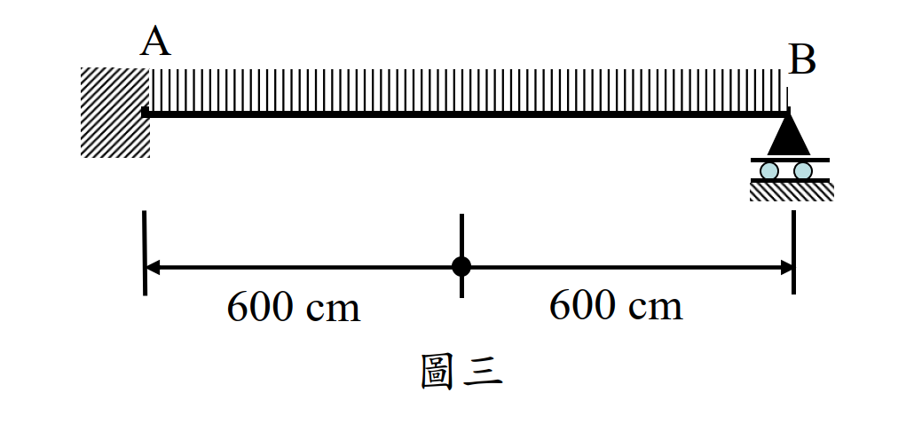

# 考題編號：SS-2021-3

**主分類：** `SS-U1-2` 梁桿件
**副分類：** `SD-U3-1` 結構耐震設計
**設計法：** LRFD
**標籤：** `梁桿件` `耐震設計` `耐震緊實斷面` `LTB側扭挫屈` `斷面選擇` `塑性彎矩` `形狀因子` `SM490` `寬厚比` `Lp` `Lr` `側向支撐` `改善策略`

---

## 1. 原始題目重述 (Problem Restatement)

耐震結構系統中，承受均布載重 $w$ 的鋼梁如圖三所示：

- **材料：** SM490，$F_y = 3.5$ tf/cm²，$F_u = 4.9$ tf/cm²，$F_r = 1.16$ tf/cm²，$E = 2040$ tf/cm²
- **跨度：** 全跨 $L = 600 + 600 = 1200$ cm（A 點至 B 點）
- **側向支撐：** A 點（與鋼柱彎矩接合處）及 B 點**均有充分側向支撐**，無中間側向支撐
- **無支撐長度：** $L_b = 1200$ cm

**試求（自表一選擇斷面，45分）：**
1. 選擇符合耐震設計需求且最能有效發揮斷面性質之斷面，並說明原因
2. 計算所選斷面之塑性彎矩強度 $M_p$ 及形狀因子 $f$
3. 依 LRFD 規範檢核是否能發揮塑性極限強度
4. 若不能，說明改善方式；若能，說明理由並計算塑性極限強度

*圖說：圖三為梁結構示意（側視圖）。左端 A 點固接於柱（斜線陰影表示柱或牆），右端 B 點為三角形支承（pin/roller）；均布載重 $w$（tf/cm）向下作用於梁頂面；A–B 跨度分為兩個 600 cm，總長 1200 cm；A 端與 B 端均標示有充分側向支撐。表一提供四個備選斷面的完整斷面性質（含耐震設計所需之 J、Cw、X1、X2、rT 等參數）。*

---

## 2. 考題核心精神與出題者意圖 (Core Concepts & Examiner's Intent)

**核心觀念：耐震緊實斷面篩選 → LTB 三段式判斷 → 改善策略**

本題三層考核（共 45 分，為最高分題目）：

1. **耐震緊實斷面（Seismic Compact Section）**：用 $\lambda_{pd}$（比標準 $\lambda_p$ 更嚴格）篩選合格斷面
2. **LTB 判斷**：計算 $L_p$、$L_r$，判斷 $L_b = 1200$ cm 落在哪個區段
3. **改善策略**：若無法達到 $M_p$，需說明如何透過增加側向支撐改善

**出題者考查重點：**
- 區分耐震設計的 $\lambda_{pd}$ 與一般設計的 $\lambda_p$（兩者公式不同）
- 正確使用 $L_p = 80r_y/\sqrt{F_{yf}}$ 判斷塑性區間
- 計算 $Z_x$（塑性斷面模數）和形狀因子 $f = Z_x/S_x$
- 提出具體的改善方式（增加中間側向支撐點，使 $L_b \leq L_p$）

---

## 3. 解題戰略地圖與陷阱分析 (Strategic Roadmap & Trap Analysis)

**步驟規劃：**
1. 對四個斷面逐一檢核耐震寬厚比（$\lambda_{pd}$）→ 淘汰不合格者
2. 計算剩餘斷面的 $L_p$，判斷 $L_b = 1200$ cm 的區段
3. 選出「最適當」斷面（能有效發揮性質，且最符合耐震要求）
4. 計算 $Z_x$、$M_p$、$f$
5. 確認 $L_b > L_p$ → 無法達到 $M_p$ → 說明如何改善

**關鍵陷阱：**

> ⚠️ **陷阱1：用一般 $\lambda_p$ 而非耐震 $\lambda_{pd}$**
> 耐震設計要求更嚴格的緊實斷面，翼板：$\lambda_{pd} = 14/\sqrt{F_y}$（非 $17/\sqrt{F_y}$）；腹板：$\lambda_{pd} = 138/\sqrt{F_y}$（非 $170/\sqrt{F_y}$）。

> ⚠️ **陷阱2：混淆 $r_y$ 與 $r_T$**
> $L_p$ 用 $r_y$（整個斷面的弱軸迴轉半徑）；$L_r$ 用 $r_T$（受壓翼板 + 腹板受壓部分的迴轉半徑），兩者不同。

> ⚠️ **陷阱3：選最重斷面而非最合適斷面**
> 「可有效發揮斷面性質」並非選最重的斷面，而是選在 $L_b = 1200$ cm 下 LTB 折減最小（即 $r_y$ 最大），且重量最輕的合規斷面。

## 3.5 變數層次分析（Variable Hierarchy Analysis）

> 複習提示：解題後，在每個卡住的知識點「卡關?」欄標記 `⚠`；第二次複習時只看有 `⚠` 的項目。

**最終目標：** 以耐震寬厚比 $\lambda_{pd}$ 篩選合格斷面 → 比較 $L_b$ 與 $L_p$/$L_r$ → 選出最適斷面並計算 $Z_x$、$M_p$、$f$ → 說明無法達到 $M_p$ 及改善方式（增設中間側向支撐）

### 主要公式（$\boxed{\phantom{x}}$ = 未知，待推導）

**Step 1：耐震緊實斷面篩選**
$$\lambda_{pdf} = \frac{14}{\sqrt{F_y}}, \quad \lambda_{pdw} = \frac{138}{\sqrt{F_y}}$$

**Step 2：$L_p$ 判斷**
$$\boxed{L_p} = \frac{80 r_y}{\sqrt{F_y}}$$

**Step 3：塑性斷面模數與塑性彎矩**
$$\boxed{Z_x} = 2\left[b_f t_f\left(\frac{h_w}{2}+\frac{t_f}{2}\right) + t_w \frac{h_w}{2} \cdot \frac{h_w}{4}\right]$$
$$\boxed{M_p} = F_y \cdot \boxed{Z_x}, \quad \boxed{f} = Z_x / S_x$$

**Step 4：非彈性 LTB 折減強度（$L_p < L_b < L_r$）**
$$\boxed{M_n} = C_b\left[M_p - (M_p - M_r)\frac{L_b - L_p}{L_r - L_p}\right] < M_p$$

### L1：題目直接給定

| 符號 | 數值 | 說明 |
|------|------|------|
| $F_y$ | 3.5 tf/cm²（SM490）| 降伏應力 |
| $F_r$ | 1.16 tf/cm² | 殘留應力 |
| $E$ | 2040 tf/cm² | 彈性模數 |
| $L_b$ | 1200 cm | 無支撐長度（全跨，無中間支撐）|
| 候選斷面 | 4 個（見表一）| BH700×300×9×19 等 |
| 耐震需求 | 耐震緊實斷面（$\lambda_{pd}$）| 比一般 $\lambda_p$ 更嚴格 |

### L2：需知識點推導

**Step 1：耐震寬厚比篩選**

| 符號 | 公式 / 來源 | 卡關? |
|------|------------|:-----:|
| $\lambda_{pdf}$ | $14/\sqrt{3.5} = 7.48$（翼板限值）| |
| $\lambda_{pdw}$ | $138/\sqrt{3.5} = 73.8$（腹板限值）| |
| BH700×300×9×19 | 翼板 $\lambda_f = 300/(2 	imes 19) = 7.89 > 7.48$ → **淘汰** | |
| 其餘三斷面 | 翼板與腹板均符合 $\lambda_{pd}$ → 合格 | |

**Step 2：計算 $L_p$，選最適斷面**

| 符號 | 公式 / 來源 | 卡關? |
|------|------------|:-----:|
| $L_p$ (BH700×300×12×25) | $80 	imes 7.03/1.871 = 300.5$ cm（$L_b$ 遠大於此）| |
| $L_p$ (BH500×500×16×36) | $80 	imes 13.2/1.871 = 564.6$ cm（$r_y$ 大，折減較小）| |
| $L_p$ (BH500×500×25×50) | $564.6$ cm（$r_y$ 同上，但更重）| |
| **選定** | **BH500×500×16×36**（$r_y$ 最大，LTB 區間最佳，最輕）| |

**Step 3：選定斷面 $Z_x$、$M_p$、$f$**

| 符號 | 公式 / 來源 | 卡關? |
|------|------------|:-----:|
| $h_w$ | $500 - 2 	imes 36 = 428$ mm = 42.8 cm | |
| $Z_x$ | $2[50 	imes 3.6 	imes 23.2 + 1.6 	imes 21.4 	imes 10.7] = 9{,}085$ cm³ | |
| $f$ | $Z_x/S_x = 9085/8180 = 1.111$ | |
| $M_p$ | $3.5 	imes 9085 = 31{,}797$ tf·cm（317.97 tf·m）| |
| $\phi_b M_p$ | $0.9 	imes 31797 = 28{,}618$ tf·cm | |

**Step 4：LTB 強度與改善方式**

| 符號 | 公式 / 來源 | 卡關? |
|------|------------|:-----:|
| $F_L$ | $\min(F_y - F_r, F_{yw}) = \min(2.34, 3.5) = 2.34$ tf/cm² | |
| $L_r$ | $r_T X_1 / F_L \sqrt{1+\sqrt{1+X_2 F_L^2}} = 2615$ cm | |
| LTB 區間 | $L_p = 564.6 < L_b = 1200 < L_r = 2615$ → 非彈性 LTB | |
| $M_n$ | $C_b[M_p - (M_p-M_r)(L_b-L_p)/(L_r-L_p)] = 27{,}875$ tf·cm < $M_p$ | |
| 改善 | 加設 2 個中間側向支撐（每隔 400 cm），使各段 $L_b = 400 < L_p = 565$ cm | |

### L3：深層知識（不懂就卡住）

| 知識點 | 說明 | 補強頁 | 卡關? |
|--------|------|:------:|:-----:|
| 耐震 $\lambda_{pd}$ vs 一般 $\lambda_p$ | 耐震翼板 $14/\sqrt{F_y}$（非 $17/\sqrt{F_y}$），腹板 $138/\sqrt{F_y}$（非 $170/\sqrt{F_y}$）；更嚴格確保塑性轉角能力 | | |
| $r_y$ 大表示 LTB 折減小 | $L_p \propto r_y$；$r_y$ 大，$L_p$ 大，$L_b < L_p$ 的機會更大；BH500×500 比 BH700×300 的 $r_y$ 大得多 | [[ltb-3zone]] · [[LATERAL-TORSIONAL-BUCKLING]] | |
| LTB 三段判斷 $L_b$ vs $L_p$/$L_r$ | $L_b \leq L_p$：$M_n = M_p$；$L_p < L_b \leq L_r$：非彈性線性折減；$L_b > L_r$：彈性折減 | [[ltb-3zone]] | |
| $r_T$ vs $r_y$ 的用途 | $L_p$ 用 $r_y$（整個斷面弱軸）；$L_r$ 用 $r_T$（受壓翼板 + 受壓腹板部分的迴轉半徑）| | |
| 選最適斷面不選最重 | 「有效發揮斷面性質」= 在 $L_b$ 條件下 LTB 折減最小且重量最輕；非最重也非最強 | | |

---

## 4. 步驟化詳細計算過程 (Step-by-Step Detailed Calculation)

### Step 1：耐震緊實斷面檢核（$\lambda_{pd}$）

$F_y = 3.5$ tf/cm²（SM490）

**耐震寬厚比限值：**
$$\lambda_{pdf} = \frac{14}{\sqrt{F_y}} = \frac{14}{\sqrt{3.5}} = \frac{14}{1.871} = 7.48 \quad \text{（翼板，不加勁元素）}$$

$$\lambda_{pdw} = \frac{138}{\sqrt{F_y}} = \frac{138}{1.871} = 73.8 \quad \text{（腹板，加勁元素）}$$

| 斷面 | 翼板 $\lambda_f = b_f/(2t_f)$ | vs $\lambda_{pdf}=7.48$ | 腹板 $\lambda_w = h_w/t_w$ | vs $\lambda_{pdw}=73.8$ | 耐震緊實？ |
|------|-----|-----|-----|-----|---------|
| BH700×300×9×19 | $300/(2\times19)=7.89$ | **7.89 > 7.48 ✗** | $(700-38)/9=73.6$ | 73.6 < 73.8 ✓ | ❌ 翼板不合格 |
| BH700×300×12×25 | $300/(2\times25)=6.0$ | 6.0 < 7.48 ✓ | $(700-50)/12=54.2$ | 54.2 < 73.8 ✓ | ✅ |
| BH500×500×16×36 | $500/(2\times36)=6.94$ | 6.94 < 7.48 ✓ | $(500-72)/16=26.75$ | 26.75 < 73.8 ✓ | ✅ |
| BH500×500×25×50 | $500/(2\times50)=5.0$ | 5.0 < 7.48 ✓ | $(500-100)/25=16.0$ | 16.0 < 73.8 ✓ | ✅ |

**淘汰：BH700×300×9×19**（翼板寬厚比超過耐震限值）

---

### Step 2：計算 $L_p$，比較 $L_b = 1200$ cm

**公式（題目提供）：**
$$L_p = \frac{80 r_y}{\sqrt{F_{yf}}}$$

其中 $F_{yf} = F_y = 3.5$ tf/cm²，$\sqrt{F_y} = 1.871$

| 斷面 | $r_y$ (cm) | $L_p = 80 r_y / 1.871$ (cm) | $L_b = 1200$ cm vs $L_p$ |
|------|------------|---------------------------|--------------------------|
| BH700×300×12×25 | 7.03 | $80\times7.03/1.871 = \mathbf{300.5}$ | 1200 >> 300.5 |
| BH500×500×16×36 | 13.2 | $80\times13.2/1.871 = \mathbf{564.6}$ | 1200 > 564.6 |
| BH500×500×25×50 | 13.2 | $80\times13.2/1.871 = \mathbf{564.6}$ | 1200 > 564.6 |

**所有合格斷面均有 $L_b > L_p$，無法不經改善就達到 $M_p$。**

---

### Step 3：計算 $L_r$（確認是彈性或非彈性 LTB 區間）

**公式（題目提供）：**
$$L_r = \frac{r_T X_1}{F_L}\sqrt{1 + \sqrt{1 + X_2 F_L^2}}$$

其中：
$$F_L = \min(F_{yf} - F_r,\; F_{yw}) = \min(3.5 - 1.16,\; 3.5) = \min(2.34, 3.5) = 2.34 \text{ tf/cm}^2$$

**BH700×300×12×25**（$r_T = 8.0$ cm，$X_1 = 144$ tf/cm²，$X_2 = 1.82$ cm²/tf²）：

$$L_r = 8.0 \times \frac{144}{2.34}\sqrt{1+\sqrt{1+1.82\times2.34^2}}$$
$$= 8.0 \times 61.54 \times \sqrt{1+\sqrt{1+9.966}} = 8.0 \times 61.54 \times \sqrt{1+\sqrt{10.966}}$$
$$= 8.0 \times 61.54 \times \sqrt{1+3.311} = 8.0 \times 61.54 \times 2.077 = \mathbf{1023 \text{ cm}}$$

$$L_b = 1200 \text{ cm} > L_r = 1023 \text{ cm} \quad \Rightarrow \quad \text{彈性 LTB（Elastic LTB）}$$

**BH500×500×16×36**（$r_T = 14.0$ cm，$X_1 = 294$ tf/cm²，$X_2 = 0.0844$ cm²/tf²）：

$$L_r = 14.0 \times \frac{294}{2.34}\sqrt{1+\sqrt{1+0.0844\times2.34^2}}$$
$$= 14.0 \times 125.6 \times \sqrt{1+\sqrt{1+0.462}} = 14.0 \times 125.6 \times \sqrt{1+\sqrt{1.462}}$$
$$= 14.0 \times 125.6 \times \sqrt{1+1.209} = 14.0 \times 125.6 \times 1.486 = \mathbf{2615 \text{ cm}}$$

$$L_p = 564.6 < L_b = 1200 < L_r = 2615 \quad \Rightarrow \quad \text{非彈性 LTB（Inelastic LTB）}$$

**BH500×500×25×50**（$r_T = 14.0$ cm，$X_1 = 439$ tf/cm²，$X_2 = 0.0185$ cm²/tf²）：

$$L_r = 14.0 \times \frac{439}{2.34}\sqrt{1+\sqrt{1+0.0185\times5.476}}$$
$$= 14.0 \times 187.6 \times \sqrt{1+\sqrt{1.101}} = 14.0 \times 187.6 \times 1.432 = \mathbf{3763 \text{ cm}}$$

$$L_p = 564.6 < L_b = 1200 < L_r = 3763 \quad \Rightarrow \quad \text{非彈性 LTB}$$

---

### Step 4：選定最適當斷面

**淘汰分析：**

| 斷面 | 耐震緊實 | LTB 區間 | 評估 |
|------|---------|---------|------|
| BH700×300×9×19 | ❌ | — | 翼板不合格，直接淘汰 |
| BH700×300×12×25 | ✅ | 彈性 LTB（$L_b > L_r$）| LTB 折減最嚴重，斷面性質發揮差 |
| **BH500×500×16×36** | ✅ | 非彈性 LTB（$L_b < L_r$）| **較輕，LTB 折減較小** |
| BH500×500×25×50 | ✅ | 非彈性 LTB（$L_b < L_r$）| $L_r$ 更長、折減更小，但重量多 40% |

**選定：BH500×500×16×36**

理由：
1. **滿足耐震緊實斷面要求**（$\lambda_f = 6.94 < \lambda_{pdf} = 7.48$，$\lambda_w = 26.75 < \lambda_{pdw} = 73.8$）
2. **$L_b$ 在非彈性 LTB 區間**（$L_p < L_b < L_r$），優於 BH700×300×12×25 的彈性 LTB
3. **比 BH500×500×25×50 更輕**（$A = 428$ cm² vs $600$ cm²），重量減 29%，同樣 $r_y = 13.2$ cm
4. **有效發揮大 $r_y$（= 13.2 cm）的優勢**，LTB 折減相對小

---

### Step 5：計算 $M_p$ 與形狀因子 $f$

**BH500×500×16×36 斷面性質（由表一）：**

| 項目 | 數值 |
|------|------|
| $A$ | 428 cm² |
| $I_x$ | 205,000 cm⁴ |
| $S_x$ | 8,180 cm³ |
| $r_y$ | 13.2 cm |

**幾何尺寸：**
$d = 500$ mm = 50 cm，$b_f = 500$ mm = 50 cm，$t_w = 16$ mm = 1.6 cm，$t_f = 36$ mm = 3.6 cm，$h_w = 500 - 72 = 428$ mm = 42.8 cm

**計算塑性斷面模數 $Z_x$：**

$$Z_x = 2\left[b_f t_f \left(\frac{h_w}{2} + \frac{t_f}{2}\right) + t_w \cdot \frac{h_w}{2} \cdot \frac{h_w}{4}\right]$$

$$= 2\left[50\times3.6\times\left(21.4+1.8\right) + 1.6\times21.4\times\frac{21.4}{2}\right]$$

$$= 2\left[180\times23.2 + 1.6\times21.4\times10.7\right]$$

$$= 2\left[4{,}176 + 366.4\right] = 2\times4{,}542.4 = \mathbf{9{,}085 \text{ cm}^3}$$

**形狀因子：**
$$f = \frac{Z_x}{S_x} = \frac{9{,}085}{8{,}180} = \boxed{1.111}$$

**塑性彎矩：**
$$M_p = F_y \times Z_x = 3.5 \times 9{,}085 = 31{,}797 \text{ tf·cm} = \boxed{317.97 \text{ tf·m}}$$

$$\phi_b M_p = 0.9 \times 31{,}797 = \mathbf{28{,}618 \text{ tf·cm} = 286.2 \text{ tf·m}}$$

---

### Step 6：LTB 強度檢核（$L_b = 1200$ cm）

$L_b = 1200$ cm，$L_p = 564.6$ cm，$L_r = 2615$ cm → **非彈性 LTB 區間**

**計算 $M_r$：**
$$M_r = F_L \times S_x = 2.34 \times 8{,}180 = 19{,}141 \text{ tf·cm}$$

**計算標稱彎矩強度（取 $C_b = 1.0$，保守）：**

$$M_n = C_b\left[M_p - (M_p - M_r)\frac{L_b - L_p}{L_r - L_p}\right] \leq M_p$$

$$= 1.0\times\left[31{,}797 - (31{,}797-19{,}141)\times\frac{1200-564.6}{2615-564.6}\right]$$

$$= 31{,}797 - 12{,}656\times\frac{635.4}{2050.4}$$

$$= 31{,}797 - 12{,}656\times0.3099$$

$$= 31{,}797 - 3{,}922 = \mathbf{27{,}875 \text{ tf·cm}}$$

$$\phi_b M_n = 0.9 \times 27{,}875 = \mathbf{25{,}088 \text{ tf·cm} = 250.9 \text{ tf·m}}$$

$$M_n = 27{,}875 \text{ tf·cm} < M_p = 31{,}797 \text{ tf·cm}$$

$$\boxed{\text{結論：}L_b = 1200 \text{ cm} > L_p = 564.6 \text{ cm，無法發揮塑性極限強度}}$$

---

### Step 7：改善方式

由於 $L_b = 1200$ cm $>$ $L_p = 564.6$ cm，必須**增加中間側向支撐**，以縮短有效無支撐長度至 $L_b \leq L_p$。

**所需中間支撐數計算：**

$$\text{每段} L_b \leq L_p = 564.6 \text{ cm}$$

$$\text{需要段數：} \left\lceil\frac{1200}{564.6}\right\rceil = \lceil 2.12\rceil = 3 \text{ 段}$$

$$\Rightarrow \text{需加設} 3 - 1 = \mathbf{2} \text{ 個中間側向支撐}$$

**支撐位置（均等分）：**
- 第 1 個支撐：距 A 端 400 cm
- 第 2 個支撐：距 A 端 800 cm
- 各段 $L_b = 400$ cm $< L_p = 564.6$ cm ✓

**加設後效果：**
$$L_b = 400 \text{ cm} < L_p = 564.6 \text{ cm} \Rightarrow M_n = M_p = 31{,}797 \text{ tf·cm}$$
$$\phi_b M_p = 0.9 \times 31{,}797 = 28{,}618 \text{ tf·cm} = 286.2 \text{ tf·m}$$

---

### 計算彙整

| 項目 | 數值 |
|------|------|
| 選定斷面 | BH500×500×16×36 |
| 耐震翼板 $\lambda_f / \lambda_{pdf}$ | 6.94 / 7.48 ✓ |
| 耐震腹板 $\lambda_w / \lambda_{pdw}$ | 26.75 / 73.8 ✓ |
| 塑性斷面模數 $Z_x$ | 9,085 cm³ |
| 形狀因子 $f = Z_x / S_x$ | 1.111 |
| 塑性彎矩 $M_p$ | 31,797 tf·cm（317.97 tf·m）|
| $\phi_b M_p$ | 28,618 tf·cm（286.2 tf·m）|
| $L_p$ | 564.6 cm |
| $L_r$ | 2,615 cm |
| LTB 區間（$L_b = 1200$ cm） | 非彈性 LTB（$L_p < L_b < L_r$）|
| $M_n$（$L_b = 1200$ cm，$C_b = 1.0$）| 27,875 tf·cm（250.9 tf·m）|
| **結論** | **無法達到 $M_p$，需加設 2 個中間側向支撐（每段 400 cm）** |

---

## 5. 關鍵爭議點與進階探討 (Critical Issues & Advanced Discussion)

### 耐震設計的 $\lambda_{pd}$ 為何比 $\lambda_p$ 更嚴格？

一般設計的 $\lambda_p$ 保證在塑性彎矩 $M_p$ 達到之前不發生局部挫屈。但在耐震設計中，梁需要反覆承受大塑性轉角（累積塑性轉角可達 $0.03$ rad 以上），因此翼板必須具有更大的應變能力（rotation capacity）。更嚴格的 $\lambda_{pd} = 14/\sqrt{F_y}$ 確保在多次往復塑性變形中翼板不會局部挫屈，保持塑性鉸的穩定性。

### $C_b$ 的影響

本題假設 $C_b = 1.0$（保守）。A 點為柱彎矩接頭，B 點為簡單支承，在均布載重下：

若 A 為固端（$M_A \neq 0$）、B 為鉸接：彎矩圖為拋物線加上端彎矩，$C_b > 1.0$，實際 $M_n$ 會比 $C_b = 1.0$ 的結果大。若 A、B 均為鉸接：$C_b = 1.75$（用簡化公式 $M_1 = M_2 = 0$）。

採 $C_b = 1.0$ 為最保守設計，實際 $M_n$ 會更大，但不超過 $M_p$。

### 加設側向支撐的實務方式

在耐震設計中，側向支撐通常由：
- 樓板鋼承板（steel deck）提供連續側向支撐
- 斜撐構件（bracing member）提供點狀支撐
- 相鄰梁的橫向接合（lateral tie）

本題建議在跨度 1/3 和 2/3 處（各 400 cm 處）加設側向支撐，使 $L_b = 400$ cm $< L_p = 565$ cm。

### 考場安全答法

1. **耐震寬厚比**：$\lambda_{pdf} = 14/\sqrt{3.5} = 7.48$，$\lambda_{pdw} = 138/\sqrt{3.5} = 73.8$
2. **淘汰 BH700×300×9×19**（翼板 7.89 > 7.48）
3. **選 BH500×500×16×36**：$r_y = 13.2$ cm 最大（BH700 只有 7.03 cm），非彈性 LTB，較輕
4. $Z_x = 9085$ cm³，$f = 9085/8180 = 1.111$，$M_p = 3.5 \times 9085 = 31797$ tf·cm
5. $L_p = 80 \times 13.2/\sqrt{3.5} = 565$ cm $< L_b = 1200$ cm → **不能達到 $M_p$**
6. 改善：**加 2 個中間側向支撐**（每隔 400 cm），使各段 $L_b = 400 < 565 = L_p$ → 可達 $\phi_b M_p = 28618$ tf·cm
