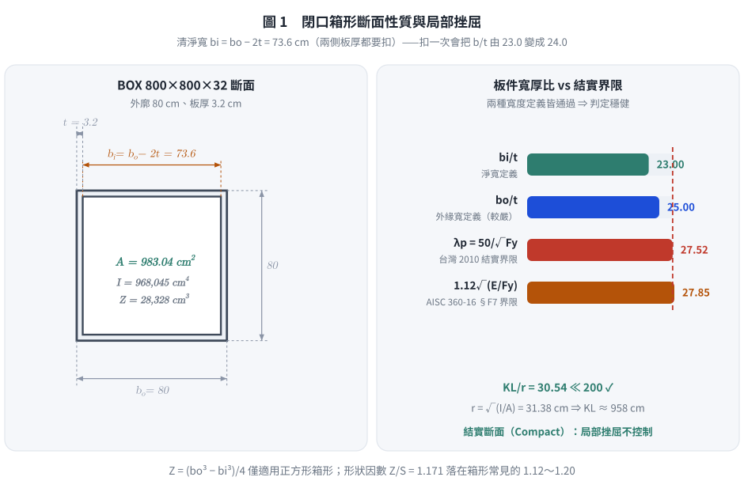
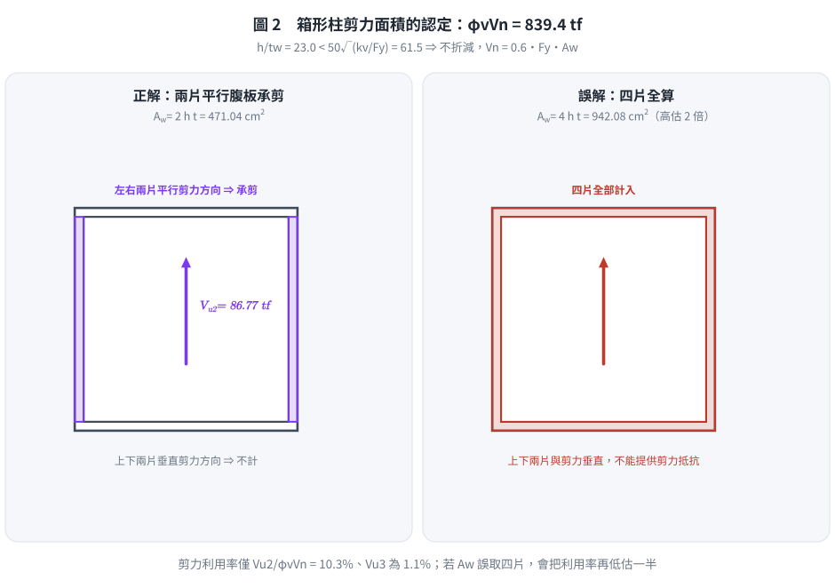
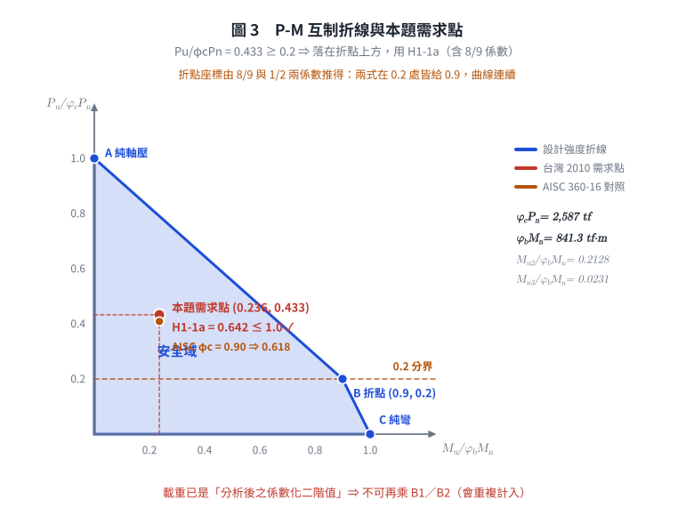

# 考題編號：SS-2022-1

**主分類：** `SS-U1-3` 梁柱桿件
**副分類：** 無
**設計法：** LRFD
**標籤：** `梁柱桿件` `箱形柱` `雙軸彎矩` `軸壓` `剪力強度` `P-M互制` `局部挫屈` `整體挫屈` `有效長細比` `閉口斷面` `全滲透銲組合斷面`

---

## 1. 原始題目重述 (Problem Restatement)

已知鋼柱斷面為 **BOX 800×800×32(mm)**，受壓有效長細比 $(KL/r)_{\text{eff}} = 30.54$，且設計配置有**充分的側向支撐與束制**。

**材料：**
- $F_y = 3.3 \text{ tf/cm}^2$，$E = 2040 \text{ tf/cm}^2$

**係數化設計載重（LRFD）：**
- $P_{u1} = -1119 \text{ tf}$（軸壓，取 $|P_u| = 1119 \text{ tf}$）
- $M_{u2} = -179 \text{ tf·m}$（繞軸 2 彎矩，取 $|M_{u2}| = 179 \text{ tf·m}$）
- $M_{u3} = -19.4 \text{ tf·m}$（繞軸 3 彎矩，取 $|M_{u3}| = 19.4 \text{ tf·m}$）
- $V_{u2} = -86.77 \text{ tf}$（軸 2 方向剪力，取 $|V_{u2}| = 86.77 \text{ tf}$）
- $V_{u3} = -9.14 \text{ tf}$（軸 3 方向剪力，取 $|V_{u3}| = 9.14 \text{ tf}$）

**題目參考公式：**
$$\lambda_p = \frac{50}{\sqrt{F_y}} \quad \text{（箱形柱翼板受壓，}F_y\text{ 單位 tf/cm}^2\text{）}$$

$$\frac{h}{t_w} \leq 50\sqrt{\frac{k_v}{F_y}} \;（k_v=5，\text{腹板未加勁}）\Rightarrow V_n = 0.6F_y A_w$$

$$\lambda_c = \frac{KL/r}{\pi}\sqrt{\frac{F_y}{E}}, \quad \lambda_c \leq 1.5: F_{cr} = 0.658^{\lambda_c^2}F_y, \quad \lambda_c > 1.5: F_{cr} = \frac{0.877}{\lambda_c^2}F_y$$

試依 LRFD 法分析與檢核鋼柱之設計強度是否適足。（25 分）

> **原卷卷首註記（逐字）**：「題目所列之計算公式僅供參考應自負確認與勘誤責任，另視設計需求可自行假設適用的條件等」——即公式表本身可能有誤，考生須自行判斷。
> 原卷之 $\lambda_p = 50/\sqrt{F_y}$ 明列適用於「**全滲透銲組合箱形柱等厚度之翼板受彎曲或壓力**」，正合本題斷面。

---

## 2. 考題核心精神與出題者意圖 (Core Concepts & Examiner's Intent)

**核心觀念：梁柱桿件三重檢核——壓力、彎曲、剪力均需分別計算，最後用 P-M 互制公式整合**

本題是梁柱（Beam-Column）設計的完整流程題：
1. **斷面性質計算**：箱形閉口斷面（BOX）的 A、I、S、Z 計算
2. **局部挫屈**：箱形柱板件的 b/t 限值
3. **整體挫屈強度** $\phi_c P_n$：用 $\lambda_c$ → $F_{cr}$ → $P_n$
4. **彎曲強度** $\phi_b M_n$：充分支撐無 LTB，取 $\phi_b M_p$
5. **剪力強度** $\phi_v V_n$
6. **P-M 互制公式**（AISC H1-1a）整合雙軸彎矩+軸壓

**出題者測驗重點：**
- 能正確計算閉口箱形截面的斷面性質（不同於 I 形斷面）
- 能對照 $P_u/\phi_c P_n$ 大小，選擇正確的互制公式（H1-1a vs H1-1b）
- 理解「有充分側向支撐」→ 不需計算 LTB，直接用 $\phi_b M_p$

---

## 3. 解題戰略地圖與陷阱分析 (Strategic Roadmap & Trap Analysis)

**作戰計畫：**
1. 計算 BOX 800×800×32 斷面性質（A、I、S、Z）
2. 局部挫屈 b/t 檢核
3. 計算 $\phi_c P_n$（柱強度）
4. 計算 $\phi_b M_n$（彎曲強度，充分支撐直接取 $\phi_b M_p$）
5. 計算 $\phi_v V_n$（剪力強度）
6. P-M 互制公式（AISC H1-1a or H1-1b）

**關鍵陷阱：**

> ⚠️ **陷阱1：BOX 斷面的清淨寬度**
> BOX 800×800×32 的清淨寬（板件有效寬）$b = 800 - 2 \times 32 = 736$ mm（兩側板厚均需扣除），不是 800 mm。

> ⚠️ **陷阱2：H1-1a vs H1-1b 的選擇**
> 計算 $P_u/(\phi_c P_n)$ 並與 0.2 比較，決定使用哪個互制公式，切勿記錯判斷條件。

> ⚠️ **陷阱3：正方形箱形柱的雙軸對稱**
> BOX 800×800×32 為正方形，$I_2 = I_3$、$Z_2 = Z_3$，兩軸彎曲強度相同，計算時不需分強弱軸。

> ⚠️ **陷阱4：剪力面積的認定**
> 箱形柱受 $V_{u2}$ 方向剪力時，承受剪力的「腹板」為與剪力方向**平行**的兩片板（而非四片全部），$A_w = 2 \times h \times t$。

---

## 3.5 變數層次分析（Variable Hierarchy Analysis）

> 複習提示：解題後，在每個卡住的知識點「卡關?」欄標記 `⚠`；第二次複習時只看有 `⚠` 的項目。

**最終目標：** 分別求 $\phi_cP_n$、$\phi_bM_n$、$\phi_vV_n$ → 代入 P-M 互制公式 → 判斷是否 ≤ 1.0

### 主要公式（$\boxed{\phantom{x}}$ = 未知，待推導）

**Step 1：斷面性質**
$$\boxed{b_i} = b_o - 2t, \quad \boxed{A} = b_o^2 - \boxed{b_i}^2$$
$$\boxed{I} = \frac{b_o^4 - \boxed{b_i}^4}{12}, \quad \boxed{Z} = \frac{b_o^3 - \boxed{b_i}^3}{4}, \quad \boxed{r} = \sqrt{\frac{\boxed{I}}{\boxed{A}}}$$

**Step 2：局部挫屈**
$$\frac{\boxed{b_i}}{t} \leq \frac{50}{\sqrt{F_y}} \quad \checkmark$$

**Step 3：壓力強度**
$$\boxed{\lambda_c} = \frac{(KL/r)_\text{eff}}{\pi}\sqrt{\frac{F_y}{E}}, \quad \boxed{F_{cr}} = 0.658^{\boxed{\lambda_c}^2} F_y$$
$$\boxed{\phi_c P_n} = 0.85 \times \boxed{F_{cr}} \times \boxed{A}$$

**Step 4：彎曲強度（充分支撐，直取 $M_p$）**
$$\boxed{\phi_b M_n} = 0.9 \, F_y \, \boxed{Z}$$

**Step 5：剪力強度**
$$\boxed{A_w} = 2 \times b_i \times t, \quad \boxed{\phi_v V_n} = 0.9 \times 0.6 F_y \times \boxed{A_w}$$

**Step 6：P-M 互制（H1-1a，因 $P_u/\phi_cP_n \geq 0.2$）**
$$\frac{P_u}{\boxed{\phi_c P_n}} + \frac{8}{9}\!\left(\frac{M_{u2}}{\boxed{\phi_b M_n}} + \frac{M_{u3}}{\boxed{\phi_b M_n}}\right) \leq 1.0 \quad \checkmark$$

### L1：題目直接給定

| 符號 | 數值 | 說明 |
|------|------|------|
| $b_o = H_o$ | 80 cm（800 mm） | 箱形柱外廓邊長（正方形） |
| $t$ | 3.2 cm（32 mm） | 板厚（四片均等） |
| $(KL/r)_\text{eff}$ | 30.54 | 有效長細比（已給定，無需自算 $K$、$L$、$r$） |
| $F_y$ | 3.3 tf/cm² | 降伏應力 |
| $E$ | 2040 tf/cm² | 彈性模數 |
| $P_u$ | 1119 tf | 軸壓（取絕對值） |
| $M_{u2}$ | 179 tf·m | 軸2彎矩（取絕對值） |
| $M_{u3}$ | 19.4 tf·m | 軸3彎矩（取絕對值） |
| $V_{u2}$ | 86.77 tf | 軸2剪力（取絕對值） |
| $V_{u3}$ | 9.14 tf | 軸3剪力（取絕對值） |
| $k_v$ | 5.0 | 剪力屈曲係數（無加勁板） |
| $\phi_c$ | 0.85 | 壓力折減係數 |
| $\phi_b$ | 0.9 | 彎曲折減係數 |
| $\phi_v$ | 0.9 | 剪力折減係數 |
| 充分側向支撐 | 題目說明 | 無 LTB，直接取 $\phi_bM_p$ |
| $\lambda_p$ 公式 | $50/\sqrt{F_y}$（題目給） | 局部挫屈限值公式 |
| $F_{cr}$ 公式 | $0.658^{\lambda_c^2}F_y$（題目給） | 非彈性整體挫屈公式 |

### L2：需知識點推導

**Step 1：斷面性質（BOX 閉口矩形公式）**

| 符號 | 公式 / 來源 | 卡關? |
|------|------------|:-----:|
| $b_i$ | $b_o - 2t = 80 - 6.4 = 73.6$ cm | |
| $A$ | $b_o^2 - b_i^2 = 983.04$ cm² | |
| $I$ | $(b_o^4 - b_i^4)/12 = 968{,}045$ cm⁴ | |
| $S$ | $I / (b_o/2) = 24{,}201$ cm³ | |
| $Z$ | $(b_o^3 - b_i^3)/4 = 28{,}328$ cm³ | |
| $r$ | $\sqrt{I/A} = 31.38$ cm | |

**Step 2：局部挫屈**

| 符號 | 公式 / 來源 | 卡關? |
|------|------------|:-----:|
| $b/t$（淨寬） | $b_i / t = 73.6 / 3.2 = 23.0$ | |
| $b/t$（外緣寬，較嚴） | $b_o/t = 80/3.2 = 25.0$ | |
| $\lambda_p$ | $50/\sqrt{F_y} = 50/\sqrt{3.3} = 27.52$ | |
| 結論 | **兩種取法（23.0 與 25.0）皆 $< 27.52$** → 結實斷面，判定不受定義影響 ✓ | |
| $KL/r \leq 200$ | $30.54 \ll 200$ ✓（規範對受壓構材之細長比上限） | |

**Step 3：壓力強度 $\phi_cP_n$**

| 符號 | 公式 / 來源 | 卡關? |
|------|------------|:-----:|
| $\lambda_c$ | $\frac{(KL/r)_\text{eff}}{\pi}\sqrt{\frac{F_y}{E}} = 0.391$ | |
| $\lambda_c \leq 1.5$？ | 是 → 非彈性整體挫屈 | |
| $F_{cr}$ | $0.658^{(0.391)^2} \times 3.3 = 0.9379 \times 3.3 = 3.095$ tf/cm² | |
| $P_n$ | $F_{cr} \times A = 3.095 \times 983.04 = 3042$ tf | |
| $\phi_cP_n$ | $0.85 \times 3042 = 2586$ tf | |

**Step 4：彎曲強度 $\phi_bM_n$**

| 符號 | 公式 / 來源 | 卡關? |
|------|------------|:-----:|
| LTB 判斷 | 充分側向支撐 → 跳過，直接取 $M_p$ | |
| $M_p$ | $F_y \times Z = 3.3 \times 28{,}328 = 934.8$ tf·m | |
| $\phi_bM_{n2} = \phi_bM_{n3}$ | $0.9 \times 934.8 = 841.3$ tf·m（正方形兩軸相同） | |

**Step 5：剪力強度 $\phi_vV_n$**

| 符號 | 公式 / 來源 | 卡關? |
|------|------------|:-----:|
| $h/t_w$ | $73.6/3.2 = 23.0$ | |
| 段落判斷門檻 | $50\sqrt{k_v/F_y} = 61.5 \gg 23.0$ → 段一 | |
| $A_w$ | $2 \times h \times t_w = 2 \times 73.6 \times 3.2 = 471.04$ cm²（**兩片平行腹板**） | |
| $V_n$ | $0.6 F_y A_w = 0.6 \times 3.3 \times 471.04 = 932.5$ tf | |
| $\phi_vV_n$ | $0.9 \times 932.5 = 839.3$ tf（兩方向相同） | |

**Step 6：P-M 互制公式**

| 符號 | 公式 / 來源 | 卡關? |
|------|------------|:-----:|
| $P_u/\phi_cP_n$ | $1119/2586 = 0.433$ | |
| 公式選擇 | $0.433 \geq 0.2$ → 使用 **H1-1a** | |
| H1-1a 計算 | $0.433 + \frac{8}{9}(0.2127 + 0.0231) = 0.643 \leq 1.0$ ✅ | |

### L3：深層知識（不懂就卡住）

| 知識點 | 說明 | 補強頁 | 卡關? |
|--------|------|:------:|:-----:|
| BOX 斷面 $Z$ 公式 | $(b_o^3 - b_i^3)/4$（與 I 形 $b_f t_f(H-t_f) + t_w h_w^2/4$ 完全不同） | [[plastic-zx]] | |
| $\phi_c = 0.85$（非 0.9） | 壓力桿件折減係數比彎曲桿件小，因柱破壞更突然 | [[lrfd-column]] | |
| $0.658^{\lambda_c^2}$ 計算 | 用 $e^{\lambda_c^2 \ln(0.658)}$ 展開計算，不能直接用計算機的次方鍵犯錯 | [[lrfd-column]] · [[column-buckling-lambda-boundary]] | |
| $A_w$ 取兩片腹板 | 箱形柱受 $V_2$ 時只有**平行**於剪力方向的兩片板承剪，非四片全算 | [[SHEAR-BUCKLING-WEB]] | |
| H1-1a vs H1-1b 門檻 | $P_u/\phi_cP_n \geq 0.2$ 用 H1-1a；$< 0.2$ 用 H1-1b（8/9 係數位置不同） | [[pm-interaction]] · [[BEAM-COLUMN-INTERACTION]] | |
| 充分側向支撐的意義 | $L_b < L_p$ → 無 LTB → 不需計算 $C_b$、$L_p$、$L_r$，直接取 $\phi_bM_p$ | [[ltb-3zone]] · [[LATERAL-TORSIONAL-BUCKLING]] | |
| 正方形兩軸對稱 | $I_2 = I_3$、$Z_2 = Z_3$，$\phi_bM_{n2} = \phi_bM_{n3}$，計算一次即可 | | |

---

## 4. 步驟化詳細計算過程 (Step-by-Step Detailed Calculation)

### 一、斷面基本性質（BOX 800×800×32）

**幾何定義：**
- 外廓尺寸：$b_o = H_o = 80 \text{ cm}$（正方形）
- 板厚：$t = 3.2 \text{ cm}$
- 內部清淨尺寸：$b_i = H_i = 80 - 2 \times 3.2 = 73.6 \text{ cm}$

**斷面積：**
$$A = b_o^2 - b_i^2 = 80^2 - 73.6^2 = 6400 - 5416.96 = \boxed{983.04 \text{ cm}^2}$$

**慣性矩（對形心軸，兩軸相同）：**
$$I = \frac{b_o^4 - b_i^4}{12} = \frac{80^4 - 73.6^4}{12} = \frac{40{,}960{,}000 - 29{,}343{,}456}{12} = \frac{11{,}616{,}544}{12} = \boxed{968{,}045 \text{ cm}^4}$$

其中：$80^4 = 40{,}960{,}000 \text{ cm}^4$；$73.6^4 = (73.6^2)^2 = 5416.96^2 = 29{,}343{,}456 \text{ cm}^4$

**彈性斷面模數：**
$$S = \frac{I}{b_o/2} = \frac{968{,}045}{40} = 24{,}201 \text{ cm}^3$$

**塑性斷面模數：**

一般矩形箱形斷面（外 $b_o \times h_o$、壁厚 $t$）：
$$Z = \frac{b_o h_o^2 - b_i h_i^2}{4}$$

本題為**正方形**（$b_o = h_o$、$b_i = h_i$），故可化簡為：
$$Z = \frac{b_o^3 - b_i^3}{4} = \frac{80^3 - 73.6^3}{4} = \frac{512{,}000 - 398{,}688}{4} = \frac{113{,}312}{4} = \boxed{28{,}328 \text{ cm}^3}$$

其中：$73.6^3 = 73.6 \times 5416.96 = 398{,}688 \text{ cm}^3$

> ⚠️ $Z = (b_o^3-b_i^3)/4$ **僅適用正方形箱形**；矩形箱形必須用上面的一般式，否則會錯。

**形狀因數驗算：** $Z/S = 28{,}328/24{,}201 = \mathbf{1.170}$ —— 箱形斷面理論值約 $1.12\sim1.20$，落在合理範圍 ✓（若 $Z$ 算錯，此比值會立刻異常）

**迴轉半徑：**
$$r = \sqrt{\frac{I}{A}} = \sqrt{\frac{968{,}045}{983.04}} = \sqrt{984.7} = 31.38 \text{ cm}$$

驗證：$KL = (KL/r)_\text{eff} \times r = 30.54 \times 31.38 = 958.5 \text{ cm} \approx 9.59 \text{ m}$（合理）

---

### 二、局部挫屈檢核（板件 b/t 限值）

**箱形柱板件寬厚比：**
$$\frac{b}{t} = \frac{b_i}{t} = \frac{73.6}{3.2} = 23.0 \quad(\text{淨寬定義})$$

$$\frac{b_o}{t} = \frac{80}{3.2} = 25.0 \quad(\text{外緣寬定義，較保守})$$

**規範限值（題目提供公式，適用「全滲透銲組合箱形柱等厚度之翼板」）：**
$$\lambda_p = \frac{50}{\sqrt{F_y}} = \frac{50}{\sqrt{3.3}} = \frac{50}{1.8166} = 27.52$$

**判斷：**
$$23.0 < 27.52 \ \checkmark \qquad\text{且}\qquad 25.0 < 27.52 \ \checkmark$$

$$\Rightarrow \text{結實斷面（Compact），局部挫屈不控制；}\textbf{兩種寬度定義皆通過，判定穩健}$$

**細長比上限檢核：**
$$\frac{KL}{r} = 30.54 \ll 200 \quad \checkmark \quad(\text{規範對受壓構材之上限})$$

---



*圖 1　閉口箱形的斷面性質與局部挫屈。清淨寬要扣**兩側**板厚；這張圖攔的是只扣一次（$b/t$ 會由 23.0 變成 24.0），並顯示兩種寬度定義都通過、判定不受定義左右。*

### 三、壓力強度 $\phi_c P_n$

**計算 $\lambda_c$（受壓柱細長參數）：**
$$\lambda_c = \frac{(KL/r)_\text{eff}}{\pi} \sqrt{\frac{F_y}{E}} = \frac{30.54}{\pi} \sqrt{\frac{3.3}{2040}} = 9.721 \times \sqrt{0.001618} = 9.721 \times 0.04022 = 0.391$$

由於 $\lambda_c = 0.391 \leq 1.5$，屬**非彈性整體挫屈**：
$$F_{cr} = 0.658^{\lambda_c^2} \times F_y = 0.658^{(0.391)^2} \times 3.3 = 0.658^{0.153} \times 3.3$$

$$0.658^{0.153} = e^{0.153 \times \ln(0.658)} = e^{0.153 \times (-0.4192)} = e^{-0.0641} = 0.9379$$

$$F_{cr} = 0.9379 \times 3.3 = 3.095 \text{ tf/cm}^2$$

$$P_n = F_{cr} \times A = 3.095 \times 983.04 = 3042 \text{ tf}$$

$$\boxed{\phi_c P_n = 0.85 \times 3042 = 2586 \text{ tf}}$$

---

### 四、彎曲強度 $\phi_b M_n$

**題目已說明「充分的側向支撐與束制」**，無需計算 LTB（側向扭轉挫屈），局部挫屈已確認結實斷面，故：
$$M_p = F_y \times Z = 3.3 \times 28{,}328 = 93{,}482 \text{ tf·cm} = 934.8 \text{ tf·m}$$

$$\boxed{\phi_b M_{n2} = \phi_b M_{n3} = \phi_b M_p = 0.9 \times 934.8 = 841.3 \text{ tf·m}}$$

（正方形箱形斷面兩軸彎曲強度相同）

---

### 五、剪力強度 $\phi_v V_n$

受 $V_{u2}$ 方向剪力時，兩片平行於剪力方向的腹板承剪：
$$A_w = 2 \times h \times t_w = 2 \times 73.6 \times 3.2 = 471.04 \text{ cm}^2$$

**腹板細長比檢核：**
$$\frac{h}{t_w} = \frac{73.6}{3.2} = 23.0$$

$$50\sqrt{\frac{k_v}{F_y}} = 50\sqrt{\frac{5}{3.3}} = 50 \times 1.231 = 61.5 \gg 23.0 \quad \Rightarrow V_n = 0.6F_yA_w$$

$$V_n = 0.6 \times 3.3 \times 471.04 = 932.5 \text{ tf}$$

$$\boxed{\phi_v V_n = 0.9 \times 932.5 = 839.3 \text{ tf}}$$

（正方形斷面兩方向剪力強度相同）

---



*圖 2　剪力有效面積的認定。與剪力方向垂直的上下兩片板不提供剪力抵抗；這張圖攔的是 $A_w$ 取四片而把剪力強度高估一倍。*

### 六、P-M 互制公式（AISC H1）

**先判斷互制公式：**
$$\frac{P_u}{\phi_c P_n} = \frac{1119}{2586} = 0.433 \geq 0.2 \quad \Rightarrow \text{使用 H1-1a}$$

**H1-1a 互制檢核：**
$$\frac{P_u}{\phi_c P_n} + \frac{8}{9}\left[\frac{M_{u2}}{\phi_b M_{n2}} + \frac{M_{u3}}{\phi_b M_{n3}}\right] \leq 1.0$$

代入數值：
$$0.433 + \frac{8}{9}\left[\frac{179}{841.3} + \frac{19.4}{841.3}\right] = 0.433 + \frac{8}{9}\left[0.2127 + 0.0231\right]$$

$$= 0.433 + \frac{8}{9} \times 0.2358 = 0.433 + 0.2096 = \boxed{0.643 \leq 1.0 \quad \checkmark \text{ OK}}$$

---



*圖 3　需求點落在折線的哪一段。$P_u/\phi_cP_n = 0.433 \geq 0.2$ ⇒ 在折點上方、用 H1-1a；這張圖攔的是互制式選錯（H1-1a 與 H1-1b 的 8/9 係數位置不同），並提醒本題載重已含二階效應、不可再乘 $B_1$／$B_2$。*

### 七、剪力需求檢核

$$\frac{V_{u2}}{\phi_v V_n} = \frac{86.77}{839.3} = 0.103 \quad (10.3\%) \leq 1.0 \quad \checkmark$$

$$\frac{V_{u3}}{\phi_v V_n} = \frac{9.14}{839.3} = 0.011 \quad (1.1\%) \leq 1.0 \quad \checkmark$$

---

### 八、檢核彙整

| 檢核項目 | 需求 | 設計強度 | 利用率 | 判斷 |
|---------|------|---------|-------|------|
| 局部挫屈（b/t） | 23.0 | 27.5（$\lambda_p$） | 83.6% | ✅ OK |
| P-M 互制（H1-1a） | 0.643 | 1.0 | 64.3% | ✅ OK |
| 剪力 $V_{u2}$ | 86.77 tf | 839.3 tf | 10.3% | ✅ OK |
| 剪力 $V_{u3}$ | 9.14 tf | 839.3 tf | 1.1% | ✅ OK |

$$\boxed{\text{結論：BOX 800×800×32 鋼柱設計強度適足，所有極限狀態均滿足 LRFD 要求}}$$

---

## 5. 關鍵爭議點與進階探討 (Critical Issues & Advanced Discussion)

### 為什麼箱形柱 $\phi_c = 0.85$ 而非 $\phi_b = 0.9$？

LRFD 規範對**壓力桿件**採用 $\phi_c = 0.85$（對應 ASD 的安全係數約 1.76-1.92），比**彎曲桿件**的 $\phi_b = 0.9$ 更保守。原因：柱強度受初始彎曲、殘留應力、端部條件等缺陷影響比梁更顯著，且柱破壞往往更突然（挫屈屬失穩破壞）。

### 充分側向支撐的意義

題目明確指出「設計配置有充分的側向支撐與束制」，這讓我們可以：
1. **跳過 LTB 計算**：$L_b < L_p$，$C_b$ 不需要計算
2. **直接用 $M_p$**：彎曲強度控制在全斷面塑性化

若無充分支撐，需額外計算 $L_p = 80r_y/\sqrt{F_{yf}}$ 判斷 LTB 區間，增加計算量。

### 箱形斷面的閉口截面優勢

與 I 形斷面相比，箱形閉口截面：
- **扭轉剛度極大**（St. Venant 扭轉常數 $J$ 大得多）
- **抗 LTB 能力強**
- **雙軸彎曲性質對稱**（適合受雙軸彎矩的柱）

這也解釋了為何本題 P-M 互制比值只有 64.3%，剪力利用率更是低至 10%——箱形斷面效率非常高。

### 考場答題建議

計算流程記憶順序：
```
① 斷面性質 A, I, S, Z（閉口式：外減內）
② 局部挫屈 b/t ≤ λp = 50/√Fy？ → 結實；順手驗 KL/r ≤ 200
③ λc → Fcr → Pn → φcPn（φc = 0.85）
④ 有充分支撐 → φbMn = φbMp = 0.9FyZ（正方形兩軸相同）
⑤ h/tw 判斷 → Vn = 0.6FyAw（Aw = 2ht，只算平行剪力的兩片板）→ φvVn
⑥ Pu/(φcPn) vs 0.2 → 選 H1-1a 或 H1-1b → 代入驗算
⑦ 別忘了剪力也要各自檢核（本題只有 10% 與 1%，寫一行即可）
```

### 本題三個「送分」條件

原卷把三件事直接告訴考生，等於免掉最花時間的三段計算：

| 原卷用語 | 免掉什麼 |
|------|------|
| 「受壓有效長細比 $(KL/r)_{eff}$ 為 30.54」 | 不用求 $K$、不用查對位圖、$r$ 只用來反推 $KL$（驗算合理性用） |
| 「設計配置有**充分的側向支撐與束制**」 | 免除 LTB：不用算 $L_p$、$L_r$、$C_b$，直接 $M_n = M_p$ |
| 「$P_{u1}$、$M_{u2}$、$M_{u3}$、$V_{u2}$、$V_{u3}$ 為**載重組合後經分析的係數化載重**」 | 免除載重組合與二階分析：不用算 $B_1$、$B_2$（值已含二階效應） |

⚠️ 因此本題**不需要** $B_1$／$B_2$——載重已是「分析後」的二階值。若還去乘 $B_1$ 會重複計入。

---

## 6. 依最新規範（AISC 360-16／-22）對照

> **主答依據**：內政部「鋼構造建築物鋼結構設計技術規範」**極限設計法（民國 99 年／2010 修正版）**——本題（111 年／2022）明示「試依極限強度設計（LRFD）法」，且原卷公式表之 $\lambda_p = 50/\sqrt{F_y}$、$50\sqrt{k_v/F_y}$、$\exp(-0.419\lambda_c^2)$ 均為台灣 2010 規範形式。以 AISC 360-16 為基礎之修訂版**尚未發布**，故僅列為對照。

### 6.1 令人意外的結論：本題各項界限值幾乎完全相同

把三組界限逐一換算（$E = 2040$、$F_y = 3.3$ tf/cm²）：

| 項目 | 台灣 2010（原卷公式） | AISC 360-16 | 差異 |
|------|:---:|:---:|:---:|
| 柱曲線（非彈性） | $\exp(-0.419\lambda_c^2)F_y = 3.0953$ | $0.658^{F_y/F_e}F_y = 3.0955$ | **0.006%（同一式）** |
| 箱形翼板結實界限 | $50/\sqrt{F_y} = \mathbf{27.52}$ | $1.12\sqrt{E/F_y} = \mathbf{27.85}$（§F7 Table B4.1b） | +1.2% |
| 剪力不折減界限 | $50\sqrt{k_v/F_y} = \mathbf{61.55}$ | $1.10\sqrt{k_vE/F_y} = \mathbf{61.16}$（§G2.1） | −0.6% |
| 箱形壁受純壓之 $\lambda_r$ | $60/\sqrt{F_y} = 33.0$ | $1.40\sqrt{E/F_y} = 34.81$ | +5.5% |

**$\lambda_c = (KL/r\pi)\sqrt{F_y/E}$ 與 $F_y/F_e$ 恆等**：
$$\frac{F_y}{F_e} = \frac{F_y}{\pi^2E/(KL/r)^2} = \left(\frac{KL}{r\pi}\right)^2\frac{F_y}{E} = \lambda_c^2$$
且 $\ln 0.658 = -0.4187 \approx -0.419$。⇒ **兩規範的柱曲線是同一條曲線**，只是寫法不同。

### 6.2 唯一的實質差異：$\phi_c = 0.85$ vs $0.90$

| 項目 | 台灣 2010 | AISC 360-16／-22 |
|------|:---:|:---:|
| $\phi_c$（受壓） | **0.85** | **0.90** |
| $\phi_b$（撓曲） | 0.90 | 0.90（同） |
| $\phi_v$（剪力） | 0.90 | $h/t_w \leq 2.24\sqrt{E/F_y} = 55.7$ 時 **1.00**；否則 0.90 |

$$\phi_cP_n = 0.90 \times 3043 = \mathbf{2738.7\ \text{tf}} \quad (\text{台灣 } 0.85 \to 2586.5\ \text{tf}，+5.9\%)$$

$$\frac{P_u}{\phi_cP_n} = \frac{1119}{2738.7} = 0.4086 \geq 0.2 \Rightarrow \textbf{H1-1a}$$

$$0.4086 + \frac{8}{9}\!\left(\frac{179}{841.3} + \frac{19.4}{841.3}\right) = 0.4086 + 0.2096 = \mathbf{0.618} \leq 1.0 \quad \checkmark$$

剪力（$h/t_w = 23.0 \leq 55.7$ ⇒ $\phi_v = 1.00$、$C_{v2} = 1.0$）：
$$\phi_vV_n = 1.00 \times 0.6 \times 3.3 \times 471.04 = \mathbf{932.7\ \text{tf}} \quad(\text{台灣 } 839.4\ \text{tf}，+11.1\%)$$
$$\frac{V_{u2}}{\phi_vV_n} = \frac{86.77}{932.7} = 9.3\%$$

### 6.3 箱形斷面在 AISC 360-16 的專屬條文

AISC 360-16 把箱形（矩形 HSS 與組合箱形）斷面獨立為 **§F7**，本題相關的三項：

| 極限狀態 | 條文 | 本題 |
|------|------|------|
| 降伏 | F7.1：$M_n = M_p = F_yZ$ | 934.8 tf·m（控制） |
| 翼板局部挫屈 | F7.2：結實時不折減 | $b/t = 23.0 < 27.85$ ✓ 不折減 |
| 腹板局部挫屈 | F7.3：結實時不折減 | 同上 ✓ |

另 §F7 對**組合箱形斷面**要求 $M_n$ 不得超過…（本題結實，不觸及）。台灣 2010 未把箱形獨立成節，散見於各章的寬厚比表。

### 6.4 對照結論

| 項目 | 台灣 2010（主答） | AISC 360-16／-22 | 差異 |
|------|:---:|:---:|:---:|
| $F_{cr}$ | 3.095 tf/cm² | 3.095 tf/cm² | **0%** |
| $\phi_cP_n$ | 2,586 tf | 2,739 tf | +5.9% |
| $\phi_bM_n$（兩軸） | 841.3 tf·m | 841.3 tf·m | **0%** |
| $\phi_vV_n$ | 839.4 tf | 932.7 tf | +11.1% |
| **P-M 互制比** | **0.642** | **0.618** | −3.7% |
| 剪力利用率 | 10.3% | 9.3% | −1.0 pt |
| **判定** | **✅ 適足** | **✅ 適足** | **結論一致** |

**兩規範的判定與數值都非常接近**（互制比差 3.7%），差異全部來自折減係數（$\phi_c$、$\phi_v$），**強度公式本身完全相同**。這使本題成為「規範改版對答案影響最小」的典型——與 SS-2011-3（分區翻轉）恰成對比。

---

*修正日期：2026-08-22（本題原解析之斷面性質、$\lambda_c$、$F_{cr}$、$\phi_cP_n$、$\phi_bM_p$、$A_w$、$\phi_vV_n$ 與互制比 0.642 經程式獨立重算**全部正確**，主答未變動。補強項目：①局部挫屈同時列出「淨寬 23.0」與「外緣寬 25.0」兩種定義並確認皆通過（判定穩健）；②補 $KL/r \leq 200$ 之細長比上限檢核；③$Z$ 補上矩形箱形之一般式 $\left(b_oh_o^2 - b_ih_i^2\right)/4$ 並註明 $(b_o^3-b_i^3)/4$ 僅適用正方形，另加形狀因數 $Z/S = 1.170$ 之合理性驗算；④新增「三個送分條件」說明（尤其：載重已是分析後之二階值，**不可再乘 $B_1$／$B_2$**）；⑤新增 §6 最新規範對照——證明兩規範柱曲線為**同一條**（$\lambda_c^2 \equiv F_y/F_e$、$\ln0.658 = -0.419$）、界限值差異均 < 1.2%，唯一實質差異是 $\phi_c$ 0.85→0.90 與 $\phi_v$ 0.90→1.00，互制比 0.642 → 0.618）*
*圖解補繪：2026-08-29（向量圖 3 張，腳本 `gen_SS-2022-1.py`，改輸入可原地重跑；SVG 供 wiki／PDF，2× PNG 供 pptx／影片）*
*驗證狀態：unverified*
