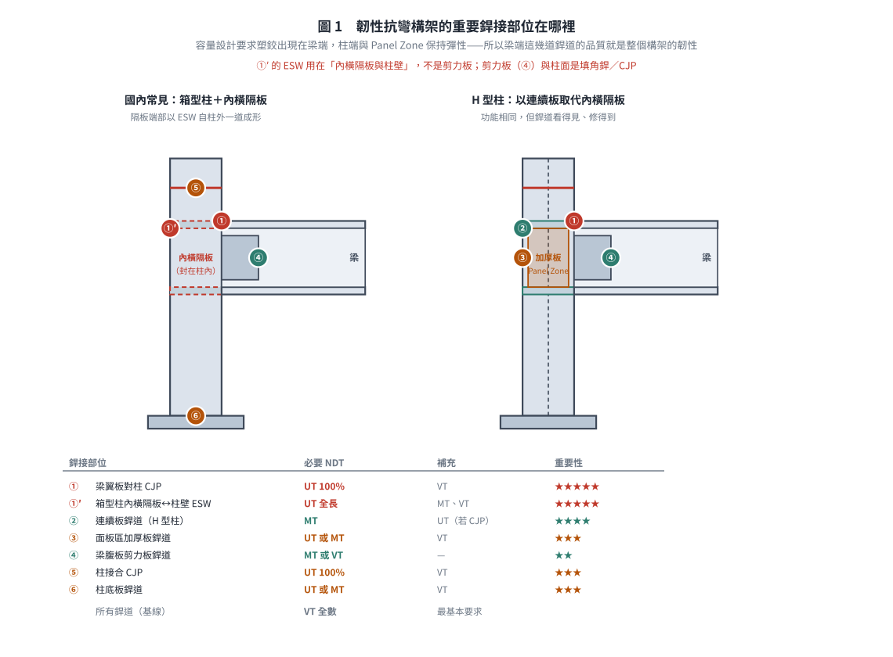
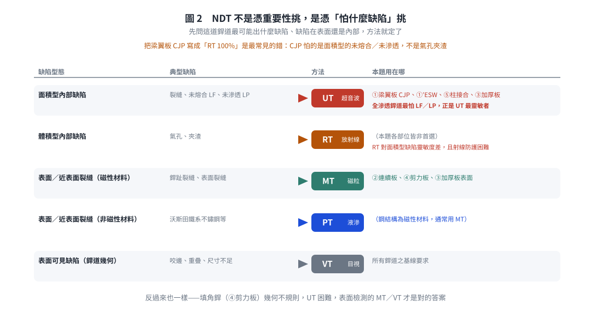
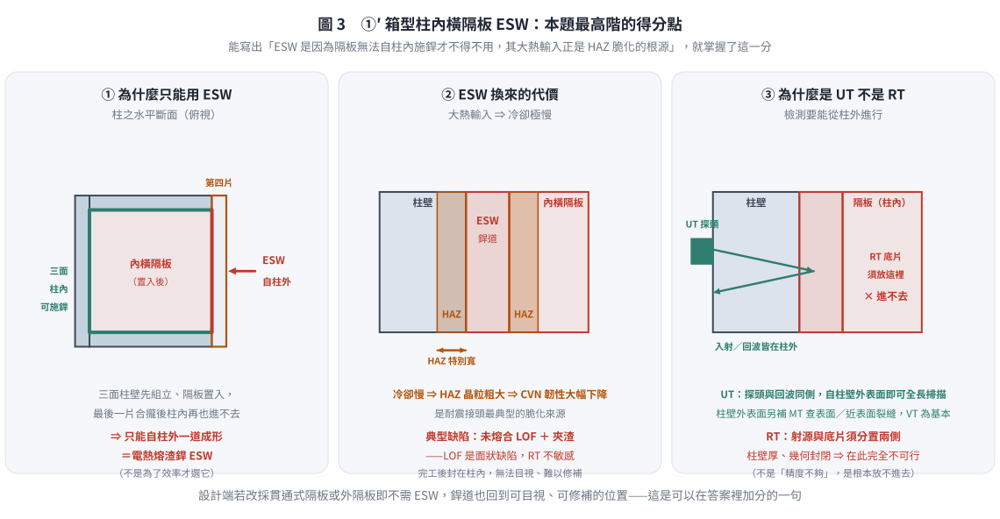

# 考題編號：SS-2022-3

**主分類：** `SS-U2-3` 設計規範對施工之要求
**副分類：** `SD-U3-1` 結構耐震設計
**設計法：** 概念題
**標籤：** `施工規範` `NDT` `非破壞檢測` `韌性抗彎構架` `耐震設計` `梁柱接頭` `全滲透銲` `電熱熔渣銲` `內橫隔板` `超音波檢測` `磁粒檢測` `銲接品管`

---

## 1. 原始題目重述 (Problem Restatement)

試說明**韌性抗彎鋼構架**的重要銲接部位與所需實施的**非破壞檢驗方法**。（25 分）

---

## 2. 考題核心精神與出題者意圖 (Core Concepts & Examiner's Intent)

**核心觀念：韌性抗彎構架的銲接品管是保證耐震性能的最後防線**

1994 年 Northridge 地震後，許多原本設計為韌性抗彎構架的梁柱接頭發生**脆性斷裂**（梁翼板全滲透銲道突然斷裂，無明顯塑性變形）。事後調查發現，問題根源之一正是**銲道瑕疵**（未熔合、未滲透、裂縫）未被 NDT 檢出。

此題考驗考生是否能：
1. **辨識韌性抗彎構架中哪些銲接部位是「高風險、高重要性」**
2. **為各部位配對合適的 NDT 方法**，並說明選擇理由
3. 了解容量設計（Capacity Design）→ 哪裡允許塑化、哪裡必須保持彈性

**出題者測驗重點：**
- 知道「梁翼板對柱全滲透對接銲」是最關鍵的銲接部位（Northridge 教訓）
- 了解 UT（超音波）對全滲透銲道內部面積型缺陷的檢測優勢
- 能區分「必須 100% 檢測」與「抽樣檢測」的部位差異

---

## 3. 解題戰略地圖與陷阱分析 (Strategic Roadmap & Trap Analysis)

**答題架構：**
1. 韌性抗彎構架的設計原則（容量設計 → 確定塑化位置）
2. 重要銲接部位（至少 4-5 處，含位置說明）——**國內作答務必包含「箱型柱內橫隔板之 ESW」**
3. 各部位對應 NDT 方法及選擇理由

**關鍵陷阱：**

> ⚠️ **陷阱1：誤以為「銲道愈多 NDT 要求就愈多」**
> NDT 要求取決於「銲道破壞的後果」，而非銲道數量。全滲透對接銲（CJP）是高風險部位；角銲（填角銲）雖多，但要求相對較低。

> ⚠️ **陷阱2：忘記說明 NDT 方法選擇的理由**
> 題目問「重要銲接部位 + NDT 方法」，光列出部位名稱或 NDT 方法名稱不夠，須說明「為何選此方法」（如 UT 對面積型內部缺陷最靈敏）。

> ⚠️ **陷阱3：混淆 VT 的地位**
> VT（目視）是**所有銲道完工後的基本要求**，但無法代替 UT 檢測內部缺陷，不可單獨作為全滲透銲道的驗收方法。

---

## 3.5 變數層次分析（Variable Hierarchy Analysis）

> 複習提示：解題後，在每個卡住的知識點「卡關?」欄標記 `⚠`；第二次複習時只看有 `⚠` 的項目。

**最終目標：** 說明韌性抗彎鋼構架（SMRF）的重要銲接部位及各部位應實施的非破壞檢驗（NDT）方法

### 主要公式（概念題關鍵概念）

**NDT 方法選擇邏輯：**
- UT（超音波）→ 面狀內部缺陷（LOF、裂縫）→ CJP、ESW
- RT（放射線）→ 體積型內部缺陷（氣孔、夾渣）
- MT（磁粒）→ 鐵磁性材料表面 + 近表面缺陷
- PT（液體滲透）→ 非鐵磁性材料表面缺陷
- VT（目視）→ 所有銲道的基本要求

### L1：題目直接給定

| 題目要求 | 說明 |
|---------|------|
| 韌性抗彎構架（SMRF）| 最高耐震等級，塑鉸在梁端形成 |
| 重要銲接部位 | 需列出至少 4-5 處 |
| NDT 方法 | 需說明選擇理由 |

### L2：需知識點推導

**重要銲接部位彙整**

| 部位 | 銲接類型 | NDT 方法 | 理由 | 卡關? |
|------|---------|---------|------|:-----:|
| 梁翼板對柱 CJP 對接銲 | 完全滲透銲 | UT（100%）| 面狀缺陷（LOF／裂縫）用 UT ⚠ 最重要 | |
| **箱型柱內橫隔板 ↔ 柱壁**（國內最常見）| **電熱熔渣銲 ESW** | UT + VT | 位於梁翼板力流主幹上；ESW 大熱輸入 → HAZ 晶粒粗大脆化、LOF 風險高；且封在柱內無法目視、修補困難 | |
| H 型柱連續板（Continuity Plate）↔ 柱翼板／腹板 | CJP 或填角銲 | UT（CJP 時 100%）／MT | 傳遞翼板集中力，防柱翼板局部彎曲 | |
| 柱接合（Column Splice）| CJP | UT（100%）+ VT | 柱身力流不得中斷 | |
| 柱底板銲道 | CJP 或大尺寸填角銲 | UT／MT + VT | 全棟力流最終傳遞點 | |
| 剪力板／梁腹板填角銲 | 填角銲 | MT 或 VT（基本）| 剪力路徑；填角銲幾何不規則，UT 難施作 | |
| 銲道趾部與端部 | 任何銲道 | MT／PT（選查）| 表面裂縫，鐵磁材料以 MT 最靈敏 | |

### L3：深層知識（不懂就卡住）

| 知識點 | 說明 | 補強頁 | 卡關? |
|--------|------|:------:|:-----:|
| CJP 必須 100% UT（AISC 341 要求）| SMRF 梁翼板 CJP 必須全面 UT，非抽檢 | [[SEISMIC-STEEL-SN]] · [[WELDED-CONNECTION-DESIGN]] | |
| UT 適合面狀缺陷（LOF/裂縫）| 超音波在缺陷平面反射強，比 RT 更能偵測薄型缺陷 | [[WELDED-CONNECTION-DESIGN]] | |
| VT 是所有銲道的基本要求 | 不能代替 UT；完全滲透銲須 UT + VT 雙重驗收 | [[WELDED-CONNECTION-DESIGN]] | |
| ESW 大熱輸入 → HAZ 脆化風險高 | 需特別注意 HAZ 韌性，AWS D1.8 對 ESW 有特殊要求 | [[SEISMIC-STEEL-SN]] | |
| **國內 ESW 用在哪裡** | 箱型柱之**內橫隔板與柱壁**：隔板置入後最後一片柱壁合攏，內部無法施銲，故以 ESW 自柱外一道成形。**不是**用來銲剪力板 | [[SS-2024-4]] · [[SEISMIC-STEEL-SN]] | |

## 4. 步驟化詳細計算過程 (Step-by-Step Detailed Calculation)

### 一、韌性抗彎構架設計原則與塑化位置

**容量設計（Capacity Design）原則：**
- 梁柱接頭應確保**塑鉸形成於梁端**（或 RBS 犬骨接頭的縮小斷面處）
- 柱端（柱膝）、接頭板件區（Panel Zone）應保持彈性
- 因此，梁端接頭銲道品質直接決定整個構架的耐震韌性

**銲接品管的位階：**
梁端翼板全滲透銲道 ≒ **箱型柱內橫隔板 ESW**（同屬力流主幹）→ Panel Zone → 柱接合 → 剪力板／腹板（自上而下依重要性排列，均需嚴格 NDT）

---

### 二、韌性抗彎構架之重要銲接部位

#### 部位①：梁翼板對柱全滲透對接銲（最關鍵）

**位置：** 梁（上下）翼板與鋼柱翼板（或箱形柱側板）之間的全滲透對接銲道（Complete Joint Penetration, CJP groove weld）

**重要性：** ★★★★★（最高）
- 此銲道承受梁端彎矩傳至柱的**主要拉壓力**
- 1994 Northridge 地震後被確認為韌性構架最脆弱銲接點
- 銲道瑕疵（未熔合、裂縫）會導致接頭在梁塑化前即發生脆性斷裂，喪失耗能能力

**NDT 要求：**
- **UT（超音波檢測）100% 全數檢測**
- 理由：全滲透銲道為**內部面積型缺陷**（未熔合、未滲透）高發區，UT 對面積型缺陷最靈敏（缺陷面垂直超音波方向時回波最強）；RT 雖可用，但對面積型缺陷靈敏度差，且射線防護困難
- 補充：銲後 VT 目視作為基本確認

---

#### 部位①′：箱型柱內橫隔板與柱壁之電熱熔渣銲（ESW）——國內構架最關鍵的工廠銲道

**位置：** 國內韌性抗彎構架多採**箱型柱**。柱在梁翼板高程須設**內橫隔板（Internal Diaphragm）**，把梁翼板傳來的集中拉／壓力導入柱之另一側。製造時三面柱壁先組立、隔板置入，最後一片柱壁合攏後**無法自柱內施銲**，故國內慣以 **ESW（電熱熔渣銲）自柱外一道成形**銲住隔板端部。

**重要性：** ★★★★★（與梁翼板 CJP 同級）

- 此銲道位於「梁翼板 → 柱壁 → 內隔板 → 柱另一側」的**力流主幹**上；隔板銲道一旦脆斷，翼板 CJP 銲得再好，力也傳不下去
- **ESW 為大熱輸入製程**，冷卻極慢 → HAZ 晶粒粗大、CVN 韌性大幅下降，是耐震接頭最典型的脆化來源
- 完工後**封在柱內、無法目視、修補極為困難**

**NDT 要求：**

- **UT 全長掃描**（自柱壁外側入射）為主
- 柱壁外表面補 **MT** 查表面／近表面裂縫；**VT** 為基本
- 理由：ESW 之典型缺陷為**未熔合（LOF）與夾渣**，屬面狀缺陷，RT 不敏感；且柱壁厚、幾何封閉，RT 在此完全不可行

> 補充：若改採**貫通式隔板（Through Diaphragm）**或**外隔板（External Diaphragm）**，即不需 ESW，銲道也回到可目視、可修補的位置——這是設計端可以降低此風險的作法。

---

#### 部位②：連續板（垂直加勁板）銲道

**位置：** 採 **H 型柱**時，對應梁翼板位置在柱腹板兩側設置的**連續板（Continuity Plate）**與柱翼板、柱腹板的連接銲道（其功能與箱型柱之內橫隔板相同）

**重要性：** ★★★★
- 連續板用於傳遞梁翼板傳來的集中力至柱腹板，防止柱翼板局部彎曲
- 銲道若有缺陷，會導致梁柱接頭局部應力重分配，影響耗能能力

**NDT 要求：**
- **MT（磁粒檢測）** 或 **UT**
- 理由：連續板多以角銲（全滲透或填角銲）連接；角銲表面及近表面裂縫用 MT 最有效率，對磁性材料鋼結構靈敏度高
- 與柱翼板間若為 CJP：補充 UT 100%

---

#### 部位③：面板區加厚板（補強腹板）銲道

**位置：** 當柱面板區（Panel Zone）剪力需求過大時，加設的**腹板加厚板（Doubler Plate）**與柱腹板及翼板的連接銲道

**重要性：** ★★★
- 面板區承受梁柱接頭傳遞之剪力，加厚板品質直接影響面板區耗能機制
- 加厚板與柱腹板的銲道如有未熔合，加厚板不能有效參與受力

**NDT 要求：**
- **UT** 或 **MT**
- 理由：加厚板與柱腹板全長銲道應以 UT 檢測內部缺陷；表面完工後 MT 確認表面裂縫

---

#### 部位④：梁腹板與剪力板（Shear Tab）銲道

**位置：** 梁腹板透過**剪力板（Shear Tab）**銲接至柱翼板（或隔板）的銲道，通常為填角銲

**重要性：** ★★
- 承受梁端剪力，也在塑鉸形成後持續傳遞剪力；若剪力板銲道失效，梁端會脫落
- 相對於翼板 CJP，此部位要求較低，因剪力傳遞路徑較多樣

**NDT 要求：**
- **MT（磁粒檢測）** 或 **VT（目視）**
- 理由：填角銲道表面裂縫（尤其銲趾裂縫）用 MT 最有效率；不需 UT（角銲幾何不規則，UT 困難）

---

#### 部位⑤：柱接合（Column Splice）全滲透銲道

**位置：** 多層建築中，鋼柱在樓層間的**對接銲道（Column Splice）**，通常為全滲透對接銲

**重要性：** ★★★
- 柱接合點受設計彎矩、剪力、軸力，地震時可能承受較高需求
- 接合點應保持彈性（容量設計），銲道缺陷可能導致柱在強震中斷裂

**NDT 要求：**
- **UT 100% 全數檢測**
- 理由：與梁翼板 CJP 同理，全滲透銲道用 UT 確保無內部缺陷

---

#### 部位⑥：柱底板銲道（Column Base Plate Welds）

**位置：** 鋼柱與基礎底板之間的連接銲道，通常為全滲透或大尺寸填角銲

**重要性：** ★★★
- 底板銲道為整棟建築力流的最終傳遞點，若底板銲道失效，柱將失去支撐
- 重力柱（非側力抵抗系統）可用較低要求，但韌性抗彎構架柱基須嚴格控制

**NDT 要求：**
- **UT** 或 **MT**（依銲接型式選擇）

---

*圖 1　容量設計要求塑鉸出現在梁端、柱端與 Panel Zone 保持彈性，所以梁端這幾道銲道的品質就是整個構架的韌性。本圖攔的是把 ESW 記成「剪力板 ESW」——它用在內橫隔板與柱壁，剪力板與柱面是填角銲／CJP。*

### 三、NDT 方法選擇總表

| 銲接部位 | 銲接類型 | 必要 NDT | 補充 NDT | 理由 |
|---------|---------|---------|---------|------|
| 梁翼板對柱（CJP） | 全滲透對接銲 | **UT 100%** | VT | 內部面積型缺陷，UT 最靈敏 |
| **箱型柱內橫隔板↔柱壁** | **ESW 電熱熔渣銲** | **UT 全長** | MT（柱壁外表面）、VT | 位於力流主幹；大熱輸入 → HAZ 脆化＋LOF；封在柱內無法目視，RT 不可行 |
| 連續板銲道（H 型柱）| 角銲或 CJP | **MT** | UT（若 CJP）| 表面／近表面裂縫，MT 效率高 |
| 面板區加厚板銲道 | 角銲 | **UT 或 MT** | VT | 依長度及重要性選擇 |
| 梁腹板剪力板銲道 | 角銲 | **MT 或 VT** | — | 填角銲，表面檢測即可 |
| 柱接合（CJP） | 全滲透對接銲 | **UT 100%** | VT | 同梁翼板 CJP |
| 柱底板銲道 | 全滲透或角銲 | **UT 或 MT** | VT | 依銲接型式選擇 |
| 所有銲道（基線） | 全部 | **VT（全數）** | — | 最基本要求 |

---

### 四、NDT 方法選擇邏輯提醒

$$\text{面積型內部缺陷（裂縫、未熔合）} \Rightarrow \textbf{UT（超音波）}$$

$$\text{體積型內部缺陷（氣孔、夾渣）} \Rightarrow \textbf{RT（放射線）}$$

$$\text{表面或近表面裂縫（磁性材料）} \Rightarrow \textbf{MT（磁粒）}$$

$$\text{表面或近表面裂縫（非磁性材料）} \Rightarrow \textbf{PT（液滲）}$$

$$\text{表面可見缺陷（銲道幾何）} \Rightarrow \textbf{VT（目視）}$$

全滲透銲道以**UT**為主，因全滲透銲道最怕的是**未熔合（Lack of Fusion, LF）**和**未滲透（Lack of Penetration, LP）**——這兩種都是面積型缺陷，正好是 UT 最靈敏的缺陷類型。

---

*圖 2　NDT 不是憑重要性挑，是憑「這道銲道最怕什麼缺陷、缺陷在表面還是內部」挑。本圖攔的是把梁翼板 CJP 寫成「RT 100%」——CJP 怕的是面積型的未熔合／未滲透，不是氣孔夾渣；反向也一樣，填角銲的剪力板該用 MT／VT 而非 UT。*

## 5. 關鍵爭議點與進階探討 (Critical Issues & Advanced Discussion)

### 1994 Northridge 地震的教訓

1994 年 Northridge 地震後，美國 SAC Steel Project 對受損建築進行全面調查，發現：
1. **梁翼板 CJP 銲道脆裂**是最普遍的接頭破壞模式
2. 銲道缺陷包括：銲根部未熔合、HAZ 裂縫、銲趾未滲透
3. 許多缺陷在竣工驗收時**未被 NDT 檢出**（因當時 UT 要求不嚴格）

之後，AISC 341（耐震規定）強制要求所有韌性構架的梁柱 CJP 銲道進行 UT 100% 全檢，並使用**FEMA 350 認可接頭型式**（含 WUF-W、RBS 等）。

### RBS（犬骨接頭）的 NDT 特殊考量

若採用 RBS（Reduced Beam Section），梁翼板在距柱面一段距離處被切削縮小：
- **切削面**：必須磨光，以 **MT 或 PT** 確認無表面裂縫（切削引起的應力集中）
- **CJP 銲道**：仍需 UT 100%
- **目的**：讓塑鉸形成於切削斷面處（非在 CJP 銲道），保護銲道不受過大非彈性變形

*圖 3　ESW 不是為了效率才選它，是隔板無法自柱內施銲才不得不用；它的大熱輸入正是 HAZ 脆化的根源，而封閉幾何讓 RT 完全不可行。本圖攔的是把此處寫成「用 RT 檢查」，也攔把 ESW 的典型缺陷寫成氣孔——它是面狀的未熔合與夾渣。*

### 考場答題建議

25 分題目，建議配分：
- 說明韌性抗彎構架設計原則（容量設計、塑鉸位置）：5 分
- 列出並說明 4-5 個重要銲接部位（含位置）：12-15 分
- 各部位 NDT 方法及選擇理由：8-10 分

**關鍵必寫兩條：**

1. 「**梁翼板對柱全滲透對接銲 → UT 100% 全數檢測**」——最核心的答案
2. 「**箱型柱內橫隔板與柱壁之電熱熔渣銲（ESW）→ UT 全長掃描**」——國內接頭型式的特有考點，且與同單元 [[SS-2024-4]]（113 年）直接相通；能寫出「ESW 是因為內隔板無法自柱內施銲才不得不用，其大熱輸入正是 HAZ 脆化的根源」，即掌握本題最高階的得分點

---

*修正日期：2026-08-22 —— 與同批 SS-2024-4 一併更正 ESW 之適用部位。原解析 §3.5 L2 將電熱熔渣銲列為「腹板剪力板 ESW」，實則國內箱型柱之 ESW 用於**內橫隔板與柱壁**之工廠銲接（剪力板與柱面為填角銲／CJP）。除更正該列外，另新增 §4「部位①′ 箱型柱內橫隔板 ESW」一節、擴充 §3.5 L2 重要部位表與 §4 三 NDT 總表、於 L3 補「國內 ESW 用在哪裡」一則，並於 §5 考場建議補列第二條必寫要點。詳見 `wiki/log.md` 2026-08-22 第五批。*
*圖解補繪：2026-08-29（向量圖 3 張，腳本 `gen_SS-2022-3.py`，改輸入可原地重跑；SVG 供 wiki／PDF，2× PNG 供 pptx／影片）*
