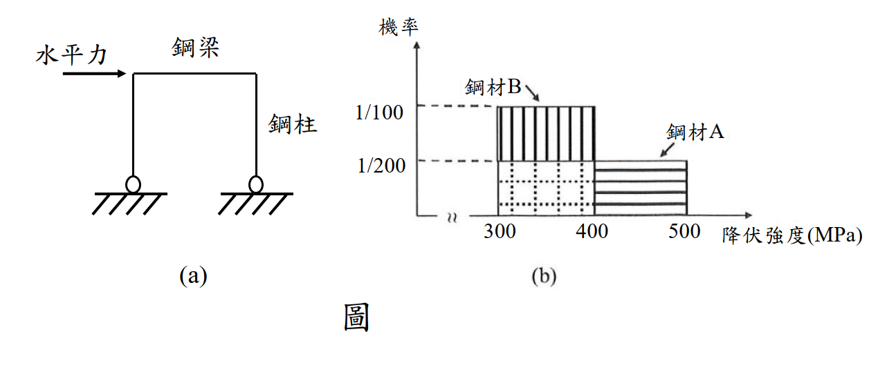

# 考題編號：SS-2022-4

**主分類：** `6.3.1` 結構耐震設計
**副分類：** `4.2.2` 鋼結構材料特性
**設計法：** 概念題（含機率計算）
**標籤：** `耐震設計` `強柱弱梁` `容量設計` `鋼材降伏強度` `機率分析` `均勻分布` `SN耐震鋼材` `降伏比` `塑鉸` `降伏強度範圍`

---

## 1. 原始題目重述 (Problem Restatement)

設計考慮鉸支承門型抗彎鋼構架受地震水平力作用時，**鋼梁比鋼柱先降伏且在梁端形成塑鉸**。為達「**強柱弱梁**」設計目標，選擇使**鋼柱的塑性斷面模數為鋼梁的 1.25 倍**（$Z_{p,col} = 1.25 \, Z_{p,beam}$）。

兩種鋼材的降伏強度分布如圖所示：

*圖說：圖(a) 門型鉸支承構架：水平地震力作用於梁端，梁與柱剛性連接，柱底為鉸支承，塑鉸設計形成於梁端。圖(b) 降伏強度機率密度分布：X 軸 = 降伏強度（MPa），Y 軸 = 機率密度（per MPa）。鋼材A（水平線紋填充）：300~500 MPa 均勻分布，機率密度 = 1/200 per MPa；鋼材B（垂直線紋填充）：350~450 MPa 均勻分布，機率密度 = 1/100 per MPa。兩種鋼材均值均為 400 MPa，但鋼材B變異範圍更窄。*

**假設：** 鋼梁與鋼柱的製作屬**統計上之獨立事件**。

**試分別針對鋼材A與鋼材B，分析柱與梁使用同一種鋼材製作卻未達設計目標，變「強梁弱柱」之機率，並說明限制鋼材降伏強度範圍的意義。**（25 分）

---

## 2. 考題核心精神與出題者意圖 (Core Concepts & Examiner's Intent)

**核心觀念：設計採用的 Fy 是「名目值」，實際材料的 Fy 具有隨機性——降伏強度範圍越寬，強柱弱梁的設計目標越難在實際工況中實現**

**容量設計邏輯：**
$$Z_{p,col} \times F_{y,col} > Z_{p,beam} \times F_{y,beam} \Longleftrightarrow \text{強柱弱梁}$$

設計上取 $Z_{p,col} = 1.25 \, Z_{p,beam}$，預期「柱的塑性彎矩強度 25% 大於梁」，理論上柱不會比梁先降伏。

**問題所在：** 設計假設梁柱同材且 $F_y$ 固定，但實際材料的 $F_y$ 是**隨機變數**。若梁的實際 $F_y$ 偏高、柱的實際 $F_y$ 偏低，則：
$$1.25 \times Z_{p,beam} \times F_{y,col,\text{actual}} < Z_{p,beam} \times F_{y,beam,\text{actual}}$$
強柱弱梁失敗，變成「強梁弱柱」（設計意外）。

**出題者測驗重點：**
1. 能建立強梁弱柱的數學條件
2. 能對連續型均勻分布作二重積分求機率
3. 能解釋「限制 Fy 範圍」（如 SN 耐震鋼材）在容量設計中的意義

---

## 3. 解題戰略地圖與陷阱分析 (Strategic Roadmap & Trap Analysis)

**作戰計畫：**
1. 建立「強梁弱柱」的判斷條件（不等式）
2. 讀出鋼材A、B的機率分布（均勻分布範圍）
3. 用雙重積分（幾何面積法）計算各自機率
4. 比較兩者差異，解釋 Fy 範圍的意義

**關鍵陷阱：**

> ⚠️ **陷阱1：條件是「發生強梁弱柱」，不是「不滿足強柱弱梁」**
> 題目問「變成強梁弱柱的機率」，即：$F_{y,beam} > 1.25 \times F_{y,col}$（嚴格大於），概率計算時上積分即為此條件。

> ⚠️ **陷阱2：忘記確認均勻分布的範圍對積分限的影響**
> 積分需同時滿足：$x \in [\text{分布下限}, \text{上限}]$ AND $y \in [\text{分布下限}, \text{上限}]$，以及條件 $y > 1.25x$。三個條件一起決定積分區域。

> ⚠️ **陷阱3：PDF × 面積 = 機率（均勻分布）**
> 對均勻分布，$f(x) = 1/(\text{範圍長度})$，雙重積分結果 = $f_X \times f_Y \times$ 有效面積。

---

## 3.5 變數層次分析（Variable Hierarchy Analysis）

> 複習提示：解題後，在每個卡住的知識點「卡關?」欄標記 `⚠`；第二次複習時只看有 `⚠` 的項目。

**最終目標：** 計算使用同一種鋼材（A 或 B）製作柱梁時，發生「強梁弱柱」的機率（需雙重積分）

### 主要公式（$\boxed{\phantom{x}}$ = 未知，待推導）

**強梁弱柱條件**（發生的不良情況）：
$$M_{p,beam} > M_{p,col} \quad \Rightarrow F_{y,beam} Z_{p,beam} > F_{y,col} Z_{p,col}$$

因 $Z_{p,col} = 1.25 Z_{p,beam}$：
$$F_{y,beam} > 1.25 F_{y,col}$$

**機率（雙重積分，均勻分布）**
$$P = \int\int_{F_{y,beam} > 1.25 F_{y,col}} f(F_{y,col}) \cdot f(F_{y,beam}) \, dF_{y,col} \, dF_{y,beam}$$

### L1：題目直接給定

| 符號 | 說明 |
|------|------|
| $Z_{p,col} = 1.25 Z_{p,beam}$ | 設計條件（柱塑模數 = 梁的 1.25 倍）|
| 鋼材 A | 均勻分布 $F_y \in [300, 500]$ MPa，$f(x) = 1/200$ |
| 鋼材 B | 均勻分布 $F_y \in [350, 450]$ MPa，$f(x) = 1/100$ |
| 獨立性假設 | 柱梁鋼材強度為統計獨立 |

### L2：需知識點推導

**Step 1：建立「強梁弱柱」不等式**

| 符號 | 公式 | 卡關? |
|------|------|:-----:|
| 強梁弱柱條件 | $F_{y,beam} > 1.25 F_{y,col}$（化簡後）⚠ 常見卡關 | |

**Step 2：鋼材 A 的機率（積分區域）**

| 步驟 | 說明 | 卡關? |
|------|------|:-----:|
| 積分範圍 | $x = F_{y,col} \in [300,500]$，$y = F_{y,beam} \in [300,500]$ | |
| 條件 | $y > 1.25x$（加上 $y \leq 500$）| |
| 幾何法 | 計算滿足條件的矩形面積（$200^2 = 40000$）分之積分面積 ⚠ | |

**Step 3：鋼材 B 的機率**

| 步驟 | 說明 | 卡關? |
|------|------|:-----:|
| 積分範圍 | $x \in [350,450]$，$y \in [350,450]$ | |
| 條件 | $y > 1.25x$（加上邊界約束）| |
| 結果比較 | B 的範圍更窄，機率更低 → SN 鋼材 Fy 範圍限制的意義 | |

### L3：深層知識（不懂就卡住）

| 知識點 | 說明 | 補強頁 | 卡關? |
|--------|------|:------:|:-----:|
| 強梁弱柱條件 = $F_{y,beam} > 1.25 F_{y,col}$（化簡）| 由 $F_{y,b} Z_{p,b} > F_{y,c} \times 1.25 Z_{p,b}$ 約分後得此條件 | [[STRONG-COLUMN-WEAK-BEAM]] | |
| 均勻分布獨立事件 → 雙重積分 = PDF × PDF × 面積 | $P = f_X \times f_Y \times \text{有效面積}$，幾何面積法最直覺 | [[CAPACITY-DESIGN]] | |
| SN 鋼材 $F_y$ 範圍限制的意義 | 限制 $F_y$ 上限（降伏比限制）→ 縮小 $F_y$ 隨機性 → 降低「強梁弱柱」機率 | [[SEISMIC-STEEL-SN]] · [[CAPACITY-DESIGN]] | |
| 積分邊界需同時滿足三個條件 | $y > 1.25x$ AND $y \leq \text{上限}$ AND $x \geq \text{下限}$，三個不等式共同決定積分域 | [[CAPACITY-DESIGN]] | |

## 4. 步驟化詳細計算過程 (Step-by-Step Detailed Calculation)

### 一、建立「強梁弱柱」的數學條件

**設計目標（強柱弱梁）成立的條件：**
$$M_{p,col} > M_{p,beam}$$
$$\underbrace{Z_{p,col}}_{=1.25 Z_{p,beam}} \times F_{y,col} > Z_{p,beam} \times F_{y,beam}$$
$$1.25 \times F_{y,col} > F_{y,beam}$$

**未達設計目標（強梁弱柱）的條件：**
$$F_{y,beam} > 1.25 \times F_{y,col}$$

設：$X = F_{y,col}$（柱降伏強度，MPa），$Y = F_{y,beam}$（梁降伏強度，MPa）

$$P(\text{強梁弱柱}) = P(Y > 1.25X)$$

$X$ 與 $Y$ 相互**獨立**（製作獨立事件），且均服從相同鋼材的均勻分布。

---

### 二、鋼材A的分布（均勻分布 300~500 MPa）

$$f_A(x) = \frac{1}{500-300} = \frac{1}{200} \text{ per MPa}, \quad x \in [300, 500]$$

#### 積分區域分析

條件：$Y > 1.25X$，且 $X \in [300,500]$，$Y \in [300,500]$

需 $1.25X < 500 \Rightarrow X < 400$（若 $X \geq 400$，則 $1.25X \geq 500$，$Y$ 無法大於 $1.25X$ 且仍在範圍內）

同時需 $1.25X > 300 \Rightarrow X > 240$（本範圍已滿足，因 $X \geq 300$）

因此：
$$x \in [300, 400], \quad y \in (1.25x, \;500)$$

#### 計算有效面積

$$\text{Area}_A = \int_{300}^{400} (500 - 1.25x) \, dx$$

$$= \left[500x - \frac{1.25}{2}x^2\right]_{300}^{400} = \left[500x - 0.625x^2\right]_{300}^{400}$$

$$= (500 \times 400 - 0.625 \times 400^2) - (500 \times 300 - 0.625 \times 300^2)$$

$$= (200{,}000 - 100{,}000) - (150{,}000 - 56{,}250)$$

$$= 100{,}000 - 93{,}750 = 6{,}250 \text{ MPa}^2$$

#### 計算機率

$$\boxed{P_A = f_A^2 \times \text{Area}_A = \left(\frac{1}{200}\right)^2 \times 6{,}250 = \frac{6{,}250}{40{,}000} = \frac{5}{32} = 15.6\%}$$

---

### 三、鋼材B的分布（均勻分布 350~450 MPa）

$$f_B(x) = \frac{1}{450-350} = \frac{1}{100} \text{ per MPa}, \quad x \in [350, 450]$$

#### 積分區域分析

條件：$Y > 1.25X$，且 $X \in [350,450]$，$Y \in [350,450]$

需 $1.25X < 450 \Rightarrow X < 360$（若 $X \geq 360$，$1.25X \geq 450$，積分為零）

同時：$Y > 1.25X \geq 1.25 \times 350 = 437.5$（超過350，滿足$Y \geq 350$）

因此：
$$x \in [350, 360], \quad y \in (1.25x, \; 450)$$

#### 計算有效面積

$$\text{Area}_B = \int_{350}^{360} (450 - 1.25x) \, dx$$

$$= \left[450x - 0.625x^2\right]_{350}^{360}$$

$$= (450 \times 360 - 0.625 \times 360^2) - (450 \times 350 - 0.625 \times 350^2)$$

$$= (162{,}000 - 81{,}000) - (157{,}500 - 76{,}562.5)$$

$$= 81{,}000 - 80{,}937.5 = 62.5 \text{ MPa}^2$$

#### 計算機率

$$\boxed{P_B = f_B^2 \times \text{Area}_B = \left(\frac{1}{100}\right)^2 \times 62.5 = \frac{62.5}{10{,}000} = \frac{1}{160} = 0.625\%}$$

---

### 四、機率比較

| 鋼材 | 降伏強度範圍 | 機率密度 | 強梁弱柱機率 |
|------|-----------|---------|------------|
| 鋼材A | 300~500 MPa（範圍 200 MPa） | 1/200 per MPa | **15.6%**（5/32） |
| 鋼材B | 350~450 MPa（範圍 100 MPa） | 1/100 per MPa | **0.625%**（1/160） |

$$\frac{P_A}{P_B} = \frac{15.6\%}{0.625\%} = 25 \text{ 倍}$$

鋼材A（降伏強度範圍較寬）發生「強梁弱柱」的機率是鋼材B（範圍較窄）的 **25 倍**。

---

### 五、限制鋼材降伏強度範圍的意義

**數學層面：**
對均勻分布，強梁弱柱機率正比於「有效面積」，有效面積與範圍寬度的平方成正比：

$$P \propto \frac{(\Delta F_y)^2}{(\Delta F_y)^2} \times [\text{有效積分面積}]$$

當範圍從 200 MPa 縮小為 100 MPa（縮小一半），機率從 15.6% 降至 0.625%（縮小 25 倍）。範圍縮短對降低機率的效果**遠大於線性比例**。

**工程層面：**

1. **容量設計的可靠性**：容量設計（強柱弱梁、強接合弱桿件）的前提是設計強度能**反映實際強度**。若 $F_y$ 範圍過寬，設計假設的「梁比柱弱 25%」可能在實際中完全反轉，耗能機制失效。

2. **SN 耐震鋼材的設計哲學**：日本 SN（Structural Steel for New Building）系列鋼材設有降伏強度**上限**（例如 SN490B：$F_y = 325$ ~ $445$ MPa，範圍 120 MPa），目的就是控制實際 $F_y$ 不超過名目值太多，確保「預期塑化位置」真的是最弱的地方。台灣耐震設計規範亦規定耐震鋼材之降伏比 $F_y/F_u \leq 0.8$，以確保足夠的應變硬化空間。

3. **「鋼材過強」也是風險**：若梁的 $F_y$ 實際值遠高於設計值，不只是「未達強柱弱梁」，更可能造成預期彈性之構件（柱、接合）承受超出設計的力量而提前破壞。

$$\boxed{\text{限制降伏強度範圍} = \text{減少設計假設與實際行為的差距} = \text{提升容量設計可靠度}}$$

---

## 5. 關鍵爭議點與進階探討 (Critical Issues & Advanced Discussion)

### 為何門型鉸支承構架設 $Z_{p,col} = 1.25 Z_{p,beam}$？

規範中「強柱弱梁」的要求：
$$\sum M_{p,col}^* \geq 1.0 \sum M_{p,beam}^*$$

但為了考慮軸力對柱塑性彎矩強度的折減（$M_{pc} = Z_{p,c}(F_y - P_u/A_g)$）以及其他保守考量，規範通常要求柱的塑性強度比梁大 20-25%（各規範不同）。本題取 1.25 倍進行分析。

### 積分幾何的直觀解釋

可用「在單位正方形（$x$軸 = 梁降伏強度範圍，$y$軸 = 柱降伏強度範圍）中，直線 $y = 1.25x$ 以上的面積佔比」來理解：

對鋼材A，(x, y) 均在 [300,500]² 的 40,000 MPa² 正方形中隨機選取，$y > 1.25x$ 的有效面積只有 6,250 MPa²，佔 15.6%。

對鋼材B，正方形縮小為 [350,450]² 的 10,000 MPa²，且直線 $y=1.25x$ 在 $x=360$ 時已超出範圍，有效面積僅 62.5 MPa²，佔 0.625%。

### 考場答題注意事項

- **積分上下限**是本題最容易出錯之處，需仔細確認 $x$ 和 $y$ 都在各自分布範圍內，且同時滿足 $y > 1.25x$
- 最後必須有「解釋降伏強度範圍意義」的文字段落，這部分約佔 8-10 分
- 計算過程中若使用分數（$5/32$、$1/160$）比小數更清晰，建議兩者都寫
