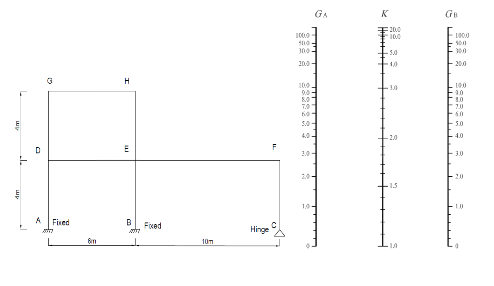

# 考題編號：SS-2023-1

**主分類：** `SS-U1-1` 拉力及壓力桿件
**副分類：** 無
**設計法：** 概念題（含計算）
**標籤：** `有效長度` `K係數` `對位圖` `查圖法` `nomograph` `側移構架` `G值` `不規則框架` `固接` `鉸接`

---

## 1. 原始題目重述 (Problem Restatement)

計算精確的有效長度係數，在鋼結構設計中相當重要。請用**查圖的方法**，試求下圖結構各柱子之有效長度係數（$K$）。鉸接（hinge）時，$G$ 可用 10；固接（fixed）時，$G$ 可用 1。（25 分）

**柱與梁之 I 值表（單位：cm⁴）：**

| 構件 | 柱 AD、BE、CF | 柱 DG、EH | 梁 EF | 梁 DE、GH |
|------|-------------|----------|-------|----------|
| I 值 | 16000 | 3000 | 17000 | 35000 |

*圖說：框架幾何：A、B（固接底）及C（鉸接底）為地面節點，間距A-B=6m、B-C=10m。第一層高4m，節點D（柱AD頂）、E（柱BE頂）、F（柱CF頂）。第二層高4m，節點G（柱DG頂）、H（柱EH頂）；第二層無右側柱。梁：DE（跨距6m）、EF（跨距10m）、GH（跨距6m）。對位圖（Jackson-Moreland Alignment Chart）為側移構架（Sway Frame）版本，K>1.0。*

---

## 2. 考題核心精神與出題者意圖 (Core Concepts & Examiner's Intent)

**核心觀念：有效長度係數 K 反映柱端束制條件——束制愈強，K 愈小，柱挫屈強度愈大**

對位圖（Alignment Chart / Nomograph）的原理：
$$G = \frac{\sum (I_c/L_c)}{\sum (I_b/L_b)}$$

- $G$ 大 → 柱剛度相對梁大 → 梁束制弱 → K 大（挫屈模態接近自由）
- $G$ 小 → 梁剛度相對柱大 → 梁束制強 → K 小（挫屈模態接近固接）
- 固接（Fixed）：$G = 1$（規範簡化值，代表梁剛度遠大於柱）
- 鉸接（Hinge）：$G = 10$（規範簡化值，代表幾乎無束制）

**出題者測驗重點：**
1. 能正確計算各節點 G 值（分清哪些柱、哪些梁連接到此節點）
2. 能識別本題為**側移構架（Sway Frame）**，需用右側圖（K > 1）
3. 能處理不規則框架（柱長度相同但 I 值不同、部分柱在中途終止）

---

## 3. 解題戰略地圖與陷阱分析 (Strategic Roadmap & Trap Analysis)

**作戰計畫（每根柱需算兩端 G，共查一次圖）：**
1. 明確各柱長度（均為 4m = 400 cm）與 I 值
2. 計算各節點 G 值（分清各節點連接哪些柱、哪些梁）
3. 對每根柱，以兩端 G 值查對位圖讀取 K
4. 列表彙整

**關鍵陷阱：**

> ⚠️ **陷阱1：本題為側移構架（Sway Frame），K > 1**
> 框架底部雖有固接（A、B）和鉸接（C），但整體為**無橫向支撐（Unbraced）**的側移構架。應使用側移框架（右側）對位圖，不可用無側移（左側）圖。

> ⚠️ **陷阱2：節點 G 的柱要包含「上下兩段」**
> 在 D、E 這類中間節點，G 的分子需同時包含下方柱（AD 或 BE）和上方柱（DG 或 EH）的 $I/L$。

> ⚠️ **陷阱3：F 節點只有一根梁（EF），沒有梁從 F 往右延伸**
> CF 頂端 F 只與梁 EF 相連，且 F 點上方無柱（第二層右側無柱），計算 $G_F$ 時分母只有 $I_{EF}/L_{EF}$。

> ⚠️ **陷阱4：GH 的跨距等於 DE，不是 EF**
> 梁 GH 位於第二層左側（G 到 H），跨距 = A 到 B 的距離 = 6m = 600 cm，與梁 DE 相同，不是 10m。

---

## 3.5 變數層次分析（Variable Hierarchy Analysis）

> 複習提示：解題後，在每個卡住的知識點「卡關?」欄標記 `⚠`；第二次複習時只看有 `⚠` 的項目。

**最終目標：** 計算框架各柱端剛度比 G，查側移構架對位圖讀取有效長度係數 K

### 主要公式（$\boxed{\phantom{x}}$ = 未知，待推導）

$$\boxed{G} = \frac{\sum (I_c/L_c)}{\sum (I_g/L_g)}, \quad \text{查對位圖} \Rightarrow \boxed{K}$$

特殊邊界：固接底 → G = 1；鉸接底 → G = 10；自由頂（無梁）→ G → ∞

### L1：題目直接給定

| 構件 | I 值 (cm⁴) | 長度 |
|------|-----------|------|
| 柱 AD, BE, CF | 16000 | 4 m = 400 cm |
| 柱 DG, EH | 3000 | 4 m = 400 cm |
| 梁 EF | 17000 | 10 m = 1000 cm |
| 梁 DE, GH | 35000 | 6 m = 600 cm |
| 底端 A, B | 固接 → G = 1 | |
| 底端 C | 鉸接 → G = 10 | |

### L2：需知識點推導

**Step 1：計算各柱、梁 I/L**

| 構件 | I/L (cm³) | 卡關? |
|------|-----------|:-----:|
| 柱 AD = BE = CF | 16000/400 = 40 | |
| 柱 DG = EH | 3000/400 = 7.5 | |
| 梁 EF | 17000/1000 = 17 | |
| 梁 DE = GH | 35000/600 = 58.33 | |

**Step 2：計算各節點 G 值**

| 節點 | G 計算式 | G 值 | 卡關? |
|------|---------|------|:-----:|
| A | 固接 → G = 1 | 1 | |
| B | 固接 → G = 1 | 1 | |
| C | 鉸接 → G = 10 | 10 | |
| D | $(40+7.5)/58.33 = 47.5/58.33$ | 0.81 | |
| E | $(40+7.5)/(17+58.33) = 47.5/75.33$ | 0.63 ⚠ 常見卡關（分母含兩梁）| |
| F | $40/(17) = 40/17$ | 2.35（F 上方無柱、分子只含 CF）⚠ | |
| G | $7.5/58.33$ | 0.13 | |
| H | $7.5/(17+58.33)$ | 0.10 ⚠ 常見卡關 | |

**Step 3：查對位圖讀取 K**

| 柱 | 底端 G | 頂端 G | K（側移構架）| 卡關? |
|-----|--------|--------|-------------|:-----:|
| AD | 1 | 0.81 | ≈ 1.3 | |
| BE | 1 | 0.63 | ≈ 1.3 | |
| CF | 10 | 2.35 | ≈ 2.3 | |
| DG | 0.81 | 0.13 | ≈ 1.2 | |
| EH | 0.63 | 0.10 | ≈ 1.2 | |

### L3：深層知識（不懂就卡住）

| 知識點 | 說明 | 補強頁 | 卡關? |
|--------|------|:------:|:-----:|
| 側移構架（Sway Frame）用右側圖，K > 1 | 無橫向支撐的框架必用側移對位圖（K > 1.0） | [[effective-length-chart]] | |
| 中間節點 G 的柱要包含上下兩段 | 節點 D/E/G/H 的分子包含該節點上下所有連接柱的 I/L | [[effective-length-chart]] | |
| 固接 G = 1（非 0）；鉸接 G = 10（非 ∞）| 規範規定的設計值，非力學理論值（理論值為 0 和 ∞）| [[effective-length-chart]] | |
| F 點上方無柱，計算 G_F 時分子只含 CF | F 為頂端懸臂節點，無上方柱貢獻 | [[EULER-BUCKLING]] | |

## 4. 步驟化詳細計算過程 (Step-by-Step Detailed Calculation)

### 一、構件幾何確認

**柱（均為 4m = 400 cm 高）：**

| 柱 | I（cm⁴） | L（cm） | I/L |
|----|---------|--------|-----|
| AD | 16000 | 400 | 40.0 |
| BE | 16000 | 400 | 40.0 |
| CF | 16000 | 400 | 40.0 |
| DG | 3000 | 400 | 7.5 |
| EH | 3000 | 400 | 7.5 |

**梁：**

| 梁 | I（cm⁴） | L（cm） | I/L |
|----|---------|--------|-----|
| DE | 35000 | 600 | 58.33 |
| EF | 17000 | 1000 | 17.00 |
| GH | 35000 | 600 | 58.33 |

---

### 二、各節點 G 值計算

#### 節點 A（柱 AD 底端）：固接 → $G_A = 1.0$

#### 節點 B（柱 BE 底端）：固接 → $G_B = 1.0$

#### 節點 C（柱 CF 底端）：鉸接 → $G_C = 10$

---

#### 節點 D（柱 AD 頂 = 柱 DG 底，連梁 DE 左端）

$$G_D = \frac{(I_{AD}/L_{AD}) + (I_{DG}/L_{DG})}{I_{DE}/L_{DE}} = \frac{40.0 + 7.5}{58.33} = \frac{47.5}{58.33} = \boxed{0.81}$$

---

#### 節點 E（柱 BE 頂 = 柱 EH 底，連梁 DE 右端和梁 EF 左端）

$$G_E = \frac{(I_{BE}/L_{BE}) + (I_{EH}/L_{EH})}{(I_{DE}/L_{DE}) + (I_{EF}/L_{EF})} = \frac{40.0 + 7.5}{58.33 + 17.00} = \frac{47.5}{75.33} = \boxed{0.63}$$

---

#### 節點 F（柱 CF 頂，連梁 EF 右端；F 上方無柱）

$$G_F = \frac{I_{CF}/L_{CF}}{I_{EF}/L_{EF}} = \frac{40.0}{17.00} = \boxed{2.35}$$

（分子只有 CF 一根柱，因 F 點上方無柱；分母只有梁 EF，F 點右側無梁）

---

#### 節點 G（柱 DG 頂，連梁 GH 左端；G 上方無柱）

$$G_G = \frac{I_{DG}/L_{DG}}{I_{GH}/L_{GH}} = \frac{7.5}{58.33} = \boxed{0.13}$$

---

#### 節點 H（柱 EH 頂，連梁 GH 右端；H 上方無柱）

$$G_H = \frac{I_{EH}/L_{EH}}{I_{GH}/L_{GH}} = \frac{7.5}{58.33} = \boxed{0.13}$$

---

### 三、查對位圖（側移構架）讀取 K 值

依各柱兩端 G 值，在**側移構架（Sway Frame）對位圖**上，用直線連接 $G_A$（上端）和 $G_B$（下端），讀取直線與 K 軸的交點：

| 柱 | $G_{\text{下端}}$（底） | $G_{\text{上端}}$（頂） | 查圖讀得 K |
|----|-------------------|-------------------|----------|
| AD | 1.0（固接） | 0.81（節點D） | ≈ **1.20** |
| BE | 1.0（固接） | 0.63（節點E） | ≈ **1.17** |
| CF | 10（鉸接） | 2.35（節點F） | ≈ **2.50** |
| DG | 0.81（節點D） | 0.13（節點G） | ≈ **1.12** |
| EH | 0.63（節點E） | 0.13（節點H） | ≈ **1.10** |

> 📌 **查圖說明：**
> 對位圖中，$G$ 軸從下（0）到上（∞），K 軸在中間。對 AD 柱，連接左軸 $G=1.0$ 與右軸 $G=0.81$ 的直線，與中間 K 軸的交點約在 $K=1.20$。CF 柱兩端 G 值皆較大（10 和 2.35），直線交 K 軸約於 $K=2.50$，反映鉸接底部束制差、K 值明顯偏大。

---

### 四、結果彙整

$$\boxed{K_{AD} \approx 1.20, \quad K_{BE} \approx 1.17, \quad K_{CF} \approx 2.50, \quad K_{DG} \approx 1.12, \quad K_{EH} \approx 1.10}$$

---

## 5. 關鍵爭議點與進階探討 (Critical Issues & Advanced Discussion)

### G 值的物理意義

$$G = \frac{\text{節點上所有柱的 } I/L \text{ 之和}}{\text{節點上所有梁的 } I/L \text{ 之和}}$$

- 分子（柱剛度和）：代表柱想抵抗轉動的能力
- 分母（梁剛度和）：代表梁束制柱端旋轉的能力
- G = 0：梁束制力無限大（完全固接極限）
- G = ∞：梁無束制力（完全鉸接極限）

規範取固接 $G=1$（而非 0），是因實際固接底板（base plate）仍有微小轉動；鉸接取 $G=10$（而非 ∞）是因實際鉸接仍有些微摩擦束制。

### CF 柱 K ≈ 2.5 的工程解讀

CF 柱底為鉸接（$G=10$），頂端束制也相對弱（$G_F=2.35$，因梁 EF 的 $I/L$ 較小），導致 K 值高達約 2.5。實務上這表示：

$$KL = 2.5 \times 4\text{ m} = 10\text{ m}$$

等效挫屈長度高達 10m，但物理長度只有 4m。設計時必須使用較大的截面，或在 F 點增設水平束制（如與右側牆面連接）來降低 K 值。

### 對位圖的適用限制

AISC 對位圖基於以下假設：
1. 所有梁柱連接為剛接
2. 所有柱同時達到挫屈
3. 梁的兩端轉角相等（遠端為固接時須修正）

本題的框架幾何不規則（右側只有一層），理論上對位圖的精確度稍有降低，但考場上查圖結果已是最佳近似解。
