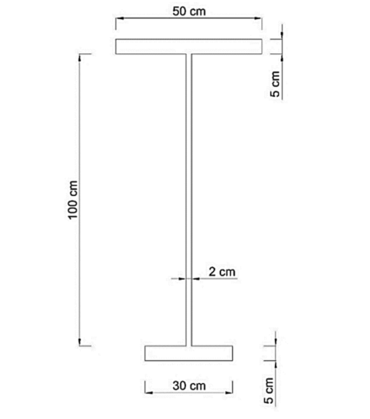

# 考題編號：SS-2023-3

**主分類：** `SS-U1-2` 梁桿件
**副分類：** 無
**設計法：** 概念題（含計算）
**標籤：** `非對稱斷面` `降伏彎矩` `塑性彎矩` `中性軸` `塑性中性軸` `斷面模數` `塑性斷面模數` `形狀因子` `平行軸定理` `等面積法`

---

## 1. 原始題目重述 (Problem Restatement)

下圖為一梁斷面，鋼之 $F_y = 2.5 \text{ tf/cm}^2$，$E = 2050 \text{ tf/cm}^2$，假設此梁有完全的側向支撐，試求此斷面之：

1. **降伏彎矩**（10 分）
2. **塑性彎矩**（15 分）

**斷面幾何（由上而下）：**
- 頂翼板：寬 50 cm × 厚 5 cm
- 腹板：高 100 cm × 厚 2 cm
- 底翼板：寬 30 cm × 厚 5 cm
- 斷面總高：110 cm

*圖說：非對稱 I 型鋼梁斷面。頂翼板（上）：寬 50 cm、厚 5 cm（最寬）；腹板（中）：高 100 cm、厚 2 cm；底翼板（下）：寬 30 cm、厚 5 cm（最窄）。斷面關於垂直軸不對稱（頂寬底窄），中性軸位置須由一次矩計算決定，塑性中性軸由等面積法決定。$F_y = 2.5 \text{ tf/cm}^2$。*

---

## 2. 考題核心精神與出題者意圖 (Core Concepts & Examiner's Intent)

**核心觀念：非對稱斷面的彈性中性軸（ENA）≠ 斷面幾何中心，且控制截面模數為距 ENA 較遠的一側（較小的 S）；塑性中性軸（PNA）由等面積法決定，與 ENA 不同位置**

降伏彎矩與塑性彎矩的對比：

| 概念 | 彈性彎矩（My） | 塑性彎矩（Mp） |
|------|--------------|--------------|
| 中性軸位置 | 彈性中性軸（ENA）= 形心軸 | 塑性中性軸（PNA）= 等面積軸 |
| 應力分布 | 線性（三角形）| 矩形（全截面降伏）|
| 控制量 | $S = I/c$（最小 S 控制）| $Z = \Sigma A_i \cdot \bar{d}_i$ |
| 強度 | $M_y = F_y \cdot S_{\min}$ | $M_p = F_y \cdot Z$ |

**出題者測驗重點：**
1. 能用一次矩計算非對稱斷面的形心位置（ENA）
2. 能用平行軸定理計算各子斷面對 ENA 的慣性矩（I）
3. 能判斷哪一側距 ENA 較遠（控制截面模數 S）
4. 能用等面積法找 PNA，並計算各子面積對 PNA 的一次矩（Z）

---

## 3. 解題戰略地圖與陷阱分析 (Strategic Roadmap & Trap Analysis)

**作戰計畫：**
1. 計算各子斷面面積與形心高度
2. 一次矩計算形心（ENA 位置）
3. 平行軸定理計算 $I_x$
4. 計算兩側截面模數 $S_{\text{top}}$ 和 $S_{\text{bot}}$，取小值求 $M_y$
5. 等面積法找 PNA（從底部往上累加面積至 A/2）
6. 各子面積乘以對 PNA 的距離，求 $Z$，再求 $M_p$

**關鍵陷阱：**

> ⚠️ **陷阱1：My 由距 ENA 較遠那側控制（c 較大 → S 較小）**
> 本題頂翼板較寬（250 cm²），底翼板較窄（150 cm²）。形心偏向頂翼板，距底緣較遠 → 底側 c 較大 → $S_{\text{bot}} < S_{\text{top}}$ → 底緣先降伏，$M_y = F_y \cdot S_{\text{bot}}$ 控制。

> ⚠️ **陷阱2：PNA 和 ENA 是不同的軸，不可混用**
> ENA = 形心軸（一次矩 = 0 軸），PNA = 等面積軸。非對稱斷面兩者不重合。

> ⚠️ **陷阱3：計算 Z 時要分別計算 PNA 上方和下方所有子面積**
> 若 PNA 落在腹板中，腹板需拆成兩段（PNA 以上和 PNA 以下）分別計算。

---

## 3.5 變數層次分析（Variable Hierarchy Analysis）

> 複習提示：解題後，在每個卡住的知識點「卡關?」欄標記 `⚠`；第二次複習時只看有 `⚠` 的項目。

**最終目標：** 非對稱 I 型斷面（頂 50×5 / 腹 100×2 / 底 30×5）計算降伏彎矩 $M_y$ 和塑性彎矩 $M_p$

### 主要公式（$\boxed{\phantom{x}}$ = 未知，待推導）

$$\boxed{\bar{y}} = \frac{\sum A_i y_i}{\sum A_i} \quad \text{（ENA 位置）}$$
$$\boxed{I_x} = \sum \left(\frac{bh^3}{12} + A_i d_i^2\right) \quad \text{（平行軸定理）}$$
$$\boxed{M_y} = F_y \cdot \min(S_{top}, S_{bot}) = F_y \cdot \min\left(\frac{I_x}{c_{top}}, \frac{I_x}{c_{bot}}\right)$$
$$\text{PNA：等面積軸，} A_{above} = A_{below} = A_{total}/2$$
$$\boxed{M_p} = F_y \cdot Z = F_y \sum A_i |d_i^{PNA}|$$

### L1：題目直接給定

| 子構件 | 尺寸 | 說明 |
|--------|------|------|
| 頂翼板 | 50 cm × 5 cm | 最寬 |
| 腹板 | 100 cm × 2 cm | |
| 底翼板 | 30 cm × 5 cm | 最窄 |
| 總高 | 110 cm | |
| $F_y$ | 2.5 tf/cm² | |
| 側向支撐 | 完全 | $M_n = M_p$（但本題只問 $M_y$ 和 $M_p$）|

### L2：需知識點推導

**Step 1：面積與一次矩（ENA 位置）**

| 子構件 | $A_i$ (cm²) | $y_i$（從底緣）(cm) | $A_i y_i$ | 卡關? |
|--------|------------|-------------------|-----------|:-----:|
| 頂翼板 | 250 | 107.5 | 26875 | |
| 腹板 | 200 | 55 | 11000 | |
| 底翼板 | 150 | 2.5 | 375 | |
| **總計** | **600** | — | **38250** | |
| $\bar{y}$ | — | $38250/600 = 63.75$ cm（從底）| | |

**Step 2：慣性矩（平行軸定理）**

| 子構件 | $I_{自身}$ (cm⁴) | $d_i$ (cm) | $A d^2$ (cm⁴) | 卡關? |
|--------|----------------|-----------|--------------|:-----:|
| 頂翼板 | 1563 | 43.75 | 478516 | |
| 腹板 | 166667 | 8.75 | 15313 | |
| 底翼板 | 1563 | 61.25 | 562969 | |
| $I_x$ | **748580 cm⁴** | | | |

**Step 3：降伏彎矩 My**

| 符號 | 公式 / 來源 | 卡關? |
|------|------------|:-----:|
| $c_{top}$ | $110 - 63.75 = 46.25$ cm | |
| $c_{bot}$ | $63.75$ cm（較大，底側先降伏）⚠ 常見卡關 | |
| $S_{bot}$ | $748580/63.75 = 11740$ cm³（控制）| |
| $M_y$ | $2.5 \times 11740 = 29350$ tf·cm | |

**Step 4：塑性彎矩 Mp（PNA = 等面積軸）**

| 符號 | 公式 / 來源 | 卡關? |
|------|------------|:-----:|
| $A_{total}/2$ | $600/2 = 300$ cm² | |
| 底翼板 | 150 cm²；腹板下段 = 300-150 = 150 cm²，高 $= 150/2 = 75$ cm | |
| PNA 位置 | 從底緣 $5 + 75 = 80$ cm ⚠ 常見卡關（PNA ≠ ENA）| |
| $Z$ | 各子面積 × 距 PNA 距離，上下加總 | |
| $M_p$ | $F_y \times Z$ | |

### L3：深層知識（不懂就卡住）

| 知識點 | 說明 | 補強頁 | 卡關? |
|--------|------|:------:|:-----:|
| $M_y$ 由距 ENA 較遠側（c 較大 → S 較小）控制 | 底寬 < 頂寬 → 形心偏上 → 底側 c 大 → 底側先降伏 | [[YIELD-MOMENT-MY]] | |
| PNA ≠ ENA（非對稱斷面）| ENA 使一次矩 = 0（形心軸）；PNA 使上下面積相等（等面積軸）| [[PLASTIC-NEUTRAL-AXIS-PNA]] · [[plastic-zx]] | |
| PNA 落在腹板時需拆腹板為兩段 | 從底翼板累積面積至 $A/2$，超出後 PNA 在腹板中，需計算腹板截斷高度 | [[plastic-zx]] | |
| $Z$ 計算：$Z = \sum A_i |dist_i|$（PNA 上下各自計算）| 不是 $I_x / c$（那是 S）；Z 是各子面積到 PNA 距離乘積之和 | [[SHAPE-FACTOR]] · [[plastic-zx]] | |

## 4. 步驟化詳細計算過程 (Step-by-Step Detailed Calculation)

### 一、各子斷面幾何

以**底緣**為基準（y = 0），各子斷面形心高度（$\bar{y}_i$）：

| 子斷面 | 寬（cm） | 高/厚（cm） | 面積 $A_i$（cm²） | 形心高 $\bar{y}_i$（cm） | $A_i \cdot \bar{y}_i$（cm³） |
|--------|---------|-----------|------------------|------------------------|---------------------------|
| 底翼板 | 30 | 5 | 150 | 2.5 | 375 |
| 腹板 | 2 | 100 | 200 | 55.0 | 11,000 |
| 頂翼板 | 50 | 5 | 250 | 107.5 | 26,875 |
| **合計** | — | — | **600** | — | **38,250** |

---

### 二、形心（彈性中性軸 ENA）位置

$$\bar{y} = \frac{\sum A_i \bar{y}_i}{\sum A_i} = \frac{38{,}250}{600} = \boxed{63.75 \text{ cm（距底緣）}}$$

距頂緣：$110 - 63.75 = 46.25 \text{ cm}$

---

### 三、計算慣性矩 $I_x$（平行軸定理）

各子斷面對 ENA 的距離 $d_i = \bar{y}_i - 63.75$：
- 底翼板：$d = 2.5 - 63.75 = -61.25$ cm（距離 61.25 cm）
- 腹板：$d = 55.0 - 63.75 = -8.75$ cm（距離 8.75 cm）
- 頂翼板：$d = 107.5 - 63.75 = +43.75$ cm（距離 43.75 cm）

$$I_x = \sum \left(\frac{b h^3}{12} + A_i d_i^2\right)$$

**底翼板：**
$$I_1 = \frac{30 \times 5^3}{12} + 150 \times 61.25^2 = 312.5 + 562{,}734.4 = 563{,}047 \text{ cm}^4$$

**腹板：**
$$I_2 = \frac{2 \times 100^3}{12} + 200 \times 8.75^2 = 166{,}667 + 15{,}313 = 181{,}980 \text{ cm}^4$$

**頂翼板：**
$$I_3 = \frac{50 \times 5^3}{12} + 250 \times 43.75^2 = 521 + 478{,}516 = 479{,}037 \text{ cm}^4$$

$$\boxed{I_x = 563{,}047 + 181{,}980 + 479{,}037 = 1{,}224{,}064 \text{ cm}^4}$$

---

### 四、截面模數與降伏彎矩 $M_y$

$$S_{\text{top}} = \frac{I_x}{c_{\text{top}}} = \frac{1{,}224{,}064}{46.25} = 26{,}471 \text{ cm}^3$$

$$S_{\text{bot}} = \frac{I_x}{c_{\text{bot}}} = \frac{1{,}224{,}064}{63.75} = 19{,}201 \text{ cm}^3$$

控制截面模數（距 ENA 較遠 → S 較小 → 先降伏）：$S_{\min} = S_{\text{bot}} = 19{,}201 \text{ cm}^3$（底緣控制）

$$\boxed{M_y = F_y \cdot S_{\min} = 2.5 \times 19{,}201 = 48{,}003 \text{ tf·cm} \approx 480 \text{ tf·m}}$$

---

### 五、塑性中性軸（PNA）位置——等面積法

$$\frac{A}{2} = \frac{600}{2} = 300 \text{ cm}^2$$

從底部往上累加：
1. 底翼板（30 × 5 = 150 cm²）→ 累計 150 cm²，不足 300 cm²
2. 繼續往上進入腹板：需再 150 cm² → 腹板高度 $h_{web} = 150/2 = 75$ cm

$$\text{PNA 距底緣} = 5 \text{（底翼板厚）} + 75 \text{（腹板段）} = \boxed{80 \text{ cm}}$$

驗算：
- PNA 以下：底翼板 150 + 腹板（75 × 2 = 150）= 300 cm² ✓
- PNA 以上：腹板（25 × 2 = 50）+ 頂翼板 250 = 300 cm² ✓

---

### 六、塑性截面模數 $Z$ 與塑性彎矩 $M_p$

各子面積對 PNA 的距離（形心至 PNA）：

**PNA 以下（共 300 cm²）：**

| 子斷面 | 面積（cm²） | 形心至 PNA 距離（cm） | $A_i \cdot d_i$（cm³） |
|--------|-----------|---------------------|----------------------|
| 底翼板 | 150 | $80 - 2.5 = 77.5$ | 11,625 |
| 腹板下段（75 cm × 2 cm） | 150 | $80 - (5 + 75/2) = 80 - 42.5 = 37.5$ | 5,625 |

**PNA 以上（共 300 cm²）：**

| 子斷面 | 面積（cm²） | 形心至 PNA 距離（cm） | $A_i \cdot d_i$（cm³） |
|--------|-----------|---------------------|----------------------|
| 腹板上段（25 cm × 2 cm） | 50 | $(80 + 25/2) - 80 = 12.5$ | 625 |
| 頂翼板 | 250 | $107.5 - 80 = 27.5$ | 6,875 |

$$Z = \sum A_i \cdot |d_i| = 11{,}625 + 5{,}625 + 625 + 6{,}875 = \boxed{24{,}750 \text{ cm}^3}$$

$$\boxed{M_p = F_y \cdot Z = 2.5 \times 24{,}750 = 61{,}875 \text{ tf·cm} = 618.75 \text{ tf·m}}$$

---

### 七、形狀因子

$$\text{形狀因子} = \frac{M_p}{M_y} = \frac{618.75}{480} = \boxed{1.289}$$

非對稱 I 型斷面的形狀因子（約 1.29）介於矩形斷面（1.50）和對稱 I 型斷面（約 1.12）之間，反映非對稱斷面有較大的塑性儲備（較對稱 I 型而言）。

---

## 5. 關鍵爭議點與進階探討 (Critical Issues & Advanced Discussion)

### ENA（彈性中性軸）vs PNA（塑性中性軸）位置比較

| 中性軸 | 距底緣高度 | 定義 |
|--------|----------|------|
| ENA（形心軸） | 63.75 cm | $\sum A_i d_i = 0$（一次矩為零） |
| PNA（等面積軸） | 80.00 cm | 上方面積 = 下方面積 = A/2 |

PNA（80 cm）高於 ENA（63.75 cm），原因：頂翼板面積較大（250 cm²），等面積分割點須偏向較大翼板的那側，才能使上下面積各半。

### 非對稱斷面的設計意義

本斷面頂翼板（50×5 = 250 cm²）> 底翼板（30×5 = 150 cm²），適用於：
- **正彎矩區：** 頂翼板受壓、底翼板受拉。底翼板距 ENA 較遠（63.75 cm > 46.25 cm），受拉側應力更大，底翼板先達到降伏。
- 若梁的受壓翼板為較大的頂翼板，壓力較小（$\sigma = M/S_{\text{top}}$），有助於延遲壓側局部挫屈。

### 為何不需 $E$？

題目雖給出 $E = 2050 \text{ tf/cm}^2$，但本題**只問 $M_y$ 和 $M_p$**，兩者均只需 $F_y$ 和斷面幾何。$E$ 在此題為**干擾數據**（可能用於計算撓度，若有第三小題）。

### 考場答題建議

- 先列表計算各子斷面的 $A$、$\bar{y}$、$A \bar{y}$，清晰不易算錯
- ENA 計算後，務必確認「哪側距離較大（c 較大 → S 較小 → 降伏先發生）」
- PNA 計算後，腹板必須拆成上下兩段分別計算 $A \cdot d$
- 最後以 tf·m 呈現彎矩（將 tf·cm 除以 100）
