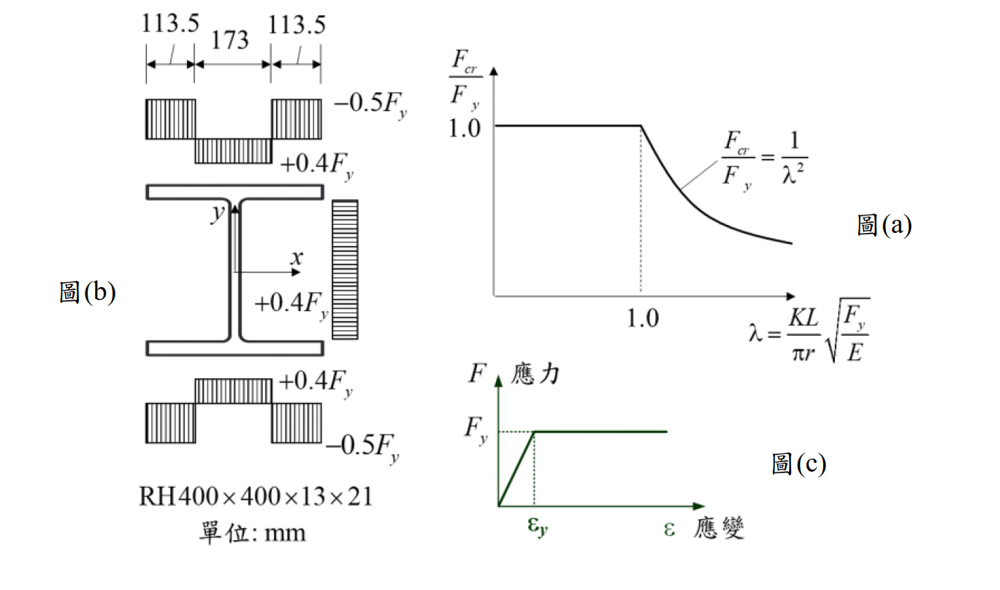

# 考題編號：SS-2024-1

**主分類：** `SS-U1-1` 拉力及壓力桿件
**設計法：** LRFD
**標籤：** `壓力桿件` `殘留應力` `切線模數` `柱強度曲線` `非彈性挫屈` `彈性挫屈` `有效慣性矩` `塊狀殘留應力` `強軸挫屈`

---

## 1. 原始題目重述 (Problem Restatement)

斷面 RH400×400×13×21，殘留應力分布如下（翼板寬度分三段）：

| 翼板分區 | 寬度 | 殘留應力 |
|---------|------|---------|
| 外側兩端 | 各 113.5 mm | $-0.5F_y$（壓） |
| 中央段 | 173 mm | $+0.4F_y$（拉） |

腹板亦有殘留應力（拉），但對強軸 $I_x$ 貢獻遠小於翼板，以翼板為主。

已知：$I_x = 66{,}600\text{ cm}^4$，$I_y = 22{,}400\text{ cm}^4$，鋼材完全彈塑性。

**子問題：** 繪製強軸（x軸）挫屈方向之 $F_{cr}/F_y$ ~ $\lambda$ 曲線，標示函數方程式與轉折點。

參考公式：$\lambda = \dfrac{KL}{\pi r}\sqrt{\dfrac{F_y}{E}}$



*圖說：左側圖(b) RH400×400×13×21 翼板殘留應力分布（塊狀模型）：外側各113.5mm 為 $-0.5F_y$，中央173mm 及腹板為 $+0.4F_y$。右上圖(a) Euler 彈性挫屈曲線參考。右下圖(c) 完全彈塑性應力-應變關係。*

---

## 2. 考題核心精神與出題者意圖 (Core Concepts & Examiner's Intent)

**核心觀念：殘留應力對柱強度曲線的影響**

本題要求考生利用切線模數理論，推導具塊狀殘留應力模型的柱強度曲線。測驗考生能否正確建立「殘留應力 → 有效慣性矩 → 非彈性挫屈強度」的完整推導鏈，並理解塊狀分布模型造成的不連續跳躍現象。

**出題者測驗重點：**

- **塊狀殘留應力模型**：翼板外側段殘留壓應力均勻分布 $-0.5F_y$，所有纖維同時降伏（與拋物線分布的差異）
- **切線模數理論**：降伏區段剛度歸零 → 有效慣性矩 $I_e < I_x$，非彈性 Euler 公式替換 $I_x$
- **三段曲線形狀**：壓潰段（水平）→ 非彈性段（$I_e/I_x \cdot \lambda^{-2}$）→ 彈性段（$\lambda^{-2}$）
- **不連續跳躍**：$\lambda = \sqrt{2}$ 處非彈性分支（0.243）低於彈性分支（0.500），曲線出現跳躍

---

## 3. 解題戰略地圖與陷阱分析 (Strategic Roadmap & Trap Analysis)

**作戰計畫：**
```
Step 1  降伏啟始點：外側殘留壓應力 −0.5Fy → F = 0.5Fy 時降伏 → λ₂ = √2 = 1.414
Step 2  有效慣性矩：4個外翼板塊 ΔI 從 Ix 移除 → Ie/Ix = 0.486
Step 3  三段公式：壓潰 / 非彈性 / 彈性
Step 4  轉折點：λ₁ = 0.697，λ₂ = 1.414；標示 B/B' 不連續跳躍
```

**陷阱分析：**

| 陷阱 | 說明 | 對策 |
|------|------|------|
| ❶ 非彈性段公式 | 需從 Euler 公式代換 $I_e$，推導 $F_{cr}/F_y = (I_e/I_x)/\lambda^2$ | 從 $F_{cr} = \pi^2 E I_e/(KL)^2 A$ 出發 |
| ❷ 跳躍不連續點 | $\lambda=\sqrt{2}$ 處非彈性值（0.243）< 彈性值（0.500），以彈性為準 | 圖中標示 B/B' 跳躍 |
| ❸ 腹板可忽略 | 腹板拉伸殘留應力對強軸 $I_x$ 貢獻小 | 只移除 4 個外翼板塊的 $\Delta I$ |
| ❹ 中央翼板不降伏 | 中央 $+0.4F_y$ 拉伸，需外加 $1.4F_y > F_y$ 才降伏 | 驗算排除 |

---

## 3.5 變數層次分析（Variable Hierarchy Analysis）

> 複習提示：解題後，在每個卡住的知識點「卡關?」欄標記 `⚠`；第二次複習時只看有 `⚠` 的項目。

**最終目標：** 建立具塊狀殘留應力之 RH400 柱的三段 $F_{cr}/F_y \sim \lambda$ 挫屈強度曲線，標示轉折點與不連續跳躍

### 主要公式（$\boxed{\phantom{x}}$ = 未知，待推導）

**Step 1：降伏啟始點**
$$F + 0.5F_y = F_y \Rightarrow F_{cr}/F_y = 0.5 \Rightarrow \boxed{\lambda_2} = \sqrt{2}$$

**Step 2：有效慣性矩**
$$\boxed{\Delta I_{one}} = \frac{b_{out} t_f^3}{12} + b_{out} t_f \bar{y}_f^2, \quad \boxed{I_e} = I_x - 4\boxed{\Delta I_{one}}$$

**Step 3：三段公式**
$$\frac{F_{cr}}{F_y} = \begin{cases} 1.0 & \lambda \leq \boxed{\lambda_1} \\ \dfrac{\boxed{I_e/I_x}}{\lambda^2} & \boxed{\lambda_1} \leq \lambda \leq \boxed{\lambda_2} \\ \dfrac{1}{\lambda^2} & \lambda \geq \boxed{\lambda_2} \end{cases}$$

**Step 4：轉折點**
$$\boxed{\lambda_1} = \sqrt{I_e/I_x} = 0.697, \quad \boxed{\lambda_2} = \sqrt{2} = 1.414$$

### L1：題目直接給定

| 符號 | 數值 | 說明 |
|------|------|------|
| 斷面 | RH400×400×13×21 | H=400mm, b=400mm, tw=13mm, tf=21mm |
| $b_{out}$ | 113.5 mm（11.35 cm） | 翼板外側降伏段寬（每邊） |
| $b_{mid}$ | 173 mm | 翼板中央段寬 |
| 殘留應力（外側） | $-0.5F_y$ | 壓縮殘留應力（外側兩端） |
| 殘留應力（中央） | $+0.4F_y$ | 拉伸殘留應力（中央段） |
| $I_x$ | 66,600 cm⁴ | 強軸慣性矩（直接給定） |
| $I_y$ | 22,400 cm⁴ | 弱軸慣性矩（直接給定） |
| 材料 | 完全彈塑性 | $E_t = 0$（降伏後剛度歸零） |
| $\lambda$ 公式 | $\dfrac{KL}{\pi r}\sqrt{\dfrac{F_y}{E}}$ | 題目提供 |

### L2：需知識點推導

**步驟一：降伏啟始點（彈性→非彈性轉折）**

| 符號 | 公式 / 來源 | 卡關? |
|------|------------|:-----:|
| 降伏條件 | $F + 0.5F_y = F_y \Rightarrow F = 0.5F_y$ | |
| $\lambda_2$ | $0.5 = 1/\lambda_2^2 \Rightarrow \lambda_2 = \sqrt{2} = 1.414$ | |

**步驟二：有效慣性矩 $I_e$**

| 符號 | 公式 / 來源 | 卡關? |
|------|------------|:-----:|
| $\bar{y}_f$ | $(H - t_f)/2 = (40-2.1)/2 = 18.95$ cm | |
| $\Delta I_\text{one}$ | $\frac{1}{12}(11.35)(2.1)^3 + 23.84 \times 18.95^2 = 8{,}566$ cm⁴ | |
| $I_e$ | $66{,}600 - 4 \times 8{,}566 = 32{,}337$ cm⁴ | |
| $I_e/I_x$ | $32{,}337/66{,}600 = 0.486$ | |

**步驟三：三段挫屈公式**

| 符號 | 公式 / 來源 | 卡關? |
|------|------------|:-----:|
| 彈性段 | $F_{cr}/F_y = 1/\lambda^2$（$\lambda \geq \sqrt{2}$） | |
| 非彈性段 | $F_{cr}/F_y = 0.486/\lambda^2$ | |
| 壓潰段 | $F_{cr}/F_y = 1.0$（$\lambda \leq 0.697$） | |

**步驟四：轉折點座標**

| 符號 | 公式 / 來源 | 卡關? |
|------|------------|:-----:|
| $\lambda_1$ | $1 = 0.486/\lambda_1^2 \Rightarrow \lambda_1 = 0.697$ | |
| B點（非彈性下端） | $\lambda=1.414$，$F_{cr}/F_y = 0.243$ | |
| B'點（彈性起點） | $\lambda=1.414$，$F_{cr}/F_y = 0.500$（跳躍） | |

### L3：深層知識（不懂就卡住）

| 知識點 | 說明 | 補強頁 | 卡關? |
|--------|------|:------:|:-----:|
| 切線模數理論 | 降伏區域 $E_t = 0$，有效慣性矩 $I_e$ 排除降伏塊的貢獻 | [[TANGENT-MODULUS-THEORY]] · [[COLUMN-STRENGTH-CURVE]] | |
| $I_e$ 代入 Euler | $F_{cr} = \pi^2 E I_e/(KL)^2 A$，化簡為 $(I_e/I_x)/\lambda^2$ | [[TANGENT-MODULUS-THEORY]] | |
| 塊狀殘留應力的跳躍 | 外側段同時降伏，$\lambda=\sqrt{2}$ 處曲線跳躍；拋物線分布則連續 | [[RESIDUAL-STRESS]] · [[COLUMN-STRENGTH-CURVE]] | |
| 跳躍處取較高值 | 彈性值（0.5）> 非彈性值（0.243），以彈性 Euler 為準 | [[COLUMN-STRENGTH-CURVE]] | |

---

## 4. 步驟化詳細計算過程 (Step-by-Step Calculation)

### 步驟一：確定降伏啟始應力

翼板外側 $-0.5F_y$ 殘留壓應力，外加壓應力 $F$ 滿足：

$$F + 0.5F_y = F_y \quad \Rightarrow \quad F = 0.5F_y$$

→ **降伏啟始點：$F_{cr}/F_y = 0.5$，對應 $\lambda_2 = \sqrt{2} \approx 1.414$**

翼板中央 $+0.4F_y$ 拉伸殘留，降伏需 $F = 1.4F_y > F_y$，**正常壓縮下不降伏**。

### 步驟二：計算有效慣性矩 $I_e$

| 參數 | 數值 |
|------|------|
| $b_{out}$ | $11.35\text{ cm}$ |
| $t_f$ | $2.1\text{ cm}$ |
| $A_{out}$ | $11.35 \times 2.1 = 23.84\text{ cm}^2$ |
| $\bar{y}_f$ | $(40-2.1)/2 = 18.95\text{ cm}$ |

$$\Delta I_{one} = \frac{1}{12}(11.35)(2.1)^3 + 23.84 \times (18.95)^2 \approx 8.8 + 8{,}557 = 8{,}566\text{ cm}^4$$

$$\Delta I = 4 \times 8{,}566 = 34{,}263\text{ cm}^4; \quad I_e = 66{,}600 - 34{,}263 = 32{,}337\text{ cm}^4$$

$$\frac{I_e}{I_x} = \frac{32{,}337}{66{,}600} = 0.486$$

### 步驟三：三段挫屈公式

**（A）彈性段（$\lambda \geq \sqrt{2}$）：**
$$\frac{F_{cr}}{F_y} = \frac{1}{\lambda^2}$$

**（B）非彈性段（外翼板已降伏，切線模數 $E_t = 0$）：**
$$\frac{F_{cr}}{F_y} = \frac{I_e/I_x}{\lambda^2} = \frac{0.486}{\lambda^2}$$

**（C）壓潰段（$F_{cr} = F_y$）：**
$$1 = \frac{0.486}{\lambda_1^2} \quad \Rightarrow \quad \lambda_1 = \sqrt{0.486} = 0.697$$

### 步驟四：轉折點座標（注意跳躍不連續）

| 轉折點 | $\lambda$ | $F_{cr}/F_y$ | 說明 |
|--------|-----------|-------------|------|
| **A** | $0.697$ | $1.0$ | 壓潰→非彈性 |
| **B**（非彈性下端） | $1.414$ | $0.243$ | $= 0.486/2$ |
| **B'**（彈性起點） | $1.414$ | $0.500$ | $= 1/2$（不連續跳躍） |

在 $\lambda = \sqrt{2}$ 處，曲線有**不連續跳躍**（$0.243 \to 0.500$），這是塊狀均勻殘留應力分布的標誌性特徵。

---

## 5. 結果彙整與驗算 (Summary & Verification)

**挫屈強度曲線完整方程式：**

$$\frac{F_{cr}}{F_y} = \begin{cases} 1.0 & 0 \leq \lambda \leq 0.697 \text{（壓潰）} \\ \dfrac{0.486}{\lambda^2} & 0.697 \leq \lambda \leq 1.414 \text{（非彈性挫屈）} \\ \dfrac{1}{\lambda^2} & \lambda \geq 1.414 \text{（彈性 Euler 挫屈）} \end{cases}$$

**關鍵公式彙整：**

$$I_e = I_x - 4 \times \left[\frac{b_{out} t_f^3}{12} + b_{out} t_f \bar{y}_f^2\right] = 32{,}337\text{ cm}^4, \quad \frac{I_e}{I_x} = 0.486$$

**進階探討：**

AISC LRFD 規範曲線 $0.658^{\lambda^2}$ 隱含拋物線殘留應力分布，曲線平滑；本題塊狀分布則產生跳躍。與無殘留應力理想曲線比較，$0.5F_y$ 殘留壓應力使降伏提前在 $\lambda = \sqrt{2}$ 開始，柱強度顯著降低。
