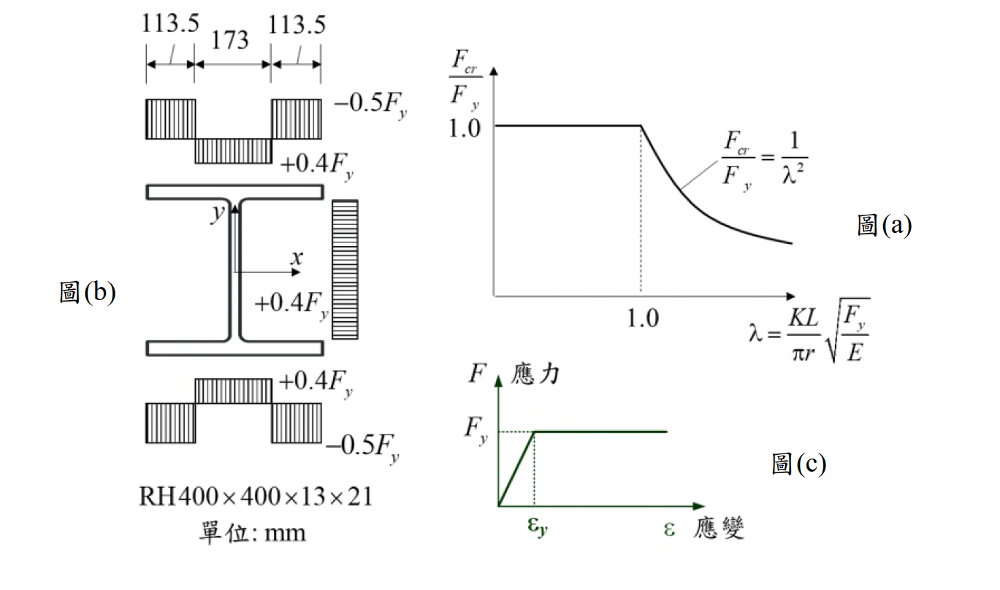

# 考題編號：SS-2024-1

**主分類：** `SS-U1-1` 拉力及壓力桿件
**副分類：** 無
**設計法：** LRFD（本題為**挫屈強度理論推導**，不含 $\phi$ 折減）
**標籤：** `壓力桿件` `殘留應力` `切線模數` `柱強度曲線` `非彈性挫屈` `彈性挫屈` `有效慣性矩` `塊狀殘留應力` `強軸挫屈` `強度平台段`

---

## 1. 原始題目重述 (Problem Restatement)

型鋼桿件中若存在殘餘應力可能導致桿件軸向壓力強度下降。在無殘餘應力之理想狀態下，桿件之挫屈強度曲線可由 $\dfrac{F_{cr}}{F_y}$ 對應 $\lambda = \dfrac{KL}{\pi r}\sqrt{\dfrac{F_y}{E}}$ 如圖 (a) 所示。

試考慮一斷面為 **RH400×400×13×21** 之受壓桿件，假設其斷面因製程過程所導致之殘餘應力分布如圖 (b) 所示，包含**殘餘壓應力 $0.5F_y$** 及**殘餘拉應力 $0.4F_y$**。假設其鋼材之應力–應變關係為**完全彈塑性**（圖 c），而斷面之慣性矩 $I_x = 66{,}600$ cm⁴、$I_y = 22{,}400$ cm⁴。

針對此具殘餘應力影響之受壓桿件，繪製該斷面**強軸（$x$ 軸）挫屈方向**之挫屈強度曲線圖（$\dfrac{F_{cr}}{F_y}\sim\lambda$ 圖），圖中須標註**曲線之函數方程式**，並標註圖中**轉折點之坐標數值**。（25 分）

**殘餘應力分布（圖 b，單位 mm）：**

| 部位 | 寬度／高度 | 殘餘應力 |
|:---|:---|:---|
| 上、下翼板**外側兩端** | 各 113.5 mm（共 4 塊） | $-0.5F_y$（壓） |
| 上、下翼板**中央段** | 173 mm | $+0.4F_y$（拉） |
| **腹板**（全高） | $400 - 2(21) = 358$ mm | $+0.4F_y$（拉） |

*自平衡驗算：* 翼板 $2 \times 21 \times [2(113.5)(-0.5) + 173(+0.4)] = -1{,}861$ mm²·$F_y$；腹板 $358 \times 13 \times (+0.4) = +1{,}862$ mm²·$F_y$，合計 $\approx 0$ ✓（確認題目給的分布是自平衡的）

**參考公式（考卷提供，並註明「僅供參考應自負確認與勘誤責任」）：**

$$\lambda = \frac{KL}{\pi r}\sqrt{\frac{F_y}{E}},\qquad \frac{F_{cr}}{F_y} = \frac{1}{\lambda^2},\quad \frac{F_{cr}}{F_y} = 1-\frac{\lambda^2}{4},\quad \frac{F_{cr}}{F_y} = 0.658^{\lambda^2},\quad \frac{F_{cr}}{F_y} = \frac{0.877}{\lambda^2}$$



*圖說：圖(b) RH400×400×13×21 斷面（$x$ 軸為強軸、水平；$y$ 軸為弱軸、垂直），翼板寬 400 mm 分為 113.5＋173＋113.5 三段，外側兩段標 $-0.5F_y$（壓）、中央段標 $+0.4F_y$（拉）；腹板側面亦標 $+0.4F_y$（拉）。圖(a) 為理想（無殘餘應力）曲線：$\lambda \le 1.0$ 時 $F_{cr}/F_y = 1.0$ 之水平段，$\lambda > 1.0$ 轉為 $F_{cr}/F_y = 1/\lambda^2$ 之 Euler 雙曲線，轉折點在 $(1.0,\ 1.0)$。圖(c) 為完全彈塑性（elastic–perfectly plastic）應力–應變圖，到 $\varepsilon_y$ 後應力恆為 $F_y$。*

---

## 2. 考題核心精神與出題者意圖 (Core Concepts & Examiner's Intent)

**核心觀念：完全彈塑性 ＋ 塊狀殘餘應力 ⇒ 有效慣性矩「階梯式」驟降 ⇒ 強度曲線出現一段「強度平台」。**

推導鏈：

```
殘餘壓應力 0.5Fy
  → 平均應力達 0.5Fy 時，外側 4 塊「同時」降伏（塊狀分布的特徵）
  → 完全彈塑性 ⇒ 降伏區 Et = 0 ⇒ 有效慣性矩 Ie = Ix − ΔI(外側4塊)
  → 非彈性挫屈 Fcr = π²E·Ie /[A(KL)²] ⇒ Fcr/Fy = (Ie/Ix)/λ²
  → 每個分支只在「與自身假設一致」的應力區間內成立
  → 兩分支都不成立的區間 ⇒ 強度被鎖在 0.5Fy（平台段）
```

**出題者測驗重點：**

1. 由殘餘壓應力 $0.5F_y$ 判出**比例限 $F_p = 0.5F_y$**，並算出對應的 $\lambda = \sqrt{2}$
2. 由「強軸」二字判斷降伏區在翼板**外側**（對 $I_x$ 貢獻大，$\propto$ 寬度 × 力臂²），使 $I_e/I_x$ 掉到約 0.49
3. **每個分支的有效區間**：這是本題真正的難點（見 §5.1），也是最容易寫錯的地方
4. 圖上要標函數式與轉折點座標（**三個**轉折點）

---

## 3. 解題戰略地圖與陷阱分析 (Strategic Roadmap & Trap Analysis)

**作戰計畫：**
```
Step 1  比例限：F + 0.5Fy = Fy → Fp = 0.5Fy → 彈性分支下界 λ = √2
Step 2  有效慣性矩：Ie = Ix − 4·ΔI(外側塊) → Ie/Ix ≈ 0.485
Step 3  非彈性分支：Fcr/Fy = 0.485/λ²，僅在 Fcr ≥ 0.5Fy 成立 → λ ≤ 0.985
Step 4  壓潰上限：Fcr/Fy ≤ 1.0 → λ ≥ 0.697 才進入非彈性分支
Step 5  0.985 < λ < 1.414 兩分支皆不成立 → Fcr = 0.5Fy 平台段
Step 6  繪四段曲線 + 標三個轉折點座標
```

**陷阱分析：**

| 陷阱 | 說明 | 對策 |
|------|------|------|
| ❶ **誤畫成「不連續跳躍」** | 若把非彈性分支硬拉到 $\lambda=\sqrt2$，會得到 $0.485/2 = 0.243$，比同點的彈性值 0.5 還低，形成「$\lambda$ 變大、強度反而變大」的跳躍——**物理上不可能**（柱做長不會變強） | 各分支只在與自身假設相容的區間成立；中間以**平台段** $F_{cr} = 0.5F_y$ 銜接 |
| ❷ 非彈性段公式來源 | 需從 Euler 式代換 $I_e$：$F_{cr} = \pi^2EI_e/[A(KL)^2]$，除以 $F_y$ 後化為 $(I_e/I_x)/\lambda^2$ | $\lambda$ 的定義用**實際** $r = \sqrt{I_x/A}$，故比值出現在分子 |
| ❸ 強軸 vs 弱軸算法不同 | 強軸：$\Delta I \approx b_{out}t_f\bar y_f^2$（力臂主導，$\propto$ 寬度一次方）；弱軸：$\propto$ 寬度三次方，$I_e/I_y$ 會掉到約 0.08 | 本題只問強軸；弱軸僅供比較（§5.4） |
| ❹ 中央翼板與腹板會不會降伏 | 兩者殘餘應力為 $+0.4F_y$（拉），需外加 $1.4F_y > F_y$ 才降伏 → **全程保持彈性** | 有效斷面 = 中央翼板 ＋ 全腹板（＋圓弧填角） |
| ❺ 誤用 $1-\lambda^2/4$ 當答案 | 考卷列的 $1-\lambda^2/4$ 是 CRC 經驗拋物線（隱含**線性**殘餘應力分布），與本題**塊狀**分布不同 | 本題須自行推導；CRC 曲線僅作對照（§5.3） |

## 3.5 變數層次分析（Variable Hierarchy Analysis）

> 複習提示：解題後，在每個卡住的知識點「卡關?」欄標記 `⚠`；第二次複習時只看有 `⚠` 的項目。

**最終目標：** 建立具塊狀殘餘應力之 RH400×400 柱、強軸方向的 $F_{cr}/F_y \sim \lambda$ 四段強度曲線，並標出三個轉折點座標

### 主要公式（$\boxed{\phantom{x}}$ = 未知，待推導）

**Step 1：比例限與彈性分支下界**

$$F_p + 0.5F_y = F_y \;\Rightarrow\; \frac{F_p}{F_y} = 0.5 \;\Rightarrow\; \frac{1}{\boxed{\lambda_3}^2} = 0.5 \;\Rightarrow\; \boxed{\lambda_3} = \sqrt{2}$$

**Step 2：有效慣性矩（降伏區 $E_t = 0$）**

$$\boxed{\Delta I_{one}} = \frac{b_{out}t_f^3}{12} + b_{out}t_f\,\bar y_f^{\,2},\qquad \boxed{I_e} = I_x - 4\,\boxed{\Delta I_{one}}$$

**Step 3：非彈性分支及其有效區間**

$$\frac{F_{cr}}{F_y} = \frac{\boxed{I_e/I_x}}{\lambda^2}\quad\text{（僅當 } F_{cr} \ge 0.5F_y\text{，即 }\lambda \le \boxed{\lambda_2}\text{）}$$

$$\boxed{\lambda_1} = \sqrt{\boxed{I_e/I_x}}\ \ (F_{cr}=F_y),\qquad \boxed{\lambda_2} = \sqrt{\frac{\boxed{I_e/I_x}}{0.5}}\ \ (F_{cr}=0.5F_y)$$

**Step 4：四段曲線**

$$\frac{F_{cr}}{F_y} = \begin{cases}
1.0, & 0 \le \lambda \le \boxed{\lambda_1} \\[4pt]
\dfrac{\boxed{I_e/I_x}}{\lambda^2}, & \boxed{\lambda_1} \le \lambda \le \boxed{\lambda_2} \\[4pt]
0.5, & \boxed{\lambda_2} \le \lambda \le \boxed{\lambda_3} \\[4pt]
\dfrac{1}{\lambda^2}, & \lambda \ge \boxed{\lambda_3}
\end{cases}$$

### L1：題目直接給定

_看到題目就能讀出的數字，不需要任何公式。_

| 符號 | 數值 | 說明 |
|:---:|:---|:---|
| 斷面 | RH400×400×13×21 | $H$=400、$b_f$=400、$t_w$=13、$t_f$=21 mm |
| $b_{out}$ | 113.5 mm = 11.35 cm | 翼板外側降伏段寬（每邊，共 4 塊） |
| $b_{mid}$ | 173 mm = 17.3 cm | 翼板中央段寬 |
| $\sigma_r$（翼板外側） | $-0.5F_y$ | 殘餘**壓**應力 |
| $\sigma_r$（翼板中央、腹板） | $+0.4F_y$ | 殘餘**拉**應力 |
| $I_x$ | 66,600 cm⁴ | 強軸慣性矩 |
| $I_y$ | 22,400 cm⁴ | 弱軸慣性矩（本題不用，僅供比較） |
| 材料 | 完全彈塑性 | 降伏後 $E_t = 0$ |
| $\lambda$ 定義 | $\dfrac{KL}{\pi r}\sqrt{\dfrac{F_y}{E}}$ | 考卷提供；$r = \sqrt{I_x/A}$ 為**實際**斷面性質 |

### L2：需知識點推導

_需要知道公式名稱與適用條件，套入 L1 即可算出。_

**第一階段：降伏啟始（比例限）**

| 符號 | 公式／來源 | 卡關? |
|:---:|:---|:---|
| $F_p$ | 外側殘餘壓應力最大 $0.5F_y$ → $F_p = F_y - 0.5F_y = 0.5F_y$ | |
| $\lambda_3$ | $1/\lambda_3^2 = 0.5 \Rightarrow \lambda_3 = \sqrt{2} = 1.414$ | |
| 中央段／腹板 | $+0.4F_y$ 拉 → 需 $1.4F_y$ 才降伏 → 全程彈性 | |

**第二階段：有效慣性矩**

| 符號 | 公式／來源 | 卡關? |
|:---:|:---|:---|
| $\bar y_f$ | $(H-t_f)/2 = (40-2.1)/2 = 18.95$ cm | |
| $A_{out}$ | $11.35 \times 2.1 = 23.84$ cm² | |
| $\Delta I_{one}$ | $\frac{1}{12}(11.35)(2.1)^3 + 23.84(18.95)^2 = 8{,}568$ cm⁴ | |
| $I_e$ | $66{,}600 - 4(8{,}568) = 32{,}330$ cm⁴ | |
| $I_e/I_x$ | $32{,}330/66{,}600 = 0.485$ | |

**第三階段：三個轉折點**

| 符號 | 公式／來源 | 卡關? |
|:---:|:---|:---|
| $\lambda_1$ | $0.485/\lambda_1^2 = 1.0 \Rightarrow \lambda_1 = \sqrt{0.485} = 0.697$ | |
| $\lambda_2$ | $0.485/\lambda_2^2 = 0.5 \Rightarrow \lambda_2 = \sqrt{0.970} = 0.985$ | |
| $\lambda_3$ | $1/\lambda_3^2 = 0.5 \Rightarrow \lambda_3 = \sqrt{2} = 1.414$ | |

### L3：深層知識（不懂就卡住）

| 知識點 | 說明 | 補強頁 | 卡關? |
|:---|:---|:---:|:---|
| 切線模數／有效斷面理論 | 完全彈塑性材料的降伏區 $E_t = 0$，等於「把降伏塊從斷面上挖掉」再算 Euler | [[TANGENT-MODULUS-THEORY]] · [[COLUMN-STRENGTH-CURVE]] | |
| $I_e$ 代入 Euler 的化簡 | $F_{cr} = \pi^2EI_e/[A(KL)^2] = (I_e/I_x)\cdot\pi^2E/(KL/r)^2$，除 $F_y$ 得 $(I_e/I_x)/\lambda^2$ | [[TANGENT-MODULUS-THEORY]] | |
| **分支的有效區間** | 彈性分支只在 $F_{cr}\le0.5F_y$ 成立；非彈性分支只在 $F_{cr}\ge0.5F_y$ 成立；中間由平台 $0.5F_y$ 補上 | [[COLUMN-STRENGTH-CURVE]] | |
| 強度曲線必須單調不遞增 | $F_{cr}$ 隨 $\lambda$ 增加不得上升（柱做長不會變強）——可用來自我檢查有沒有畫錯 | [[COLUMN-STRENGTH-CURVE]] | |
| 塊狀 vs 線性殘餘應力分布 | 塊狀 → 外側整塊同時降伏 → 剛度階梯式驟降 → 出現平台段；線性（拋物線）→ 逐漸降伏 → 平滑（即 CRC $1-\lambda^2/4$） | [[RESIDUAL-STRESS]] | |
| 強軸與弱軸的敏感度差異 | 強軸 $\Delta I \propto b\,\bar y^2$（削 51%）；弱軸 $\Delta I \propto b^3$（削 92%）→ 殘餘應力對弱軸殺傷力大得多 | [[RESIDUAL-STRESS]] | |

---

## 4. 步驟化詳細計算過程 (Step-by-Step Calculation)

> 📊 互動圖：[柱強度曲線（含殘餘應力）SS-2024-1-column-curve-viz.html](SS-2024-1-column-curve-viz.html)

### 步驟一：確定降伏啟始應力（比例限）

翼板外側 4 塊之殘餘應力為 $-0.5F_y$（壓）。外加平均壓應力 $F$ 時，該處總應力 $= F + 0.5F_y$，達 $F_y$ 即降伏：

$$F + 0.5F_y = F_y \quad \Rightarrow \quad \boxed{F_p = 0.5F_y}$$

**塊狀分布的關鍵特徵：** 外側 4 塊的殘餘應力**均勻**為 $-0.5F_y$，因此在 $F = 0.5F_y$ 這一瞬間**整塊同時降伏**（不像拋物線分布是由邊緣逐步向內推進）。

**中央翼板與腹板：** 殘餘應力 $+0.4F_y$（拉），降伏需 $F = F_y + 0.4F_y = 1.4F_y > F_y$，在軸壓下**永不降伏**，全程保持彈性。

---

### 步驟二：計算有效慣性矩 $I_e$（強軸）

| 參數 | 數值 |
|:---|:---|
| $b_{out}$ | 11.35 cm |
| $t_f$ | 2.1 cm |
| $A_{out} = b_{out}t_f$ | 23.84 cm² |
| $\bar y_f = (H - t_f)/2$ | $(40 - 2.1)/2 = 18.95$ cm |

單一外側塊對 $x$ 軸的慣性矩貢獻：

$$\Delta I_{one} = \frac{b_{out}t_f^3}{12} + A_{out}\bar y_f^{\,2} = \frac{(11.35)(2.1)^3}{12} + 23.84(18.95)^2 = 8.8 + 8{,}559 = 8{,}568 \ \text{cm}^4$$

4 塊（上下翼板 × 左右兩側）合計扣除：

$$\Delta I = 4 \times 8{,}568 = 34{,}272 \ \text{cm}^4$$

$$\boxed{I_e = I_x - \Delta I = 66{,}600 - 34{,}272 = 32{,}328 \approx 32{,}330 \ \text{cm}^4}$$

$$\boxed{\frac{I_e}{I_x} = \frac{32{,}330}{66{,}600} = 0.485}$$


*圖 2　被挖掉的 4 塊正好位於力臂最長的翼板外側，$\Delta I$ 的主項是 $b\,t_f\,y_f^2$，所以強軸剛度一口氣掉到 $I_e/I_x = 0.485$。**攔錯：** 誤以為中央翼板或腹板也會降伏（它們是殘餘拉應力，需 $1.4F_y$ 才降伏，全程彈性），或把強軸的扣除量按弱軸的 $b^3$ 方式算。*


> **策略註解：** 用**題目給的** $I_x = 66{,}600$ 扣除降伏塊，而非自行重算全斷面。理由：翼腹交會的圓弧填角位於中央（未降伏）區、全程有效，用給定值扣除才能把它留下來。
> *驗算：* 若完全忽略填角、純以三片矩形板計算，$I_{x,\text{geom}} = 65{,}362$、$I_{e,\text{geom}} = 31{,}090$，比值 $0.476$——與 0.485 相差 2%，不影響曲線形狀與結論。

---

### 步驟三：兩條挫屈分支及其**有效區間**（本題核心）

**（A）彈性分支（全斷面有效）**

$$\frac{F_{cr}}{F_y} = \frac{1}{\lambda^2}\qquad \text{成立條件：}F_{cr}\le F_p = 0.5F_y \;\Rightarrow\; \lambda \ge \sqrt{2} = 1.414$$

**（B）非彈性分支（外側 4 塊已降伏，$E_t = 0$）**

$$F_{cr} = \frac{\pi^2 E I_e}{A(KL)^2} = \frac{I_e}{I_x}\cdot\frac{\pi^2E}{(KL/r)^2} \;\Rightarrow\; \frac{F_{cr}}{F_y} = \frac{I_e/I_x}{\lambda^2} = \frac{0.485}{\lambda^2}$$

成立條件：平均應力必須**已經超過** $0.5F_y$（否則外側塊還沒降伏、應該用全斷面）：

$$\frac{0.485}{\lambda^2} \ge 0.5 \;\Rightarrow\; \lambda \le \sqrt{\frac{0.485}{0.5}} = \sqrt{0.970} = \boxed{0.985}$$

再受壓潰上限 $F_{cr} \le F_y$ 約束：

$$\frac{0.485}{\lambda^2} \le 1.0 \;\Rightarrow\; \lambda \ge \sqrt{0.485} = \boxed{0.697}$$

**（C）平台段（$0.985 < \lambda < 1.414$）：兩分支都不成立**

在此區間：

- 用彈性分支算：$1/\lambda^2 > 0.5$ → 但應力若真超過 $0.5F_y$，外側塊必已降伏，「全斷面有效」假設**自相矛盾**
- 用非彈性分支算：$0.485/\lambda^2 < 0.5$ → 但應力若低於 $0.5F_y$，外側塊尚未降伏，「$E_t = 0$」假設**自相矛盾**

實際加載過程：柱在 $F < 0.5F_y$ 時全斷面彈性，$1/\lambda^2 > F/F_y$ 故不挫屈，可持續加載；一旦 $F$ 達 $0.5F_y$，外側 4 塊瞬間降伏、勁度掉到 $I_e$，此時可用挫屈容量 $0.485F_y/\lambda^2 < 0.5F_y = $ 當下應力 → **立刻失穩**。故此區間之極限強度恰為比例限：

$$\boxed{\frac{F_{cr}}{F_y} = 0.5 \quad (0.985 \le \lambda \le 1.414)}$$

**（D）壓潰段（$\lambda \le 0.697$）**

$$\frac{F_{cr}}{F_y} = 1.0$$

---

### 步驟四：轉折點座標

| 轉折點 | $\lambda$ | $F_{cr}/F_y$ | 意義 |
|:---:|:---:|:---:|:---|
| **A** | $\lambda_1 = \sqrt{0.485} = 0.697$ | 1.000 | 壓潰段 → 非彈性段 |
| **B** | $\lambda_2 = \sqrt{0.485/0.5} = 0.985$ | 0.500 | 非彈性段 → 平台段 |
| **C** | $\lambda_3 = \sqrt{2} = 1.414$ | 0.500 | 平台段 → 彈性 Euler 段 |

三點皆**連續**（B、C 的 $F_{cr}/F_y$ 同為 0.500），整條曲線單調不遞增 ✓


*圖 3　四段曲線與三個轉折點座標，並把常見的錯誤畫法一併畫上做對照。**攔錯：** 把非彈性分支 $0.485/\lambda^2$ 硬拉到 $\lambda = \sqrt2$（得 0.243）再跳回 0.500——圖上一眼可見那條紅線讓「$\lambda$ 變大、強度反而變大」，違反柱強度隨 $\lambda$ 單調不遞增。*


---

### 步驟五：完整曲線方程式（作答用）

$$\frac{F_{cr}}{F_y} = \begin{cases}
1.0, & 0 \le \lambda \le 0.697 \quad \text{（壓潰）}\\[6pt]
\dfrac{0.485}{\lambda^2}, & 0.697 \le \lambda \le 0.985 \quad \text{（非彈性挫屈，}I_e\text{ 有效）}\\[6pt]
0.5, & 0.985 \le \lambda \le 1.414 \quad \text{（強度平台，殘餘應力控制）}\\[6pt]
\dfrac{1}{\lambda^2}, & \lambda \ge 1.414 \quad \text{（彈性 Euler 挫屈）}
\end{cases}$$

**與理想（無殘餘應力）曲線的比較：**

| $\lambda$ | 理想曲線 $F_{cr}/F_y$ | 本題（含殘餘應力） | 折減 |
|:---:|:---:|:---:|:---:|
| 0.70 | 1.000 | 0.990 | −1% |
| 0.85 | 1.000 | 0.671 | −33% |
| 1.00 | 1.000 | 0.500 | −50% |
| 1.20 | 0.694 | 0.500 | −28% |
| 1.414 | 0.500 | 0.500 | 0% |
| 2.00 | 0.250 | 0.250 | 0% |

**結論：** 殘餘應力的殺傷力集中在**中等細長比**（$\lambda \approx 0.7\sim1.4$，即實務上最常見的柱），最嚴重處折減達 50%；極短柱（壓潰控制）與極長柱（彈性挫屈控制）皆不受影響。

---

## 5. 關鍵爭議點與進階探討 (Critical Issues & Advanced Discussion)

### 5.1 為什麼不是「不連續跳躍」？（本題最易錯處）

一種常見寫法是把非彈性分支硬拉到 $\lambda = \sqrt{2}$，得

$$\left.\frac{F_{cr}}{F_y}\right|_{\lambda=\sqrt2} = \frac{0.485}{2} = 0.243 \quad\text{vs.}\quad \left.\frac{1}{\lambda^2}\right|_{\lambda=\sqrt2} = 0.500$$

然後宣稱「曲線在 $\lambda=\sqrt2$ 處由 0.243 跳到 0.500」。**這是錯的**，理由有三：

1. **違反單調性。** 柱強度曲線必須隨 $\lambda$ 單調不遞增。若 $\lambda = 1.40$ 時強度 0.247、$\lambda = 1.45$ 時強度 0.476，代表「柱做長一點反而變強」——物理上不可能。
2. **分支被用超出適用範圍。** $0.485/\lambda^2$ 的前提是「外側塊已降伏」，即當下應力 $\ge 0.5F_y$。當 $\lambda > 0.985$ 時該式算出的值已低於 $0.5F_y$，前提不成立。
3. **同一 $\lambda$ 不會有兩個強度值。** 一根給定的柱只有一個極限強度；$\lambda=\sqrt2$ 處的正確值是 0.500（平台段與 Euler 段在此相接）。

**正確的圖形特徵**應描述為：塊狀（均勻）殘餘應力使**剛度階梯式驟降**，因而在強度曲線上留下一段**水平平台** $F_{cr} = F_p = 0.5F_y$（$\lambda$ 自 0.985 至 1.414），而不是跳躍。平台的存在正是「整塊同時降伏」的指紋。

### 5.2 平台段的長度由 $I_e/I_x$ 決定

平台區間為 $\left[\sqrt{2(I_e/I_x)},\ \sqrt{2}\right]$，長度隨 $I_e/I_x$ 減小而變長：

| $I_e/I_x$ | 平台起點 $\lambda_2$ | 平台長度 |
|:---:|:---:|:---:|
| 1.00（無殘餘應力） | 1.414 | 0（無平台） |
| 0.485（本題強軸） | 0.985 | 0.429 |
| 0.081（本題弱軸，見 §5.4） | 0.403 | 1.011 |

極端情形 $I_e/I_x \to 0$ 時，平台自 $\lambda = 0$ 一路延伸到 $\sqrt2$，強度上限被殘餘應力完全鎖在 $0.5F_y$。

### 5.3 與規範曲線的對照（含最新規範）

| 曲線 | 方程式 | 隱含的殘餘應力假設 | 轉折點 |
|:---|:---|:---|:---|
| 本題（塊狀，強軸） | 1.0 ／ $0.485/\lambda^2$ ／ 0.5 ／ $1/\lambda^2$ | 塊狀 $0.5F_y$，外側整塊同時降伏 | (0.697, 1.0)、(0.985, 0.5)、(1.414, 0.5) |
| CRC 拋物線（考卷所列） | $1-\lambda^2/4$（$\lambda\le\sqrt2$） | 最大殘餘壓應力 $0.5F_y$，**線性**分布、逐步降伏 | (1.414, 0.5)，與 Euler 相切 |
| 台灣現行規範／AISC 舊 LRFD | $0.658^{\lambda^2}$（$\lambda\le1.5$）；$0.877/\lambda^2$（$\lambda>1.5$） | SSRC Curve 2P，含殘餘應力＋初始彎曲＋統計折減 | (1.5, 0.404) |
| AISC 360-16／-22（E3） | $\left[0.658^{F_y/F_e}\right]F_y$（$KL/r \le 4.71\sqrt{E/F_y}$）；$0.877F_e$ | 同上（**與 $0.658^{\lambda^2}$ 完全相同**，因 $F_y/F_e \equiv \lambda^2$） | 等價於 $\lambda = 1.5$ |

**依最新規範的說明：**

- AISC 360-16／-22 把判準由 $\lambda_c \le 1.5$ 改寫為 $KL/r \le 4.71\sqrt{E/F_y}$，兩者**數學上等價**（$1.5\pi = 4.712$），$F_{cr}$ 公式本身**未改**。
- 真正改變的是**強度折減係數：$\phi_c$ 由 0.85 提高為 0.90**（AISC 360-05 起）。台灣現行「鋼構造建築物鋼結構設計技術規範」（民國 99 年版）仍為 $\phi_c = 0.85$；參照 AISC 360-16 之修正草案已完成研究但尚未發布施行。
- 本題只問**標稱**挫屈強度曲線（$F_{cr}/F_y$），不涉及 $\phi_c$，故新舊規範對本題答案**無影響**。

### 5.4 若改問弱軸（$y$ 軸），答案差多少？

弱軸慣性矩以翼板寬度的**三次方**計算，削掉外側後：

$$I_y = 2\cdot\frac{t_f b_f^3}{12} + \frac{(H-2t_f)t_w^3}{12} = 2\cdot\frac{2.1(40)^3}{12} + 6.6 = 22{,}407 \ \text{cm}^4 \ (\approx 22{,}400\ \checkmark)$$

$$I_{e,y} = 2\cdot\frac{t_f b_{mid}^3}{12} + 6.6 = 2\cdot\frac{2.1(17.3)^3}{12} + 6.6 = 1{,}819 \ \text{cm}^4 \;\Rightarrow\; \frac{I_{e,y}}{I_y} = 0.081$$

轉折點變為 $\lambda_1 = \sqrt{0.081} = 0.285$、$\lambda_2 = \sqrt{0.162} = 0.403$、$\lambda_3 = 1.414$——平台段長達 1.011，幾乎整個實用範圍都被鎖在 $0.5F_y$。

**這就是為什麼規範的柱曲線採「偏弱軸」的保守值**：殘餘應力對弱軸的破壞遠大於強軸，而實務上柱多由弱軸控制。

### 5.5 考場作答的最短路徑

1. 寫 $F_p = F_y - 0.5F_y = 0.5F_y$，得 $\lambda_3 = \sqrt2$
2. 算 $\Delta I_{one}$（主項就是 $b_{out}t_f\bar y_f^2$）、$I_e/I_x = 0.485$
3. 寫四段式，**明確寫出每段的 $\lambda$ 區間**
4. 畫圖，標 (0.697, 1.0)、(0.985, 0.5)、(1.414, 0.5) 三點，並在平台段旁註「$F_{cr}=F_p=0.5F_y$，外側翼板整塊同時降伏所致」
5. 一句話收尾：殘餘應力使中等細長比柱強度最多折減 50%

*解析完成時間：2026-05-27*
*修正日期：2026-08-22（更正「不連續跳躍」為「強度平台段」，補 $\lambda_2 = 0.985$ 轉折點；同步 `-column-curve-viz.html`）*
*圖解補繪：2026-08-29（向量圖，腳本 `gen_SS-2024-1.py`，可重跑）*
*驗證狀態：unverified*
