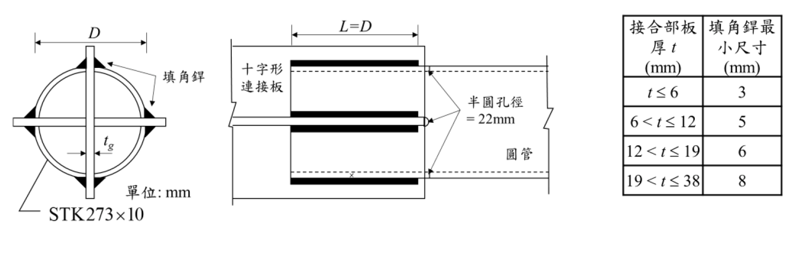

# 考題編號：SS-2024-2

**主分類：** `SS-U1-1` 拉力及壓力桿件
**副分類：** `SS-U1-4` 接合之分析與設計
**設計法：** LRFD
**標籤：** `拉力桿件` `圓管HSS` `縱向填角銲` `剪力遲滯` `U值` `半圓管` `淨截面斷裂` `銲道設計`

---

## 1. 原始題目重述 (Problem Restatement)

STK273×10 圓管（$D = 273\text{ mm}$，$t = 10\text{ mm}$），A500 Grade 50 鋼材，縱向填角銲與十字形連接板相連接。銲道長度 $L = D = 273\text{ mm}$，使用 E70 系列銲條。

**已知：**
- $F_y = 2.3\text{ tf/cm}^2$，$F_u = 3.1\text{ tf/cm}^2$
- $A_g = 82.6\text{ cm}^2$（圓管斷面積）
- $t_g = 20\text{ mm}$（十字形連接板厚）

**參考公式：** $U = 1 - \bar{x}/L$，$\bar{x} = D/\pi$（半圓管），$U = 3L^2/(3L^2+W^2)$

**子問題：**
1. 求拉力桿件之設計強度 $\phi_t T_n$
2. 設計填角銲尺寸



*圖說：左側為 STK273×10 圓管斷面示意（正視），十字形連接板（厚 $t_g$）貫穿圓管中心，沿板邊四個角落各施作一道縱向填角銲（共 4 道）。中間側視圖顯示銲道長度 $L = D = 273\text{ mm}$，管端有半圓孔（直徑 22 mm）作為銲接起弧孔，$\bar{x}$ 標示半圓管形心至銲道面之距離。右側為規範規定之填角銲最小尺寸表：$t \leq 6\text{ mm} \Rightarrow 3\text{ mm}$；$6 < t \leq 12 \Rightarrow 5\text{ mm}$；$12 < t \leq 19 \Rightarrow 6\text{ mm}$；$19 < t \leq 38 \Rightarrow 8\text{ mm}$（本題連接板 $t_g = 20\text{ mm}$，故最小銲腳 = 8 mm）。*

---

## 2. 考題核心精神與出題者意圖 (Core Concepts & Examiner's Intent)

**核心觀念：圓管拉力桿件的剪力遲滯與銲道設計**

本題涵蓋拉力桿件設計的兩個面向：強度驗算（三種極限狀態）與銲道幾何設計。測驗考生對縱向填角銲圓管接頭的特殊幾何（半圓管形心距 $\bar{x} = D/\pi$）及銲腳尺寸上下限同時約束的處理能力。

**出題者測驗重點：**

- **三種極限狀態並行**：GSY（全斷面降伏）、NSF（淨截面斷裂含 $U$ 折減）、BSR（塊狀剪力），以最小值控制
- **半圓管幾何**：十字形連接板將圓管分為兩個半圓截面，形心偏移 $\bar{x} = D/\pi$（非 $D/2$）
- **四道縱向銲**：十字形板有 4 個自由邊，總銲道長 $4L$
- **銲腳三重限制**：所需強度（需求面）、最小銲腳（薄板母材控制）、最大銲腳（管壁控制）同時存在

---

## 3. 解題戰略地圖與陷阱分析 (Strategic Roadmap & Trap Analysis)

**作戰計畫：**
```
甲題（設計強度）：
  Step 1  GSY：φt Tn = 0.9 Fy Ag
  Step 2  NSF：確認 An = Ag（無孔），計算 x̄ = D/π，U = 1-x̄/L，φt Tn = 0.75 U Fu Ag
  Step 3  BSR：此類型接頭以 NSF 控制，BSR 通常不起控制（縱向銲）
  Step 4  取最小值

乙題（銲道設計）：
  Step 5  確認 4 道銲，總長 = 4D = 4×27.3 = 109.2 cm
  Step 6  所需 a：T_u ÷ (φ Rw × 總長)
  Step 7  最小 a：查連接板厚 tg=20mm → 最小 8mm
  Step 8  最大 a：母材剪力強度限制，a ≤ t×0.6Fu/φRw_per_cm
  Step 9  取 max(所需, 最小) ≤ 最大 → a = 8 mm
```

**陷阱分析：**

| 陷阱 | 說明 | 對策 |
|------|------|------|
| ❶ $\bar{x}$ 誤用 $D/2$ | 半圓管形心在 $D/\pi \approx 0.318D$（非半徑 $D/2$） | $\bar{x} = D/\pi$；矩形管為 $b/4$（若只有一條邊連接） |
| ❷ 銲道數量算錯 | 十字形板有 4 個自由邊，每邊一道填角銲，共 **4 道** | 正視圖數方塊邊，共 4 道（非 2 道） |
| ❸ $\phi$ 值混用 | 淨截面斷裂用 $\phi_t = 0.75$；全斷面降伏用 $\phi_t = 0.90$ | NSF 和 GSY 用不同 $\phi$ |
| ❹ 最小銲腳查錯 | 最小銲腳取決於**較厚母材**（連接板 $t_g = 20\text{ mm} > $ 管壁 10 mm），查表得 8 mm | 查表時用較厚那片母材（20 mm 對應 8 mm） |
| ❺ 忘記母材剪力限制 | 若 $a$ 過大會使銲道強度超過母材剪力強度，需同時驗算上限 | 上限：$a \leq \phi R_{BM}/(\phi R_w\text{ per }a)$ |

---

## 3.5 變數層次分析（Variable Hierarchy Analysis）

> 複習提示：解題後，在每個卡住的知識點「卡關?」欄標記 `⚠`；第二次複習時只看有 `⚠` 的項目。

**最終目標：** STK273×10 圓管十字形銲接接頭：①求設計拉力強度（GSY/NSF/BSR 三控）②設計填角銲腳尺寸（需求/最小/最大三重限制）

### 主要公式（$\boxed{\phantom{x}}$ = 未知，待推導）

**甲題：設計拉力強度**
$$\phi_t T_{n,GSY} = 0.90 F_y A_g$$
$$\boxed{U} = 1 - \frac{\bar{x}}{L} = 1 - \frac{D/\pi}{D}, \quad \boxed{\phi_t T_{n,NSF}} = 0.75 F_u U A_g$$
$$\boxed{\phi_t T_n} = \min(T_{GSY}, T_{NSF})$$

**乙題：填角銲尺寸**
$$a_{req} = \frac{T_u}{\phi R_w \times 4L}, \quad a_{min}\text{（查表，較厚母材）}, \quad a_{max}\text{（母材剪力限制）}$$
$$\boxed{a} = \max(a_{req}, a_{min}) \leq a_{max}$$

### L1：題目直接給定

| 符號 | 數值 | 說明 |
|------|------|------|
| $D$ | 273 mm = 27.3 cm | 圓管外徑 |
| $t$ | 10 mm = 1.0 cm | 圓管壁厚 |
| $A_g$ | 82.6 cm² | 圓管毛斷面積 |
| $F_y$ | 2.3 tf/cm² | 降伏強度 |
| $F_u$ | 3.1 tf/cm² | 極限強度 |
| $t_g$ | 20 mm | 十字形連接板厚 |
| $L$ | $D = 27.3$ cm | 銲道長度（縱向）|
| 銲條 | E70 | $F_{EXX} = 49$ tf/cm² |
| 接合形式 | 十字形連接板，縱向填角銲，共 4 道 | |
| $\bar{x}$ 公式 | $D/\pi$（半圓管形心距）| 題目給定參考公式 |

### L2：需知識點推導

**甲題 Step 1：全斷面降伏（GSY）**

| 符號 | 公式 / 來源 | 卡關? |
|------|------------|:-----:|
| $\phi_t T_{n,GSY}$ | $0.90 \times 2.3 \times 82.6 = 171.0$ tf | |

**甲題 Step 2：淨截面斷裂（NSF）含剪力遲滯**

| 符號 | 公式 / 來源 | 卡關? |
|------|------------|:-----:|
| $\bar{x}$ | $D/\pi = 27.3/\pi = 8.69$ cm ⚠ 常見卡關（非 $D/2$）| |
| $U$ | $1 - 8.69/27.3 = 1 - 0.318 = 0.682$ | |
| $A_e$ | $U \times A_g = 0.682 \times 82.6 = 56.3$ cm² | |
| $\phi_t T_{n,NSF}$ | $0.75 \times 3.1 \times 56.3 = 130.9$ tf | |

**甲題 Step 3：設計強度**

| 符號 | 公式 / 來源 | 卡關? |
|------|------------|:-----:|
| $\phi_t T_n$ | $\min(171.0, 130.9) = 130.9$ tf（NSF 控制）| |

**乙題：銲道設計（設計強度需求 $T_u$ 由題目給定或同上限值）**

| 符號 | 公式 / 來源 | 卡關? |
|------|------------|:-----:|
| 銲道總長 | $4 \times D = 4 \times 27.3 = 109.2$ cm ⚠ 常見卡關（4 道非 2 道）| |
| $\phi R_w$（每 cm 每 cm 銲腳）| $0.75 \times 0.6 F_{EXX} \times 0.707 = 0.75 \times 0.6 \times 49 \times 0.707 = 15.6$ tf/cm/cm | |
| $a_{req}$ | $T_u / (15.6 \times 109.2)$ | |
| $a_{min}$ | 8 mm（查表，$t_g = 20$ mm 在 $19\text{-}38$ mm 範圍）⚠ 常見卡關 | |

### L3：深層知識（不懂就卡住）

| 知識點 | 說明 | 補強頁 | 卡關? |
|--------|------|:------:|:-----:|
| 半圓管 $\bar{x} = D/\pi$（非 $D/2$）| 半圓形心到直徑面距離 = $2r/\pi = D/\pi$，不是半徑 $D/2$ | [[shear-lag-u]] · [[SHEAR-LAG]] | |
| 十字形板 = 4 道縱向銲 | 十字板有 4 個自由邊，每邊一道填角銲，共 4 道（非 2 道）| [[CONNECTION-DESIGN]] | |
| NSF 的 $\phi_t = 0.75$（非 0.9）| 斷裂型極限狀態用 0.75；降伏型用 0.90 | [[TENSION-MEMBER-DESIGN]] | |
| 最小銲腳查**較厚**母材 | 本題連接板 $t_g = 20$ mm > 管壁 10 mm，查 20 mm 對應 8 mm | [[WELDED-CONNECTION-DESIGN]] | |
| 銲道強度公式含 0.707（有效喉深）| 填角銲有效喉深 = $0.707a$（45°），故 $\phi R_w = 0.75 \times 0.6 F_{EXX} \times 0.707a$ | [[WELDED-CONNECTION-DESIGN]] | |


## 4. 步驟化詳細計算過程 (Step-by-Step Calculation)

### 甲題：拉力桿件設計強度

已知：$D = 27.3\text{ cm}$，$t = 1.0\text{ cm}$，$A_g = 82.6\text{ cm}^2$，$L = 27.3\text{ cm}$

#### Step 1：全斷面降伏（GSY）

$$\phi_t T_n = 0.90 \times F_y \times A_g = 0.90 \times 2.3 \times 82.6 = 171.0\ \text{tf}$$

#### Step 2：淨截面斷裂（NSF）

圓管與連接板以縱向填角銲連接，**無孔**，故 $A_n = A_g = 82.6\text{ cm}^2$。

半圓管形心至銲道面之距離：

$$\bar{x} = \frac{D}{\pi} = \frac{27.3}{\pi} = 8.69\ \text{cm}$$

剪力遲滯係數：

$$U = 1 - \frac{\bar{x}}{L} = 1 - \frac{8.69}{27.3} = 1 - 0.318 = 0.682$$

有效淨截面積：

$$A_e = U \times A_n = 0.682 \times 82.6 = 56.3\ \text{cm}^2$$

淨截面斷裂設計強度：

$$\phi_t T_n = 0.75 \times F_u \times A_e = 0.75 \times 3.1 \times 56.3 = 130.8\ \text{tf}$$

#### Step 3：控制極限狀態

| 極限狀態 | $\phi_t T_n$（tf） |
|---------|-----------------|
| 全斷面降伏（GSY） | 171.0 |
| **淨截面斷裂（NSF，控制）** | **130.8** |

$$\boxed{\phi_t T_n = 130.8\ \text{tf}\ \text{（淨截面斷裂控制）}}$$

---

### 乙題：銲道尺寸設計

以甲題設計強度 $T_u = \phi_t T_n = 130.8\text{ tf}$ 為銲接設計力。

#### 銲道幾何

十字形連接板穿過圓管，每側各有 2 道縱向填角銲（上下各一），共 **4 道**，每道長度 $L_w = D = 27.3\text{ cm}$。

$$\text{總銲道長} = 4 \times 27.3 = 109.2\ \text{cm}$$

#### Step 4：E70 填角銲設計強度

E70 銲條：$F_{EXX} = 70\text{ ksi} = 70 \times 0.0703 = 4.92\text{ tf/cm}^2$

每 cm 銲道設計強度（$a$ = 銲腳尺寸，cm）：

$$\phi R_w = 0.75 \times 0.6 F_{EXX} \times 0.707a = 1.564a\ \text{(tf/cm)}$$

#### Step 5：母材剪力限制（管壁 $t = 10\text{ mm} = 1.0\text{ cm}$）

$$\phi R_{BM} = 0.75 \times 0.6 F_u \times t = 0.75 \times 0.6 \times 3.1 \times 1.0 = 1.395\ \text{tf/cm}$$

銲道強度每 cm 應 $\leq 1.395$ tf/cm，即：$1.564a \leq 1.395$，$a \leq 8.92\text{ mm}$

#### Step 6：所需銲腳尺寸

$$a_{req} \geq \frac{130.8}{1.564 \times 109.2} = 0.766\ \text{cm} = 7.66\ \text{mm}$$

#### Step 7：最小銲腳（規範限制）

較厚母材為連接板 $t_g = 20\text{ mm}$（查規範表，$19 < t \leq 38\text{ mm}$ → 最小銲腳 = **8 mm**）

#### Step 8：銲腳尺寸確認

$$a \geq \max(a_{req},\ a_{min}) = \max(7.66,\ 8.0) = 8.0\ \text{mm}$$

$$a \leq a_{max} = 8.92\ \text{mm} \quad \checkmark$$

$$\boxed{a = 8\ \text{mm}\ \text{（最小銲腳控制）}}$$

---

## 5. 結果彙整與驗算 (Summary & Verification)

| 項目 | 數值 |
|------|------|
| $A_g$ | $82.6\ \text{cm}^2$ |
| $\bar{x} = D/\pi$ | $8.69\ \text{cm}$ |
| $U = 1 - \bar{x}/L$ | $0.682$ |
| $A_e = U \cdot A_n$ | $56.3\ \text{cm}^2$ |
| GSY：$\phi_t T_n$ | $171.0\ \text{tf}$ |
| **NSF：$\phi_t T_n$（控制）** | **$130.8\ \text{tf}$** |
| 總銲道長（4 道 × 27.3 cm） | $109.2\ \text{cm}$ |
| 所需銲腳 $a_{req}$ | $7.66\ \text{mm}$ |
| 最小銲腳 $a_{min}$（規範） | $8.0\ \text{mm}$ |
| **設計銲腳 $a$** | **$8\ \text{mm}$** |

**觀念精析：**

$\bar{x} = D/\pi$ 的幾何推導：圓管橫截面為完整圓環，被十字形板切成四個相等的「四分之一圓弧」扇形；但由於銲道在板面（平面），每個半圓的形心到板面的距離 = 半圓形心到直徑的距離 = $2r/\pi = D/\pi$。這是圓弧形心公式的直接應用，非 $D/2$（圓心到直徑的距離為零）。

最小銲腳由**較厚母材**決定：連接板 $t_g = 20\text{ mm} > $ 管壁 $t = 10\text{ mm}$，故查 20 mm 那行，最小銲腳 8 mm。所需強度（7.66 mm）小於最小值（8 mm），最終設計值 8 mm 由規範最小銲腳控制。

母材剪力上限（8.92 mm）> 設計值（8 mm）✅，三重限制均滿足。
