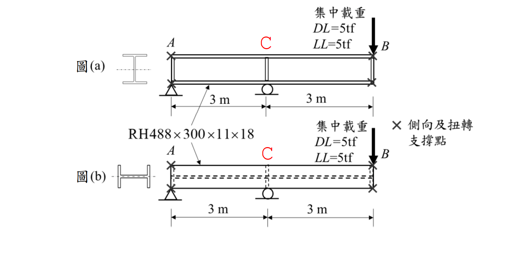

# 考題編號：SS-2024-3

**主分類：** `SS-U1-2` 梁桿件
**設計法：** LRFD
**標籤：** `梁桿件` `LTB側扭挫屈` `非彈性LTB` `Cb係數` `強弱軸比較` `弱軸彎曲` `SN490B` `結實斷面` `塑性彎矩`

---

## 1. 原始題目重述 (Problem Restatement)

簡支梁，跨距 $L = 6\text{ m}$，C 點（跨中）承受集中載重 $P_{DL} = 5\text{ tf}$，$P_{LL} = 5\text{ tf}$。A、B 兩端翼板有充分側向支撐，中間無側向支撐（$L_b = 600\text{ cm}$）。

**圖(a)** — 強軸彎曲（繞 $x$ 軸）
**圖(b)** — 弱軸彎曲（同一斷面旋轉 90°，繞 $y$ 軸）

**材料：** SN490B，$F_y = 2.35\text{ tf/cm}^2$，$F_u = 4.0\text{ tf/cm}^2$（結實斷面）

**子問題：**
1. 圖(a) 強軸彎曲：檢核 $\phi_b M_{nx}$ 是否 $\geq M_u$
2. 圖(b) 弱軸彎曲：檢核 $\phi_b M_{ny}$ 是否 $\geq M_u$



*圖說：圖(a) 強軸彎曲——H 型鋼斷面繞強軸（$x$ 軸）彎曲，簡支梁 A（鉸支）至 B（輥支），跨距 6 m，跨中 C 點承受集中載重 $DL = 5\text{ tf}$、$LL = 5\text{ tf}$；A 與 B 兩端有側向及扭轉支撐，無側向支撐段長度 $L_b = 600\text{ cm}$。圖(b) 弱軸彎曲——同一 RH488×300×11×18 斷面旋轉 90°（繞弱軸 $y$ 軸），載重與支撐配置相同，弱軸方向撓曲不發生 LTB。*

---

## 2. 考題核心精神與出題者意圖 (Core Concepts & Examiner's Intent)

**核心觀念：強弱軸 LTB 差異**

本題用同一斷面、同一載重，對比強軸（發生 LTB）與弱軸（不發生 LTB）的設計強度，突出「弱軸彎曲無側扭挫屈」的核心概念，並測驗 $C_b$ 放大係數在非彈性段的正確應用與上限 $M_p$ 的截取。

**出題者測驗重點：**

- **強軸 LTB 三段式**：$L_b$ 與 $L_p$、$L_r$ 比較，判斷非彈性段；$C_b$ 放大但不超過 $M_p$
- **弱軸不發生 LTB**：弱軸彎曲直接取 $\phi_b M_{p,y} = 0.9 F_y Z_y$，無需計算 LTB
- **$C_b$ 的計算**：跨中集中載重的彎矩圖為三角形，$C_b = 12.5M_{max}/(2.5M_{max}+3M_A+4M_B+3M_C)$
- **$M_n$ 上限 = $M_p$**：$C_b > 1$ 使計算值超過 $M_p$ 時，必須截取至 $M_p$

---

## 3. 解題戰略地圖與陷阱分析 (Strategic Roadmap & Trap Analysis)

**作戰計畫：**
```
Step 1  Pu = 1.2×5 + 1.6×5 = 14 tf → Mu = PuL/4 = 2100 tf·cm
Step 2  斷面性質計算：Ix, Iy, Sx, Sy, Zx, Zy, J, Cw, ry
Step 3  圖(a)強軸：
        → 算 Lp, X1, X2, Lr（判斷三段）
        → 算 Cb（跨中集中載重，三角形彎矩圖）
        → 算 Mn（非彈性 LTB），cap at Mp
Step 4  圖(b)弱軸：
        → 直接 φbMny = 0.9 FyZy（無 LTB）
Step 5  比較強弱軸設計強度 vs Mu
```

**陷阱分析：**

| 陷阱 | 說明 | 對策 |
|------|------|------|
| ❶ 弱軸套強軸 LTB 公式 | 弱軸彎曲無側扭挫屈，不能套 LTB 三段公式 | 弱軸直接 $\phi_b M_{ny} = 0.9 F_y Z_y$ |
| ❷ $M_n$ 超過 $M_p$ 未截取 | $C_b > 1$ 計算出的 $M_n$ 可能超過 $M_p$，需取上限 $M_p$ | 最後加一行：$M_n = \min(計算值, M_p)$ |
| ❸ $C_b$ 代入錯彎矩值 | 三角形彎矩圖（跨中集中載重），$M_A = M_C = M_{max}/2$，$M_B = M_{max}$ | 從彎矩圖讀取 1/4, 1/2, 3/4 跨點值 |
| ❹ $F_L = F_y - 0.7$ 單位 | 殘留應力修正 $0.7\text{ tf/cm}^2$（熱軋型鋼翼板典型值） | 注意 $F_y$ 與 0.7 單位相同（tf/cm²） |
| ❺ 弱軸 $Z_y$ 計算 | 翼板貢獻主導，腹板極小；$Z_y \approx b_f^2 t_f / 2$（忽略腹板） | 兩片翼板各算一半 |

---

## 3.5 變數層次分析（Variable Hierarchy Analysis）

> 複習提示：解題後，在每個卡住的知識點「卡關?」欄標記 `⚠`；第二次複習時只看有 `⚠` 的項目。

**最終目標：** RH488×300×11×18 簡支梁，分別驗核強軸（非彈性 LTB + Cb）與弱軸（直接取 Mp）之設計強度，確認是否 ≥ Mu

### 主要公式（$\boxed{\phantom{x}}$ = 未知，待推導）

**需求彎矩**
$$\boxed{P_u} = 1.2 P_{DL} + 1.6 P_{LL}, \quad \boxed{M_u} = \frac{\boxed{P_u} \cdot L}{4}$$

**強軸 LTB（非彈性段）**
$$\boxed{C_b} = \frac{12.5 M_{max}}{2.5 M_{max}+3M_A+4M_B+3M_C}$$
$$\boxed{M_{n,x}} = \min\!\left(C_b\!\left[M_p - (M_p-M_r)\frac{L_b-L_p}{L_r-L_p}\right],\ M_p\right)$$

**弱軸（無 LTB）**
$$\boxed{M_{n,y}} = M_{p,y} = F_y Z_y$$

### L1：題目直接給定

| 符號 | 數值 | 說明 |
|------|------|------|
| $L$ | 6 m = 600 cm | 梁跨距 |
| $P_{DL}$ | 5 tf | 靜載重 |
| $P_{LL}$ | 5 tf | 活載重 |
| $L_b$ | 600 cm | 強軸彎曲無側向支撐長度 |
| $F_y$ | 2.35 tf/cm² | SN490B |
| $F_u$ | 4.0 tf/cm² | 極限強度 |
| 斷面 | RH488×300×11×18 | $d$×$b_f$×$t_w$×$t_f$ mm |

### L2：需知識點推導

**Step 1：需求彎矩**

| 符號 | 公式 / 來源 | 卡關? |
|------|------------|:-----:|
| $P_u$ | $1.2(5)+1.6(5) = 14$ tf | |
| $M_u$ | $14 	imes 600/4 = 2100$ tf·cm | |

**Step 2：斷面性質（由 §4 計算值）**

| 符號 | 公式 / 來源 | 卡關? |
|------|------------|:-----:|
| $h_w$ | $d - 2t_f = 48.8 - 3.6 = 45.2$ cm | |
| $Z_x$, $Z_y$, $S_x$ | 翼板 + 腹板各貢獻加總 ⚠ 常見卡關 | |
| $r_y$, $J$, $C_w$ | 查表或推導 | |

**Step 3：強軸 LTB 判斷**

| 符號 | 公式 / 來源 | 卡關? |
|------|------------|:-----:|
| $L_p$ | $1.76 r_y \sqrt{E/F_y}$ | |
| $L_r$ | 含 $F_r$、$X_1$、$X_2$ 的公式 | |
| 判斷 | $L_p < L_b = 600 \leq L_r?$ → 非彈性 LTB | |
| $M_r$ | $(F_y - F_r)S_x$，$F_r = 0.7$ tf/cm²（熱軋）| |
| $C_b$ | $12.5/(2.5+3(0.5)+4(1.0)+3(0.5)) = 12.5/10.25 = 1.75$（跨中集中，三角形 BMD）⚠ | |
| $M_n$ | $\min(C_b[M_p-(M_p-M_r)(L_b-L_p)/(L_r-L_p)], M_p)$ | |

**Step 4：弱軸強度**

| 符號 | 公式 / 來源 | 卡關? |
|------|------------|:-----:|
| $Z_y$ | $\approx b_f^2 t_f/2$（翼板主導）| |
| $\phi_b M_{n,y}$ | $0.9 F_y Z_y$（無 LTB）| |

### L3：深層知識（不懂就卡住）

| 知識點 | 說明 | 補強頁 | 卡關? |
|--------|------|:------:|:-----:|
| 弱軸彎曲無 LTB | 弱軸旋轉時扭轉中心改變，幾何上不能發生側扭挫屈，直接取 $M_p$ | [[ltb-3zone]] · [[LATERAL-TORSIONAL-BUCKLING]] | |
| $C_b$ 三角形彎矩圖的讀值 | 集中載重在跨中，BMD 為對稱三角形：$M_A = M_{max}/2$，$M_B = M_{max}$，$M_C = M_{max}/2$ | [[cb-factor]] · [[BENDING-MODIFICATION-FACTOR-CB]] | |
| $M_n$ 上限 = $M_p$（乘 $C_b$ 後截取）| $C_b > 1$ 計算可能得 $M_n > M_p$，必須取 $\min(計算值, M_p)$ | [[ltb-3zone]] | |
| $F_r = 0.7$ tf/cm²（熱軋）vs 1.16（銲接）| 兩種殘留應力值適用不同斷面類型，影響 $M_r$ 和 $L_r$ | [[RESIDUAL-STRESS]] | |
| $Z_y$ 主要是翼板貢獻 | 弱軸 $Z_y \approx 2 \times (b_f/2) \times t_f \times (b_f/4) \times 2 = b_f^2 t_f/2$（腹板極小）| [[plastic-zx]] | |


## 4. 步驟化詳細計算過程 (Step-by-Step Calculation)

### 斷面性質計算

RH488×300×11×18：$h = 48.8\text{ cm}$，$b_f = 30\text{ cm}$，$t_w = 1.1\text{ cm}$，$t_f = 1.8\text{ cm}$

$$h_w = h - 2t_f = 48.8 - 3.6 = 45.2\text{ cm}$$

$$A = 2(b_f t_f) + h_w t_w = 2(30 \times 1.8) + 45.2 \times 1.1 = 108 + 49.7 = 157.7\text{ cm}^2$$

**強軸慣性矩：**

$$I_x = 2\left[\frac{b_f t_f^3}{12} + b_f t_f \left(\frac{h-t_f}{2}\right)^2\right] + \frac{t_w h_w^3}{12}$$
$$= 2(14.6 + 54 \times 23.5^2) + \frac{1.1 \times 45.2^3}{12} = 68{,}138\text{ cm}^4$$

$$S_x = I_x/(h/2) = 68{,}138/24.4 = 2{,}793\text{ cm}^3$$

**弱軸慣性矩：**

$$I_y = 2 \times \frac{t_f b_f^3}{12} + \frac{h_w t_w^3}{12} = 2 \times \frac{1.8 \times 30^3}{12} + 5 = 8{,}105\text{ cm}^4$$

$$r_y = \sqrt{I_y/A} = \sqrt{8{,}105/157.7} = 7.17\text{ cm}; \quad S_y = I_y/(b_f/2) = 8{,}105/15 = 540\text{ cm}^3$$

**扭轉常數與翹曲常數：**

$$J = \frac{1}{3}\left[2b_f t_f^3 + (d - t_f)t_w^3\right] = \frac{1}{3}[349.9 + 62.6] = 137.5\text{ cm}^4$$

$$C_w = \frac{I_y (h - t_f)^2}{4} = \frac{8{,}105 \times 47^2}{4} = 4{,}476{,}000\text{ cm}^6$$

**塑性斷面模數：**

$$Z_x = 2\left[b_f t_f \cdot \frac{h - t_f}{2} + \frac{t_w h_w^2}{8}\right] = 2(1{,}269 + 281) = 3{,}100\text{ cm}^3$$

$$Z_y = 2 \times \frac{t_f b_f^2}{4} + \frac{h_w t_w^2}{4} = 810 + 13.7 = 823.7\text{ cm}^3$$

---

### 設計用彎矩

$$P_u = 1.2 \times 5 + 1.6 \times 5 = 14\text{ tf}$$

$$M_u = \frac{P_u \cdot L}{4} = \frac{14 \times 600}{4} = 2{,}100\text{ tf·cm}$$

---

### 圖(a)：強軸彎曲檢核

**材料參數：** $E = 2{,}040\text{ tf/cm}^2$，$G = 785\text{ tf/cm}^2$，$F_L = F_y - 0.7 = 1.65\text{ tf/cm}^2$

**LTB 特性長度：**

$$L_p = \frac{80r_y}{\sqrt{F_y}} = \frac{80 \times 7.17}{\sqrt{2.35}} = 374\text{ cm}$$

$$X_1 = \frac{\pi}{S_x}\sqrt{\frac{EGJA}{2}} = \frac{\pi}{2{,}793}\sqrt{\frac{2{,}040 \times 785 \times 137.5 \times 157.7}{2}} = 148.2\text{ tf/cm}^2$$

$$X_2 = 4\frac{C_w}{I_y}\left(\frac{S_x}{GJ}\right)^2 = 4 \times 552.3 \times (0.02588)^2 = 1.480\ (\text{tf/cm}^2)^{-2}$$

$$L_r = \frac{r_y X_1}{F_L}\sqrt{1 + \sqrt{1 + X_2 F_L^2}} = \frac{7.17 \times 148.2}{1.65}\sqrt{1 + \sqrt{5.027}} = 644 \times 1.800 = 1{,}160\text{ cm}$$

**判斷區段：**

$$L_p = 374 < L_b = 600 < L_r = 1{,}160 \quad \Rightarrow \text{非彈性 LTB 段}$$

**計算 $C_b$（跨中集中載重，三角形彎矩圖）：**

- $M_A = M_C = 1{,}050\text{ tf·cm}$（$L/4$ 和 $3L/4$ 點）
- $M_B = M_{max} = 2{,}100\text{ tf·cm}$（跨中）

$$C_b = \frac{12.5 \times 2{,}100}{2.5 \times 2{,}100 + 3 \times 1{,}050 + 4 \times 2{,}100 + 3 \times 1{,}050} = \frac{26{,}250}{19{,}950} = 1.316$$

**計算 $M_n$（非彈性 LTB）：**

$$M_p = F_y Z_x = 2.35 \times 3{,}100 = 7{,}285\text{ tf·cm}; \quad M_r = F_L S_x = 1.65 \times 2{,}793 = 4{,}608\text{ tf·cm}$$

$$M_n = C_b\left[M_p - (M_p - M_r)\frac{L_b - L_p}{L_r - L_p}\right] = 1.316 \times [7{,}285 - 2{,}677 \times 0.287] = 1.316 \times 6{,}516 = 8{,}575\text{ tf·cm}$$

$$M_n > M_p \Rightarrow M_n = M_p = 7{,}285\text{ tf·cm}; \quad \phi_b M_n = 0.9 \times 7{,}285 = 6{,}557\text{ tf·cm}$$

---

### 圖(b)：弱軸彎曲檢核

弱軸（$y$ 軸）彎曲時，**不發生側扭挫屈（LTB）**，直接取塑性彎矩：

$$M_{p,y} = F_y Z_y = 2.35 \times 823.7 = 1{,}936\text{ tf·cm}$$

$$\phi_b M_{n,y} = 0.9 \times 1{,}936 = 1{,}742\text{ tf·cm}$$

---

## 5. 結果彙整與驗算 (Summary & Verification)

| 方向 | $M_u$ (tf·cm) | $\phi_b M_n$ (tf·cm) | 結果 |
|------|--------------|---------------------|------|
| **強軸（圖a）** | 2,100 | 6,557 | ✅ OK（利用率 32%） |
| **弱軸（圖b）** | 2,100 | 1,742 | ❌ NG（利用率 121%） |

**結論：** 此梁可承受強軸（圖a）之設計載重，但無法承受弱軸（圖b）之同等載重。弱軸強度約為強軸的 27%，差距懸殊。

**關鍵公式彙整：**

$$L_p = \frac{80r_y}{\sqrt{F_{yf}}}, \quad L_r = \frac{r_y X_1}{F_L}\sqrt{1 + \sqrt{1 + X_2 F_L^2}}$$

$$M_n = C_b\left[M_p - (M_p - M_r)\frac{L_b - L_p}{L_r - L_p}\right] \leq M_p \quad \text{（非彈性 LTB）}$$

$$C_b = \frac{12.5M_{max}}{2.5M_{max} + 3M_A + 4M_B + 3M_C}; \quad M_{p,y} = F_y Z_y \text{（弱軸，無 LTB）}$$
