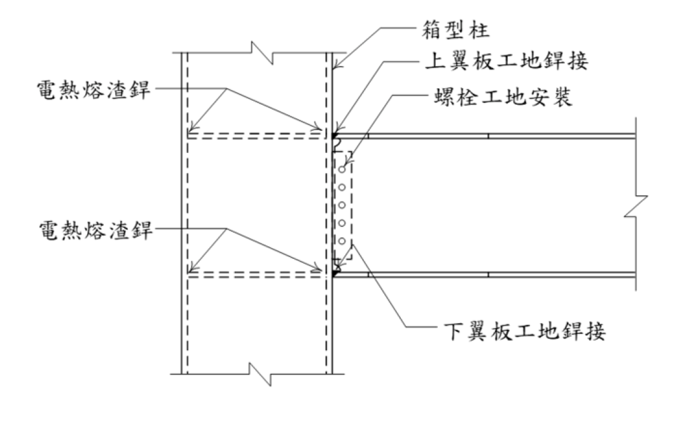

# 考題編號：SS-2024-4

**主分類：** `SS-U1-4` 接合之分析與設計
**副分類：** `SD-U3-1` 結構耐震設計；`SS-U2-3` 設計規範對施工之要求
**設計法：** 概念題
**標籤：** `梁柱接頭` `電熱熔渣銲` `翼板銲接` `層狀撕裂` `HAZ脆化` `破壞模式` `NDT檢測` `SN耐震鋼材`

---

## 1. 原始題目重述 (Problem Restatement)

典型國內梁柱接頭：H 型鋼梁 + 箱型（方管）鋼柱，接頭包含：

| 銲接 / 接合方式 | 位置 | 施工時機 |
|--------------|------|---------|
| **電熱熔渣銲**（Electroslag Welding, ESW） | 梁腹板剪力板（shear tab）與箱型柱面 | 工廠 |
| **上翼板完全滲透銲**（CJP Butt Weld） | 梁上翼板↔箱型柱面 | 工地 |
| **下翼板完全滲透銲**（CJP Butt Weld） | 梁下翼板↔箱型柱面 | 工地 |
| **高拉力螺栓**（HTB） | 腹板剪力板（Web Plate）與梁腹板 | 工地 |

**子問題：** 針對各式銲接及其相鄰母材，說明其**潛在破壞模式**、**預防方法**與**檢測方式**。



*圖說：接頭立面示意圖。左側箱型柱（虛線輪廓為柱壁）與右側 H 型鋼梁相接。柱側面標示兩處「電熱熔渣銲」（腹板剪力板與柱面之工廠銲接，大熱輸入製程）。梁上下翼板標示「翼板工地銲接」（CJP），腹板區域標示「螺栓工地安裝」（HTB）。傳力路徑：梁彎矩→翼板 CJP 傳遞軸力→柱橫隔板；梁剪力→腹板螺栓→剪力板→ESW→柱面。*

---

## 2. 考題核心精神與出題者意圖 (Core Concepts & Examiner's Intent)

**核心觀念：梁柱接頭各部位的破壞機制與耐震設計要求**

本題要求考生對四種接合方式各自的破壞模式有系統性認識。1994 年北嶺地震（Northridge）後，梁柱接頭脆性斷裂成為耐震設計的核心課題，此題正是直接測驗這段歷史教訓轉化成的規範要求。

**出題者測驗重點：**

- **ESW 的特殊問題**：大熱輸入導致 HAZ 晶粒粗大脆化，此特性是 ESW 獨有的
- **翼板 CJP 的北嶺教訓**：背銲鋼條（weld backing）是根部裂縫起始源，應移除或修磨
- **層狀撕裂 ≠ 銲道裂縫**：層狀撕裂發生在母材板厚方向，需 Z 向鋼材（SN-C 類型）解決
- **NDT 選擇邏輯**：UT 適合面狀缺陷（LOF、裂縫），RT 適合體積型（孔穴），MT/PT 只能表面

---

## 3. 解題戰略地圖與陷阱分析 (Strategic Roadmap & Trap Analysis)

**作戰計畫：** 以「銲接/接合種類」為主軸，每種各答「破壞模式 → 預防方法 → 檢測方式」三段，最後以彙整表收尾：

```
① ESW（電熱熔渣銲）→ HAZ 脆化、未熔合
② CJP 翼板銲 → 脆性斷裂（根部裂縫）、層狀撕裂
③ HTB 腹板螺栓 → 滑動、疲勞剪斷
④ 整體 → Panel Zone 剪切、容量設計
```

**陷阱分析：**

| 陷阱 | 說明 | 對策 |
|------|------|------|
| ❶ 忽略 ESW 的 HAZ 問題 | 考生常只回答翼板銲接，忽略 ESW 的特殊脆化問題 | ESW 是本題獨特考點，須另闢一節說明 |
| ❷ 層狀撕裂歸因錯誤 | 層狀撕裂發生在母材（箱型柱面板），沿板材厚度方向，是母材問題而非銲材問題 | 用 Z 向鋼材（SN-C）解決，非換銲材 |
| ❸ 忽略背銲鋼條問題 | 傳統保留的背銲條是北嶺地震後發現的主要脆性裂縫起始原因 | 現行耐震規範要求移除或修磨背銲條 |
| ❹ NDT 方法選錯 | UT 適合 LOF/裂縫（面狀缺陷）；ESW 的 LOF 以 UT 為主，RT 效果差 | 記住 UT 適合面狀、RT 適合體積型 |
| ❺ SN 鋼材三要素 | SN 鋼材特殊性：降伏比上限、CVN 低溫韌性、Z 向延伸率（C 類型），三點都可能考 | 系統性記憶 A/B/C 三等級差異 |

---

## 3.5 變數層次分析（Variable Hierarchy Analysis）

> 複習提示：解題後，在每個卡住的知識點「卡關?」欄標記 `⚠`；第二次複習時只看有 `⚠` 的項目。

**最終目標：** 系統說明梁柱接頭四種接合（ESW / 翼板 CJP / 腹板 HTB / Panel Zone）之破壞模式、預防方法、檢測方式（概念題）

### 主要公式（概念題關鍵公式）

**Panel Zone 剪力強度**
$$\phi_v R_n = 0.6 F_y d_c t_z \left(1 + \frac{3 b_{cf} t_{cf}^2}{d_b d_c t_z}\right), \quad t_z \geq \frac{d_z + w_z}{90}$$

**容量設計（強柱弱梁）**
$$\sum M_{pc} \geq \sum (1.1 R_y M_p)_{beam}$$

### L1：題目直接給定

| 符號 | 數值 | 說明 |
|------|------|------|
| 接頭形式 | H 型梁 + 箱型柱 | 典型梁柱接頭 |
| 接合 ① | ESW（電熱熔渣銲） | 工廠，剪力板↔柱面 |
| 接合 ② | CJP 完全滲透銲（上下翼板）| 工地，翼板↔柱面 |
| 接合 ③ | HTB 高拉力螺栓（腹板）| 工地，剪力板↔梁腹板 |
| 子問題要求 | 破壞模式 + 預防方法 + 檢測方式 | 各接合各答三段 |

### L2：需知識點推導（各接合系統回答架構）

**① ESW（電熱熔渣銲）**

| 問題 | 要點 | 卡關? |
|------|------|:-----:|
| 破壞模式 | HAZ 晶粒粗大脆化、大熱輸入導致韌性下降、未熔合（LOF）⚠ 常見卡關 | |
| 預防方法 | 焊後熱處理（PWHT）、限制熱輸入、改用 SAW 或 SMAW | |
| 檢測方式 | 超音波檢測（UT）為主（面狀缺陷）、VT 輔助 | |

**② 翼板 CJP 完全滲透銲**

| 問題 | 要點 | 卡關? |
|------|------|:-----:|
| 破壞模式 | 脆性斷裂（根部裂縫由背銲鋼條起始）、層狀撕裂（母材板厚方向）⚠ 常見卡關 | |
| 預防方法 | 移除/修磨背銲條、使用 CVN 韌性銲材（$\geq$27 J @ -29°C）、柱面用 Z 向鋼材（SN-C）| |
| 檢測方式 | UT（裂縫/LOF）、MT 或 PT（表面裂縫）| |

**③ HTB 腹板螺栓**

| 問題 | 要點 | 卡關? |
|------|------|:-----:|
| 破壞模式 | 滑動（摩阻型控制）、疲勞剪斷、淨截面斷裂 | |
| 預防方法 | 足夠預拉力（摩阻型）、避免孔位過密 | |
| 檢測方式 | 扭矩扳手（預拉力驗證）、VT | |

### L3：深層知識（不懂就卡住）

| 知識點 | 說明 | 補強頁 | 卡關? |
|--------|------|:------:|:-----:|
| ESW 大熱輸入 → HAZ 脆化 | ESW 單道完成厚板，熱輸入極高，HAZ 晶粒粗大，是 ESW 獨特缺點 | [[SEISMIC-STEEL-SN]] | |
| 背銲鋼條 → 根部裂縫起始源 | 北嶺地震後發現保留背銲條在根部形成缺口效應，現規範要求移除 | [[SEISMIC-STEEL-SN]] · [[WELDED-CONNECTION-DESIGN]] | |
| 層狀撕裂在**母材**（非銲縫）| 層狀撕裂沿板材非金屬夾雜物面撕裂，在柱面板厚方向，需 Z 向鋼材（SN-C）解決 | [[SEISMIC-STEEL-SN]] | |
| UT 適合面狀缺陷，RT 適合體積型 | 裂縫/LOF 用 UT；氣孔/夾渣用 RT；表面缺陷用 MT 或 PT | [[WELDED-CONNECTION-DESIGN]] | |
| SN 鋼材 A/B/C 三等級 | A 無特殊要求；B 加 CVN 韌性；C 加 Z 向延伸率（$Z_{25} \geq 25\%$）| [[SEISMIC-STEEL-SN]] | |


## 4. 步驟化詳細計算過程 (Step-by-Step Calculation)

### 一、電熱熔渣銲（ESW）相關破壞模式

#### 1.1 破壞模式：ESW 熱影響區（HAZ）脆化

**機制：** ESW 為大熱輸入（high heat input）製程，冷卻速率極慢，HAZ 晶粒粗大，低溫衝擊韌性（CVN 值）大幅降低，在地震或低溫工況下可能發生脆性破壞。

**預防方法：** 採用正規化處理（normalize）的鋼材使 HAZ 晶粒細化；採用 SN 耐震鋼材（CVN ≥ 27 J at 0°C）；限制 ESW 僅用於腹板剪力板，避免用於翼板主要受力銲道；考慮以多道次 FCAW/SMAW 取代 ESW，降低熱輸入。

**檢測方式：** UT（超音波檢測）銲後全長掃描；MT（磁粒探傷）表面及次表面缺陷；施工前 HAZ 衝擊試驗確認母材韌性。

#### 1.2 破壞模式：ESW 銲道未熔合（Lack of Fusion）

**機制：** 高熱輸入下若電極行進速率不當，可能形成銲道與母材間的未熔合（LOF）缺陷，成為疲勞裂縫起始點。

**預防方法：** 嚴格施工程序控制（WPS 銲接程序書）；銲工資格驗證（PQR）。

**檢測方式：** UT 是主要檢測手段（LOF 對 RT 不敏感）；TOFD 適用厚板。

---

### 二、翼板完全滲透銲（CJP）相關破壞模式

#### 2.1 破壞模式：翼板 CJP 銲道脆性斷裂

**機制：** 梁翼板 CJP 銲接是傳遞彎矩的主要路徑，在強震下承受高度循環拉壓應力。若銲道金屬韌性不足、存在缺陷（尤其在背銲鋼條 weld backing root 附近），可能發生脆性斷裂。**1994 年北嶺地震後大量案例即為此類破壞。**

**預防方法：** 使用低溫 CVN 合格銲材（AWS D1.8）；改善接頭細部——採用合規扇形孔（Weld Access Hole）避免三向應力集中，移除或修磨背銲鋼條，補填根部銲道；考慮採 RBS 接頭（削減翼板犬骨接頭）降低接頭需求力；預熱及道間溫度控制。

**檢測方式：** UT 全銲道掃描（主要方法）；RT 適合孔穴等體積型缺陷；銲後 MT 或 PT 確認表面裂縫。

#### 2.2 破壞模式：層狀撕裂（Lamellar Tearing）

**機制：** 箱型柱面板在翼板銲接時承受**板厚方向（Z 方向）拉力**，若鋼板含夾層（inclusion）缺陷或 Z 方向延伸率不足，在銲接殘留應力疊加下呈階梯狀沿包覆面撕裂。

**預防方法：** 選用 **Z 向鋼材（Z25/Z35 規格）**，確保板厚方向斷面縮率（Z ≥ 25% 或 35%）；SN-C 類型鋼材已有 Z 向要求；漸進式銲接順序降低殘留拉應力；採用「奶油塗層（Buttering）」技術。

**檢測方式：** UT（銲前）確認柱面板無夾層缺陷；UT（銲後）確認無層狀撕裂裂縫。

---

### 三、腹板螺栓接合相關破壞模式

#### 3.1 破壞模式：螺栓接合滑動與螺栓剪斷

**機制：** 若螺栓預拉力不足，地震往復荷載下接合面發生**滑動（slip）**，造成衝擊應力；循環載重下螺栓可能疲勞剪斷。

**預防方法：** 採用 F10T 或 S10T 高拉力螺栓，確認鎖緊方法（扭矩法、轉角法或 DTI 墊片）；接合面清潔，摩擦面處理達規定係數 $\mu$；耐震接合設計（slip-critical，不允許滑動）。

**檢測方式：** 扭矩扳手抽驗（初鎖後 10% 抽查）；DTI 墊片目視確認。

---

### 四、梁柱接頭整體注意事項

**節點域（Panel Zone）剪切：** 箱型柱內對應梁翼板位置須設橫隔板（diaphragm），否則柱壁在翼板力傳遞時發生局部彎曲或剪切降伏。預防：工廠施工後以 UT 確認隔板銲道。

**容量設計原則：** 接頭銲接設計力應以梁塑性彎矩 $M_{p,beam}$（乘以材料過強係數 $R_y$）計算。使用 SN 鋼材可控制 $R_y$（降伏比上限 $\leq 0.80$），避免材料過強導致接頭超強。

---

## 5. 結果彙整與驗算 (Summary & Verification)

| 銲接 / 接合 | 破壞模式 | 預防方法 | NDT 方式 |
|-----------|---------|---------|---------|
| ESW（電熱熔渣） | HAZ 脆化、未熔合 | 低熱輸入替代、SN 鋼材、WPS 控制 | UT、MT |
| 翼板 CJP | 脆性斷裂（根部裂縫） | CVN 合格銲材、扇形孔改善、背銲修磨 | UT、RT |
| 柱面板母材 | 層狀撕裂 | Z 向鋼材（SN-C）、奶油技術、銲接順序 | UT（銲前後）|
| 腹板 HTB | 滑動、螺栓剪斷 | F10T螺栓、摩擦面處理、DTI 墊片 | 扭矩驗證、DTI 目視 |

**SN 鋼材三項特殊性（耐震接頭核心）：**

1. **降伏比 $F_y/F_u \leq 0.80$** — 避免材料過強導致容量設計失效
2. **CVN 低溫衝擊韌性** — 確保 HAZ 及銲道在低溫/地震高應變速率下不脆斷
3. **C 型特有：Z 向延伸率 ≥ 25%** — 防止厚板接頭層狀撕裂
