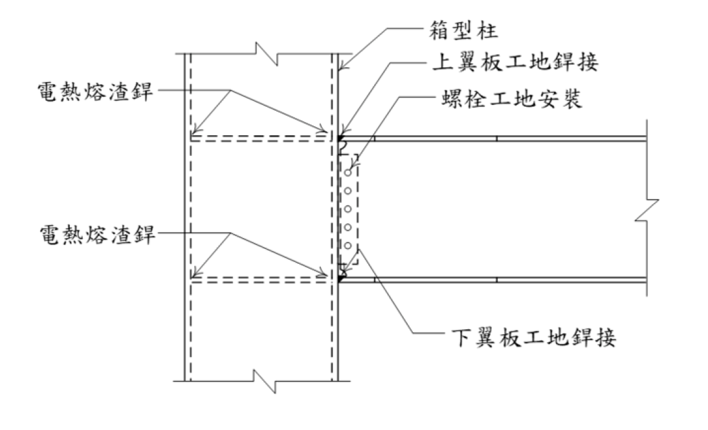

# 考題編號：SS-2024-4

**主分類：** `SS-U1-4` 接合之分析與設計
**副分類：** `SD-U3-1` 結構耐震設計；`SS-U2-3` 設計規範對施工之要求
**設計法：** 概念題
**標籤：** `梁柱接頭` `電熱熔渣銲` `內橫隔板` `翼板銲接` `層狀撕裂` `HAZ脆化` `破壞模式` `NDT檢測` `SN耐震鋼材`

---

## 1. 原始題目重述 (Problem Restatement)

**題目：** 下圖為國內典型梁柱接頭型式，梁為 H 型鋼斷面，柱為箱型鋼斷面，試申論說明該類梁柱接頭內各式銲接及其相鄰母材可能產生之潛在破壞模式為何？其對應之預防方法與檢測方式為何？（25 分）

圖中標示之接合共三類：

| 銲接 / 接合方式 | 位置 | 施工時機 |
|--------------|------|---------|
| **電熱熔渣銲**（Electroslag Welding, ESW） | **箱型柱內橫隔板（Internal Diaphragm）與柱壁**——對應上、下梁翼板高程各一片，圖中以水平虛線繪於柱內，每片隔板之左右兩端各一處引線 | 工廠 |
| **上翼板完全滲透銲**（CJP Groove Weld） | 梁上翼板 ↔ 箱型柱面 | 工地 |
| **下翼板完全滲透銲**（CJP Groove Weld） | 梁下翼板 ↔ 箱型柱面 | 工地 |
| **高拉力螺栓**（HTB） | 剪力板（Shear Tab）↔ 梁腹板 | 工地（剪力板與柱面之銲接於工廠完成） |



*圖說：接頭立面示意圖。左側為箱型柱（外緣實線為近側柱壁，內部虛線表示遠側柱壁與柱內構件），右側為 H 型鋼梁，兩者均以折斷符號表示延續。*

- *柱內於**上、下梁翼板高程各繪一道水平虛線**，即**內橫隔板（Internal Diaphragm）**。兩處「電熱熔渣銲」引線分別指向該隔板**與左右柱壁交會之兩端**——這正是國內箱型柱最典型的工廠銲接：隔板先置入，最後一片柱壁（封閉板）合攏後，以 **ESW 自柱外一道成形**將隔板端部銲住。*
- *梁上、下翼板與柱面交會處標示「上翼板工地銲接」「下翼板工地銲接」，為**工地 CJP 開槽銲**。*
- *梁腹板側之虛線矩形內繪一排圓孔，標示「螺栓工地安裝」，即**剪力板（Shear Tab）以高拉力螺栓與梁腹板接合**；剪力板本身與柱面之銲接屬工廠銲接（圖中未另標註銲接符號）。*
- ***傳力路徑：** 梁彎矩 → 上、下翼板 CJP 傳為拉／壓力 → 柱壁 → **內橫隔板（由 ESW 銲住）**把該集中力導入柱之另一側，避免柱壁局部彎曲；梁剪力 → 腹板 HTB → 剪力板 → 剪力板與柱面之銲道 → 柱壁。*

---

## 2. 考題核心精神與出題者意圖 (Core Concepts & Examiner's Intent)

**核心觀念：梁柱接頭各部位的破壞機制與耐震設計要求**

本題要求考生對四種接合方式各自的破壞模式有系統性認識。1994 年北嶺地震（Northridge）後，梁柱接頭脆性斷裂成為耐震設計的核心課題，此題正是直接測驗這段歷史教訓轉化成的規範要求。

**出題者測驗重點：**

- **ESW 的特殊問題**：大熱輸入導致 HAZ 晶粒粗大脆化，此特性是 ESW 獨有的；且它銲的是**內橫隔板↔柱壁**，正落在梁翼板拉力傳入柱身的力流主幹上，一旦脆斷，翼板 CJP 再好也沒有用
- **翼板 CJP 的北嶺教訓**：背銲鋼條（weld backing）是根部裂縫起始源，應移除或修磨
- **層狀撕裂 ≠ 銲道裂縫**：層狀撕裂發生在母材板厚方向，需 Z 向鋼材（SN-C 類型）解決
- **NDT 選擇邏輯**：UT 適合面狀缺陷（LOF、裂縫），RT 適合體積型（孔穴），MT/PT 只能表面

---

## 3. 解題戰略地圖與陷阱分析 (Strategic Roadmap & Trap Analysis)

**作戰計畫：** 以「銲接/接合種類」為主軸，每種各答「破壞模式 → 預防方法 → 檢測方式」三段，最後以彙整表收尾：

```
① ESW（內橫隔板↔柱壁，工廠）→ HAZ 晶粒粗大脆化、未熔合
② CJP 翼板銲（工地）→ 脆性斷裂（背銲條根部裂縫）
③ 相鄰母材（柱壁）→ 層狀撕裂（板厚 Z 向）
④ HTB 腹板螺栓 → 滑動、螺栓剪斷
⑤ 整體 → Panel Zone 剪切、容量設計
```

**陷阱分析：**

| 陷阱 | 說明 | 對策 |
|------|------|------|
| ❶ **看錯 ESW 的位置** | 圖中 ESW 引線指的是**柱內橫隔板與柱壁**（虛線水平板兩端），**不是**剪力板與柱面。位置判錯，後面的「力流為何關鍵」「為什麼柱壁母材會層狀撕裂」全部會寫偏 | 先讀圖：虛線 = 柱內看不見的構件；兩道虛線恰在上、下翼板高程 ⇒ 內橫隔板 |
| ❶′ 忽略 ESW 的 HAZ 問題 | 考生常只回答翼板銲接，忽略 ESW 的特殊脆化問題 | ESW 是本題獨特考點，須另闢一節說明 |
| ❷ 層狀撕裂歸因錯誤 | 層狀撕裂發生在母材（箱型柱面板），沿板材厚度方向，是母材問題而非銲材問題 | 用 Z 向鋼材（SN-C）解決，非換銲材 |
| ❸ 忽略背銲鋼條問題 | 傳統保留的背銲條是北嶺地震後發現的主要脆性裂縫起始原因 | 現行耐震規範要求移除或修磨背銲條 |
| ❹ NDT 方法選錯 | UT 適合 LOF/裂縫（面狀缺陷）；ESW 的 LOF 以 UT 為主，RT 效果差 | 記住 UT 適合面狀、RT 適合體積型 |
| ❺ SN 鋼材三要素 | SN 鋼材特殊性：降伏比上限、CVN 低溫韌性、Z 向延伸率（C 類型），三點都可能考 | 系統性記憶 A/B/C 三等級差異 |

---

## 3.5 變數層次分析（Variable Hierarchy Analysis）

> 複習提示：解題後，在每個卡住的知識點「卡關?」欄標記 `⚠`；第二次複習時只看有 `⚠` 的項目。

**最終目標：** 系統說明梁柱接頭四種接合（ESW / 翼板 CJP / 腹板 HTB / Panel Zone）之破壞模式、預防方法、檢測方式（概念題）

### 主要公式（概念題關鍵公式）

**Panel Zone 剪力強度**
$$\phi_v R_n = 0.6 F_y d_c t_z \left(1 + \frac{3 b_{cf} t_{cf}^2}{d_b d_c t_z}\right), \quad t_z \geq \frac{d_z + w_z}{90}$$

**容量設計（強柱弱梁）**
$$\sum M_{pc} \geq \sum (1.1 R_y M_p)_{beam}$$

### L1：題目直接給定

| 符號 | 數值 | 說明 |
|------|------|------|
| 接頭形式 | H 型梁 + 箱型柱 | 典型梁柱接頭 |
| 接合 ① | ESW（電熱熔渣銲） | **工廠，內橫隔板↔柱壁**（上、下翼板高程各一片）|
| 接合 ② | CJP 完全滲透銲（上下翼板）| 工地，翼板↔柱面 |
| 接合 ③ | HTB 高拉力螺栓（腹板）| 工地，剪力板↔梁腹板 |
| 子問題要求 | 破壞模式 + 預防方法 + 檢測方式 | 各接合各答三段 |

### L2：需知識點推導（各接合系統回答架構）

**① ESW（電熱熔渣銲，內橫隔板↔柱壁）**

| 問題 | 要點 | 卡關? |
|------|------|:-----:|
| 破壞模式 | HAZ 晶粒粗大脆化、大熱輸入導致韌性下降、未熔合（LOF）⚠ 常見卡關 | |
| 預防方法 | 限制熱輸入與道間溫度、選用**正常化處理鋼材或 SN 耐震鋼材**、必要時改以多道次 FCAW／SMAW 或改採外隔板（External Diaphragm）型式 | |
| 檢測方式 | 超音波檢測（UT）為主（面狀缺陷）、VT 輔助；柱壁外表面補 MT | |

**② 翼板 CJP 完全滲透銲**

| 問題 | 要點 | 卡關? |
|------|------|:-----:|
| 破壞模式 | 脆性斷裂（根部裂縫由背銲鋼條起始）、層狀撕裂（母材板厚方向）⚠ 常見卡關 | |
| 預防方法 | 移除/修磨背銲條、使用 CVN 韌性銲材（$\geq$27 J @ -29°C）、柱面用 Z 向鋼材（SN-C）| |
| 檢測方式 | UT（裂縫/LOF）、MT 或 PT（表面裂縫）| |

**③ HTB 腹板螺栓**

| 問題 | 要點 | 卡關? |
|------|------|:-----:|
| 破壞模式 | 滑動（摩阻型控制）、疲勞剪斷、淨截面斷裂 | |
| 預防方法 | 足夠預拉力（摩阻型）、避免孔位過密 | |
| 檢測方式 | 扭矩扳手（預拉力驗證）、VT | |

### L3：深層知識（不懂就卡住）

| 知識點 | 說明 | 補強頁 | 卡關? |
|--------|------|:------:|:-----:|
| ESW 大熱輸入 → HAZ 脆化 | ESW 單道完成厚板，熱輸入極高，HAZ 晶粒粗大，是 ESW 獨特缺點；國內箱型柱以 ESW 銲**內橫隔板↔柱壁**，該處正是梁翼板力流進入柱身的主幹 | [[SEISMIC-STEEL-SN]] | |
| 背銲鋼條 → 根部裂縫起始源 | 北嶺地震後發現保留背銲條在根部形成缺口效應，現規範要求移除 | [[SEISMIC-STEEL-SN]] · [[WELDED-CONNECTION-DESIGN]] | |
| 層狀撕裂在**母材**（非銲縫）| 層狀撕裂沿板材非金屬夾雜物面撕裂，在柱面板厚方向，需 Z 向鋼材（SN-C）解決 | [[SEISMIC-STEEL-SN]] | |
| UT 適合面狀缺陷，RT 適合體積型 | 裂縫/LOF 用 UT；氣孔/夾渣用 RT；表面缺陷用 MT 或 PT | [[WELDED-CONNECTION-DESIGN]] | |
| SN 鋼材 A/B/C 三等級 | A 無特殊要求；B 加 CVN 韌性；C 加 Z 向延伸率（$Z_{25} \geq 25\%$）| [[SEISMIC-STEEL-SN]] | |


## 4. 步驟化詳細計算過程 (Step-by-Step Calculation)

### 一、電熱熔渣銲（ESW，內橫隔板↔柱壁）相關破壞模式

> **先定位：** 箱型柱在梁翼板高程須設**內橫隔板**，把梁翼板傳來的集中拉／壓力導入柱之另一側，避免柱壁單獨受面外彎曲。製造時三面柱壁先組立、隔板置入，最後一片柱壁合攏後**無法自內部施銲**，故國內慣以 **ESW 自柱外一道成形**把隔板端部銲住（圖中兩處引線即指此）。此銲道位於力流主幹上，且**完工後被封在柱內、無法目視、修補極困難**——這正是本題把它單獨標出來的理由。

#### 1.1 破壞模式：ESW 熱影響區（HAZ）晶粒粗大脆化

**機制：** ESW 為大熱輸入（high heat input）製程，一道成形厚銲、冷卻速率極慢，HAZ 沃斯田鐵晶粒粗大化，低溫衝擊韌性（CVN）大幅降低。地震時該處承受高應變速率之反覆拉力，可能在柱壁／隔板交會處發生**脆性破壞**，使梁翼板力流中斷。

**預防方法：**

1. 選用**正常化（normalizing）處理或 TMCP 鋼材**，抑制 HAZ 晶粒粗大化
2. 採用 **SN 耐震鋼材（B／C 類具 CVN 保證）**，並要求銲材之低溫衝擊值
3. **限制單位長度熱輸入與道間溫度**（依 WPS／PQR 訂定上限）
4. 必要時改以**多道次 FCAW／SMAW** 取代 ESW，或改採**外隔板（External Diaphragm）／貫通式隔板（Through Diaphragm）**型式，把銲道移到可檢查、可修補的位置

**檢測方式：** ESW 銲後以 **UT 全長掃描**（自柱壁外側入射）；柱壁外表面補 **MT** 查表面／近表面裂縫；施工前以衝擊試驗（Charpy）確認母材與銲材韌性，並以 PQR 驗證熱輸入上限下之 HAZ 韌性。

#### 1.2 破壞模式：ESW 銲道未熔合（Lack of Fusion）／夾渣

**機制：** ESW 靠熔渣電阻發熱，若熔渣深度、電極行進速率或水冷銅模貼合不當，易在銲道與柱壁／隔板界面形成**未熔合（LOF）**或捲入熔渣，成為地震下裂縫的起始點。此類缺陷為**面狀**且位於柱內，目視完全看不到。

**預防方法：** 嚴格依合格之 **WPS**（銲接程序規範書）與 **PQR** 施工；銲工資格檢定；施銲前確認隔板與柱壁之組立間隙與水冷銅模密合；全程監控電流、電壓與行進速率。

**檢測方式：** **UT 為主要檢測手段**（LOF 為面狀缺陷，RT 不敏感，且柱壁厚、幾何封閉，RT 亦不可行）；厚板可採 TOFD 提升定量精度。

---

### 二、翼板完全滲透銲（CJP）相關破壞模式

#### 2.1 破壞模式：翼板 CJP 銲道脆性斷裂

**機制：** 梁翼板 CJP 銲接是傳遞彎矩的主要路徑，在強震下承受高度循環拉壓應力。若銲道金屬韌性不足、存在缺陷（尤其在背銲鋼條 weld backing root 附近），可能發生脆性斷裂。**1994 年北嶺地震後大量案例即為此類破壞。**

**預防方法：** 使用低溫 CVN 合格銲材（AWS D1.8）；改善接頭細部——採用合規扇形孔（Weld Access Hole）避免三向應力集中，移除或修磨背銲鋼條，補填根部銲道；考慮採 RBS 接頭（削減翼板犬骨接頭）降低接頭需求力；預熱及道間溫度控制。

**檢測方式：** UT 全銲道掃描（主要方法）；RT 適合孔穴等體積型缺陷；銲後 MT 或 PT 確認表面裂縫。

#### 2.2 破壞模式：層狀撕裂（Lamellar Tearing）

**機制：** 箱型柱面板在翼板銲接時承受**板厚方向（Z 方向）拉力**，若鋼板含夾層（inclusion）缺陷或 Z 方向延伸率不足，在銲接殘留應力疊加下呈階梯狀沿包覆面撕裂。

**預防方法：** 選用 **Z 向鋼材（Z25/Z35 規格）**，確保板厚方向斷面縮率（Z ≥ 25% 或 35%）；SN-C 類型鋼材已有 Z 向要求；漸進式銲接順序降低殘留拉應力；採用「奶油塗層（Buttering）」技術。

**檢測方式：** UT（銲前）確認柱面板無夾層缺陷；UT（銲後）確認無層狀撕裂裂縫。

---

### 三、腹板螺栓接合相關破壞模式

#### 3.1 破壞模式：螺栓接合滑動與螺栓剪斷

**機制：** 若螺栓預拉力不足，地震往復荷載下接合面發生**滑動（slip）**，造成衝擊應力；循環載重下螺栓可能疲勞剪斷。

**預防方法：** 採用 F10T 或 S10T 高拉力螺栓，確認鎖緊方法（扭矩法、轉角法或 DTI 墊片）；接合面清潔，摩擦面處理達規定係數 $\mu$；耐震接合設計（slip-critical，不允許滑動）。

**檢測方式：** 扭矩扳手抽驗（初鎖後 10% 抽查）；DTI 墊片目視確認。

---

### 四、梁柱接頭整體注意事項

**節點域（Panel Zone）剪切與柱壁局部變形：** 箱型柱在梁翼板高程須設**內橫隔板**，否則柱壁在翼板集中力作用下發生面外局部彎曲，接頭剛度與強度大幅下降。隔板本身之厚度不得小於梁翼板厚度，且**其與柱壁之 ESW 銲道須以 UT 全檢**——隔板再厚，銲道脆斷一樣失效。節點域剪力不足時另加厚柱壁或於柱內加設補強板。

**容量設計原則：** 接頭銲接設計力應以梁塑性彎矩 $M_{p,beam}$（乘以材料過強係數 $R_y$）計算。使用 SN 鋼材可控制 $R_y$（降伏比上限 $\leq 0.80$），避免材料過強導致接頭超強。

---

## 5. 關鍵爭議點與進階探討 (Critical Issues & Advanced Discussion)

### 5.1 內隔板三種型式與 ESW 的關係（本題最容易被忽略的一層）

| 隔板型式 | 作法 | 與 ESW 的關係 | 優劣 |
|---------|------|--------------|------|
| **內隔板（Internal Diaphragm）** | 隔板置於柱內，最後一片柱壁合攏後自外部銲 | **必須用 ESW**（或深槽 CJP）一道成形，因內部無法施銲 | 外觀平整；但銲道封在柱內、熱輸入大、無法目視、修補困難 ⇒ **本題圖示型式** |
| **貫通式隔板（Through Diaphragm）** | 柱在梁翼板高程斷開，隔板貫穿後上下柱各以 CJP 接回 | 不需 ESW | 力流最直接、品質最可靠；但柱身多兩道 CJP，製作成本高 |
| **外隔板（External Diaphragm）** | 隔板做在柱外，環繞柱身 | 不需 ESW | 銲道全部可目視、可檢測；但外露、占空間 |

> 答題時若能點出「**因為是內隔板，才不得不用 ESW；ESW 的所有問題都源自這個施工限制**」，即掌握本題的申論骨幹。

### 5.2 結果彙整表

| 銲接 / 接合 | 破壞模式 | 預防方法 | NDT 方式 |
|-----------|---------|---------|---------|
| ESW（電熱熔渣）<br>**內橫隔板↔柱壁**（工廠） | HAZ 晶粒粗大脆化、未熔合／夾渣 | 正常化／SN 鋼材、限制熱輸入與道間溫度、WPS/PQR 控制、必要時改多道次銲或外隔板型式 | UT（全長）、MT（柱壁外表面）|
| 翼板 CJP | 脆性斷裂（根部裂縫） | CVN 合格銲材、扇形孔改善、背銲修磨 | UT、RT |
| 柱面板母材 | 層狀撕裂 | Z 向鋼材（SN-C）、奶油技術、銲接順序 | UT（銲前後）|
| 腹板 HTB | 滑動、螺栓剪斷 | F10T螺栓、摩擦面處理、DTI 墊片 | 扭矩驗證、DTI 目視 |

**SN 鋼材三項特殊性（耐震接頭核心）：**

1. **降伏比 $F_y/F_u \leq 0.80$** — 避免材料過強導致容量設計失效
2. **CVN 低溫衝擊韌性** — 確保 HAZ 及銲道在低溫/地震高應變速率下不脆斷
3. **C 型特有：Z 向延伸率 ≥ 25%** — 防止厚板接頭層狀撕裂

---

*修正日期：2026-08-22 —— 依考卷原圖重判 ESW 之位置。原解析將「電熱熔渣銲」判為「梁腹板剪力板與箱型柱面」，惟圖中兩處 ESW 引線指向的是**柱內兩道水平虛線（內橫隔板）與柱壁交會的兩端**；連帶更正 §1 題目重述與圖說、§2、§3 陷阱、§3.5 L1/L2/L3、§4 第一節與第四節、§5 彙整表，並新增 §5.1 內隔板／貫通式隔板／外隔板之對照。詳見 `wiki/log.md` 2026-08-22 第五批。*
