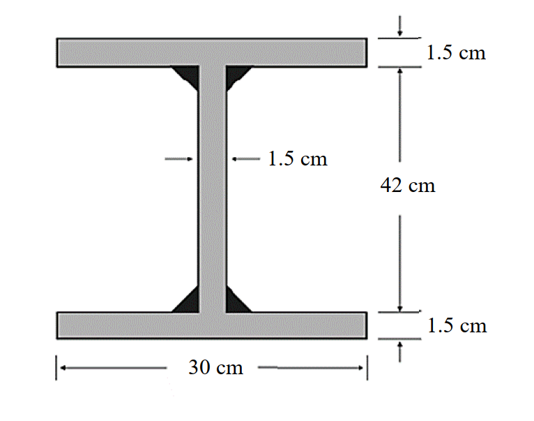

# 考題編號：SS-2025-1

**主分類：** `4.1.2` 梁桿件
**副分類：** 無
**設計法：** LRFD
**標籤：** `梁桿件` `撓曲構材` `結實斷面` `塑性彎矩` `寬厚比` `銲接組合斷面` `殘留應力` `完全側向支撐` `φbMn`

---

## 1. 原始題目重述 (Problem Restatement)

設計一銲接 H 型鋼梁，斷面尺寸如下：

- 翼板寬 $b_f = 30$ cm，翼板厚 $t_f = 1.5$ cm
- 腹板高 $h_w = 42$ cm，腹板厚 $t_w = 1.5$ cm
- 材料：$F_y = 2.5$ tf/cm²
- 殘留應力：$F_r = 1.16$ tf/cm²（銲接組合斷面）
- 梁具完全側向支撐（Complete lateral bracing）

試依 LRFD 規範求此梁之設計撓曲強度 $\phi_b M_{nx}$。

*圖說：銲接組合 H 型鋼斷面（正面視圖）。翼板寬度 $b_f = 30\text{ cm}$，翼板厚度 $t_f = 1.5\text{ cm}$（上下翼板相同）；腹板淨高 $h_w = 42\text{ cm}$，腹板厚度 $t_w = 1.5\text{ cm}$；全深 $d = 42 + 2 \times 1.5 = 45\text{ cm}$。腹板與翼板之連接以填角銲施作（圖中黑色三角形區域）。翼板寬厚比 $\lambda_f = b_f/(2t_f) = 30/3 = 10.0$，腹板寬厚比 $\lambda_w = h_w/t_w = 42/1.5 = 28.0$。*

---

## 2. 考題核心精神與出題者意圖 (Core Concepts & Examiner's Intent)

**核心觀念：結實斷面 + 完全側向支撐 → 設計強度即為塑性彎矩**

本題考查三層判斷能力：
1. 能正確計算銲接 H 型鋼的**寬厚比**，並與 $\lambda_p$ 比較判斷是否為結實斷面
2. 能利用「完全側向支撐」條件，直接跳過 LTB 計算
3. 能正確計算組合斷面的**塑性斷面模數 $Z_x$**

**出題者關鍵考點：**
- 翼板寬厚比計算：$\lambda = b_f / (2t_f)$（注意分母是 $2t_f$，因為翼板是懸臂板）
- $\lambda_p = 17/\sqrt{F_y}$（$F_y$ 以 tf/cm² 代入）
- 殘留應力 $F_r = 1.16$ tf/cm² 是「銲接組合斷面」特徵值，提醒考生此題是銲接斷面
- 題目明示「完全側向支撐」→ $L_b = 0 < L_p$ → 無 LTB → $M_n = M_p$

---

## 3. 解題戰略地圖與陷阱分析 (Strategic Roadmap & Trap Analysis)

**步驟規劃：**
1. 計算翼板、腹板寬厚比，與 $\lambda_p$ 比較 → 確認結實斷面
2. 用完全側向支撐條件確認 $M_n = M_p$
3. 計算塑性斷面模數 $Z_x$
4. 計算 $\phi_b M_n = 0.9 \times F_y \times Z_x$

**關鍵陷阱：**

> ⚠️ **陷阱1：誤用 Sx 而非 Zx**
> 結實斷面且完全支撐時，$M_n = M_p = F_y Z_x$（塑性），不是 $F_y S_x$（彈性）。這是最常見的粗心失分點。

> ⚠️ **陷阱2：寬厚比計算錯誤**
> 翼板寬厚比 $\lambda = b_f / (2t_f)$，分母是 $2t_f$ 而非 $t_f$。因為翼板從腹板兩側懸出，懸臂長度是 $b_f/2$，所以 $\lambda = (b_f/2)/t_f = b_f/(2t_f)$。

> ⚠️ **陷阱3：誤將殘留應力帶入 Mp 計算**
> 殘留應力 $F_r = 1.16$ tf/cm² 影響的是 $M_r$（用於計算 $L_r$）和 LTB 計算，但 $M_p = F_y Z_x$ 不受殘留應力影響。本題有完全支撐，LTB 不控制，$F_r$ 對本題計算無直接影響。

> ⚠️ **陷阱4：Zx 計算漏算腹板貢獻**
> 組合斷面 $Z_x$ 包含翼板和腹板兩部分，腹板貢獻 $= 2 \times (h_w/2) \times t_w \times (h_w/4)$，不可漏算。

---

## 3.5 變數層次分析（Variable Hierarchy Analysis）

> 複習提示：解題後，在每個卡住的知識點「卡關?」欄標記 `⚠`；第二次複習時只看有 `⚠` 的項目。

**最終目標：** 確認銲接 H 型鋼為結實斷面 + 完全側向支撐，計算塑性斷面模數 $Z_x$，求設計撓曲強度 $\phi_b M_{nx}$

### 主要公式（$\boxed{\phantom{x}}$ = 未知，待推導）

**Step 1：寬厚比判斷**
$$\boxed{\lambda_f} = \frac{b_f}{2t_f}, \quad \lambda_{pf} = \frac{17}{\sqrt{F_y}} \quad \Rightarrow \lambda_f < \lambda_{pf}?$$
$$\boxed{\lambda_w} = \frac{h_w}{t_w}, \quad \lambda_{pw} = \frac{170}{\sqrt{F_y}} \quad \Rightarrow \lambda_w < \lambda_{pw}?$$

**Step 2：LTB 判斷**
$$L_b = 0 < L_p \quad \Rightarrow M_n = M_p$$

**Step 3：塑性斷面模數**
$$\boxed{Z_x} = 2 b_f t_f \left(\frac{h_w}{2} + \frac{t_f}{2}\right) + \frac{t_w h_w^2}{4}$$

**Step 4：設計強度**
$$\boxed{\phi_b M_{nx}} = 0.9 \times F_y \times \boxed{Z_x}$$

### L1：題目直接給定

| 符號 | 數值 | 說明 |
|------|------|------|
| $b_f$ | 30 cm | 翼板寬度 |
| $t_f$ | 1.5 cm | 翼板厚度 |
| $h_w$ | 42 cm | 腹板淨高 |
| $t_w$ | 1.5 cm | 腹板厚度 |
| $F_y$ | 2.5 tf/cm² | 降伏強度 |
| $F_r$ | 1.16 tf/cm² | 殘留應力（銲接組合斷面，本題不需代入計算） |
| 側向支撐條件 | 完全側向支撐 | 即 $L_b = 0$，LTB 不控制 |
| 設計法 | LRFD | $\phi_b = 0.9$ |

### L2：需知識點推導

**Step 1：寬厚比計算**

| 符號 | 公式 / 來源 | 卡關? |
|------|------------|:-----:|
| $\lambda_f$ | $b_f/(2t_f) = 30/3 = 10.0$ | |
| $\lambda_{pf}$ | $17/\sqrt{F_y} = 17/\sqrt{2.5} = 10.75$ | |
| $\lambda_w$ | $h_w/t_w = 42/1.5 = 28.0$ | |
| $\lambda_{pw}$ | $170/\sqrt{F_y} = 170/\sqrt{2.5} = 107.5$ | |
| 結論 | $\lambda_f < \lambda_{pf}$ 且 $\lambda_w < \lambda_{pw}$ → 結實斷面 | |

**Step 2：LTB 判斷**

| 符號 | 公式 / 來源 | 卡關? |
|------|------------|:-----:|
| $L_b$ | 完全側向支撐 → $L_b = 0$ | |
| 結論 | $L_b < L_p$ → 無 LTB，$M_n = M_p$ | |

**Step 3：塑性斷面模數 $Z_x$**

| 符號 | 公式 / 來源 | 卡關? |
|------|------------|:-----:|
| $Z_{x,\text{flange}}$ | $2 \times 30 \times 1.5 \times (21 + 0.75) = 1957.5$ cm³ | |
| $Z_{x,\text{web}}$ | $2 \times 21 \times 1.5 \times 10.5 = 661.5$ cm³ ⚠ 常見卡關 | |
| $Z_x$ | $1957.5 + 661.5 = 2619$ cm³ | |

**Step 4：設計強度**

| 符號 | 公式 / 來源 | 卡關? |
|------|------------|:-----:|
| $M_p$ | $F_y \times Z_x = 2.5 \times 2619 = 6547.5$ tf·cm | |
| $\phi_b M_{nx}$ | $0.9 \times 6547.5 = 5892.75$ tf·cm | |

### L3：深層知識（不懂就卡住）

| 知識點 | 說明 | 補強頁 | 卡關? |
|--------|------|:------:|:-----:|
| 翼板寬厚比分母是 $2t_f$ | 翼板從腹板懸出，懸臂長 $b_f/2$，故 $\lambda = (b_f/2)/t_f = b_f/(2t_f)$ | [[COMPACT-SECTION]] | |
| $\lambda_p$ 公式（銲接 vs 熱軋皆同） | $\lambda_{pf} = 17/\sqrt{F_y}$（tf/cm² 制），不因斷面類型而異 | [[COMPACT-SECTION]] | |
| 完全側向支撐 → $M_n = M_p$（直接跳過 LTB） | $L_b = 0 < L_p$，三段判斷邏輯的第一段 | [[ltb-3zone]] · [[LATERAL-TORSIONAL-BUCKLING]] | |
| $Z_x$ 包含腹板貢獻 | 腹板分上下兩半，各部分 $= (h_w/2) \times t_w \times (h_w/4)$，不可漏算 | [[plastic-zx]] | |
| 殘留應力 $F_r$ 不影響 $M_p$ | $M_p = F_y Z_x$，殘留應力只影響 $M_r$ 和 $L_r$（LTB 相關），本題完全支撐故無影響 | [[RESIDUAL-STRESS]] | |
| $\phi_b = 0.9$（彎曲） | 不可與 $\phi_c = 0.85$（壓力）混用 | [[lrfd-phi-values]] | |

---

## 4. 步驟化詳細計算過程 (Step-by-Step Detailed Calculation)

### Step 1：計算斷面尺寸確認

| 部位 | 尺寸 |
|------|------|
| 翼板寬 $b_f$ | 30 cm |
| 翼板厚 $t_f$ | 1.5 cm |
| 腹板高 $h_w$ | 42 cm |
| 腹板厚 $t_w$ | 1.5 cm |
| 全深 $d$ | $42 + 2 \times 1.5 = 45$ cm |

---

### Step 2：結實斷面檢核

**翼板寬厚比（不加勁元素，懸臂板）：**
$$\lambda_f = \frac{b_f}{2t_f} = \frac{30}{2 \times 1.5} = \frac{30}{3} = 10.0$$

$$\lambda_{pf} = \frac{17}{\sqrt{F_y}} = \frac{17}{\sqrt{2.5}} = \frac{17}{1.581} = 10.75$$

$$\lambda_f = 10.0 < \lambda_{pf} = 10.75 \quad \Rightarrow \quad \text{翼板結實} \checkmark$$

**腹板寬厚比（加勁元素，純彎）：**
$$\lambda_w = \frac{h_w}{t_w} = \frac{42}{1.5} = 28.0$$

$$\lambda_{pw} = \frac{170}{\sqrt{F_y}} = \frac{170}{\sqrt{2.5}} = \frac{170}{1.581} = 107.5$$

$$\lambda_w = 28.0 < \lambda_{pw} = 107.5 \quad \Rightarrow \quad \text{腹板結實} \checkmark$$

$$\boxed{\text{翼板、腹板均為結實 → 斷面為結實斷面（Compact Section）}}$$

---

### Step 3：側向扭轉挫屈（LTB）判斷

題目明示**完全側向支撐**（梁的整個長度均有側向束制），即 $L_b = 0$：

$$L_b = 0 < L_p \quad \Rightarrow \quad \text{無側扭挫屈，} M_n = M_p$$

> 💡 **策略提示：** 有了「完全側向支撐」這個條件，就不需要計算 $L_p$、$r_{ts}$、$C_b$ 等複雜參數，直接確認 $M_n = M_p$。

---

### Step 4：計算塑性斷面模數 $Z_x$

塑性斷面模數 $Z_x$ = 中性軸上下各部分面積 × 各面積形心到中性軸距離之代數和。

對於對稱 H 型鋼（中性軸在腹板中點）：

$$Z_x = \underbrace{2 \times b_f t_f \times \left(\frac{h_w}{2} + \frac{t_f}{2}\right)}_{\text{翼板貢獻（上下各一）}} + \underbrace{2 \times \frac{h_w}{2} \times t_w \times \frac{h_w}{4}}_{\text{腹板貢獻（上下各半）}}$$

**翼板貢獻：**
$$Z_{x,\text{flange}} = 2 \times (30 \times 1.5) \times \left(\frac{42}{2} + \frac{1.5}{2}\right) = 2 \times 45 \times (21 + 0.75) = 2 \times 45 \times 21.75 = 1{,}957.5 \text{ cm}^3$$

**腹板貢獻：**
$$Z_{x,\text{web}} = 2 \times \frac{42}{2} \times 1.5 \times \frac{42}{4} = 2 \times 21 \times 1.5 \times 10.5 = 2 \times 330.75 = 661.5 \text{ cm}^3$$

**總塑性斷面模數：**
$$Z_x = 1{,}957.5 + 661.5 = \mathbf{2{,}619 \text{ cm}^3}$$

---

### Step 5：計算塑性彎矩 $M_p$

$$M_p = F_y \times Z_x = 2.5 \times 2{,}619 = 6{,}547.5 \text{ tf·cm}$$

---

### Step 6：計算設計撓曲強度 $\phi_b M_n$

由 Step 2–3 確認：$M_n = M_p$（結實斷面 + 完全側向支撐）

$$\phi_b M_n = \phi_b M_p = 0.9 \times 6{,}547.5 = \mathbf{5{,}892.75 \text{ tf·cm}}$$

$$\boxed{\phi_b M_{nx} = 5{,}892.75 \text{ tf·cm} \approx 58.9 \text{ tf·m}}$$

---

## 5. 關鍵爭議點與進階探討 (Critical Issues & Advanced Discussion)

### 銲接組合斷面殘留應力的角色

本題給出 $F_r = 1.16$ tf/cm²（銲接組合斷面殘留應力），許多考生困惑此值在何處使用：

| 殘留應力影響的量 | 計算式 | 本題是否用到 |
|----------------|--------|-------------|
| $M_r$（彈性限制彎矩）| $M_r = (F_y - F_r) S_x$ | **否**（完全支撐，不算 LTB） |
| $L_p$（塑性極限無支撐長度）| 查表，含 $r_y$、$F_y$ | **否**（同上）|
| $L_r$（彈性極限無支撐長度）| 含 $F_r$ 的公式 | **否**（同上）|
| $M_p$（塑性彎矩）| $M_p = F_y Z_x$ | 完全不含 $F_r$ |

**結論：** 本題的 $F_r = 1.16$ tf/cm² 是「給出但不需計算」的資訊（題目暗示考生注意斷面類型），**不影響最終結果**。在考場上，應說明「因完全側向支撐，$L_b < L_p$，無需計算 LTB，故殘留應力不影響本題計算」。

### 銲接組合斷面 vs. 熱軋斷面的殘留應力差異

| 斷面類型 | $F_r$（tf/cm²） | 說明 |
|---------|---------------|------|
| 熱軋斷面 | 0.7 | 翼板端部殘留壓應力較低 |
| 銲接組合斷面 | 1.16 | 翼板-腹板銲縫區殘留壓應力更高 |

銲接熱收縮在翼板-腹板接合處產生更大殘留應力，使 $M_r = (F_y - F_r)S_x$ 較小、$L_r$ 較短，LTB 的彈性範圍縮小。這也是為什麼規範對銲接組合斷面使用較大的 $F_r$。

### 翼板寬厚比恰好接近極限值的設計意義

本題 $\lambda_f = 10.0$，$\lambda_{pf} = 10.75$，兩者相差僅 7%！這代表翼板非常接近非結實斷面的邊界：若翼板稍厚（如 $t_f = 1.4$ cm → $\lambda_f = 10.71 < 10.75$，仍結實）或稍薄（如 $t_f = 1.3$ cm → $\lambda_f = 11.54 > 10.75$，非結實），設計策略完全不同。出題者刻意製造這個緊張感，考驗計算精準度。

### 考場安全答法

1. 確認 $\lambda_f = b_f/(2t_f) = 10.0 < \lambda_{pf} = 10.75$（結實）
2. 確認 $\lambda_w = h_w/t_w = 28 < \lambda_{pw} = 107.5$（結實）
3. 完全側向支撐 → $M_n = M_p$
4. 計算 $Z_x = 1957.5 + 661.5 = 2619$ cm³
5. $\phi_b M_n = 0.9 \times 2.5 \times 2619 = 5892.75$ tf·cm ≈ **58.9 tf·m**
