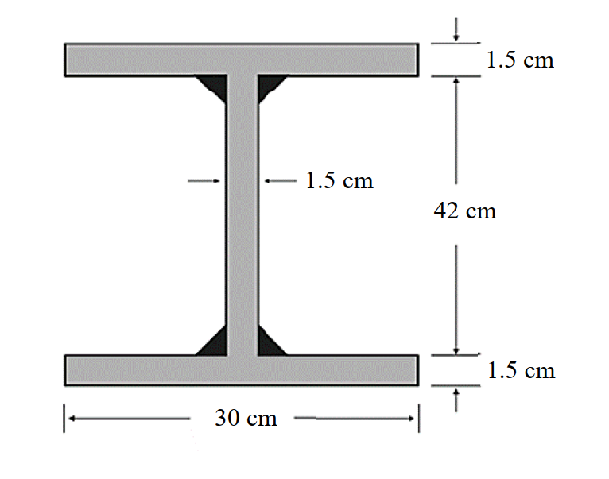
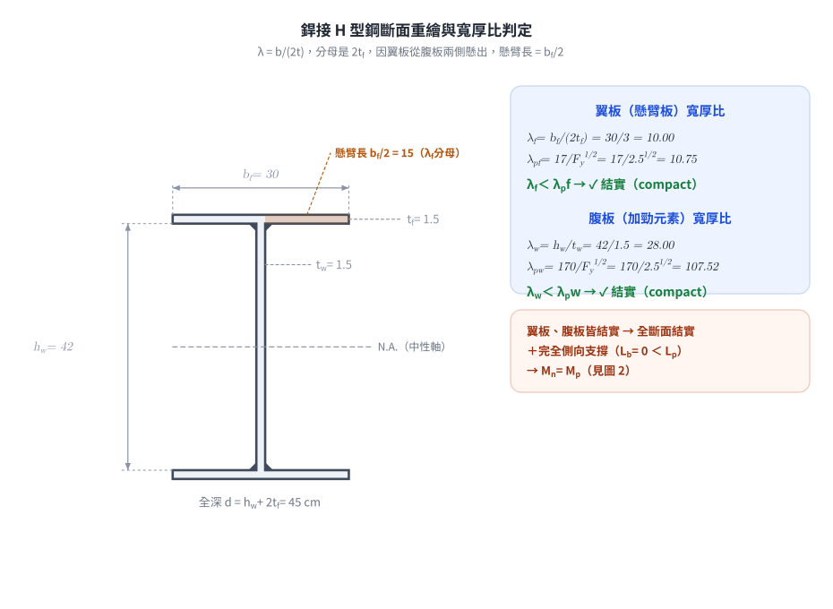
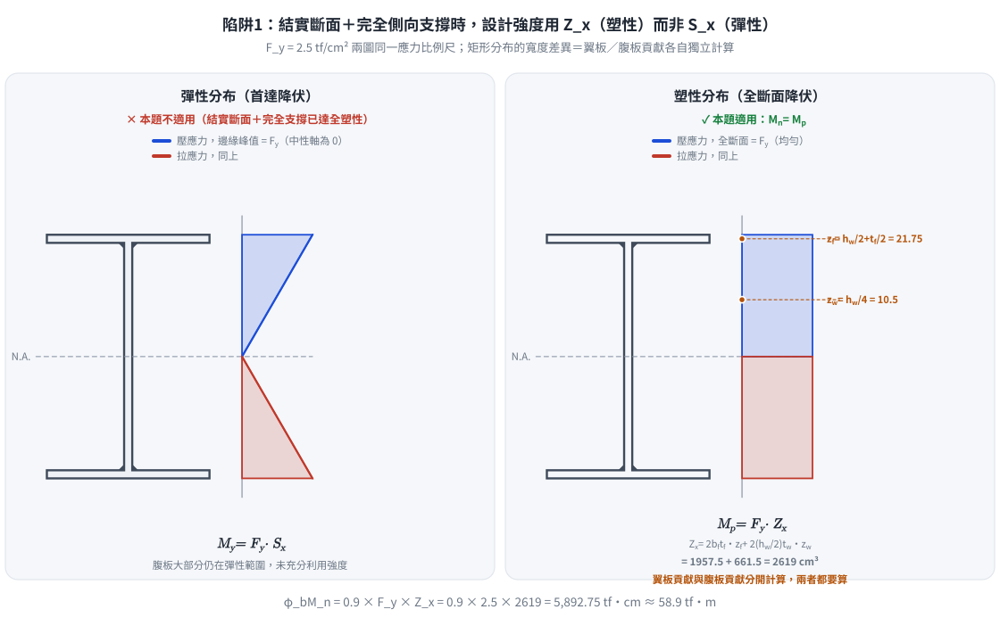

# 考題編號：SS-2025-1

**主分類：** `SS-U1-2` 梁桿件
**副分類：** 無
**設計法：** LRFD
**標籤：** `梁桿件` `撓曲構材` `結實斷面` `塑性彎矩` `寬厚比` `銲接組合斷面` `殘留應力` `完全側向支撐` `φbMn` `塑性斷面模數` `干擾資訊辨識`

---

## 1. 原始題目重述 (Problem Restatement)

> **原卷逐字**：「載重強度係數設計法（LRFD）**結實梁**，強軸彎矩強度計算：H 型鋼接鋼梁斷面如下圖，假設此梁有**完全之側支撐**，**腹板（web）不會產生局部挫屈**。假設**銲接面積不計入斷面性質**，若鋼材之 $F_y = 2.5$ tf/cm² 及**銲接殘餘應力為 1.16 tf/cm²**，試求此梁斷面強軸之**設計彎矩強度 $M_{nx}$**。（25 分）」

**斷面尺寸（由圖）：**

- 翼板寬 $b_f = 30$ cm，翼板厚 $t_f = 1.5$ cm（上下各一）
- 腹板淨高 $h_w = 42$ cm，腹板厚 $t_w = 1.5$ cm
- 全深 $d = 42 + 2(1.5) = 45$ cm

**題目已「送分」的三個條件（務必逐條引用回答）：**

| 原卷用語 | 解題上的意義 |
|------|------|
| 「**結實梁**」 | 題目已宣告斷面等級；但**仍應驗算翼板 $\lambda_f$ 以示驗證**（腹板已被下一條豁免） |
| 「腹板（web）**不會產生局部挫屈**」 | 免除腹板 $\lambda_w$ 檢核與 WLB 極限狀態 |
| 「有**完全之側支撐**」 | $L_b = 0 < L_p$ → 免除 LTB，$M_n = M_p$ |
| 「銲接面積不計入斷面性質」 | 填角銲三角形不計入 $A$、$Z_x$（否則 $Z_x$ 會略增） |
| 「銲接殘餘應力 1.16 tf/cm²」 | **干擾資訊**——只用於 $M_r$、$L_r$（LTB），本題已免除 |

**注意題目問法**：原卷寫「**設計**彎矩強度 $M_{nx}$」，符號用的是標稱值 $M_n$，但形容詞是「設計」。**兩者都應寫出**：$M_{nx}$（標稱）與 $\phi_b M_{nx}$（設計）。

*圖說：銲接組合 H 型鋼斷面（正面視圖）。翼板寬度 $b_f = 30\text{ cm}$，翼板厚度 $t_f = 1.5\text{ cm}$（上下翼板相同）；腹板淨高 $h_w = 42\text{ cm}$，腹板厚度 $t_w = 1.5\text{ cm}$；全深 $d = 42 + 2 \times 1.5 = 45\text{ cm}$。腹板與翼板之連接以填角銲施作（圖中黑色三角形區域）。翼板寬厚比 $\lambda_f = b_f/(2t_f) = 30/3 = 10.0$，腹板寬厚比 $\lambda_w = h_w/t_w = 42/1.5 = 28.0$。*

---

## 2. 考題核心精神與出題者意圖 (Core Concepts & Examiner's Intent)

**核心觀念：結實斷面 + 完全側向支撐 → 設計強度即為塑性彎矩**

本題考查三層判斷能力：
1. 能正確計算銲接 H 型鋼的**寬厚比**，並與 $\lambda_p$ 比較判斷是否為結實斷面
2. 能利用「完全側向支撐」條件，直接跳過 LTB 計算
3. 能正確計算組合斷面的**塑性斷面模數 $Z_x$**

**出題者關鍵考點：**
- 翼板寬厚比計算：$\lambda = b_f / (2t_f)$（注意分母是 $2t_f$，因為翼板是懸臂板）
- $\lambda_p = 17/\sqrt{F_y}$（$F_y$ 以 tf/cm² 代入）
- 殘留應力 $F_r = 1.16$ tf/cm² 是「銲接組合斷面」特徵值，提醒考生此題是銲接斷面
- 題目明示「完全側向支撐」→ $L_b = 0 < L_p$ → 無 LTB → $M_n = M_p$

---

## 3. 解題戰略地圖與陷阱分析 (Strategic Roadmap & Trap Analysis)

**步驟規劃：**
1. 計算翼板、腹板寬厚比，與 $\lambda_p$ 比較 → 確認結實斷面
2. 用完全側向支撐條件確認 $M_n = M_p$
3. 計算塑性斷面模數 $Z_x$
4. 計算 $\phi_b M_n = 0.9 \times F_y \times Z_x$

**關鍵陷阱：**

> ⚠️ **陷阱1：誤用 Sx 而非 Zx**
> 結實斷面且完全支撐時，$M_n = M_p = F_y Z_x$（塑性），不是 $F_y S_x$（彈性）。這是最常見的粗心失分點。

> ⚠️ **陷阱2：寬厚比計算錯誤**
> 翼板寬厚比 $\lambda = b_f / (2t_f)$，分母是 $2t_f$ 而非 $t_f$。因為翼板從腹板兩側懸出，懸臂長度是 $b_f/2$，所以 $\lambda = (b_f/2)/t_f = b_f/(2t_f)$。

> ⚠️ **陷阱3：誤將殘留應力帶入 Mp 計算**
> 殘留應力 $F_r = 1.16$ tf/cm² 影響的是 $M_r$（用於計算 $L_r$）和 LTB 計算，但 $M_p = F_y Z_x$ 不受殘留應力影響。本題有完全支撐，LTB 不控制，$F_r$ 對本題計算無直接影響。

> ⚠️ **陷阱4：Zx 計算漏算腹板貢獻**
> 組合斷面 $Z_x$ 包含翼板和腹板兩部分，腹板貢獻 $= 2 \times (h_w/2) \times t_w \times (h_w/4)$，不可漏算。

---

## 3.5 變數層次分析（Variable Hierarchy Analysis）

> 複習提示：解題後，在每個卡住的知識點「卡關?」欄標記 `⚠`；第二次複習時只看有 `⚠` 的項目。

**最終目標：** 確認銲接 H 型鋼為結實斷面 + 完全側向支撐，計算塑性斷面模數 $Z_x$，求設計撓曲強度 $\phi_b M_{nx}$

### 主要公式（$\boxed{\phantom{x}}$ = 未知，待推導）

**Step 1：寬厚比判斷**
$$\boxed{\lambda_f} = \frac{b_f}{2t_f}, \quad \lambda_{pf} = \frac{17}{\sqrt{F_y}} \quad \Rightarrow \lambda_f < \lambda_{pf}?$$
$$\boxed{\lambda_w} = \frac{h_w}{t_w}, \quad \lambda_{pw} = \frac{170}{\sqrt{F_y}} \quad \Rightarrow \lambda_w < \lambda_{pw}?$$

**Step 2：LTB 判斷**
$$L_b = 0 < L_p \quad \Rightarrow M_n = M_p$$

**Step 3：塑性斷面模數**
$$\boxed{Z_x} = 2 b_f t_f \left(\frac{h_w}{2} + \frac{t_f}{2}\right) + \frac{t_w h_w^2}{4}$$

**Step 4：設計強度**
$$\boxed{\phi_b M_{nx}} = 0.9 \times F_y \times \boxed{Z_x}$$

### L1：題目直接給定

| 符號 | 數值 | 說明 |
|------|------|------|
| $b_f$ | 30 cm | 翼板寬度 |
| $t_f$ | 1.5 cm | 翼板厚度 |
| $h_w$ | 42 cm | 腹板淨高 |
| $t_w$ | 1.5 cm | 腹板厚度 |
| $F_y$ | 2.5 tf/cm² | 降伏強度 |
| $F_r$ | 1.16 tf/cm² | 殘留應力（銲接組合斷面，本題不需代入計算） |
| 側向支撐條件 | 完全側向支撐 | 即 $L_b = 0$，LTB 不控制 |
| 設計法 | LRFD | $\phi_b = 0.9$ |

### L2：需知識點推導

**Step 1：寬厚比計算**

| 符號 | 公式 / 來源 | 卡關? |
|------|------------|:-----:|
| $\lambda_f$ | $b_f/(2t_f) = 30/3 = 10.0$ | |
| $\lambda_{pf}$ | $17/\sqrt{F_y} = 17/\sqrt{2.5} = 10.75$ | |
| $\lambda_w$ | $h_w/t_w = 42/1.5 = 28.0$ | |
| $\lambda_{pw}$ | $170/\sqrt{F_y} = 170/\sqrt{2.5} = 107.5$ | |
| 結論 | $\lambda_f < \lambda_{pf}$ 且 $\lambda_w < \lambda_{pw}$ → 結實斷面 | |

**Step 2：LTB 判斷**

| 符號 | 公式 / 來源 | 卡關? |
|------|------------|:-----:|
| $L_b$ | 完全側向支撐 → $L_b = 0$ | |
| 結論 | $L_b < L_p$ → 無 LTB，$M_n = M_p$ | |

**Step 3：塑性斷面模數 $Z_x$**

| 符號 | 公式 / 來源 | 卡關? |
|------|------------|:-----:|
| $Z_{x,\text{flange}}$ | $2 \times 30 \times 1.5 \times (21 + 0.75) = 1957.5$ cm³ | |
| $Z_{x,\text{web}}$ | $2 \times 21 \times 1.5 \times 10.5 = 661.5$ cm³ ⚠ 常見卡關 | |
| $Z_x$ | $1957.5 + 661.5 = 2619$ cm³ | |

**Step 4：設計強度**

| 符號 | 公式 / 來源 | 卡關? |
|------|------------|:-----:|
| $M_p$ | $F_y \times Z_x = 2.5 \times 2619 = 6547.5$ tf·cm | |
| $\phi_b M_{nx}$ | $0.9 \times 6547.5 = 5892.75$ tf·cm | |

### L3：深層知識（不懂就卡住）

| 知識點 | 說明 | 補強頁 | 卡關? |
|--------|------|:------:|:-----:|
| 翼板寬厚比分母是 $2t_f$ | 翼板從腹板懸出，懸臂長 $b_f/2$，故 $\lambda = (b_f/2)/t_f = b_f/(2t_f)$ | [[COMPACT-SECTION]] | |
| $\lambda_p$ 公式（銲接 vs 熱軋皆同） | $\lambda_{pf} = 17/\sqrt{F_y}$（tf/cm² 制），不因斷面類型而異 | [[COMPACT-SECTION]] | |
| 完全側向支撐 → $M_n = M_p$（直接跳過 LTB） | $L_b = 0 < L_p$，三段判斷邏輯的第一段 | [[ltb-3zone]] · [[LATERAL-TORSIONAL-BUCKLING]] | |
| $Z_x$ 包含腹板貢獻 | 腹板分上下兩半，各部分 $= (h_w/2) \times t_w \times (h_w/4)$，不可漏算 | [[plastic-zx]] | |
| 殘留應力 $F_r$ 不影響 $M_p$ | $M_p = F_y Z_x$，殘留應力只影響 $M_r$ 和 $L_r$（LTB 相關），本題完全支撐故無影響 | [[RESIDUAL-STRESS]] | |
| $\phi_b = 0.9$（彎曲） | 不可與 $\phi_c = 0.85$（壓力）混用 | [[lrfd-phi-values]] | |

---

## 4. 步驟化詳細計算過程 (Step-by-Step Detailed Calculation)

### Step 1：計算斷面尺寸確認

| 部位 | 尺寸 |
|------|------|
| 翼板寬 $b_f$ | 30 cm |
| 翼板厚 $t_f$ | 1.5 cm |
| 腹板高 $h_w$ | 42 cm |
| 腹板厚 $t_w$ | 1.5 cm |
| 全深 $d$ | $42 + 2 \times 1.5 = 45$ cm |

---

### Step 2：結實斷面檢核

**翼板寬厚比（不加勁元素，懸臂板）：**
$$\lambda_f = \frac{b_f}{2t_f} = \frac{30}{2 \times 1.5} = \frac{30}{3} = 10.0$$

$$\lambda_{pf} = \frac{17}{\sqrt{F_y}} = \frac{17}{\sqrt{2.5}} = \frac{17}{1.581} = 10.75$$

$$\lambda_f = 10.0 < \lambda_{pf} = 10.75 \quad \Rightarrow \quad \text{翼板結實} \checkmark$$

**腹板寬厚比（加勁元素，純彎）——題目已宣告「腹板不會產生局部挫屈」，此處僅作驗證：**
$$\lambda_w = \frac{h_w}{t_w} = \frac{42}{1.5} = 28.0$$

$$\lambda_{pw} = \frac{170}{\sqrt{F_y}} = \frac{170}{\sqrt{2.5}} = \frac{170}{1.581} = 107.5$$

$$\lambda_w = 28.0 < \lambda_{pw} = 107.5 \quad \Rightarrow \quad \text{腹板結實} \checkmark$$

$$\boxed{\text{翼板、腹板均為結實 → 斷面為結實斷面（Compact Section）}}$$

*圖 1　斷面重繪與寬厚比判定。取代原始截圖，把 λ 計算過程畫成看得見的懸臂長：翼板從腹板兩側懸出，故懸臂長為 $b_f/2$（橘色色塊區），這是 $\lambda_f = b_f/(2t_f)$ 分母是 $2t_f$ 而非 $t_f$ 的幾何來源。攔下的錯：把 $\lambda_f$ 算成 $b_f/t_f$（漏除以 2）而誤判斷面等級。*

---

### Step 3：側向扭轉挫屈（LTB）判斷

題目明示**完全側向支撐**（梁的整個長度均有側向束制），即 $L_b = 0$：

$$L_b = 0 < L_p \quad \Rightarrow \quad \text{無側扭挫屈，} M_n = M_p$$

> 💡 **策略提示：** 有了「完全側向支撐」這個條件，就不需要計算 $L_p$、$r_{ts}$、$C_b$ 等複雜參數，直接確認 $M_n = M_p$。

---

### Step 4：計算塑性斷面模數 $Z_x$

塑性斷面模數 $Z_x$ = 中性軸上下各部分面積 × 各面積形心到中性軸距離之代數和。

對於對稱 H 型鋼（中性軸在腹板中點）：

$$Z_x = \underbrace{2 \times b_f t_f \times \left(\frac{h_w}{2} + \frac{t_f}{2}\right)}_{\text{翼板貢獻（上下各一）}} + \underbrace{2 \times \frac{h_w}{2} \times t_w \times \frac{h_w}{4}}_{\text{腹板貢獻（上下各半）}}$$

**翼板貢獻：**
$$Z_{x,\text{flange}} = 2 \times (30 \times 1.5) \times \left(\frac{42}{2} + \frac{1.5}{2}\right) = 2 \times 45 \times (21 + 0.75) = 2 \times 45 \times 21.75 = 1{,}957.5 \text{ cm}^3$$

**腹板貢獻：**
$$Z_{x,\text{web}} = 2 \times \frac{42}{2} \times 1.5 \times \frac{42}{4} = 2 \times 21 \times 1.5 \times 10.5 = 2 \times 330.75 = 661.5 \text{ cm}^3$$

**總塑性斷面模數：**
$$Z_x = 1{,}957.5 + 661.5 = \mathbf{2{,}619 \text{ cm}^3}$$

---

### Step 5：計算塑性彎矩 $M_p$

$$M_p = F_y \times Z_x = 2.5 \times 2{,}619 = 6{,}547.5 \text{ tf·cm}$$

---

### Step 6：計算設計撓曲強度 $\phi_b M_n$

由 Step 2–3 確認：$M_n = M_p$（結實斷面 + 完全側向支撐 + 腹板不局部挫屈）

**標稱彎矩強度：**

$$\boxed{M_{nx} = M_p = 6{,}547.5 \text{ tf·cm} = 65.475 \text{ tf·m}}$$

**設計彎矩強度（$\phi_b = 0.90$）：**

$$\phi_b M_n = \phi_b M_p = 0.9 \times 6{,}547.5 = \mathbf{5{,}892.75 \text{ tf·cm}}$$

$$\boxed{\phi_b M_{nx} = 5{,}892.75 \text{ tf·cm} = 58.93 \text{ tf·m}}$$

> 原卷問「設計彎矩強度 $M_{nx}$」，符號與形容詞不一致，**兩個數字都寫出來**最安全：
> 標稱 $M_{nx} = 6{,}547.5$ tf·cm；設計 $\phi_bM_{nx} = 5{,}892.75$ tf·cm。

**旁證：形狀因數合理性檢查**

$$I_x = 2\left[\frac{30(1.5)^3}{12} + 45(21.75)^2\right] + \frac{1.5(42)^3}{12} = 42{,}592.5 + 9{,}261 = 51{,}853.5 \text{ cm}^4$$

$$S_x = \frac{2I_x}{d} = \frac{2(51{,}853.5)}{45} = 2{,}304.6 \text{ cm}^3 \quad \Rightarrow \quad \frac{Z_x}{S_x} = \frac{2{,}619}{2{,}304.6} = \mathbf{1.136}$$

I 型斷面的形狀因數理論上約 1.10～1.18，**1.136 落在正常範圍內**，可反證 $Z_x = 2{,}619$ cm³ 沒有算錯（若漏算腹板貢獻，$Z_x = 1{,}957.5$，$Z_x/S_x = 0.849 < 1$ —— 塑性模數小於彈性模數在物理上不可能，可立即察覺錯誤）。

參考：$M_y = F_yS_x = 2.5 \times 2{,}304.6 = 5{,}761.5$ tf·cm（首次降伏彎矩，本題不是答案）。

*圖 2　彈性（$S_x$）vs 塑性（$Z_x$）應力分布對照。左：彈性分布下應力沿深度線性變化、僅邊緣達 $F_y$，用 $S_x$ 但本題不適用；右：結實斷面＋完全側向支撐已達全斷面降伏，應力為矩形分布，翼板與腹板各自的力臂 $z_f$、$z_w$ 分開計算後加總才是 $Z_x$。攔下的錯：結實斷面＋完全支撐時仍誤用 $S_x$ 而非 $Z_x$；以及計算 $Z_x$ 時漏算腹板貢獻。*

---

## 5. 關鍵爭議點與進階探討 (Critical Issues & Advanced Discussion)

### 銲接組合斷面殘留應力的角色

本題給出 $F_r = 1.16$ tf/cm²（銲接組合斷面殘留應力），許多考生困惑此值在何處使用：

| 殘留應力影響的量 | 計算式 | 本題是否用到 |
|----------------|--------|-------------|
| $M_r$（彈性限制彎矩）| $M_r = (F_y - F_r) S_x$ | **否**（完全支撐，不算 LTB） |
| $L_p$（塑性極限無支撐長度）| 查表，含 $r_y$、$F_y$ | **否**（同上）|
| $L_r$（彈性極限無支撐長度）| 含 $F_r$ 的公式 | **否**（同上）|
| $M_p$（塑性彎矩）| $M_p = F_y Z_x$ | 完全不含 $F_r$ |

**結論：** 本題的 $F_r = 1.16$ tf/cm² 是「給出但不需計算」的資訊（題目暗示考生注意斷面類型），**不影響最終結果**。在考場上，應說明「因完全側向支撐，$L_b < L_p$，無需計算 LTB，故殘留應力不影響本題計算」。

### 銲接組合斷面 vs. 熱軋斷面的殘留應力差異

| 斷面類型 | $F_r$（tf/cm²） | 說明 |
|---------|---------------|------|
| 熱軋斷面 | 0.7 | 翼板端部殘留壓應力較低 |
| 銲接組合斷面 | 1.16 | 翼板-腹板銲縫區殘留壓應力更高 |

銲接熱收縮在翼板-腹板接合處產生更大殘留應力，使 $M_r = (F_y - F_r)S_x$ 較小、$L_r$ 較短，LTB 的彈性範圍縮小。這也是為什麼規範對銲接組合斷面使用較大的 $F_r$。

### 翼板寬厚比恰好接近極限值的設計意義

本題 $\lambda_f = 10.0$，$\lambda_{pf} = 10.75$，餘裕僅 **7.5%**。翼板越**薄** $\lambda_f$ 越大（$\lambda_f = b_f/2t_f$，$t_f$ 在分母）：

| $t_f$ (cm) | $\lambda_f = 30/(2t_f)$ | vs $\lambda_{pf} = 10.75$ | 判定 |
|:---:|:---:|:---:|:---:|
| 1.6 | 9.38 | < | 結實（餘裕 12.8%） |
| **1.5（本題）** | **10.00** | **<** | **結實（餘裕 7.5%）** |
| 1.4 | 10.71 | < | 結實（餘裕僅 0.4%，幾乎踩線） |
| 1.3 | 11.54 | **>** | **非結實** → $M_n$ 須依 FLB 內插折減 |

也就是說，翼板只要**再薄 0.2 cm** 就會掉出結實等級，$M_n$ 不再等於 $M_p$。出題者刻意把 $t_f$ 設在 1.5 cm，考驗的正是「$\lambda_f$ 分母是 $2t_f$ 而非 $t_f$」這一步有沒有算對——若誤算成 $b_f/t_f = 20 \gg 10.75$，會誤判為細長翼板而整題方向錯誤。

> 題幹雖已寫明「結實梁」，仍應把 $\lambda_f = 10.0 < 10.75$ 算出來作為驗證（否則等於沒展現斷面分級的能力）。

### 「完全之側支撐」到底相當於多長？（量化理解）

題目說「完全之側支撐」即 $L_b \to 0$，但值得知道**這根梁本來能撐多長不需側撐**：

$$I_y = \frac{2(1.5)(30)^3}{12} + \frac{42(1.5)^3}{12} = 6{,}750 + 11.8 = 6{,}762 \text{ cm}^4，\quad r_y = \sqrt{\frac{6{,}762}{153}} = 6.65 \text{ cm}$$

$$L_p = \frac{80 r_y}{\sqrt{F_y}} = \frac{80(6.65)}{1.581} = 336 \text{ cm} = 3.36 \text{ m}$$

即**只要側撐間距不超過 3.36 m，就已達成本題所需的「$M_n = M_p$」**，並不需要真的連續支撐。這個數字也說明本斷面（$b_f/d = 30/45 = 0.67$，翼板相對寬）弱軸剛度不差，$L_p$ 比一般深梁長。

### 考場安全答法

1. 引用題幹三個豁免條件：**結實梁**、**腹板不局部挫屈**、**完全側支撐**
2. 驗證 $\lambda_f = b_f/(2t_f) = 30/3 = 10.0 < \lambda_{pf} = 17/\sqrt{2.5} = 10.75$（結實 ✓）
3. 完全側支撐 → $L_b = 0 < L_p$ → 無 LTB → $M_n = M_p$
4. $Z_x = \underbrace{2(30)(1.5)(21.75)}_{1957.5} + \underbrace{1.5(42)^2/4}_{661.5} = 2{,}619$ cm³
5. 標稱：$M_{nx} = 2.5 \times 2{,}619 = 6{,}547.5$ tf·cm；設計：$\phi_bM_{nx} = 0.9 \times 6{,}547.5 = \mathbf{5{,}892.75}$ tf·cm $= 58.93$ tf·m
6. 一句話交代干擾資訊：「銲接殘餘應力 1.16 tf/cm² 僅用於 $M_r = (F_y - F_r)S_x$ 與 $L_r$ 之計算，本題因完全側支撐而不需使用」

---

## 6. 依最新規範（AISC 360-16／-22）對照

> **主答依據**：內政部「鋼構造建築物鋼結構設計技術規範」**民國 99 年（2010）修正版**。以 AISC 360-16 為基礎之修訂版**尚未發布**，故僅列為對照。本題為 114 年（2025 年）考題，仍應依 2010 規範作答。

### 6.1 結論不變：$\phi_b M_{nx}$ 兩規範完全相同

結實斷面＋完全側支撐時，兩規範都是 $M_n = M_p = F_yZ_x$、$\phi_b = 0.90$：

$$\phi_b M_{nx} = 0.9 \times 2.5 \times 2{,}619 = \mathbf{5{,}892.75 \text{ tf·cm}} \quad (\text{兩規範同值})$$

$Z_x$ 是純幾何量、$\phi_b = 0.90$ 自 AISC LRFD 1993 起未變，故**本題答案不受規範改版影響**。

### 6.2 翼板結實界限：差異 0.96%，判定相同

| 項目 | 台灣 2010 | AISC 360-16 §B4 Table B4.1b | 本題 $\lambda_f = 10.00$ |
|------|:---:|:---:|:---:|
| $\lambda_{pf}$ | $\dfrac{17}{\sqrt{F_y}} = 10.75$ | $0.38\sqrt{\dfrac{E}{F_y}} = 0.38\sqrt{\dfrac{2040}{2.5}} = 10.85$ | **結實 ✓（兩者皆然）** |
| 餘裕 | 7.5% | 8.5% | — |
| $\lambda_{rf}$ | $\dfrac{25}{\sqrt{F_y}} = 15.81$ | $0.95\sqrt{\dfrac{k_cE}{F_L}}$（銲接組合斷面用 $k_c$） | — |

$17/\sqrt{F_y}$ 與 $0.38\sqrt{E/F_y}$ 在 $E = 2040$ tf/cm² 時本質等價（$0.38\sqrt{2040} = 17.16 \approx 17$），故**任何 $F_y$ 下兩者差異都在 1% 內**。腹板界限同理：$170/\sqrt{F_y} = 107.52$ vs $3.76\sqrt{E/F_y} = 107.41$。

> **一個新規範才有的細節**：AISC 360-16 對**銲接組合斷面**的 $\lambda_{rf}$ 引入腹板挫屈係數 $k_c = 4/\sqrt{h/t_w}$（限 $0.35 \leq k_c \leq 0.76$），反映薄腹板對翼板的支撐較弱。本題 $h/t_w = 28$ → $k_c = 4/\sqrt{28} = 0.756$，仍在上限附近，影響甚微；且本題翼板已判結實，$\lambda_{rf}$ 根本用不到。台灣 2010 規範無此 $k_c$ 修正。

### 6.3 殘留應力 $F_r$：AISC 360 已**完全取消**這個參數

這是本題「干擾資訊」在新規範下最有趣的變化：

| 項目 | 台灣 2010／AISC LRFD 1993 | AISC 360-16 |
|------|------|------|
| LTB 轉折彎矩 | $M_r = (F_y - F_r)S_x$，$F_r$ 分熱軋 0.7、**銲接 1.16** tf/cm² | $0.7F_yS_x$（**單一係數，不分熱軋／銲接**） |
| 本題數值 | $(2.5 - 1.16)(2304.6) = 3{,}088$ tf·cm | $0.7(2.5)(2304.6) = 4{,}033$ tf·cm |
| 差異 | — | **+30.6%** |

AISC 360-05 起以固定的 $0.7F_y$ 取代 $(F_y - F_r)$，理由是：$F_r$ 的區分（熱軋 10 ksi／銲接 16.5 ksi）在統計上難以支持，且 $0.7F_y$ 對常用鋼材（$F_y = 50$ ksi 時 $0.3F_y = 15$ ksi）已能涵蓋兩者。**因此「銲接殘餘應力 1.16 tf/cm²」這個數字在 AISC 360-16 中已不存在**——若本題改依新規範出題，這個干擾資訊連放進題目的餘地都沒有。

$M_r$ 提高 30.6% 會使 $L_r$ 明顯縮短（本斷面：台灣 2010 約 13.4 m → AISC 360-16 約 11.0 m），但本題完全側支撐，**不影響答案**。

### 6.4 對照結論

| 項目 | 台灣 2010（主答） | AISC 360-16／-22 | 差異 |
|------|:---:|:---:|:---:|
| $\lambda_{pf}$（翼板） | 10.75 | 10.85 | +0.9%，判定同為結實 |
| $\lambda_{pw}$（腹板） | 107.52 | 107.41 | −0.1%，判定同 |
| $Z_x$ | 2,619 cm³ | 同 | 無 |
| $L_p$ | 336 cm | 334 cm | −0.6% |
| **$M_{nx}$（標稱）** | **6,547.5 tf·cm** | **同** | **無** |
| **$\phi_bM_{nx}$（設計）** | **5,892.75 tf·cm** | **同** | **無** |
| $M_r$（本題未使用） | 3,088 tf·cm | 4,033 tf·cm | +30.6% |
| 殘留應力 $F_r$ | 銲接 1.16 tf/cm² | **參數已取消** | 概念變更 |

**兩規範答案完全一致**；差異僅在本題已被豁免的 LTB 相關參數上。

---

*圖解補繪：2026-08-11（向量圖，腳本 `gen_SS-2025-1.py`，可重跑；圖上所有數值均由腳本自 L1 輸入公式計算得出，非手動填寫）*
*修正日期：2026-08-22（勘誤：§1 改為原卷逐字重述，補入題幹三個豁免條件（結實梁／腹板不局部挫屈／銲接面積不計入）與「設計彎矩強度 $M_{nx}$」的問法歧義；Step 6 同時給出標稱 $M_{nx} = 6{,}547.5$ 與設計 $\phi_bM_{nx} = 5{,}892.75$ tf·cm，並補 $S_x = 2{,}304.6$、形狀因數 1.136 之合理性反證；修正 §5 中「翼板稍厚 $t_f = 1.4$」的厚薄方向錯誤（$t_f$ 在分母，變薄才使 $\lambda_f$ 變大），改為完整 $t_f$ 敏感度表；新增 $L_p = 3.36$ m 之量化說明與 §6 最新規範對照（含 AISC 360 已取消 $F_r$ 參數之說明）。$Z_x$、$M_p$、$\phi_bM_n$ 三個主答數值本即正確，未變動）*
*驗證狀態：unverified*
