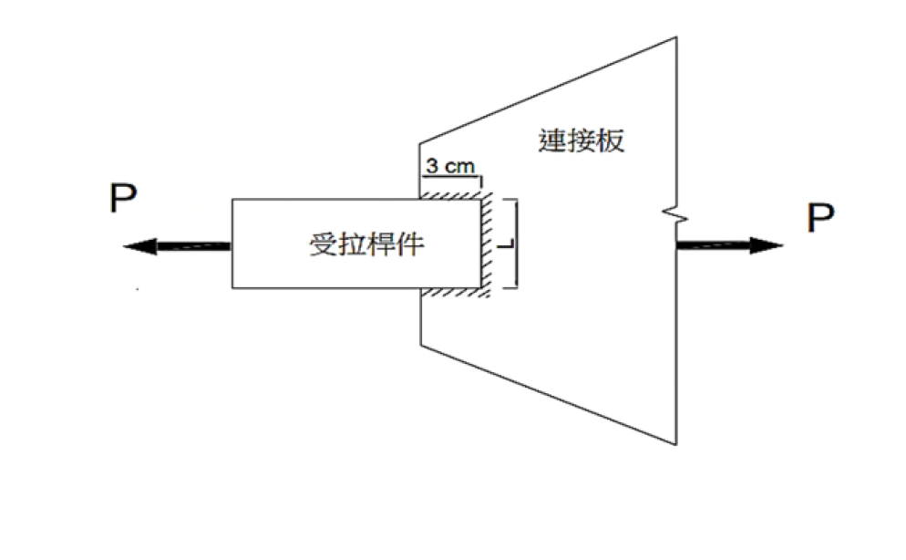

# 考題編號：SS-2025-2

**主分類：** `SS-U1-1` 拉力及壓力桿件
**副分類：** 無
**設計法：** ASD
**標籤：** `拉力桿件` `容許應力法` `剪力遲滯` `U值` `淨截面斷裂` `全斷面降伏` `最佳化` `銲接拉力接合`

---

## 1. 原始題目重述 (Problem Restatement)

一鋼板斷面寬 $L$ cm、厚 2 cm，以銲接方式連接至一厚 1 cm、寬 3 cm 的連接板（銲接長度 = 3 cm，沿銲縫方向傳遞拉力）。

**給定：**
- 降伏強度：$F_y = 2.5$ tf/cm²
- 極限強度：$F_u = 4.1$ tf/cm²
- 設計法：ASD（容許應力設計法）

試求使容許拉力 $P$ 最大之板寬 $L$（cm），並求此時最大容許拉力 $P_{max}$。

*圖說：受拉桿件（矩形鋼板，寬 $L$ cm、厚 2 cm）由左側承受拉力 $P$，右端以銲接（銲縫長 3 cm，斜線陰影區）連接至三角形連接板（厚 1 cm、寬 3 cm）；連接板右側再承受拉力 $P$（固定端）。鋼板僅在右端面（一個面）與連接板接合，鋼板斷面形心至接合面的距離為 $\bar{x} = L/2$，故剪力遲滯係數 $U = 1 - \bar{x}/L_{weld} = 1 - L/6$。板寬 $L$ 越大，剪力遲滯越嚴重；最佳板寬使容許拉力達到最大值。*

---

## 2. 考題核心精神與出題者意圖 (Core Concepts & Examiner's Intent)

**核心觀念：剪力遲滯係數 U 的最佳化問題——兩種破壞模式互相制衡**

本題的關鍵在於：
- **全斷面降伏（GY）** 的容許力 $\propto L$（隨板寬增加而線性增加）
- **淨截面斷裂（NSF）** 的容許力含剪力遲滯效應：$U = 1 - L/(2 \times 3) = 1 - L/6$，隨 $L$ 增大而 $U$ 減小

兩者的乘積形成一個拋物線形態的 NSF 容許力曲線，其最高點即為最佳解。

**出題者測驗重點：**
- 剪力遲滯公式 $U = 1 - \bar{x}/L_{weld}$（此題 $\bar{x} = L/2$，$L_{weld} = 3$ cm）
- ASD 三種極限狀態：全斷面降伏（$0.6F_y A_g$）、淨截面斷裂（$0.5F_u A_e$）
- 最佳化：對 $P_{NSF}(L)$ 求極值，得 $L_{opt}$

---

## 3. 解題戰略地圖與陷阱分析 (Strategic Roadmap & Trap Analysis)

**步驟規劃：**
1. 建立 $A_g$、$U$、$A_e$ 的 $L$ 函數
2. 寫出 GY 與 NSF 的容許力公式（均為 $L$ 的函數）
3. 對 NSF 函數求極值（微分 = 0 或配方）
4. 確認極值處 GY 是否比 NSF 更緊
5. 得出 $L_{opt}$ 和 $P_{max}$

**關鍵陷阱：**

> ⚠️ **陷阱1：剪力遲滯公式的 $\bar{x}$ 認定**
> $\bar{x}$ = 受拉斷面形心到**銲縫面**的距離。板寬 $L$ 的鋼板，只有一側（一個面）銲接至連接板，形心距離連接面為 $L/2$。此值隨板寬 $L$ 變化，是本題最佳化的核心。

> ⚠️ **陷阱2：$A_e$ 非 $A_g$**
> 銲接接合無螺栓孔，An = Ag，但剪力遲滯使 $A_e = U \cdot A_g < A_g$（除非 $U = 1$）。考生常誤認銲接接合不需扣減面積。

> ⚠️ **陷阱3：NSF 控制不等於極值**
> NSF 函數 $4.1L(1 - L/6)$ 有其自身極大值點，需確認此極值點處 NSF 仍是控制限制狀態（即 NSF < GY），才能確認全局最大 $P$。

---

## 3.5 變數層次分析（Variable Hierarchy Analysis）

> 複習提示：解題後，在每個卡住的知識點「卡關?」欄標記 `⚠`；第二次複習時只看有 `⚠` 的項目。

**最終目標：** 求使 ASD 容許拉力最大的板寬 $L$，透過對 NSF 容許力函數求極值得到 $L_{opt}$ 和 $P_{max}$

### 主要公式（$\boxed{\phantom{x}}$ = 未知，待推導）

**Step 1：面積與 U 函數化**
$$\boxed{U} = 1 - \frac{\bar{x}}{L_{weld}} = 1 - \frac{L/2}{3} = 1 - \frac{L}{6}$$
$$\boxed{A_e} = U \cdot A_g = \left(1 - \frac{L}{6}\right) \times 2L$$

**Step 2：ASD 容許力**
$$P_{GY} = 0.6 F_y A_g = 3L \quad \text{（線性）}$$
$$\boxed{P_{NSF}} = 0.5 F_u \boxed{A_e} = 4.1L\!\left(1 - \frac{L}{6}\right) \quad \text{（拋物線）}$$

**Step 3：最佳化**
$$\frac{d P_{NSF}}{dL} = 4.1\!\left(1 - \frac{L}{3}\right) = 0 \quad \Rightarrow \boxed{L_{opt} = 3 \text{ cm}}$$

**Step 4：最大容許力**
$$\boxed{P_{max}} = P_{NSF}(3) = 4.1 \times 3 \times 0.5 = 6.15 \text{ tf}$$

### L1：題目直接給定

| 符號 | 數值 | 說明 |
|------|------|------|
| 板厚 | 2 cm | 受拉鋼板厚度（固定） |
| 連接板寬 | 3 cm | 即有效銲縫長度 $L_{weld} = 3$ cm |
| $F_y$ | 2.5 tf/cm² | 降伏強度 |
| $F_u$ | 4.1 tf/cm² | 極限強度 |
| 設計法 | ASD | 容許應力設計法 |
| $L$ | 待求 | 使容許拉力最大的板寬 |

### L2：需知識點推導

**Step 1：幾何函數建立**

| 符號 | 公式 / 來源 | 卡關? |
|------|------------|:-----:|
| $\bar{x}$ | $L/2$（板形心到銲縫面，隨 $L$ 變化）⚠ 常見卡關 | |
| $U$ | $1 - (L/2)/3 = 1 - L/6$ | |
| $A_g$ | $L \times 2 = 2L$ cm² | |
| $A_e$ | $2L(1-L/6)$（銲接無孔，$A_n = A_g$） | |

**Step 2：ASD 容許力**

| 符號 | 公式 / 來源 | 卡關? |
|------|------------|:-----:|
| $P_{GY}$ | $0.6 \times 2.5 \times 2L = 3L$ tf | |
| $P_{NSF}$ | $0.5 \times 4.1 \times 2L(1-L/6) = 4.1L(1-L/6)$ tf | |

**Step 3：最佳化求極值**

| 符號 | 公式 / 來源 | 卡關? |
|------|------------|:-----:|
| $L_{opt}$ | $dP_{NSF}/dL = 4.1(1-L/3) = 0$ → $L = 3$ cm | |
| 驗證控制 | $P_{NSF}(3)=6.15 < P_{GY}(3)=9.0$ → NSF 控制 ✓ | |
| $P_{max}$ | $6.15$ tf | |

### L3：深層知識（不懂就卡住）

| 知識點 | 說明 | 補強頁 | 卡關? |
|--------|------|:------:|:-----:|
| $\bar{x}$ 是形心到**接合面**距離 | 接合面在板端一側，形心在板中央，故 $\bar{x} = L/2$（而非常數） | [[shear-lag-u]] · [[SHEAR-LAG]] | |
| 銲接接合 $A_n = A_g$ | 無螺栓孔，但剪力遲滯仍使 $A_e = U \cdot A_g < A_g$ | [[shear-lag-u]] | |
| ASD 兩安全係數不同：GY 0.6 vs NSF 0.5 | GY 用 $0.6F_y$（FS≈1.67），NSF 用 $0.5F_u$（FS≈2.0） | [[TENSION-MEMBER-DESIGN]] | |
| 最佳點 ≠ GY = NSF 交叉點 | 應先對 NSF 求極值，再確認此點仍為 NSF 控制，才是全局最大 $P$ | [[shear-lag-u]] | |

---

## 4. 步驟化詳細計算過程 (Step-by-Step Detailed Calculation)

### Step 1：建立幾何關係

**斷面幾何：**
- 板寬 = $L$ cm（待求）
- 板厚 = 2 cm
- 毛斷面積：$A_g = L \times 2 = 2L$ cm²

**銲縫幾何（剪力遲滯）：**
- 連接板寬 = 3 cm = **有效銲縫長度** $L_{weld} = 3$ cm（拉力傳遞方向垂直於銲縫）
- 鋼板形心至銲縫面（連接面）之距離：$\bar{x} = L/2$（銲接於板的一側面）

$$U = 1 - \frac{\bar{x}}{L_{weld}} = 1 - \frac{L/2}{3} = 1 - \frac{L}{6}$$

**有效淨面積：**
$$A_e = U \cdot A_n = U \cdot A_g = \left(1 - \frac{L}{6}\right) \times 2L \quad [\text{cm}^2]$$

（銲接接合無孔：$A_n = A_g$）

---

### Step 2：建立 ASD 容許力函數

**① 全斷面降伏（Gross Yielding, GY）：**
$$P_{GY} = 0.6 \times F_y \times A_g = 0.6 \times 2.5 \times 2L = 3L \quad [\text{tf}]$$

**② 淨截面斷裂（Net Section Fracture, NSF）：**
$$P_{NSF} = 0.5 \times F_u \times A_e = 0.5 \times 4.1 \times \left(1 - \frac{L}{6}\right) \times 2L$$
$$= 4.1L\left(1 - \frac{L}{6}\right) = 4.1L - \frac{4.1L^2}{6} \quad [\text{tf}]$$

**容許拉力：**
$$P_{allow} = \min(P_{GY},\ P_{NSF}) = \min\!\left(3L,\ 4.1L - \frac{4.1L^2}{6}\right)$$

---

### Step 3：求 NSF 函數的極大值

對 $P_{NSF}(L) = 4.1L - \dfrac{4.1L^2}{6}$ 微分並令其等於零：

$$\frac{dP_{NSF}}{dL} = 4.1 - \frac{4.1 \times 2L}{6} = 4.1\left(1 - \frac{L}{3}\right) = 0$$

$$\boxed{L_{opt} = 3 \text{ cm}}$$

此時 $U = 1 - 3/6 = 0.5$（剪力遲滯係數）

---

### Step 4：驗證 NSF 控制（非 GY 控制）

在 $L = 3$ cm 時：

$$P_{GY} = 3 \times 3 = 9.0 \text{ tf}$$
$$P_{NSF} = 4.1 \times 3 \times \left(1 - \frac{3}{6}\right) = 12.3 \times 0.5 = 6.15 \text{ tf}$$

$$P_{NSF} = 6.15 \text{ tf} < P_{GY} = 9.0 \text{ tf} \quad \Rightarrow \quad \text{NSF 控制} \checkmark$$

---

### Step 5：確認全局最大值

列出各 $L$ 值的容許力：

| $L$ (cm) | $U = 1-L/6$ | $P_{GY} = 3L$ (tf) | $P_{NSF} = 4.1L(1-L/6)$ (tf) | $P_{allow} = \min$ (tf) |
|---------|------------|------------------|------------------------------|------------------------|
| 1 | 0.833 | 3.0 | 3.42 | **3.0** |
| 1.61 | 0.732 | 4.83 | 4.83 | **4.83** （交叉點）|
| 2 | 0.667 | 6.0 | 5.47 | **5.47** |
| **3** | **0.500** | **9.0** | **6.15** | ✦ **6.15** 極大值 |
| 4 | 0.333 | 12.0 | 5.47 | **5.47** |
| 6 | 0 | 18.0 | 0 | **0** |

- $L < 1.61$ cm：GY 控制，$P = 3L$ 隨 $L$ 增大而增加
- $L > 1.61$ cm：NSF 控制，$P = P_{NSF}(L)$ 在 $L = 3$ cm 達到極大值後下降

$$\boxed{L_{opt} = 3 \text{ cm} \quad \Rightarrow \quad P_{max} = 6.15 \text{ tf}}$$

---

### 計算彙整

| 項目 | 數值 |
|------|------|
| 最佳板寬 $L_{opt}$ | **3 cm** |
| 毛斷面積 $A_g$ | $3 \times 2 = 6$ cm² |
| 剪力遲滯係數 $U$ | $1 - 3/(2 \times 3) = 0.5$ |
| 有效面積 $A_e$ | $0.5 \times 6 = 3.0$ cm² |
| 控制極限狀態 | 淨截面斷裂（NSF）|
| $P_{max} = 0.5 \times F_u \times A_e$ | $0.5 \times 4.1 \times 3.0 = 6.15$ tf |

---

## 5. 關鍵爭議點與進階探討 (Critical Issues & Advanced Discussion)

### 剪力遲滯的物理意義

當鋼板僅部分截面與連接件接合時，應力從接合面向未接合部分「傳遞」需要一段距離，造成截面上應力分布不均——靠近接合面的應力高，遠離接合面的應力低。此現象稱為**剪力遲滯（Shear Lag）**。

$U = 1 - \bar{x}/L$ 是對此現象的簡化模擬：
- $\bar{x}$ 大（接合面距形心遠）→ $U$ 小 → 截面利用率低
- $L_{weld}$ 大（銲縫長）→ $U$ 接近 1 → 應力傳遞均勻 → 截面充分利用

本題特殊性在於：$L_{weld} = 3$ cm 固定，$\bar{x} = L/2$ 隨板寬增大，使 $U$ 下降。**板越寬，剪力遲滯越嚴重。**

### 最佳化的本質

本題的最佳化是 GY 與 NSF 兩條曲線的博弈：

$$P_{GY}(L) = 3L \quad (\text{線性增加})$$
$$P_{NSF}(L) = 4.1L(1-L/6) \quad (\text{拋物線，頂點在 }L=3)$$

當 $P_{NSF}$ 達到其拋物線頂點時（$L = 3$ cm），恰好也是 NSF 控制範圍內 $P_{allow}$ 的最大值。此點並非 GY = NSF 的交叉點（交叉在 $L = 1.61$ cm），而是 NSF 拋物線的頂點。

### 考場安全答法

1. 定義 $A_g = 2L$，$U = 1 - L/6$，$A_e = 2L(1-L/6)$
2. 寫出 $P_{GY} = 3L$，$P_{NSF} = 4.1L(1-L/6)$
3. 對 $P_{NSF}$ 微分：$dP_{NSF}/dL = 4.1(1-L/3) = 0$ → $L = 3$ cm
4. 確認 $P_{NSF}(3) = 6.15$ tf $< P_{GY}(3) = 9$ tf → NSF 控制 → $P_{max} = 6.15$ tf
5. 結論：**板寬 $L = 3$ cm 時，容許拉力最大，$P_{max} = 6.15$ tf**
