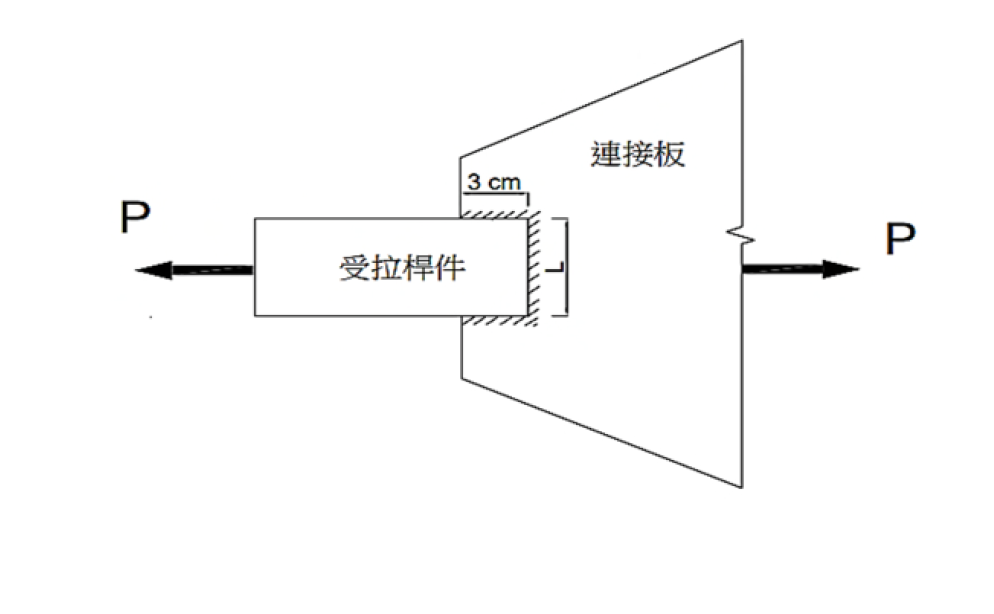

# 考題編號：SS-2025-2

**主分類：** `SS-U1-1` 拉力及壓力桿件
**副分類：** 無（題目已明言「假設銲道強度足夠」，接合設計本身不在考核範圍）
**設計法：** ASD
**標籤：** `拉力桿件` `容許應力法` `剪力遲滯` `U值` `淨截面斷裂` `全斷面降伏` `最佳化` `銲接拉力接合` `板類縱向銲接` `l/w規定`

---

## 1. 原始題目重述 (Problem Restatement)

如圖示之銲接結合，**受拉桿件寬度為 $L$ cm、厚度為 2 cm**，**連接板厚度為 1 cm**。假設**銲道強度足夠**，請依**容許應力設計法（ASD）規範**，計算 **$L$ 值最大或最小值應為何值，可使工作拉力 $P$ 為最大**？所有鋼材 $F_y = 2.5$ tf/cm²、$F_u = 4.1$ tf/cm²。（25 分）

**銲道配置（由圖判讀）：**

| 銲道 | 長度 | 位置 |
|:---|:---|:---|
| 縱向銲道（沿載重方向） | **各 3 cm，共 2 道** | 受拉桿件上、下兩側邊緣 |
| 橫向銲道（垂直載重方向） | $L$（＝板寬） | 受拉桿件端面 |



*圖說：受拉桿件為矩形鋼板，寬 $L$ cm、厚 2 cm，自左方受拉力 $P$；其右端搭接於梯形連接板（厚 1 cm）之左緣。接合為**三面圍焊**：沿受拉桿件上、下兩長邊各一道**長 3 cm 的縱向銲道**（圖上以「3 cm」標示，斜線陰影），以及沿桿件端面一道**長 $L$ 的橫向銲道**（圖右以「$L$」之尺寸線標示）。板寬 $L$ 為待求量，縱向銲長固定為 3 cm——這正是本題「$L$ 有上限」的來源。*

---

## 2. 考題核心精神與出題者意圖 (Core Concepts & Examiner's Intent)

**核心觀念：板類構件以兩側縱向銲道傳力時，規範用「銲長 $l$ 與板寬 $w$ 的比值」規定 $U$，並且要求 $l \ge w$——這是一條「階梯函數＋硬性上限」，不是連續公式。**

規範（鋼結構容許應力設計法規範 §4.3 有效淨斷面積；AISC 360 Table D3.1 Case 4 相同）規定：

| 條件 | $U$ |
|:---|:---:|
| $l \ge 2w$ | 1.00 |
| $2w > l \ge 1.5w$ | 0.87 |
| $1.5w > l \ge w$ | 0.75 |
| $l < w$ | **規範未規定（不允許）** |

本題 $l = 3$ cm 固定、$w = L$ 待求，因此：

$$L \le l = 3 \ \text{cm}$$

而 ASD 兩個極限狀態的容許力**都隨 $L$ 線性增加**：

$$P_{GY} = 0.6F_y A_g = 3.0L,\qquad P_{NSF} = 0.5F_u\,U\,A_g = 4.1\,U\,L$$

所以 $P$ 在**允許範圍的最大端**取得最大值 $\Rightarrow$ $\boxed{L_{\max} = 3 \ \text{cm}}$。

**出題者測驗重點：**

1. 認出這是「板類構件＋兩側縱向銲道」的 $U$ 規定（$l/w$ 階梯值），而**不是** $U = 1-\bar{x}/l$ 的偏心距公式
2. 知道規範對此情形有 **$l \ge w$ 的硬性下限**——這就是題目問「最大或最小值」的用意
3. ASD 兩極限狀態的容許應力不同：$0.6F_y$（全斷面）vs $0.5F_u$（有效淨斷面）
4. 在 $U = 0.75$ 時比較兩者誰控制（答案：$0.5F_u \times 0.75 = 3.075 > 0.6F_y = 3.0$，**全斷面降伏控制**，但只差 2.5%）

---

## 3. 解題戰略地圖與陷阱分析 (Strategic Roadmap & Trap Analysis)

**作戰計畫：**
```
Step 1  查規範：板類 + 兩側縱向銲道 → U = f(l/w)，且要求 l ≥ w
Step 2  l = 3 cm 固定 → L(=w) ≤ 3 cm，得 L 的「最大值」
Step 3  寫出 P_GY = 0.6Fy(2L) = 3.0L 與 P_NSF = 0.5Fu·U·(2L) = 4.1UL
Step 4  分段列表（L ≤ 1.5 / 1.5~2 / 2~3），確認 P 隨 L 遞增
Step 5  L = 3 cm：U = 0.75 → P = min(9.0, 9.225) = 9.0 tf（GY 控制）
Step 6  補檢核：銲道旁母材剪斷（ASD Fv = 0.4Fy）
```

**關鍵陷阱：**

> ⚠️ **陷阱 1（本題最致命）：不可用 $U = 1-\bar{x}/l$**
> $U = 1-\bar{x}/l$ 的 $\bar{x}$ 是「被連接元件形心到整個斷面形心的**偏心距**」，用於角鋼、槽鋼、T 型鋼等
> 「只有部分肢材被連接」的斷面。本題受拉桿件是**單一板片、全斷面都被銲道連接**，偏心距為零，
> 該公式不適用。若誤取 $\bar{x} = L/2$（把板寬的一半當偏心距）會得到 $U = 1-L/6$ 這種
> 「板越寬 $U$ 越小」的連續函數，進而算出 $P_{\max} = 6.15$ tf——**低估 32%**，且完全偏離規範條文。

> ⚠️ **陷阱 2：$U$ 是階梯函數，不是連續函數**
> 規範只給 1.00 / 0.87 / 0.75 三個值。不能內插，也不能對 $L$ 微分求極值。
> 本題的「最佳化」是**在階梯上找最右端的允許點**，而不是微分找拋物線頂點。

> ⚠️ **陷阱 3：$l \ge w$ 是硬性規定**
> $l < w$（本題即 $L > 3$ cm）時規範**沒有 $U$ 值**，等於不允許這樣設計。這就是「$L$ 有最大值」的來源。
> 物理上：縱向銲道太短、板太寬時，板中央的應力根本傳不出去，剪力遲滯嚴重到規範不願意給折減值。

> ⚠️ **陷阱 4：ASD 的兩個容許應力別記混**
> 全斷面降伏用 $F_t = 0.6F_y = 1.5$ tf/cm²（作用於 $A_g$）；
> 有效淨斷面斷裂用 $F_t = 0.5F_u = 2.05$ tf/cm²（作用於 $A_e$）。
> 兩者的交叉點在 $U = 0.6F_y/(0.5F_u) = 1.5/2.05 = 0.732$——$U = 0.75$ 剛好**略高於**它，故 GY 控制。

> ⚠️ **陷阱 5：橫向銲道不能用來主張 $U = 1.0$**
> 規範對「純橫向銲道傳力」才規定 $U = 1.0$（且 $A_e$ 只取直接連接元件面積）。本題為
> 縱向＋橫向並用之**板類**構件，仍應套板類的 $l/w$ 規定（見 §5.3 的規範條文層級討論）。

## 3.5 變數層次分析（Variable Hierarchy Analysis）

> 複習提示：解題後，在每個卡住的知識點「卡關?」欄標記 `⚠`；第二次複習時只看有 `⚠` 的項目。

**最終目標：** 依 ASD 規範板類構件縱向銲接之 $U$ 規定，求容許的板寬 $L$ 上限及對應的最大工作拉力 $P$

### 主要公式（$\boxed{\phantom{x}}$ = 未知，待推導）

$$\text{Step 1:}\quad A_g = t \cdot L = 2L,\qquad A_n = A_g\ (\text{銲接無孔})$$

$$\text{Step 2:}\quad \boxed{U} = \begin{cases}1.00 & l \ge 2w\\ 0.87 & 2w > l \ge 1.5w\\ 0.75 & 1.5w > l \ge w\end{cases},\qquad l = 3\ \text{cm},\ w = L$$

$$\text{Step 3:}\quad \boxed{L_{\max}} :\ l \ge w \;\Rightarrow\; L \le 3\ \text{cm}$$

$$\text{Step 4:}\quad P_{GY} = 0.6F_y A_g,\qquad \boxed{P_{NSF}} = 0.5F_u \cdot \boxed{U} \cdot A_g$$

$$\text{Step 5:}\quad \boxed{P_{\max}} = \min\left(P_{GY},\ \boxed{P_{NSF}}\right)\Big|_{L = \boxed{L_{\max}}}$$

### L1：題目直接給定

_看到題目就能讀出的數字，不需要任何公式。_

| 符號 | 數值 | 說明 |
|:---:|:---|:---|
| $t$ | 2 cm | 受拉桿件厚度 |
| $L$（$= w$） | 待求 | 受拉桿件寬度 |
| $l$ | 3 cm | **縱向**銲道長度（每側一道，共 2 道） |
| 橫向銲道長 | $L$ | 沿桿件端面 |
| 連接板厚 | 1 cm | 題目給定（不控制，見 §5.4） |
| $F_y$ | 2.5 tf/cm² | 降伏強度 |
| $F_u$ | 4.1 tf/cm² | 抗拉強度 |
| 設計法 | ASD | 容許應力設計法 |
| 銲道強度 | 足夠（題目假設） | 不需檢核銲道本身 |

### L2：需知識點推導

_需要知道公式名稱與適用條件，套入 L1 即可算出。_

**第一階段：$U$ 值的規範判定**

| 符號 | 公式／來源 | 卡關? |
|:---:|:---|:---|
| 適用條文 | ASD 規範 §4.3「板類構件僅以兩側縱向銲道傳遞拉力」 | |
| $l \ge 2w$ | $3 \ge 2L \Rightarrow L \le 1.5$ cm → $U = 1.00$ | |
| $1.5w \le l < 2w$ | $1.5 < L \le 2.0$ cm → $U = 0.87$ | |
| $w \le l < 1.5w$ | $2.0 < L \le 3.0$ cm → $U = 0.75$ | |
| $l < w$ | $L > 3$ cm → **規範未規定，不允許** | |

**第二階段：ASD 容許力（$L$ 的函數）**

| 符號 | 公式／來源 | 卡關? |
|:---:|:---|:---|
| $A_g$ | $tL = 2L$ cm² | |
| $P_{GY}$ | $0.6F_yA_g = 0.6(2.5)(2L) = 3.0L$ tf | |
| $P_{NSF}$ | $0.5F_u\,U\,A_g = 0.5(4.1)U(2L) = 4.1UL$ tf | |
| 控制判準 | $0.5F_uU \gtrless 0.6F_y \Rightarrow U \gtrless 0.732$ | |

**第三階段：取極大**

| 符號 | 公式／來源 | 卡關? |
|:---:|:---|:---|
| $L_{\max}$ | $l \ge w \Rightarrow L = 3.0$ cm | |
| $U$ | $1.5w = 4.5 > l = 3 \ge w = 3 \Rightarrow U = 0.75$ | |
| $A_g$ | $2 \times 3 = 6.0$ cm² | |
| $A_e$ | $0.75 \times 6.0 = 4.5$ cm² | |
| $P_{GY}$ | $1.5 \times 6.0 = 9.0$ tf ← **控制** | |
| $P_{NSF}$ | $2.05 \times 4.5 = 9.225$ tf | |
| $P_{\max}$ | $\min(9.0,\ 9.225) = 9.0$ tf | |

### L3：深層知識（不懂就卡住）

| 知識點 | 說明 | 補強頁 | 卡關? |
|:---|:---|:---:|:---|
| 板類縱向銲接的 $U$ 是 $l/w$ 階梯值 | 規範對「板類 + 兩側縱向銲道」單獨列條文（1.00/0.87/0.75），**不用** $1-\bar x/l$ | [[shear-lag-u]] · [[SHEAR-LAG]] | |
| $U = 1-\bar x/l$ 的適用對象 | $\bar x$ 是「被連接元件到全斷面形心」的偏心距；只用於角鋼、槽鋼、T 型鋼等部分肢材連接之斷面 | [[shear-lag-u]] | |
| $l \ge w$ 的物理意義 | 縱向銲太短、板太寬時，力無法由邊緣擴散至板中央（$45°$ 擴散不足），剪力遲滯超出規範適用範圍 | [[SHEAR-LAG]] | |
| ASD 兩極限狀態的容許應力 | $0.6F_y$（$FS = 1.67$，作用於 $A_g$）vs $0.5F_u$（$FS = 2.0$，作用於 $A_e$）；後者較嚴是因斷裂為脆性破壞 | [[TENSION-MEMBER-DESIGN]] | |
| 銲接接合 $A_n = A_g$ | 無螺栓孔，故淨面積等於全面積；但 $U$ 造成的折減仍在 | [[shear-lag-u]] | |
| 銲道旁母材剪斷檢核 | 銲道足夠 ≠ 母材足夠；仍需檢核沿銲道的母材剪力面（見 §4 Step 5） | [[fillet-weld-0707]] | |

---

## 4. 步驟化詳細計算過程 (Step-by-Step Detailed Calculation)

### Step 1：斷面與銲道幾何

$$A_g = t \times L = 2L \ \text{cm}^2,\qquad A_n = A_g\ (\text{銲接接合，無螺栓孔})$$

$$l = 3\ \text{cm（縱向銲道長，兩側各一道）},\qquad w = L\ \text{（板寬）}$$

---

### Step 2：依規範判定 $U$ 值與 $L$ 的允許範圍

依「鋼結構容許應力設計法規範」§4.3——**板類構件僅以兩側縱向銲道傳遞拉力時**：

$$U = \begin{cases}
1.00, & l \ge 2w \\
0.87, & 2w > l \ge 1.5w \\
0.75, & 1.5w > l \ge w
\end{cases}$$

代入 $l = 3$ cm：

| $U$ | 條件 | 換算成 $L$ |
|:---:|:---|:---|
| 1.00 | $3 \ge 2L$ | $L \le 1.5$ cm |
| 0.87 | $2L > 3 \ge 1.5L$ | $1.5 < L \le 2.0$ cm |
| 0.75 | $1.5L > 3 \ge L$ | $2.0 < L \le 3.0$ cm |
| — | $3 < L$ | **超出規範適用範圍（不允許）** |

$$\boxed{\therefore L \le l = 3.0 \ \text{cm}\quad\text{（}L\text{ 存在「最大值」而非最小值）}}$$

---

### Step 3：建立 ASD 容許力函數

**① 全斷面降伏（Gross Yielding, GY）：**

$$P_{GY} = F_t A_g = 0.6F_y \cdot 2L = 0.6(2.5)(2L) = 3.0L \ \text{tf}$$

**② 有效淨斷面斷裂（Net Section Fracture, NSF）：**

$$P_{NSF} = F_t A_e = 0.5F_u \cdot U A_g = 0.5(4.1)\,U\,(2L) = 4.1\,U\,L \ \text{tf}$$

**容許工作拉力：** $P = \min(P_{GY},\ P_{NSF})$

---

### Step 4：分段列表，確認 $P$ 隨 $L$ 遞增

| $L$ (cm) | $U$ | $A_g$ (cm²) | $P_{GY} = 3.0L$ | $P_{NSF} = 4.1UL$ | $P = \min$ | 控制 |
|:---:|:---:|:---:|:---:|:---:|:---:|:---:|
| 1.0 | 1.00 | 2.0 | 3.00 | 4.10 | **3.00** | GY |
| 1.5 | 1.00 | 3.0 | 4.50 | 6.15 | **4.50** | GY |
| 2.0 | 0.87 | 4.0 | 6.00 | 7.13 | **6.00** | GY |
| **3.0** | **0.75** | **6.0** | **9.00** | **9.23** | **9.00** | **GY** |
| >3.0 | — | — | — | — | 不允許 | — |

**觀察：** 在每一個允許的分段內，$P_{NSF} > P_{GY}$（因為 $0.5F_uU = 2.05U \ge 2.05(0.75) = 1.538 > 1.5 = 0.6F_y$），故**全程由全斷面降伏控制**，$P = 3.0L$ 單調遞增。因此 $P$ 在 $L$ 的最大允許值處達到最大。

> **策略註解：** 這裡不需要（也不可以）微分。$U$ 是階梯函數，$P$ 在每段內都是線性遞增，只在跨段時可能掉一階；本題三段皆由 $P_{GY} = 3.0L$ 控制，所以 $P$ 在整個允許區間內**嚴格遞增**，最大值必在右端點 $L = 3$ cm。

---

### Step 5：$L = 3$ cm 的完整檢核

$$U = 0.75\quad(\because 1.5w = 4.5 > l = 3 \ge w = 3)$$

$$A_g = 2 \times 3 = 6.0 \ \text{cm}^2,\qquad A_e = U A_g = 0.75 \times 6.0 = 4.5 \ \text{cm}^2$$

**① 全斷面降伏：**
$$P_{GY} = 0.6(2.5)(6.0) = 1.5 \times 6.0 = 9.00 \ \text{tf}$$

**② 有效淨斷面斷裂：**
$$P_{NSF} = 0.5(4.1)(4.5) = 2.05 \times 4.5 = 9.23 \ \text{tf}$$

**③ 銲道旁母材剪斷（補充檢核）：** ASD 容許剪應力 $F_v = 0.4F_y = 1.0$ tf/cm²，兩道縱向銲道旁之母材剪力面

$$A_v = 2 \times l \times t = 2 \times 3 \times 2 = 12 \ \text{cm}^2 \;\Rightarrow\; P_v = 1.0 \times 12 = 12.0 \ \text{tf} > 9.0 \ \text{tf} \ \checkmark$$

（且端面另有長 $L$ 的橫向銲道直接傳力，實際更寬裕。）

**結論：**

$$\boxed{L_{\max} = 3 \ \text{cm}\ (=\ l),\qquad P_{\max} = \min(9.00,\ 9.23,\ 12.0) = 9.00 \ \text{tf}\ \text{（全斷面降伏控制）}}$$

---

### Step 6：結果彙整

| 項目 | 數值 |
|------|------|
| $L$ 的性質 | **有最大值**（不是最小值）：$L \le l = 3$ cm |
| $L_{\max}$ | **3 cm** |
| $U$（$l/w = 1.0$） | 0.75 |
| $A_g$ | 6.0 cm² |
| $A_e$ | 4.5 cm² |
| $P_{GY}$ | 9.00 tf ← **控制** |
| $P_{NSF}$ | 9.23 tf |
| 母材剪斷 | 12.0 tf |
| **$P_{\max}$** | **9.00 tf** |

---

## 5. 關鍵爭議點與進階探討 (Critical Issues & Advanced Discussion)

### 5.1 為什麼題目說「最大**或**最小」？

這是出題者的提示：要考生自己判斷 $L$ 的限制是上限還是下限。

- 若只看 $P_{GY} = 3.0L$、$P_{NSF} = 4.1UL$，兩者都隨 $L$ 遞增 → 想把 $L$ 做越大越好
- 但規範的 $l \ge w$ 把 $L$ 卡在 3 cm → **$L$ 有最大值**

所以正確答案是「$L$ **最大**取 3 cm」。若答「$L$ 有最小值」則方向答反。

### 5.2 誤用 $U = 1-\bar x/l$ 會差多少？

| 作法 | $U(L=3)$ | $A_e$ | $P_{NSF}$ | 最終 $P_{\max}$ | 誤差 |
|:---|:---:|:---:|:---:|:---:|:---:|
| **規範 $l/w$ 階梯值（正解）** | **0.75** | 4.5 cm² | 9.23 tf | **9.00 tf**（GY 控制） | — |
| 誤用 $U = 1-\dfrac{L/2}{3} = 1-\dfrac{L}{6}$ | 0.50 | 3.0 cm² | 6.15 tf | 6.15 tf（NSF 控制） | **低估 32%** |

誤用法還會導出一個假象：「$P_{NSF} = 4.1L(1-L/6)$ 是拋物線，微分得頂點 $L = 3$」。頂點位置**碰巧**也是 3 cm，
但那是 $l/2 \times 2 = l$ 的數學巧合，與規範規定無關；控制的極限狀態與 $P$ 值都錯。

**根本錯誤：** $\bar x$ 是**偏心距**，量的是「被連接元件的形心」到「整個斷面形心」的垂直距離。
單一板片被三面圍焊，被連接元件就是板本身，$\bar x = 0$。把「板寬的一半」當偏心距，等於假設
全部拉力都從板的一條邊緣進入，與圖示的三面圍焊不符。

### 5.3 縱向＋橫向並用時，究竟該套哪一條？（規範條文層級）

「鋼結構容許應力設計法規範」§4.3 銲接部分有三種情形：

| 情形 | 規定 |
|:---|:---|
| (i) 拉力僅由**縱向**銲道，或**縱向與橫向並用**，傳遞至**鋼板以外**之構材 | $A_e = U A_g$，$U$ 依構材類型查表（0.90／0.85／0.75） |
| (ii) 拉力僅由**橫向**銲道傳遞 | $A_e = $ 直接連接元件之面積，$U = 1.0$ |
| (iii) **板類構材**之拉力由**兩側縱向**銲道傳遞 | $A_e = UA_g$，$U$ 依 $l/w$ 取 1.00／0.87／0.75，且須 $l \ge w$ |

本題受拉桿件是**板類**構材（(i) 明文排除鋼板），且縱向銲道是傳力主體 → 套 **(iii)**。
（AISC 360-16 Table D3.1 亦同：Case 4 專門處理「plates ... where the tension load is transmitted by longitudinal welds only」，$U$ 依 $l/w$；Case 3 才是純橫向銲道 $U=1.0$。）

若有人主張「端面有橫向銲道、全斷面直接連接，故 $U = 1.0$」，則 $P_{NSF} = 4.1L$ 恆大於 $P_{GY} = 3.0L$，
$L$ 將無上限、題目也就沒有答案——反證此讀法與題意不符。**考場答 $L_{\max} = 3$ cm、$P_{\max} = 9.0$ tf。**

### 5.4 連接板（1 cm 厚）要不要檢核？

題目給了連接板厚度 1 cm，但**未給其寬度**（圖上為梯形、明顯比受拉桿件寬）。既然「假設銲道強度足夠」，
且連接板的 Whitmore 有效寬度（自銲道起點以 $30°$ 向外擴散）為 $3 + 2(3\tan30°) = 6.46$ cm，
斷面積 $1 \times 6.46 = 6.46$ cm²，容許力 $\approx 1.5 \times 6.46 = 9.7$ tf $> 9.0$ tf，不控制。
此估算僅供理解「為什麼題目敢略過連接板」——實際連接板遠寬於此。

### 5.5 依最新規範（AISC 360-16／-22）的對照

| 項目 | 台灣現行規範（民國 99 年版 ASD） | AISC 360-16／-22 |
|:---|:---|:---|
| $U$（板類縱向銲） | $l/w$ 階梯值 1.00／0.87／0.75，$l \ge w$ | Table D3.1 **Case 4**，數值與條件**完全相同** |
| 全斷面降伏 | $F_t = 0.6F_y$ 作用於 $A_g$ | $P_n/\Omega = F_yA_g/1.67 = 0.599F_yA_g$（**等價**） |
| 有效淨斷面斷裂 | $F_t = 0.5F_u$ 作用於 $A_e$ | $P_n/\Omega = F_uA_e/2.00 = 0.5F_uA_e$（**完全相同**） |

$\Rightarrow$ **本題在新舊規範下答案完全一致**（$0.6 \approx 1/1.67$、$0.5 = 1/2.00$），$L_{\max} = 3$ cm、$P_{\max} = 9.0$ tf。

### 5.6 若要提高 $P$，該改什麼？

| 措施 | 效果 |
|:---|:---|
| 加長縱向銲道 $l$ | $L$ 上限同步放寬（$L \le l$），且 $l \ge 2w$ 時 $U$ 升到 1.00 → 最直接有效 |
| 只加寬板 $L$ | **無效**（超過 3 cm 即超出規範適用範圍） |
| 加厚板 $t$ | $P_{GY} \propto t$，線性有效，但接合處剪力遲滯不變 |
| 只加大銲腳尺寸 | **無效**（題目已假設銲道強度足夠；瓶頸在母材的剪力遲滯，不在銲道） |

*解析完成時間：2026-06-xx*
*修正日期：2026-08-22（改以規範 §4.3「板類兩側縱向銲道」$l/w$ 階梯 $U$ 值取代誤用之 $U = 1-\bar x/l$；答案由 $P_{\max}=6.15$ tf 更正為 9.00 tf）*
*驗證狀態：unverified*
