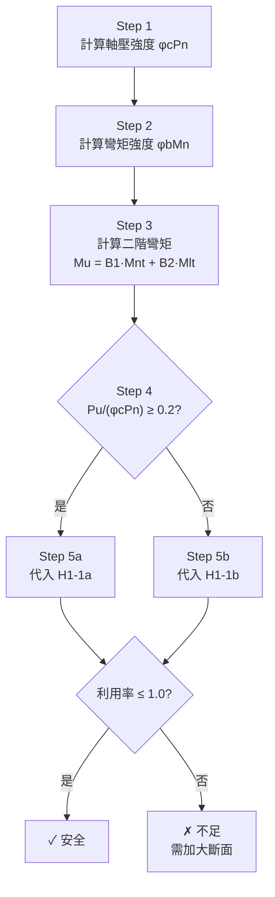

# 鋼結構設計 ── 梁柱桿件 (Beam-Columns)
# 大學四年級備課講義

> **科目**：鋼結構設計  
> **授課對象**：土木工程系 / 結構工程組 大四學生  
> **先修知識**：材料力學（彈性挫屈、塑性彎矩）、結構分析（剛架分析）、鋼結構設計（柱設計＋梁設計）  
> **建議授課時數**：4 節課（理論 2 節 ＋ 例題演練 1 節 ＋ 考題解析與討論 1 節）  
> **規範依據**：內政部《鋼結構設計規範》（對應 AISC 360）；《鋼結構耐震設計規範》（對應 AISC 341）

---

## 〇、課前提問──從你們已經會的東西出發

在開始之前，請先回答三個問題（不翻課本，憑直覺）：

> **Q1**：你設計了一根柱，確認 $\phi_c P_n > P_u$（軸壓OK）。又設計了同一根構件的梁性能，確認 $\phi_b M_n > M_u$（彎矩OK）。**這根構件安全嗎？**

> **Q2**：一根柱在純軸壓下，臨界荷重是 $P_{cr}$。現在我在柱端額外施加一個很小的彎矩 $M$，這根柱的臨界荷重會：(A) 不變　(B) 變大　(C) 變小？

> **Q3**：兩根完全相同的柱，都受到相同的軸壓力。柱 A 呈現「C 形」彎曲（單曲率），柱 B 呈現「S 形」彎曲（雙曲率）。**哪一根比較危險？**

---

如果你對 Q1 的回答是「安全」，你就需要這堂課。  
如果你對 Q2 選了 (A)，你一定需要這堂課。  
如果你對 Q3 猶豫了，你更需要這堂課。

答案分別是：**不一定安全**、**(C) 變小**、**柱 A（單曲率）較危險**。

這三個答案背後的統一原理，就是今天要學的核心——**軸力與彎矩的耦合效應，以及由此衍生的二階放大問題**。

---

## 一、定義與動機

### 1.1 什麼是梁柱桿件？

**定義**：同時承受**軸向壓力 $P$** 與**彎矩 $M$** 的結構構件。

在教科書的理想世界裡，我們把結構拆成「只受軸力的柱」和「只受彎矩的梁」來分別設計。但在真實建築中：

- 框架柱承受樓層重力載重（軸壓），同時因風力、地震力或偏心梁接合而受到彎矩。
- 桁架弦桿承受軸力，但節點間有次應力產生的彎矩。
- 合成梁在施工階段可能因斜撐系統而承受軸力。

**結論**：幾乎所有真實結構中的柱，都是梁柱桿件。梁柱設計不是特殊狀況，而是常態。

### 1.2 為什麼不能「各算各的、各自OK就好」？

原因有二，且缺一不可：

**原因 ①：斷面容量是共用的**

想像斷面的塑性強度是一個固定大小的「容量池」。軸力用掉一部分，能分給彎矩的就變少了。反之亦然。兩者共同消耗同一個容量池，因此需要用**互制公式 (Interaction Equation)** 來聯合檢核。

**原因 ②：軸力會「放大」彎矩（二階效應）**

這是更致命的問題。軸力不僅佔用了斷面的容量，還因為作用在變形後的幾何形狀上，產生了**額外的附加彎矩**。這意味著，實際的彎矩比你用一階分析算出來的還要大。忽略這個放大效應，就是在用偏小的需求去比對容量——天生偏不安全。

---

## 二、二階效應：力學的核心

### 2.1 從尤拉柱到梁柱——一個思想實驗

回憶尤拉柱的推導：我們在柱的平衡方程中，是基於**變形後的幾何**來列式的（$EIy'' + Py = 0$）。正是因為考慮了「力作用在偏移後的位置」，才得到了挫屈荷重 $P_{cr}$。

現在，想像你在尤拉柱的端部施加一個小彎矩 $M$。在一階分析（不考慮變形）下，柱中的彎矩分布就是端彎矩的線性內插。但當你施加軸壓力 $P$ 後，柱會彎曲，而 $P$ 作用在彎曲後的截面上，額外產生 $P \cdot y(x)$ 的彎矩。這就是二階效應。

**關鍵洞察**：二階效應不是一個獨立的「額外荷重」——它是**已有的軸力**與**已有的彎曲變形**之間的耦合產物。軸力越大（接近 $P_{cr}$）、變形越大（無支撐長度越長），放大效應就越劇烈。

### 2.2 兩種二階效應：P-δ 與 P-Δ

規範將二階效應依「變形發生的尺度」分為兩類：

#### P-δ 效應（構件層級）

```
            P                        P
            ↓                        ↓
    M₁ ─┐       ┌─ M₂       M₁ ─┐   ╲   ┌─ M₂
         │       │                │  δ ↕  │
         │       │                │   ╱   │
         │       │                │       │
    ─────┘       └─────      ─────┘       └─────
            ↑                        ↑
            P                        P

    一階分析：忽略變形        二階現實：P 落在偏移 δ 處
    M = M₁ 或 M₂ 的內插      M_actual = M_一階 + P·δ
```

- **尺度**：構件自身的撓曲（桿身中段偏離兩端點連線的距離 $\delta$）
- **本質**：桿件像一根偏心受壓柱
- **LRFD 處理工具**：放大係數 $B_1$
- **即使無側移框架也會發生**

#### P-Δ 效應（框架層級）

```
    ┌──────────┐ ← H          ┌──────────┐ ←─ Δ
    │          │               │          │
    │  樓板    │               │  樓板    │
    │          │               │          │
    ╧          ╧               ╧          ╧
    ↓P₁       ↓P₂             ↓P₁       ↓P₂
    
    一階：柱頂無位移           實際：柱頂側移 Δ
                               P_total 作用在 Δ 上
                               → 額外翻轉矩 ΣP·Δ
```

- **尺度**：整個樓層的側向位移 $\Delta$（story drift）
- **本質**：整層的重力載重作用在偏移後的樓板上，產生翻轉傾向
- **LRFD 處理工具**：放大係數 $B_2$
- **僅有側移框架 (Sway Frame) 需要計算**

#### 兩者的關鍵差異

| | P-δ | P-Δ |
|:---|:---|:---|
| **發生位置** | 構件中段 | 樓層之間 |
| **位移量** | δ（桿身撓度） | Δ（層間側移） |
| **LRFD 放大係數** | $B_1$ | $B_2$ |
| **計算 $P_e$ 時的 $K$ 值** | $K = 1.0$（恆定） | 由對位圖查 $K$（>1.0） |
| **無側移框架是否需要？** | ✓ 需要 | ✗ 不需要（$B_2 = 1.0$） |
| **有側移框架是否需要？** | ✓ 需要 | ✓ 需要 |

---

## 三、彎矩放大法——從物理到公式

### 3.1 總公式

$$\boxed{M_u = B_1 \cdot M_{nt} + B_2 \cdot M_{lt}}$$

- $M_{nt}$（**n**o-**t**ranslation moment）：假設框架不側移，施加全部荷重後的一階彎矩
- $M_{lt}$（**l**ateral **t**ranslation moment）：僅由側向力引起側移所產生的一階彎矩
- $B_1$：P-δ 放大係數（≥ 1.0）
- $B_2$：P-Δ 放大係數（≥ 1.0）

### 3.2 $B_1$ 的推導與公式

$$B_1 = \frac{C_m}{1 - P_u / P_{e1}} \geq 1.0$$

**分母的物理意義**：$1 - P_u/P_{e1}$ 反映的是「軸力離挫屈有多近」。當 $P_u \to P_{e1}$ 時，分母 → 0，放大效應 → ∞（構件瀕臨不穩定）。若 $P_u \geq P_{e1}$，分母為負或零——構件已經不穩定，設計無效。

#### 構件彈性挫屈荷重 $P_{e1}$

$$P_{e1} = \frac{\pi^2 E I}{(K_1 L)^2} \qquad K_1 = 1.0 \text{（恆定）}$$

> [!WARNING]
> **絕對不可以把對位圖查出的 $K$ 值帶入 $P_{e1}$！**
> 
> $B_1$ 處理的是「假設兩端不側移，桿件自身的撓曲」。不管結構是否有側移，這個局部問題的端點條件都是「不位移」（位移被 $B_2$ 另外處理了），所以 $K_1$ 必須取 1.0。
>
> 對位圖查出的 $K_{sway}$（如 1.6 或 2.1）是用在 $B_2$ 的 $P_{e2}$ 計算中，描述的是框架整體穩定性。

另一個重點：計算 $P_{e1}$ 時要用**彎矩作用方向**的慣性矩 $I$。若題目考的是強軸彎矩放大，就用 $I_x$；若考弱軸，就用 $I_y$。**不可與決定 $\phi_c P_n$ 時「取弱軸控制」的慣性矩搞混**。

#### 等效均勻彎矩係數 $C_m$

$C_m$ 的作用是：修正不同端彎矩分布對 P-δ 放大程度的影響。

**情況一：無橫向載重，僅有端彎矩**（最常考）

$$C_m = 0.6 - 0.4 \cdot \frac{M_1}{M_2}$$

其中 $|M_1| \leq |M_2|$（$M_2$ 是絕對值較大的那端）。

##### $M_1/M_2$ 的符號約定——本課程最容易搞混的一個規則

> [!IMPORTANT]
> **規範版本差異警告**：
> 
> AISC 360 與台灣規範/某些教科書對 $M_1/M_2$ 的符號約定**恰好相反**。以下分別說明：
> 
> **版本 A（AISC 360 標準，本講義採用）**：
> - **單曲率**（C 形彎曲，無反曲點）→ $M_1/M_2$ 取**負值** → $C_m$ 較**大**（0.6～1.0）→ 放大效應大（危險較大✓）
> - **雙曲率**（S 形彎曲，有反曲點）→ $M_1/M_2$ 取**正值** → $C_m$ 較**小**（0.2～0.6）→ 放大效應小（安全✓）
> 
> **版本 B（部分教科書/舊規範）**：
> - 符號定義正好相反。
> 
> **如何自我校驗**：不管用哪個版本，最終結果必須滿足：
> - 「**單曲率的 $C_m$ 大於雙曲率的 $C_m$**」（因為單曲率 P-δ 放大效應更嚴重）
> - **特別驗算**：等值反向端彎矩（完全單曲率，$M_1 = M_2$）應得 $C_m = 1.0$
> 
> 若算出來的結果違反上述物理直覺，就是符號帶反了。

完整範例表（以 AISC 版本為準）：

| 端彎矩情況 | 撓曲形態 | $M_1/M_2$ | $C_m$ | 物理解讀 |
|:---|:---|:---:|:---:|:---|
| 兩端等值同向 | 單曲率（最危險） | $-1.0$ | $1.0$ | 全桿均勻彎曲，P-δ 放大最大 |
| 一端 $M$，另一端 $0.5M$，同向 | 單曲率 | $-0.5$ | $0.8$ | 中度放大 |
| 一端 $M$，另一端為零 | 單側彎曲 | $0$ | $0.6$ | 中性起點 |
| 一端 $M$，另一端 $0.5M$，反向 | 雙曲率 | $+0.5$ | $0.4$ | 放大效應小 |
| 兩端等值反向 | 雙曲率（最安全） | $+1.0$ | $0.2$ | 反曲點在中央，P-δ 影響最小 |

**情況二：有橫向載重**（保守取值）

| 端部約束 | $C_m$ |
|:---|:---:|
| 兩端有束制（類固接） | $0.85$ |
| 至少一端為鉸接 | $1.0$ |

---

### 3.3 $B_2$ 的公式

$$B_2 = \frac{1}{1 - \dfrac{\sum P_u}{\sum P_{e2}}} \geq 1.0$$

- $\sum P_u$：**整層所有柱**（含靠桿）的設計軸力總和
- $\sum P_{e2} = \sum \dfrac{\pi^2 EI}{(K_2 L)^2}$：整層所有**抗側力柱**的彈性挫屈荷重總和，$K_2$ 由側移對位圖查得

**替代公式**（利用側移勁度，免算各柱 $K$）：

$$B_2 = \frac{1}{1 - \dfrac{\sum P_u \cdot \Delta_{oh}}{\sum H \cdot L_c}} \geq 1.0$$

- $\Delta_{oh}$：一階水平力 $\sum H$ 作用下的層間側移
- $L_c$：層高

> [!NOTE]
> **靠桿效應 (Leaning Column Effect) ── 一個經常被忽略的關鍵**
> 
> 兩端鉸接的重力柱（靠桿，Leaning Column）：
> - 自身**不提供任何側向抵抗力**（$P_{e2,靠桿} = 0$）→ 不計入 $\sum P_{e2}$
> - 但其重力載重**必須計入 $\sum P_u$** → 使 $B_2$ 分母變小 → $B_2$ 增大
> 
> 靠桿的重力越重，框架越不穩定。這是因為靠桿的 P-Δ 效應全部「轉嫁」到了抗側力構架身上。在實際建築中，重力柱非常普遍（占柱數的一半以上並不罕見），因此靠桿效應的影響往往出乎意料地巨大。

---

## 四、LRFD 互制公式

### 4.1 兩段折線公式

**當 $\dfrac{P_u}{\phi_c P_n} \geq 0.2$（軸壓主導）── H1-1a：**

$$\frac{P_u}{\phi_c P_n} + \frac{8}{9}\left(\frac{M_{ux}}{\phi_b M_{nx}} + \frac{M_{uy}}{\phi_b M_{ny}}\right) \leq 1.0$$

**當 $\dfrac{P_u}{\phi_c P_n} < 0.2$（彎矩主導）── H1-1b：**

$$\frac{P_u}{2\phi_c P_n} + \left(\frac{M_{ux}}{\phi_b M_{nx}} + \frac{M_{uy}}{\phi_b M_{ny}}\right) \leq 1.0$$

### 4.2 P-M 互制圖

```
    P/(φcPn)
    1.0 ●
        │╲
        │  ╲  ← H1-1a（大軸力側，斜率陡）
        │    ╲
    0.2 ●─────● ← 折點座標 (8/9 × Mn 餘裕, 0.2)
        │      ╲
        │        ╲  ← H1-1b（小軸力側，斜率緩）
        │          ╲
    0.0 ●───────────● M/(φbMn)
       0.0          1.0

    ● 設計點落在折線內側 → 安全 ✓
    ● 設計點落在折線外側 → 不安全 ✗
```

**為什麼是折線而非曲線？**  
真實的 P-M 強度包絡面是一條光滑曲線。規範用兩段折線來近似，目的是簡化計算。折線略微偏保守（在中間區域比真實曲線低一些），但簡單且安全。

### 4.3 抗力係數速查

| 力學行為 | 抗力係數 | 記憶法 |
|:---|:---:|:---|
| 軸壓（Column） | $\phi_c = 0.85$ | **c**olumn：壓力構件的不確定性較大，折減多 |
| 受彎（Beam） | $\phi_b = 0.90$ | **b**eam：撓曲行為較穩定，折減少 |

---

## 五、ASD 互制公式（對照學習）

### 5.1 判斷門檻

ASD 以 $f_a/F_a = 0.15$ 為分界（對應 LRFD 的 0.2），選擇不同複雜度的公式。

### 5.2 完整式（$f_a/F_a \geq 0.15$）

需同時滿足**兩個方程式**：

**穩定性方程式**（含二階放大，對應 LRFD 的 H1-1a）：

$$\frac{f_a}{F_a} + \frac{C_{mx} f_{bx}}{(1 - f_a / F'_{ex}) F_{bx}} + \frac{C_{my} f_{by}}{(1 - f_a / F'_{ey}) F_{by}} \leq 1.0$$

**斷面強度方程式**（桿端無放大，對應 LRFD 的 H1-1b）：

$$\frac{f_a}{0.6 F_y} + \frac{f_{bx}}{F_{bx}} + \frac{f_{by}}{F_{by}} \leq 1.0$$

### 5.3 簡化式（$f_a/F_a < 0.15$）

$$\frac{f_a}{F_a} + \frac{f_{bx}}{F_{bx}} + \frac{f_{by}}{F_{by}} \leq 1.0$$

### 5.4 ASD 特有公式

$$F'_e = \frac{12\pi^2 E}{23(KL/r)^2}$$

此即尤拉臨界應力除以安全係數 $23/12 \approx 1.92$。

### 5.5 LRFD 與 ASD 的對應關係總表

| LRFD | ASD | 物理意義 |
|:---|:---|:---|
| $P_u / \phi_c P_n$ | $f_a / F_a$ | 軸壓利用率 |
| $B_1 = C_m / (1 - P_u/P_{e1})$ | $C_m / (1 - f_a/F'_e)$ | P-δ 放大效應 |
| $M_{ux} / \phi_b M_{nx}$ | $f_{bx} / F_{bx}$ | 強軸彎矩利用率 |
| $M_{uy} / \phi_b M_{ny}$ | $f_{by} / F_{by}$ | 弱軸彎矩利用率 |
| 0.2 分界 | 0.15 分界 | 大/小軸力判定 |

---

## 六、設計驗核標準流程



各步驟要點：

**Step 1**：取弱軸 $(KL/r)_y$ 控制 → 算 $F_e$ → 判斷彈性/非彈性挫屈 → 得 $F_{cr}$ → $\phi_c P_n = 0.85 F_{cr} A_g$

**Step 2**：檢核寬厚比（結實/非結實/細長斷面）→ 判斷 LTB 三區間（$L_b$ vs. $L_p$, $L_r$）→ 得 $\phi_b M_n$。雙軸彎矩需分別計算 $\phi_b M_{nx}$ 與 $\phi_b M_{ny}$

**Step 3**：區分 $M_{nt}$ 與 $M_{lt}$ → 計算 $C_m$（注意曲率符號）→ 算 $P_{e1}$（$K_1 = 1.0$，用彎矩方向的 $I$）→ 得 $B_1$ → 若有側移再算 $B_2$ → 合成 $M_u$

**Step 4–5**：判斷軸壓比 → 選公式 → 代入 → 判定

---

## 七、例題精析

### 例題 A：無側移框架，雙曲率彎矩（安全案例）

**已知條件**

| 項目 | 數值 |
|:---|:---|
| 鋼材 | SN490B（$F_y = 3.3$ tf/cm², $E = 2040$ tf/cm²） |
| 斷面 | $A_g = 140$ cm², $I_x = 26{,}000$ cm⁴, $r_x = 13.6$ cm, $r_y = 7.5$ cm |
| 柱高 | $L = 4.0$ m，兩方向均無側移（$K_x = K_y = 1.0$） |
| 設計軸壓力 | $P_u = 150$ tf |
| 強軸端彎矩 | $M_{大端} = +30$ tf·m，$M_{小端} = -20$ tf·m（**雙曲率**，S 形） |
| 側移彎矩 | $M_{lt} = 0$（無側移框架） |
| 強軸彎矩強度 | $\phi_b M_{nx} = 85$ tf·m（已含 LTB 折減） |

---

**Step 1：$\phi_c P_n$**

弱軸控制：$(KL/r)_y = 400/7.5 = 53.3$

$F_e = \pi^2 \times 2040 / 53.3^2 = 20{,}132 / 2{,}841 = 7.09$ tf/cm²

交界值：$4.71\sqrt{2040/3.3} = 4.71 \times 24.87 = 117.1$。因 $53.3 < 117.1$，非彈性挫屈。

$F_{cr} = 0.658^{3.3/7.09} \times 3.3 = 0.658^{0.465} \times 3.3 = 0.833 \times 3.3 = 2.75$ tf/cm²

$\phi_c P_n = 0.85 \times 2.75 \times 140 = 327.3$ tf

---

**Step 2：$\phi_b M_{nx}$**

題目已知 $\phi_b M_{nx} = 85$ tf·m。

---

**Step 3：二階彎矩 $M_{ux}$**

$C_m$（AISC 符號約定，雙曲率取正）：

$$\frac{M_1}{M_2} = \frac{+20}{+30} = +0.667 \quad \text{（雙曲率，正號）}$$

$$C_m = 0.6 - 0.4 \times (+0.667) = 0.6 - 0.267 = 0.333$$

$P_{e1}$（$K_1 = 1.0$，用 $I_x$）：

$$P_{e1} = \frac{\pi^2 \times 2040 \times 26000}{400^2} = \frac{523{,}247{,}424}{160{,}000} = 3{,}270 \text{ tf}$$

$B_1$：

$$B_1 = \frac{0.333}{1 - 150/3270} = \frac{0.333}{0.954} = 0.349 \quad \Rightarrow \text{取 } B_1 = 1.0$$

$M_{ux} = 1.0 \times 30.0 + 0 = 30.0$ tf·m

---

**Step 4–5：互制檢核**

$$\frac{P_u}{\phi_c P_n} = \frac{150}{327.3} = 0.458 \geq 0.2 \quad \Rightarrow \text{H1-1a}$$

$$0.458 + \frac{8}{9} \times \frac{30.0}{85.0} = 0.458 + 0.889 \times 0.353 = 0.458 + 0.314 = \boxed{0.772 \leq 1.0 \quad \checkmark}$$

**結論：斷面安全**，利用率 77.2%。

---

### 例題 B：有側移框架，單曲率 + $B_2$（不安全案例）

**已知條件**

| 項目 | 數值 |
|:---|:---|
| 同上斷面、鋼材 | $A_g = 140$ cm², $I_x = 26{,}000$ cm⁴ 等 |
| 柱高 | $L = 4.0$ m，有側移框架 |
| 設計軸壓力 | $P_u = 200$ tf |
| 強軸端彎矩 | $M_{nt} = 25$ tf·m（無側移分量，單曲率，$M_1/M_2 = -0.6$） |
| 側移彎矩 | $M_{lt} = 18$ tf·m |
| 已知 | $B_2 = 1.35$（由層間計算得到） |
| 強軸彎矩強度 | $\phi_b M_{nx} = 85$ tf·m |

---

**Step 1**：$\phi_c P_n = 327.3$ tf（同上）

**Step 3**：

$C_m = 0.6 - 0.4 \times (-0.6) = 0.6 + 0.24 = 0.84$（單曲率，放大效應明顯）

$P_{e1} = 3{,}270$ tf（同上）

$B_1 = 0.84 / (1 - 200/3270) = 0.84 / 0.939 = 0.894 \Rightarrow$ 取 $B_1 = 1.0$

$M_{ux} = 1.0 \times 25 + 1.35 \times 18 = 25 + 24.3 = 49.3$ tf·m

**Step 4–5**：

$$\frac{P_u}{\phi_c P_n} = \frac{200}{327.3} = 0.611 \geq 0.2 \quad \Rightarrow \text{H1-1a}$$

$$0.611 + \frac{8}{9} \times \frac{49.3}{85.0} = 0.611 + 0.889 \times 0.580 = 0.611 + 0.516 = \boxed{1.127 > 1.0 \quad \boldsymbol{\times}}$$

**結論：斷面不足**，利用率 112.7%，需選用更大斷面。

> **教學提示**：比較例題 A 與例題 B，可引導學生看到——即使用同樣的斷面，（i）軸力從 150 tf 增加到 200 tf、（ii）加上 $B_2 = 1.35$ 的側移放大、（iii）改為單曲率使 $C_m$ 增大——三個因素疊加後，利用率從 0.77 飆升到 1.13，過了安全線。

---

## 八、延伸：梁柱與耐震設計的橋接

大四學生應理解：梁柱桿件的 P-M 互制公式不只用在「構件是否安全」的檢核，更延伸到耐震設計中最重要的觀念——**強柱弱梁 (Strong Column – Weak Beam)**。

### 耐震規範要求

在韌性抗彎矩構架（MRF）的梁柱節點處，須檢核：

$$\sum M_{pc} \geq \sum M_{pb}$$

其中，柱的塑性彎矩**必須扣除軸力影響**：

$$M_{pc} = Z_c \left(F_{yc} - \frac{P_u}{A_g}\right)$$

注意這裡出現了 $P_u / A_g$！這正是梁柱互制的精神——柱所承受的軸壓力，會削弱其可用的彎矩容量，使得柱在接頭處能提供的抗彎強度低於純彎矩狀態。

**教學連結**：強柱弱梁的 $M_{pc}$ 公式，其實就是 P-M 互制公式的簡化版（假設線性折減）。它保證了在地震時，塑性鉸優先發生在梁端（由梁消耗地震能量），而不是在柱上形成軟弱層，導致整棟建築崩塌。

---

## 九、技師考試題型分析

根據 98 題考古題（民國 91–114 年）的統計分析，梁柱桿件相關考題的出題特徵如下：

### 出題頻率與分布

- **主分類為「梁柱桿件 (4.1.3)」的題目：11 題**，佔全部考題的 11.2%
- **平均出題頻率**：每 2.2 年出現 1 題
- **LRFD vs. ASD 分布**：約 45% LRFD，35% ASD，20% 概念題

### 高頻考點

| 考點 | 出現頻率 | 代表題目 |
|:---|:---:|:---|
| P-M 互制公式代入計算 | 極高 | SS-2012-3, SS-2014-4, SS-2020-3, SS-2022-1 |
| $B_1$ / $B_2$ 放大係數 | 極高 | SS-2013-4, SS-2014-4, SS-2020-3 |
| 雙軸彎矩 | 高 | SS-2003-4, SS-2007-2, SS-2022-1 |
| $C_m$ / 端彎矩符號 | 高 | SS-2004-4, SS-2019-3 |
| 對位圖有效長度 + 梁柱 | 中 | SS-2014-4 |
| 直接分析法 / 初始不完美 | 低 | SS-2011-1 |

### 典型出題模式

**模式 A：完整計算型**（最常見）  
給定斷面、鋼材、載重，要求完成全套計算：$\phi_c P_n \to \phi_b M_n \to B_1 (B_2) \to M_u \to$ 互制檢核。作答時間約 25–30 分鐘。

**模式 B：概念比較型**  
請說明 P-δ 與 P-Δ 效應的差別、$B_1$ 與 $B_2$ 的物理意義、直接分析法與有效長度法的適用條件。

**模式 C：圖形繪製型**  
要求繪製 P-M 互制圖、標示設計點、判斷安全性。

---

## 十、五大常見錯誤清單

| # | 錯誤描述 | 後果 | 正確做法 |
|:---:|:---|:---|:---|
| 1 | $P_{e1}$ 帶入對位圖 $K$ 值 | $P_{e1}$ 偏小 → $B_1$ 偏大 → 偏保守或計算錯誤 | $K_1 = 1.0$（恆定） |
| 2 | $C_m$ 的曲率正負號帶反 | 單/雙曲率判斷錯誤，$B_1$ 不合理 | 校驗：單曲率 $C_m$ 必大於雙曲率 |
| 3 | $\phi_c = 0.90$ 或 $\phi_b = 0.85$ | 安全係數錯誤，結論不可靠 | $\phi_c = 0.85$（壓），$\phi_b = 0.90$（彎） |
| 4 | $M_u$ 直接用一階彎矩，未乘 $B_1$ | 低估設計彎矩，偏不安全 | $M_u = B_1 M_{nt} + B_2 M_{lt}$ |
| 5 | 計算 $P_{e1}$ 時用弱軸 $I_y$（但彎矩繞強軸） | $P_{e1}$ 嚴重偏小，$B_1$ 異常放大 | $P_{e1}$ 用彎矩作用方向的 $I$ |

---

## 十一、課後討論題

### 討論 1：$B_2$ 的敏感性分析

一單層框架：2 根剛接抗側力柱（各 $P_u = 50$ tf），2 根靠桿（各 $P_u = 80$ tf）。整層 $\sum P_{e2} = 500$ tf。

(a) 計算 $B_2$。  
(b) 若靠桿載重加倍（各 $P_u = 160$ tf），$B_2$ 變為多少？  
(c) 若再加倍呢？什麼時候框架「崩潰」（$B_2 \to \infty$）？

*引導*：
- (a) $\sum P_u = 260$，$B_2 = 1/(1-260/500) = 2.08$
- (b) $\sum P_u = 420$，$B_2 = 1/(1-420/500) = 6.25$
- (c) $\sum P_u = 740 > \sum P_{e2} = 500$ → 分母為負 → **框架已經不穩定**。物理意義：整層的重力載重已超過框架的彈性側移挫屈能力。

### 討論 2：「設計 vs. 分析」的思維切換

你用 SAP2000 做了一個二階 P-Delta 分析，軟體輸出某根柱的 $P_u = 180$ tf，$M_u = 45$ tf·m。

(a) 你是否需要再乘以 $B_1$ 和 $B_2$？  
(b) 如果分析時只開了「P-Δ」選項而沒開「P-δ」，你的 $M_u$ 會偏大還是偏小？應如何補救？

*引導*：
- (a) 不需要，前提是軟體同時考慮了 P-δ 和 P-Δ。
- (b) 會偏小（缺少構件內部的 P-δ 放大）。補救方式：手動計算 $B_1$ 來放大 $M_{nt}$ 分量。

### 討論 3：為什麼 $\phi_c < \phi_b$？

從機率可靠度理論的角度，思考：壓力構件的破壞模式（挫屈）與彎矩構件的破壞模式（側向扭轉挫屈或全截面塑性化），哪一個的「不確定性」更大？為什麼需要更大的安全裕度？

*引導*：壓力構件的挫屈荷重對初始缺陷（彎曲度、殘留應力、尺寸誤差）極為敏感，變異係數大，因此需要更大的安全裕度（$\phi_c = 0.85$ 而非 0.90）。

### 討論 4：如果 $P_u / \phi_c P_n$ 剛好 $= 0.2$？

兩條公式在 0.2 處給出的值是否相同？（提示：代入看看。）

*引導*：代入 $P_u/\phi_c P_n = 0.2$，H1-1a 得 $0.2 + (8/9)(M/\phi_b M_n)$，H1-1b 得 $0.1 + (M/\phi_b M_n)$。兩者在 0.2 處**精確相等**（可證明 $0.2 + (8/9)x = 0.1 + x$ → $x = 0.9$，即折線連續）。這確認了兩段折線在折點處是連續的。
