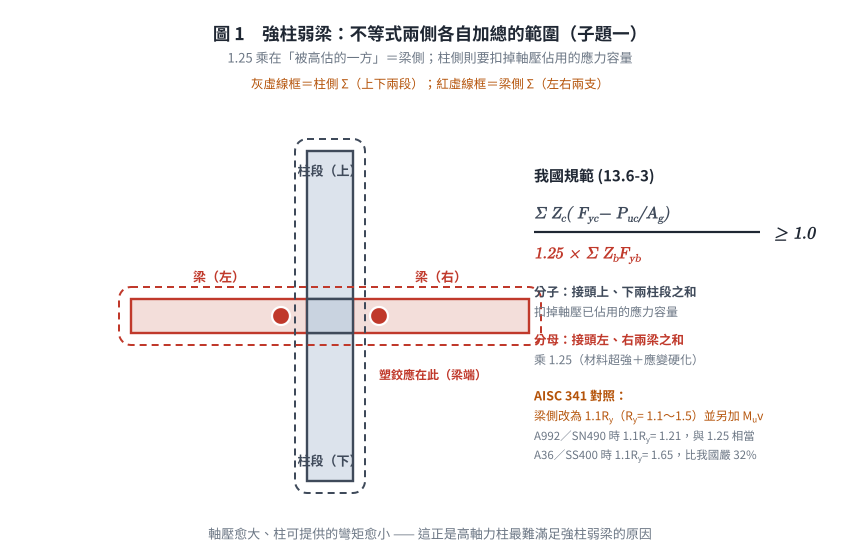
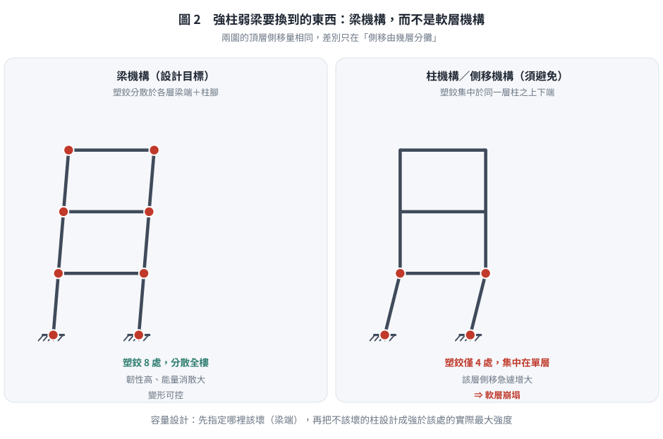
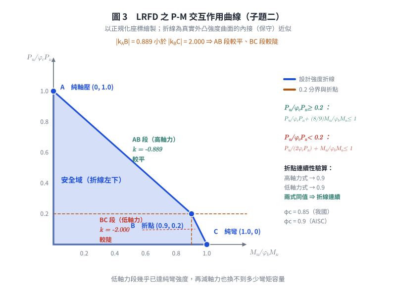

# SS-2009-1 — 如右圖所示鋼結構建築之梁柱構材示意圖

**來源：** 專門職業及技術人員高等考試結構工程技師 · 鋼結構設計 · 第一題
**考年：** 2009（民國 98 年）
**主分類：** [[SD-U3-1]] 結構耐震設計
**副分類：** [[SS-U1-3]] 梁柱桿件
**設計法：** LRFD
**標籤：** `強柱弱梁` `梁柱彎矩強度比` `P-M互制` `耐震設計` `韌性抗彎矩構架` `SMRF` `容量設計` `P-M互制曲線` `交互作用方程式` `我國規範13.6.5` `折線斜率`
**驗證狀態：** ⚠️ unverified

---

## 題幹摘要

> **原卷逐字**：「如右圖所示鋼結構建築之梁柱構材示意圖，試回答以下問題：
> (一) 進行鋼骨建築耐震設計時，依據**我國鋼結構極限設計法規範**，說明如何滿足強柱弱梁（Strong Column Weak Beam）之梁柱彎矩強度比（Moment Strength Ratio）之要求？（10 分）
> (二) 對於鋼結構建築之鋼柱，依據**我國鋼結構極限設計法規範**，繪出鋼柱受軸壓力（P）與單軸向彎矩（M）共同作用下之交互作用曲線圖（P-M Interaction Curve）。（15 分）」

⚠️ **兩小題都明寫「依據我國規範」**。子題(一) 必須寫**我國規範第 13.6.5 節之式 (13.6-3)**，而**不是** AISC 341 的 $\sum M^*_{pc}/\sum M^*_{pb}$ 形式——兩者差異甚大（見 §4 一、與 §6）。


*圖說：一般型梁柱接頭立面示意。H型柱（垂直）貫通，左右各有一 H型梁（水平），梁腹板以高拉力螺栓連結剪力板（shear tab），翼板採全滲透對接銲（CJP groove weld）。此為「韌性抗彎矩構架（SMRF）」之典型接頭型式。*

---

---

## 核心考點

**核心觀念：耐震容量設計——強柱弱梁與 P-M 互制**

此題為 SMRF 耐震設計的核心概念題，測驗考生對「容量設計（Capacity Design）」原則的理解，以及鋼柱 LRFD 設計的 P-M 互制曲線（兩段折線型式）。容量設計的精髓：讓設計者能**控制塑性鉸發生的位置**（梁端，而非柱端），使整體構架在地震下具備穩定的能量消散機制。

**出題者測驗重點：**

- **強柱弱梁的物理意義**：柱側彎矩強度恆大於梁側，確保塑性鉸在梁端形成（梁機構），而非柱端（層崩塌機構）
- **我國規範用「1.25」處理梁的超強**：$\sum Z_c(F_{yc} - P_{uc}/A_g) \geq 1.25\sum Z_bF_{yb}$ —— **單一定值係數**，不含 $R_y$、不含 $M_v$
- **柱側須扣軸力**：$(F_{yc} - P_{uc}/A_g)$ 反映軸壓已消耗部分斷面的彎矩容量
- **P-M 折點 B 在 $P = 0.2\phi_c P_n$**：兩段折線是對真實 P-M 曲面的簡化；**折點處兩式皆得 $M/\phi_bM_n = 0.9$，曲線連續**
- **兩段斜率的大小關係**：AB 段 $|{-}8/9|$ **較平**、BC 段 $|{-}2|$ **較陡**（常被寫反）
- **$\phi_c = 0.85$ vs $\phi_b = 0.90$**：軸壓不確定性較大（0.85），彎曲不確定性較小（0.90）

---

---

## 解題關鍵步驟

**作戰計畫：**
```
(一) 強柱弱梁：
  Step 1  寫出驗算不等式 ΣM*pc > ΣM*pb
  Step 2  定義 M*pc = Zc(Fyc − Pu/Ag)（含軸力折減）
  Step 3  定義 M*pb = Σ(1.1RyFybZb + Mv)（含超強與剪力附加彎矩）

(二) P-M 互制曲線：
  Step 4  列出兩段公式（高軸力 Pu/φcPn ≥ 0.2，低軸力 < 0.2）
  Step 5  計算 A、B、C 三個控制點（純壓、折點、純彎）
  Step 6  繪製折線圖，標示兩段
```

**陷阱分析：**

| 陷阱 | 說明 | 對策 |
|------|------|------|
| ❶ **答錯規範** | 題目問「**我國**規範」，卻寫成 AISC 341 的 $1.1R_yF_{yb}Z_b + M_v$ | 我國式 (13.6-3) 用**單一 1.25**，無 $R_y$、無 $M_v$ |
| ❷ 1.25 放的位置 | 1.25 乘在**梁側**（被高估的一方），不是除在柱側 | $\sum Z_c(F_{yc}-P_{uc}/A_g) \geq \mathbf{1.25}\sum Z_bF_{yb}$ |
| ❸ 柱側忘記扣軸力 | 柱的彎矩容量須以 $(F_{yc} - P_{uc}/A_g)$ 折減 | 軸壓愈大、可用彎矩愈小 |
| ❹ 折點 B 的 P 值 | 折點在 $P = 0.2\phi_c P_n$，而非 $0.5\phi_c P_n$ | 代入兩段公式驗算折點相等（皆得 0.9） |
| ❺ **兩段斜率寫反** | AB 段（高軸力）斜率 $-8/9$、**較平**；BC 段（低軸力）斜率 $-2$、**較陡** | 由三控制點 A(0,1)、B(0.9,0.2)、C(1,0) 直接算斜率 |
| ❻ $\phi_c$ 與 $\phi_b$ 搞混 | 軸壓：$\phi_c = 0.85$；彎曲：$\phi_b = 0.90$ | 壓力折減較嚴（0.85） |
| ❼ 例外條款 | 屋頂層柱頂、低軸壓比柱等有免驗規定 | 規範明文例外，答題時需提及 |

---

---

## 4. 步驟化詳細計算過程 (Step-by-Step Detailed Calculation)

### 一、強柱弱梁之彎矩強度比要求

#### 1.1 設計目的

強柱弱梁（SCWB）原則屬「容量設計（Capacity Design）」的核心概念：確保地震時**塑性鉸**優先在**梁端**形成，而非柱端，使整體構架具備穩定的能量消散機制（梁機構），避免因柱形成塑鉸而導致樓層崩塌（側移機構）。

#### 1.2 規範要求（韌性抗彎矩構架 SMRF）

我國「鋼結構極限設計法規範及解說」**第十三章 耐震設計、第 13.6.5 節「梁柱彎矩強度比」**規定：「任何梁柱接頭應滿足下式：」

$$\boxed{\frac{\displaystyle\sum Z_c\!\left(F_{yc} - \frac{P_{uc}}{A_g}\right)}{1.25 \displaystyle\sum Z_b F_{yb}} \ \geq\ 1.0} \qquad (13.6\text{-}3)$$

等價寫法：

$$\sum Z_c\!\left(F_{yc} - \frac{P_{uc}}{A_g}\right) \ \geq\ 1.25 \sum Z_b F_{yb}$$

| 符號 | 規範定義 |
|------|------|
| $Z_c$ | 柱斷面塑性模數 |
| $F_{yc}$ | 柱鋼材之標稱降伏強度 |
| $P_{uc}$ | 所需之柱軸向受壓強度 |
| $A_g$ | 柱全斷面積 |
| $Z_b$ | 梁斷面塑性模數 |
| $F_{yb}$ | 梁鋼材之標稱降伏強度 |
| $\sum$ | 柱側：接頭**上、下**兩柱段之和；梁側：接頭**左、右**兩梁之和 |

> ⚠️ **來源註記**：本式引自 rootlaw 之官方 PDF（第十三章）。該 PDF 之**文字層已破損**，兩次獨立擷取對「分子／分母／1.25 的位置」給出互相矛盾的排列（其中一種為 $1.25 \geq$ 比值，物理上不可能——那等於要求柱比梁**弱**）。本頁依**強柱弱梁的物理意義**（柱側必須大於梁側）確定上式之不等號方向，並與 AISC 341 的 $\sum M^*_{pc}/\sum M^*_{pb} > 1.0$ 結構對照確認。**建議以紙本規範第十三章覆核。**

#### 1.3 兩側各自的物理意義

**柱側（分子）—— 扣除軸力後的可用彎矩容量：**

$$Z_c\left(F_{yc} - \frac{P_{uc}}{A_g}\right)$$

柱同時承受軸壓與彎矩。斷面的應力容量 $F_{yc}$ 已被軸應力 $f_a = P_{uc}/A_g$ 佔用一部分，剩下 $(F_{yc} - f_a)$ 才能用來抵抗彎矩。**軸壓愈大，柱可提供的彎矩強度愈小** —— 這正是高軸力柱容易先形成塑鉸的原因，也是規範要求扣除的理由。

**梁側（分母）—— 乘 1.25 反映梁的實際超強：**

$$1.25 \sum Z_b F_{yb}$$

梁端塑鉸的**實際**彎矩會超過 $Z_bF_{yb}$，原因有二：
1. **材料超強**：鋼材實際降伏強度普遍高於標稱值（$F_{y,actual} > F_y$）；
2. **應變硬化**：塑鉸轉動後應力進入硬化段，超過降伏強度。

我國規範以**單一定值 1.25** 涵蓋這兩項；AISC 341 則拆成 $1.1 \times R_y$（$1.1$ 為應變硬化、$R_y$ 為材料超強，依鋼種 1.1～1.5）。



*圖 1　不等式兩側各自加總的範圍。1.25 乘在被高估的一方＝梁側，柱側則要扣掉軸壓已佔用的應力容量；這張圖攔的是 $\sum$ 範圍取錯（柱是上下、梁是左右）與把 1.25 除到柱側。*

#### 1.4 計算流程

```
① 柱側：對接頭上、下兩柱段各算 Zc(Fyc − Puc/Ag)，相加
② 梁側：對接頭左、右兩梁各算 Zb·Fyb，相加後乘 1.25
③ 驗算：①/② ≥ 1.0
④ 不滿足 → 加大柱斷面（↑Zc）／減小梁斷面（↓Zb）／降低柱軸力
```

**免驗（例外）情形：**
- **屋頂層柱頂**：其上方無柱，不會形成貫穿樓層的柱機構
- **柱軸壓比甚低者**：$P_{uc}/(F_{yc}A_g)$ 低於規定值（約 0.3）且符合特定條件
- 該層之側向剪力強度相對下層有足夠增量者

> ⚠️ 例外條款之確切數值門檻同受前述 PDF 文字層破損影響，僅能確認量級（約 0.3、約 50%），**建議以紙本覆核**。

#### 1.5 為何要「強柱弱梁」——兩種崩塌機構的對比

| 機構 | 塑鉸位置 | 韌性 | 後果 |
|------|---------|:---:|------|
| **梁機構**（Beam mechanism，目標） | 各層梁端 | **高** | 塑鉸數量多、分散全樓，能量消散大，變形可控 |
| **柱機構／側移機構**（Sway mechanism，須避免） | 同一層柱之上下端 | **低** | 塑鉸集中於單層，該層側移急遽增大 → **軟層崩塌** |

強柱弱梁的本質是**容量設計（Capacity Design）**：先指定「哪裡該壞」（梁端），再把不該壞的構件（柱）設計成強度大於「該壞處的實際最大強度」。

---



*圖 2　強柱弱梁要換到的東西。兩格的頂層側移量相同，差別只在側移由幾層分攤；這張圖攔的是把強柱弱梁當成條文背誦，而說不出「為什麼柱端出鉸就是軟層崩塌」。*

### 二、P-M 交互作用曲線圖

#### 2.1 LRFD 交互作用方程式

鋼柱在軸壓力 $P_u$ 與單軸彎矩 $M_u$ 共同作用下，依規範：

**當 $\dfrac{P_u}{\phi_c P_n} \geq 0.2$（高軸力段）：**

$$\frac{P_u}{\phi_c P_n} + \frac{8}{9} \cdot \frac{M_u}{\phi_b M_n} \leq 1.0$$

**當 $\dfrac{P_u}{\phi_c P_n} < 0.2$（低軸力段）：**

$$\frac{P_u}{2\phi_c P_n} + \frac{M_u}{\phi_b M_n} \leq 1.0$$

#### 2.2 關鍵控制點

| 點 | $P_u$ | $M_u$ | 說明 |
|----|--------|--------|------|
| **A** | $\phi_c P_n$ | $0$ | 純軸壓（無彎矩） |
| **B**（折點） | $0.2\, \phi_c P_n$ | $0.9\, \phi_b M_n$ | 兩段公式交界處 |
| **C** | $0$ | $\phi_b M_n$ | 純彎矩（無軸壓） |

**折點 B 之連續性驗算（兩式在 $P_u/\phi_cP_n = 0.2$ 處必須給出同一個 $M_u$）：**

高軸力式：$0.2 + \dfrac{8}{9}\dfrac{M_u}{\phi_bM_n} = 1.0 \Rightarrow \dfrac{M_u}{\phi_bM_n} = \dfrac{0.8 \times 9}{8} = \mathbf{0.9}$

低軸力式：$\dfrac{0.2}{2} + \dfrac{M_u}{\phi_bM_n} = 1.0 \Rightarrow \dfrac{M_u}{\phi_bM_n} = 1.0 - 0.1 = \mathbf{0.9}$ ✓

**兩式同得 0.9 ⇒ 折線在 B 點連續**（這正是 $8/9$ 與 $1/2$ 這兩個係數被選定的原因）。

#### 2.3 兩段的斜率（⚠️ 大小關係常被寫反）

以**正規化座標** $\bar{M} = M_u/\phi_bM_n$（橫軸）、$\bar{P} = P_u/\phi_cP_n$（縱軸）表示三控制點：

$$A(0,\ 1.0), \qquad B(0.9,\ 0.2), \qquad C(1.0,\ 0)$$

$$k_{AB} = \frac{0.2 - 1.0}{0.9 - 0} = \frac{-0.8}{0.9} = -\frac{8}{9} = -0.889$$

$$k_{BC} = \frac{0 - 0.2}{1.0 - 0.9} = \frac{-0.2}{0.1} = -2.000$$

$$|k_{AB}| = 0.889 \ < \ |k_{BC}| = 2.000$$

$$\Rightarrow \boxed{\text{AB 段（高軸力）較「平」；BC 段（低軸力）較「陡」}}$$

未正規化時：$\dfrac{dP}{dM}\Big|_{AB} = -\dfrac{8}{9}\dfrac{\phi_cP_n}{\phi_bM_n}$、$\dfrac{dP}{dM}\Big|_{BC} = -2\dfrac{\phi_cP_n}{\phi_bM_n}$

**幾何直觀：** 從 A 走到 B，$\bar M$ 增加 0.9 而 $\bar P$ 只降 0.8（走得「橫」）；從 B 走到 C，$\bar M$ 只增加 0.1 而 $\bar P$ 又降 0.2（走得「直」）。**低軸力段幾乎已達純彎強度，再減軸力也換不到多少彎矩容量。**



*圖 3　兩段折線的斜率大小關係。三個控制點由 8/9 與 1/2 兩係數算出（兩式在 $\bar P = 0.2$ 處皆得 0.9，故折線連續）；這張圖攔的是把 AB 與 BC 的陡平寫反。*

#### 2.4 P-M 交互作用曲線圖

```
 Pu/φcPn
   1.0 ┤● A（純軸壓，Mu = 0）
       │ ╲
       │   ╲                 AB 段：斜率 −8/9（較平）
       │     ╲               Pu/φcPn + (8/9)Mu/φbMn = 1.0
       │       ╲
       │         ╲
       │           ╲
   0.2 ┤─ ─ ─ ─ ─ ─ ─● B（折點：0.9, 0.2）
       │              │╲     BC 段：斜率 −2（較陡）
       │   安全域     │ ╲    Pu/(2φcPn) + Mu/φbMn = 1.0
       │  （左下）    │  ╲
     0 ┼──────────────┴───● C（純彎矩，Pu = 0）
       0             0.9  1.0    Mu/φbMn
```

**P-M 曲線特性：**

| 特性 | 說明 |
|------|------|
| 整體形狀 | 兩段直線，折點在 $P_u = 0.2\phi_cP_n$、$M_u = 0.9\phi_bM_n$ |
| 上段（AB） | 軸力主導；斜率 $-\frac{8}{9}\frac{\phi_cP_n}{\phi_bM_n}$，**絕對值較小 → 較平** |
| 下段（BC） | 彎矩主導；斜率 $-2\frac{\phi_cP_n}{\phi_bM_n}$，**絕對值較大 → 較陡** |
| 折點連續性 | 兩式在 B 點皆得 $M_u/\phi_bM_n = 0.9$，曲線**連續但不平滑**（有轉折） |
| 安全域 | 折線**左下方**（含折線本身）為安全，右上方不安全 |
| 與真實曲面之關係 | 真實 P-M 強度為外凸曲線；兩段折線是其**內接**（保守）近似 |

---


*（詳見原始解析）*

---

## 涉及陷阱

**作戰計畫：**
```
(一) 強柱弱梁：
  Step 1  寫出驗算不等式 ΣM*pc > ΣM*pb
  Step 2  定義 M*pc = Zc(Fyc − Pu/Ag)（含軸力折減）
  Step 3  定義 M*pb = Σ(1.1RyFybZb + Mv)（含超強與剪力附加彎矩）

(二) P-M 互制曲線：
  Step 4  列出兩段公式（高軸力 Pu/φcPn ≥ 0.2，低軸力 < 0.2）
  Step 5  計算 A、B、C 三個控制點（純壓、折點、純彎）
  Step 6  繪製折線圖，標示兩段
```

**陷阱分析：**

| 陷阱 | 說明 | 對策 |
|------|------|------|
| ❶ **答錯規範** | 題目問「**我國**規範」，卻寫成 AISC 341 的 $1.1R_yF_{yb}Z_b + M_v$ | 我國式 (13.6-3) 用**單一 1.25**，無 $R_y$、無 $M_v$ |
| ❷ 1.25 放的位置 | 1.25 乘在**梁側**（被高估的一方），不是除在柱側 | $\sum Z_c(F_{yc}-P_{uc}/A_g) \geq \mathbf{1.25}\sum Z_bF_{yb}$ |
| ❸ 柱側忘記扣軸力 | 柱的彎矩容量須以 $(F_{yc} - P_{uc}/A_g)$ 折減 | 軸壓愈大、可用彎矩愈小 |
| ❹ 折點 B 的 P 值 | 折點在 $P = 0.2\phi_c P_n$，而非 $0.5\phi_c P_n$ | 代入兩段公式驗算折點相等（皆得 0.9） |
| ❺ **兩段斜率寫反** | AB 段（高軸力）斜率 $-8/9$、**較平**；BC 段（低軸力）斜率 $-2$、**較陡** | 由三控制點 A(0,1)、B(0.9,0.2)、C(1,0) 直接算斜率 |
| ❻ $\phi_c$ 與 $\phi_b$ 搞混 | 軸壓：$\phi_c = 0.85$；彎曲：$\phi_b = 0.90$ | 壓力折減較嚴（0.85） |
| ❼ 例外條款 | 屋頂層柱頂、低軸壓比柱等有免驗規定 | 規範明文例外，答題時需提及 |

---

---

## 圖形

| 檔案 | 類型 | 內容 |
|------|------|------|
| [SS-2009-1-fig-1.png](../../raw/solutions/SS-2009-1/SS-2009-1-fig-1.png) | PNG 附圖 | 題目附圖 |
| [SS-2009-1-fig-1-scwb.svg](../../raw/solutions/SS-2009-1/figs/SS-2009-1-fig-1-scwb.svg) | SVG 向量圖 | 強柱弱梁的 Σ 範圍（腳本 `gen_SS-2009-1.py` 產生） |
| [SS-2009-1-fig-2-mechanism.svg](../../raw/solutions/SS-2009-1/figs/SS-2009-1-fig-2-mechanism.svg) | SVG 向量圖 | 梁機構 vs 軟層機構（腳本 `gen_SS-2009-1.py` 產生） |
| [SS-2009-1-fig-3-pm.svg](../../raw/solutions/SS-2009-1/figs/SS-2009-1-fig-3-pm.svg) | SVG 向量圖 | P-M 折線與兩段斜率（腳本 `gen_SS-2009-1.py` 產生） |


## 核心考點

本題測驗兩個耐震核心觀念：

1. **強柱弱梁原則**：韌性抗彎矩構架（SMRF）中，接頭處柱側的彎矩強度之和須大於梁側（含超強）之和，以確保塑性鉸先在梁端形成，保護柱。**我國規範第 13.6.5 節式 (13.6-3)**：

$$\frac{\sum Z_c\!\left(F_{yc} - \dfrac{P_{uc}}{A_g}\right)}{1.25 \sum Z_b F_{yb}} \geq 1.0$$

   柱側須扣軸應力 $P_{uc}/A_g$；梁側乘 **1.25**（材料超強＋應變硬化）。**不含 $\phi$ 折減、不含 $R_y$、不含 $M_v$**（後兩者是 AISC 341 的做法）。

2. **P-M 互制曲線**：鋼柱同時受軸壓 $P_u$ 與彎矩 $M_u$ 時，以兩段線性方程式描述強度界限：

$$\text{當} \frac{P_u}{\phi_c P_n} \geq 0.2：\frac{P_u}{\phi_c P_n} + \frac{8}{9}\frac{M_u}{\phi_b M_n} \leq 1.0$$

$$\text{當} \frac{P_u}{\phi_c P_n} < 0.2：\frac{P_u}{2\phi_c P_n} + \frac{M_u}{\phi_b M_n} \leq 1.0$$

## 解題關鍵步驟

1. **強柱弱梁驗核**：柱側 $\sum Z_c(F_{yc} - P_{uc}/A_g)$（接頭上下兩柱段）；梁側 $1.25\sum Z_bF_{yb}$（接頭左右兩梁）；確認柱側／梁側 $\geq 1.0$。屋頂層柱頂與低軸壓比柱可免驗。
2. **P-M 互制圖繪製**：$P_u/\phi_cP_n$ 為縱軸、$M_u/\phi_bM_n$ 為橫軸；三控制點 A$(0,\ 1.0)$、B$(0.9,\ 0.2)$、C$(1.0,\ 0)$。
3. **兩段斜率**：AB 段 $-8/9$（**較平**）、BC 段 $-2$（**較陡**）；折點處兩式皆得 $M_u/\phi_bM_n = 0.9$，曲線連續。
4. **設計驗核**：將 $(M_u, P_u)$ 點標於折線圖，確認落在折線左下方（安全域）。

## 涉及陷阱

- **⚠️ 答錯規範**：題目兩次明寫「依據**我國**規範」，須寫 (13.6-3) 的 **1.25** 形式，不可寫成 AISC 341 的 $1.1R_yF_{yb}Z_b + M_v$。
- **⚠️ 軸壓折減易漏**：柱側須用 $Z_c(F_{yc} - P_{uc}/A_g)$ 而非 $Z_cF_{yc}$。
- **⚠️ 1.25 放在梁側**：1.25 乘在被高估的一方（梁），不是除在柱側。
- **⚠️ 分段判斷 0.2**：P-M 互制式依 $P_u/\phi_cP_n$ 是否 $\geq 0.2$ 分兩段，忘記分段是最常見錯誤。
- **⚠️ 兩段斜率別寫反**：AB 段（高軸力）$|-8/9| = 0.889$ **較平**；BC 段（低軸力）$|-2|$ **較陡**。
- **⚠️ 強柱弱梁比值 ≥ 1**：柱側／梁側須 $\geq 1$，不是 $\leq 1$。


## 相關概念

[[BEAM-COLUMN-INTERACTION]] | [[CAPACITY-DESIGN]] | [[SEISMIC-DESIGN-PHILOSOPHY]] | [[STRONG-COLUMN-WEAK-BEAM]]

## 相關題目

*（請參閱 [原始解析](../../raw/solutions/SS-2009-1/SS-2009-1.md) 取得完整計算內容）*
