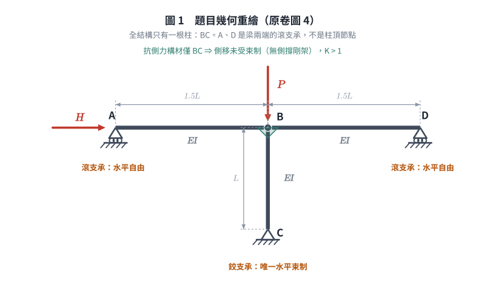

# SS-2013-4 — 無側撐剛架之二階設計彎矩 Mu 與 B1、B2、Mnt、Mlt（符號解）

**來源：** 專門職業及技術人員高等考試結構工程技師 · 鋼結構設計 · 第四題
**考年：** 2013（民國 102 年）
**主分類：** [[SS-U1-3]] 梁柱桿件
**副分類：** 無
**設計法：** LRFD
**標籤：** `二階效應` `B1B2放大法` `無側撐剛架` `有效長度係數` `對位圖` `Mnt` `Mlt` `層間穩定` `設計彎矩` `滾支承` `符號解`
**驗證狀態：** ⚠️ unverified

---

## 題幹摘要

> **原卷逐字**：「如圖 4 所示一**無側撐剛架**，承受垂直軸壓力 P 及水平力 H。試使用 LRFD 求解**柱 BC** 之二階設計彎矩（Second-order design moment）$M_u$ 及 $B_1$、$B_2$、$M_{nt}$、$M_{lt}$。（求解柱 BC 之有效長度係數時，請參考題二之 Alignment Chart。）（25 分）（柱邊界為固接（Fixed end）時 G 使用 1、為鉸接（hinged end）時 G 使用 10。）」


*圖說（依原卷圖 4 目視判讀）：**上方**為連續水平梁 **A—B—D**，$AB = BD = 1.5L$（全長 $3L$），各段 $EI$ 相同。**A 端與 D 端均為滾支承**（三角形＋滾輪＋斜線地面符號）——只提供**垂直**支承，水平方向**可自由平移**。**B 點**為梁與柱之剛性交會點。自 B 往**下**接一根長度 $L$、剛度 $EI$ 之柱 **BC**，柱底 **C 為鉸支承**（三角形＋斜線地面，無滾輪）——同時束制水平與垂直。**水平力 $H$ 作用於 A 點**（向右），**垂直軸壓力 $P$ 作用於 B 點**（向下，即柱頂）。*



*圖 1　題目幾何重繪。A、D 是**梁端的滾支承**而非柱頂節點——全結構只有柱 BC 一根，這張圖攔的是「單層兩跨、三根柱」的誤讀，該誤讀會同時把 $\sum P_{eK}$ 膨脹 2.7 倍、把 $M_{lt}$ 錯分成 $HL/3$。*

**⚠️ 幾何判讀重點（本題最易誤讀之處）：**

| 項目 | 正確判讀 | 常見誤讀 |
|------|---------|---------|
| 柱數 | **僅 1 根**（柱 BC） | 誤為「單層兩跨、三根柱」 |
| A、D 之角色 | 梁兩端之**滾支承**（在地面／支座上） | 誤為兩根外柱的柱頂節點 |
| 水平束制來源 | **只有 C 點的鉸支承**（故可側移＝無側撐剛架） | — |
| $P$ 之作用位置 | **B 點**（柱頂，與柱同軸） | 誤為作用於 D 點 |
| $H$ 之作用位置 | A 點（經梁傳至 B，再下傳至 C） | — |

**為何是「無側撐剛架」：** A、D 為滾支承，水平方向不提供束制；整個梁可水平平移，唯一抵抗側移者為柱 BC 之撓曲。故側移**未受束制**（sidesway uninhibited），符合原卷「無側撐剛架」之描述，$K > 1$。

**題目提供之公式（原卷圖 4 下方）：**
$$B_1 = \frac{C_m}{1 - P_u/P_{eK}} \geq 1.0, \quad C_m = 0.6 - 0.4\frac{M_A}{M_B}$$
$$P_{eK} = \frac{\pi^2 EI}{(KL)^2} = \frac{P_e}{K^2}, \quad B_2 = \frac{1}{1 - \sum P_u/\sum P_{eK}}$$
$$M_u = B_1 M_{nt} + B_2 M_{lt}$$

**題目提供之 K 值表（原卷題三下方，本題可參照）：**

| 條件 | 邊界無側位移 | | | 邊界有側位移* | | |
|------|:---:|:---:|:---:|:---:|:---:|:---:|
| 端點型式 | 固接-固接 | 鉸接-固接 | 鉸接-鉸接 | 固接*-固接 | 固接*-鉸接 | 自由端*-固接 |
| 理論 K | 0.5 | 0.7 | 1.0 | 1.0 | 2.0 | 2.0 |
| 設計 K | 0.65 | 0.8 | 1.0 | 1.2 | 2.0 | 2.1 |

> 本題採 **Alignment Chart（有側移）** 求 $K$，K 值表僅作對照參考。

**本題為符號解**：$P$、$H$、$L$、$EI$ 均為符號，答案應以符號表示。

---

---

## 核心考點

**核心觀念：$B_1$-$B_2$ 放大法 —— 二階彎矩的兩個來源分別放大後再相加**

| 量 | 物理意義 | 求法 | 本題結果 |
|---|---------|------|---------|
| $M_{nt}$ | **no translation**：側移被束制後的一階彎矩 | 加虛擬水平支撐，只施加重力載重，作一階分析 | **0** |
| $M_{lt}$ | **lateral translation**：僅側移（水平力）造成的一階彎矩 | 只施加水平力，作一階分析 | **$HL$** |
| $B_1$ | 構材撓曲 P-δ 放大係數（作用於 $M_{nt}$） | $C_m/(1-P_u/P_{eK})$，$P_{eK}$ 用**無側移 K** | 1.0（$M_{nt}=0$，不影響結果） |
| $B_2$ | 層間側移 P-Δ 放大係數（作用於 $M_{lt}$） | $1/(1-\sum P_u/\sum P_{eK})$，$P_{eK}$ 用**有側移 K** | $\dfrac{1}{1 - PL^2/(2.88EI)}$ |
| $M_u$ | 二階設計彎矩 | $B_1M_{nt} + B_2M_{lt}$ | $B_2 \cdot HL$ |

**出題者測驗重點：**
1. 能正確判讀支承型式（滾支承 vs 鉸支承）並判定「可側移」
2. 能分離 $M_{nt}$ 與 $M_{lt}$（本題 $M_{nt}=0$ 是關鍵發現）
3. 能用有側移對位圖查 $K$（$G$ 值分母含**兩側**梁）
4. 知道 $\sum P_{eK}$ 只計「抵抗側移之柱」，本題僅 1 根

---

---

## 解題關鍵步驟

**作戰計畫：**
```
Step 1  判讀支承：A、D 滾支承（水平自由）、C 鉸支承（水平束制）→ 可側移，僅 1 根柱
Step 2  G 值：柱頂 B 之分母含左右兩段梁；柱底 C 為鉸接 → G = 10
Step 3  有側移對位圖 → K_BC
Step 4  Mnt：束制側移後，P 沿柱軸直下 + 幾何對稱 → Mnt = 0
Step 5  Mlt：對 C 取矩，H 作用於 L 高處 → Mlt = H·L
Step 6  ΣPeK = π²EI/(K L)²（只有 BC 一根）；ΣPu = P
Step 7  B2 = 1/(1 − ΣPu/ΣPeK)；Mu = B1·0 + B2·HL = B2·HL
```

**關鍵陷阱：**

> ⚠️ **陷阱1：把 A、D 誤認為柱頂節點（本題最致命）**
> A、D 是**梁端的滾支承**，不是柱。全結構**只有一根柱（BC）**。若誤為三根柱，$\sum P_{eK}$ 會膨脹成約 2.7 倍、$M_{lt}$ 會被錯誤地分成 $H/3 \times L$，兩處錯誤同時發生。

> ⚠️ **陷阱2：$M_{lt}$ 不是 $HL/3$，而是 $HL$**
> 只有柱 BC 抵抗側移（A、D 為滾支承，水平反力為零），故層剪力**全部**由 BC 承擔：$V_{BC} = H$，$M_{lt} = H \times L$。

> ⚠️ **陷阱3：$M_{nt} = 0$，但仍須說明理由**
> $P$ 直接作用於柱頂 B、與柱同軸，且梁兩側跨度相同（$1.5L = 1.5L$）。束制側移後，梁在 B 點的變形對稱 → $\theta_B = 0$ → 左右梁端彎矩等值反向、於節點相消 → 不傳遞彎矩給柱 → $M_{nt} = 0$。

> ⚠️ **陷阱4：$P_{e1}$（$B_1$ 用）與 $P_{eK}$（$B_2$ 用）的 K 不同**
> $B_1$ 之 $P_{e1}$ 用**無側移** K（規範明定 $K \leq 1.0$）；$B_2$ 之 $P_{eK}$ 用**有側移** K（規範 4.8 節，$K \geq 1.0$）。混用會嚴重高估或低估。

> ⚠️ **陷阱5：$C_m$ 在 $M_{nt} = 0$ 時是 $0/0$**
> $M_A/M_B = 0/0$ 無定義。但 $B_1 M_{nt} = B_1 \times 0 = 0$，$B_1$ 之數值不影響 $M_u$；依規範下限取 $B_1 = 1.0$ 即可，**不可編造「規範規定 $C_m = 1.0$」**。

---

## 4. 步驟化詳細計算過程 (Step-by-Step Detailed Calculation)

### 一、支承判讀與結構行為

由圖 4 目視判讀：

- **A、D**：三角形＋**滾輪**＋斜線地面 → **滾支承**，$R_x = 0$、$R_y \neq 0$、$M = 0$
- **C**：三角形＋斜線地面（無滾輪）→ **鉸支承**，$R_x \neq 0$、$R_y \neq 0$、$M = 0$
- **B**：梁與柱之剛性交會（剛架節點）

**水平力平衡（整體）：**
$$\sum F_x = 0:\quad H + R_{x,A} + R_{x,D} + R_{x,C} = 0 \ \xrightarrow{\ R_{x,A}=R_{x,D}=0\ }\ R_{x,C} = -H$$

→ 水平力**全部**經梁傳至 B、再沿柱 BC 下傳至 C。柱 BC 是**唯一**的抗側力構材，故本剛架**側移未受束制**（無側撐剛架），$K > 1$。

---

### 二、$G$ 值計算

各構材 $EI$ 相同，取 $I_c = I_g = I$：

$$\text{柱勁度} = \frac{I_c}{L_c} = \frac{I}{L}, \qquad \text{梁勁度（兩段之和）} = \frac{I}{1.5L} + \frac{I}{1.5L} = \frac{2I}{1.5L} = \frac{4I}{3L}$$

**柱頂 B：**
$$G_B = \frac{\sum(I_c/L_c)}{\sum(I_g/L_g)} = \frac{I/L}{4I/(3L)} = \frac{3}{4} = \boxed{0.75}$$

**柱底 C（鉸接）：** 依原卷約定
$$G_C = \boxed{10}$$

---


*（詳見原始解析）*

---

## 涉及陷阱

**作戰計畫：**
```
Step 1  判讀支承：A、D 滾支承（水平自由）、C 鉸支承（水平束制）→ 可側移，僅 1 根柱
Step 2  G 值：柱頂 B 之分母含左右兩段梁；柱底 C 為鉸接 → G = 10
Step 3  有側移對位圖 → K_BC
Step 4  Mnt：束制側移後，P 沿柱軸直下 + 幾何對稱 → Mnt = 0
Step 5  Mlt：對 C 取矩，H 作用於 L 高處 → Mlt = H·L
Step 6  ΣPeK = π²EI/(K L)²（只有 BC 一根）；ΣPu = P
Step 7  B2 = 1/(1 − ΣPu/ΣPeK)；Mu = B1·0 + B2·HL = B2·HL
```

**關鍵陷阱：**

> ⚠️ **陷阱1：把 A、D 誤認為柱頂節點（本題最致命）**
> A、D 是**梁端的滾支承**，不是柱。全結構**只有一根柱（BC）**。若誤為三根柱，$\sum P_{eK}$ 會膨脹成約 2.7 倍、$M_{lt}$ 會被錯誤地分成 $H/3 \times L$，兩處錯誤同時發生。

> ⚠️ **陷阱2：$M_{lt}$ 不是 $HL/3$，而是 $HL$**
> 只有柱 BC 抵抗側移（A、D 為滾支承，水平反力為零），故層剪力**全部**由 BC 承擔：$V_{BC} = H$，$M_{lt} = H \times L$。

> ⚠️ **陷阱3：$M_{nt} = 0$，但仍須說明理由**
> $P$ 直接作用於柱頂 B、與柱同軸，且梁兩側跨度相同（$1.5L = 1.5L$）。束制側移後，梁在 B 點的變形對稱 → $\theta_B = 0$ → 左右梁端彎矩等值反向、於節點相消 → 不傳遞彎矩給柱 → $M_{nt} = 0$。

> ⚠️ **陷阱4：$P_{e1}$（$B_1$ 用）與 $P_{eK}$（$B_2$ 用）的 K 不同**
> $B_1$ 之 $P_{e1}$ 用**無側移** K（規範明定 $K \leq 1.0$）；$B_2$ 之 $P_{eK}$ 用**有側移** K（規範 4.8 節，$K \geq 1.0$）。混用會嚴重高估或低估。

> ⚠️ **陷阱5：$C_m$ 在 $M_{nt} = 0$ 時是 $0/0$**
> $M_A/M_B = 0/0$ 無定義。但 $B_1 M_{nt} = B_1 \times 0 = 0$，$B_1$ 之數值不影響 $M_u$；依規範下限取 $B_1 = 1.0$ 即可，**不可編造「規範規定 $C_m = 1.0$」**。

---

## 圖形

| 檔案 | 類型 | 內容 |
|------|------|------|
| [SS-2013-4-pm-viz.html](../../raw/solutions/SS-2013-4/SS-2013-4-pm-viz.html) | HTML 互動 | B₁-B₂ 放大法概念圖（單柱抗側移剛架，Mu = B₂×H·L，ΣPeK = 2.88EI/L²） |
| [SS-2013-4-fig-1.png](../../raw/solutions/SS-2013-4/SS-2013-4-fig-1.png) | PNG 附圖 | 題目附圖 |
| [SS-2013-4-fig-1-frame.svg](../../raw/solutions/SS-2013-4/figs/SS-2013-4-fig-1-frame.svg) | SVG 向量圖 | 題目幾何重繪（向量）（腳本 `gen_SS-2013-4.py` 產生） |
| [SS-2013-4-fig-2-nt-lt.svg](../../raw/solutions/SS-2013-4/figs/SS-2013-4-fig-2-nt-lt.svg) | SVG 向量圖 | Mnt／Mlt 分離三聯圖（腳本 `gen_SS-2013-4.py` 產生） |
| [SS-2013-4-fig-3-b2-curve.svg](../../raw/solutions/SS-2013-4/figs/SS-2013-4-fig-3-b2-curve.svg) | SVG 向量圖 | B2 放大曲線與適用上限（腳本 `gen_SS-2013-4.py` 產生） |


## 相關概念

[[BEAM-COLUMN-INTERACTION]] | [[FLEXURAL-BUCKLING-GENERAL]] | [[FRAME-STABILITY-ADVANCED]] | [[MOMENT-AMPLIFICATION-B1-B2]] | [[P-DELTA-EFFECT]] | [[SECOND-ORDER-ANALYSIS]]

## 相關題目

*（請參閱 [原始解析](../../raw/solutions/SS-2013-4/SS-2013-4.md) 取得完整計算內容）*
