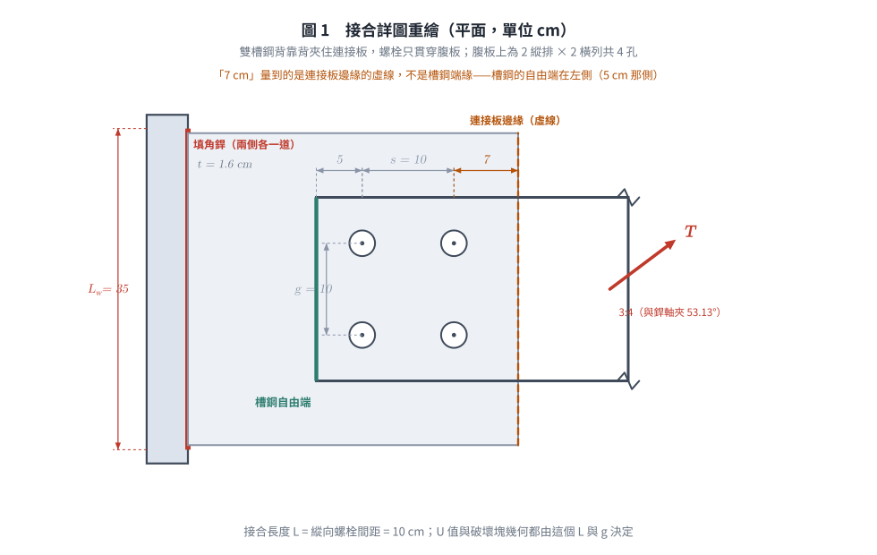
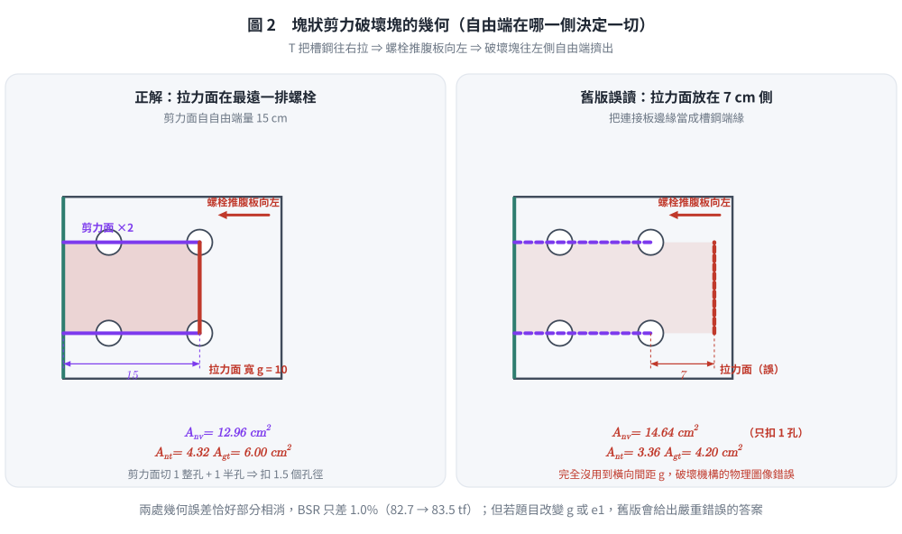
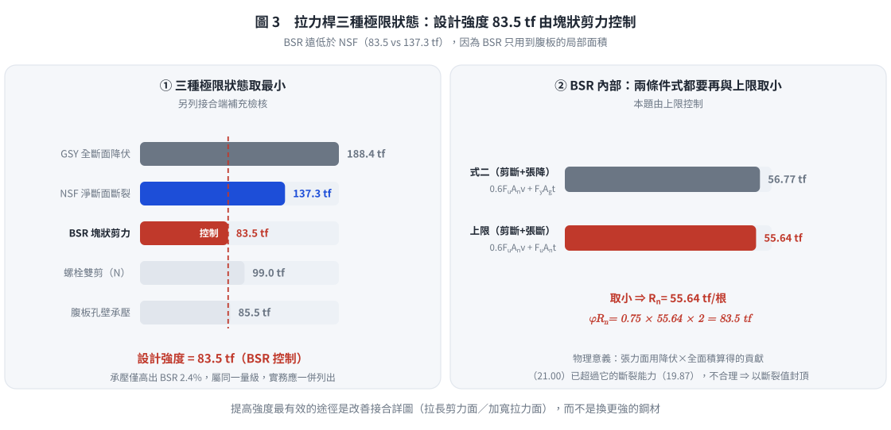

# SS-2015-2 — 雙槽鋼拉力桿設計強度（GSY/NSF/BSR）與連接板填角銲銲腳反算

**來源：** 專門職業及技術人員高等考試結構工程技師 · 鋼結構設計 · 第二題
**考年：** 2015（民國 104 年）
**主分類：** [[SS-U1-1]] 拉力及壓力桿件
**副分類：** [[SS-U1-4]] 接合之分析與設計
**設計法：** LRFD
**標籤：** `拉力桿件` `剪力遲滯` `塊狀剪力` `填角銲` `雙槽鋼` `U值` `接合設計` `上限式` `方向性強度` `孔壁承壓` `錯列淨斷面`
**驗證狀態：** ⚠️ unverified

---

## 題幹摘要

**結構描述：**
- 雙槽鋼（2×C200×75）拉力桿，透過連接板與 H 柱翼板接合
- C200×75 斷面：$H \times B \times t_w \times t_f = 200 \times 75 \times 6 \times 12.5$ mm
- 斷面性質：$A = 29.9$ cm²，$C_y = 2.49$ cm
  - ⚠️ **此二值第二題本身並未給定**，係取自**同一份試卷第三題**所列之「單一槽鋼 C200×75：$I_x = 1970$ cm⁴、$I_y = 170$ cm⁴、$A = 29.9$ cm²、$C_y = 2.49$ cm」。兩題斷面相同，援用合理。
  - 若僅由 $200 \times 75 \times 6 \times 12.5$ 作矩形理想化：$A_g = 2(7.5)(1.25) + (20 - 2.5)(0.6) = 18.75 + 10.5 = 29.25$ cm²（差 2.2%，型鋼實際有翼板斜度與圓角）。
- 螺栓：A325，$d_b = 2.5$ cm（高拉力螺栓，承壓型），**共 4 支（縱向 2 排 × 橫向 2 列）**
- 連接板：$t = 1.6$ cm，與 H 柱有效銲長 $L_w = 35$ cm
- 鋼材：A992，$F_y = 3.5$ tf/cm²，$F_u = 4.6$ tf/cm²
- 銲條：E70，$F_{EXX} = 4.9$ tf/cm²
- $E_s = 2040$ tf/cm²


*圖說：雙槽鋼拉力桿接合詳圖（單位：cm）。中央為連接板（gusset），兩側各一根 C200×75，槽鋼**腹板**貼合連接板、翼板朝外，螺栓僅貫穿腹板。螺栓配置（2026-08-22 重新判讀原始試卷確認）：**縱向**（力方向）自槽鋼端緣起 5 cm → 第一排螺栓 → 10 cm → 第二排螺栓 → 7 cm 至連接板邊緣（圖中虛線）；**橫向**（垂直力方向）兩列螺栓間距 $g = 10$ cm（見中央端視圖之「10」尺寸）。故**每根槽鋼腹板上共 4 個螺栓孔（2×2）**。接合長度（縱向最外兩排螺栓中心距）$L = 10$ cm。連接板厚 $t = 1.6$ cm，與 H 柱翼板之填角銲有效銲長 $L_w = 35$ cm（板兩側各一道），銲腳長度 $w$ 待求；拉力 $T$ 之作用線與銲道軸（鉛垂）成 3:4 斜率（與水平夾 36.87°），並通過銲道群形心（無附加偏心彎矩）。$C_y = 2.49$ cm 為單一 C200×75 斷面形心到腹板外面之距離。*



*圖 1　接合詳圖重繪。圖中「7 cm」量到的是**連接板邊緣的虛線**而非槽鋼端緣；這張圖攔的是把自由端判在 7 cm 那側，該誤判會讓塊狀剪力的拉力面整個放錯位置。*

> 🔍 **關鍵圖面判讀更正**：圖中「7 cm」量至一條**虛線**（隱藏線），該虛線為**連接板之邊緣**，非槽鋼之端緣；槽鋼右側有折斷符號表示構材延續。因此對**槽鋼**而言，自由端在左側（端距 5 cm），塊狀撕裂之剪力面長度為 $5 + 10 = 15$ cm，**不是** 7 cm 側。舊版解析誤將 7 cm 當成槽鋼端距並據以取拉力面，須更正（見 §4 極限狀態三）。


*圖說：題目提供參考公式。【淨寬】$w_n = w_g - \sum d_h + \sum \frac{s^2}{4g}$。【拉力設計強度】$T_{ds} = 0.9F_yA_g$（GSY）；$T_{ds} = 0.75F_uA_e$（NSF），$U = 0.9, 0.85, 0.75$。【塊狀剪力（BSR）】當 $F_uA_{nt} \geq 0.6F_uA_{nv}$：$\phi R_n = \phi[0.6F_yA_{gv} + F_uA_{nt}] \leq \phi[0.6F_uA_{nv} + F_uA_{nt}]$；當 $0.6F_uA_{nv} \geq F_uA_{nt}$：$\phi R_n = \phi[0.6F_uA_{nv} + F_yA_{gt}] \leq \phi[0.6F_uA_{nv} + F_uA_{nt}]$。【填角銲】$\phi R_n = (0.75)(0.6F_{EXX})(t)(L)$，$t = 0.707w$。*

**子問題：**
1. 求此拉力桿的**設計強度**（20 分）
2. 若連接板強度足夠，求設計**填角銲銲腳長度** $w$（10 分）

---

---

## 核心考點

**核心觀念：拉力桿件三重極限狀態 × 接合反算設計**

拉力桿件設計必須同時評估三個互相競爭的破壞模式，取最脆弱者（最小值）為設計強度。第二小題再以此強度「反推」銲腳尺寸，測驗完整的接合設計流程。

**出題者測驗重點：**
- **GSY**：全斷面降伏（$A_g$ 使用全斷面，$\phi = 0.9$）
- **NSF**：淨斷面斷裂（用 $U$ 折減，$\phi = 0.75$）；雙槽鋼只有腹板接觸螺栓 → 剪力遲滯必考
- **BSR**：塊狀剪力（識別破壞路徑、正確選用 $F_uA_{nt}$ vs $F_yA_{gt}$ 的條件公式）
- **填角銲**：從需求強度反算銲腳尺寸，並與最小銲腳尺寸取較大值

---

---

## 解題關鍵步驟

**作戰計畫：**
```
Step 1  整理幾何：斷面尺寸（mm→cm）、孔徑 dh、螺栓排列
Step 2  GSY：最快，φt × Fy × (2Ag)
Step 3  NSF：An（扣 2 孔，橫向 gauge 10cm）→ U = 0.75（規範表列）→ Ae = U·An
         → φt × Fu × (2Ae)
Step 4  BSR：先定自由端（5cm 側）→ 剪力面 2 條（長 15cm，扣 1.5 孔）
         → 拉力面 1 條（寬 g=10cm，扣 1 孔）→ 比較 FuAnt vs 0.6FuAnv
         → 選對條件公式 → 再與上限取小 → 乘 2（雙槽鋼）
Step 5  取三者最小值 = 設計強度
Step 6  填角銲：φRn = 0.75 × 0.6FEXX × 0.707w × (2 × 35) ≥ 設計強度 → 解 w
```

**陷阱分析：**

| 陷阱 | 說明 | 對策 |
|------|------|------|
| ❶ 忘記乘 2 | C200×75 是單根性質，需 ×2 | 每步計算完單根後立即標註 ×2 |
| ❷ 螺栓孔徑 | 標準孔 = $d_b + 0.3$ cm | $d_h = 2.5 + 0.3 = 2.8$ cm |
| ❸ NSF 扣孔數 | 橫向臨界截面同時穿過**同一縱向位置之 2 個孔**（橫向間距 $g = 10$ cm）；**不是** 1 孔 | $A_n = A_g - \mathbf{2} \times d_h \times t_w$ |
| ❹ BSR 條件公式選錯 | 比較 $F_uA_{nt}$ 與 $0.6F_uA_{nv}$，**較大者配 Fu（淨面積），較小者改用 Fy（全面積）**；且**兩式均受上限拘束** | 先判斷哪個大，再套對應公式，最後與上限取小 |
| ❺ BSR 破壞塊之方位 | 剪力面沿**兩條螺栓列線**由槽鋼自由端（5 cm 側）延伸至最遠一排螺栓（長 15 cm）；拉力面為**通過最遠一排螺栓、寬度等於橫向間距 $g$** 之橫斷面 | 先確認自由端在哪一側（本題為 5 cm 側），再畫塊 |
| ❻ 銲道兩側 | 連接板兩側各一道填角銲，有效總長 = 2 × 35 = 70 cm | $\phi R_n = 0.75 \times 0.6F_{EXX} \times 0.707w \times 70$ |
| ❼ 最小銲腳尺寸查錯 | 台灣規範表 10.2-4：$12 < t \le 19$ mm → 最小 **6 mm**（$19 < t \le 38$ mm 才是 8 mm） | 連接板 16 mm ⇒ 最小 6 mm，本題由**強度**控制 |

---

---

## 4. 步驟化詳細計算過程 (Step-by-Step Detailed Calculation)


*圖說：U 值計算整理。查表法：① W/H/S/T 型鋼翼板連接，沿力方向每排 ≥3 個螺栓 → U=0.9；② 其他斷面（含槽鋼）每排 ≥3 個螺栓 → U=0.85；③ 每排 2 個螺栓 → U=0.75。公式法：$U = 1 - \bar{x}/L$（$\bar{x}$ 為斷面形心到剪力傳力面之距離，$L$ 為接合縱向長度）；C 型鋼只有腹板連接時 $\bar{x} = C_y$。*

> 📌 **規範版本提醒**：筆記所寫「兩者取較大值」是 **AISC 360-05 之後**的規定。台灣 2010 規範與本試卷第三頁參考公式**只列表列值** $U = 0.9 / 0.85 / 0.75$，並未給公式法。本題兩法為 0.75 vs 0.751（差 0.13%），作答依表列值 0.75 為宜（詳 §5 爭議三、§6.1）。


*圖說：三種極限狀態概念。GSY：全斷面降伏，$\phi=0.9$，$P_n = F_yA_g$。NSF：有效淨截面斷裂，$\phi=0.75$，$P_n = F_uA_e = F_u U A_n$。BSR：塊狀剪力，$\phi=0.75$；兩條判斷規則：(a) $F_uA_{nt} \geq 0.6F_uA_{nv}$ → 張力斷裂 + 剪力降伏：$R_n = 0.6F_yA_{gv} + F_uA_{nt}$；(b) $0.6F_uA_{nv} > F_uA_{nt}$ → 剪力斷裂 + 張力降伏：$R_n = 0.6F_uA_{nv} + F_yA_{gt}$。兩種情況均有上限：$R_n \leq 0.6F_uA_{nv} + F_uA_{nt}$。*

### 基本幾何整理

| 參數 | 單位換算 | 結果 |
|------|----------|------|
| $H = 200$ mm | → cm | 20.0 cm |
| $B = 75$ mm | → cm | 7.5 cm |
| $t_w = 6$ mm | → cm | 0.6 cm |
| $t_f = 12.5$ mm | → cm | 1.25 cm |
| $A_g$（單根） | 同卷第三題 | 29.9 cm² |
| $C_y$（形心到腹板外面） | 同卷第三題 | 2.49 cm |
| $d_h = d_b + 0.3$ | $= 2.5 + 0.3$ | 2.8 cm |
| 接合長度 $L$ | 縱向螺栓間距 | 10 cm |
| 槽鋼端距 $e_1$ | 圖讀（自由端側） | 5 cm |
| 至連接板邊緣 $e_2$ | 圖讀（虛線） | 7 cm |
| 橫向間距 $g$ | 圖讀（端視圖） | 10 cm |
| 螺栓數 | 縱向 2 排 × 橫向 2 列 | 4 支 |

---

### Part (一)：拉力桿設計強度

#### 極限狀態一：全斷面降伏（GSY）

$$\phi_t P_n = \phi_t F_y (2 A_g) = 0.9 \times 3.5 \times (2 \times 29.9) = 0.9 \times 3.5 \times 59.8 = \boxed{188.4 \text{ tf}}$$

> 策略註解：GSY 使用**全斷面積**，不扣孔，不考慮剪力遲滯。此值通常是三者中最大的。

---

#### 極限狀態二：淨斷面斷裂（NSF）

**淨斷面積 $A_n$（單根槽鋼）：**

⚠️ **本項為舊版解析之錯誤所在。** 腹板上螺栓為 **2×2** 配置（橫向間距 $g = 10$ cm），故任一垂直於力方向之橫斷面**同時切過 2 個孔**，不是 1 個：

$$A_n = A_g - \mathbf{2} \times d_h \times t_w = 29.9 - 2 \times 2.8 \times 0.6 = 29.9 - 3.36 = \boxed{26.54 \text{ cm}^2}$$

**錯列（stagger）路徑交叉驗核**——依試卷參考公式 $w_n = w_g - \sum d_h + \sum \dfrac{s^2}{4g}$：

| 破壞路徑 | 扣除量 |
|---------|-------|
| 直線（切 2 孔，同一縱向位置） | $2 d_h = 5.60$ cm |
| 斜線（由 (5, +5) 至 (15, −5)，切 2 孔並回加 $s^2/4g$） | $2 d_h - \dfrac{10^2}{4 \times 10} = 5.60 - 2.50 = 3.10$ cm |

直線扣除 5.60 cm > 斜線 3.10 cm ⇒ **直線斷面控制** ✓（無需考慮錯列）

**剪力遲滯係數 $U$：**

雙槽鋼只有**腹板**連接至螺栓，翼板力流需繞過，發生剪力遲滯。

**本試卷第三頁參考公式明載** $U = 0.9,\ 0.85,\ 0.75$ 三個表列值（並未給 $U = 1-\bar{x}/L$ 公式），與台灣 2010 規範一致：

| 情況 | $U$ |
|------|-----|
| W/S/H 型鋼翼板連接，$b_f \ge 2d/3$，每線 ≥ 3 螺栓 | 0.90 |
| 其他斷面（含槽鋼），每線 ≥ 3 螺栓 | 0.85 |
| **每線 2 個螺栓（本題）** | **0.75** |

$$\boxed{U = 0.75}$$

*交叉驗核（AISC 360-05 起之公式法，見 §6）：*
$$U = 1 - \frac{\bar{x}}{L} = 1 - \frac{C_y}{L} = 1 - \frac{2.49}{10} = 0.751$$
兩者差 0.13%，實質同值。$\bar{x} = C_y = 2.49$ cm 為斷面形心到**剪力傳力面**（腹板外面）之距離；$L = 10$ cm 為縱向最外兩排螺栓中心距。

**有效淨斷面積：**
$$A_e = U \cdot A_n = 0.75 \times 26.54 = 19.905 \text{ cm}^2 \text{（單根）}$$

**設計強度：**
$$\phi_t P_n = 0.75 \times F_u \times (2 A_e) = 0.75 \times 4.6 \times (2 \times 19.905) = 0.75 \times 4.6 \times 39.81 = \boxed{137.3 \text{ tf}}$$

*（若採 $U = 0.751$：137.5 tf，差 0.13%）*

---

#### 極限狀態三：塊狀剪力破壞（BSR）


*圖說：手寫筆記，塊狀撕裂兩種破壞路徑圖解（無具體數值）。上方兩幅示意圖畫出破壞塊：**兩側為剪力面（平行於 $T_u$）、遠端一條為張力面（垂直於 $T_u$）**——與本題更正後所採之幾何一致。(a)「剪力斷裂—張力降伏」：$R_n = 0.6F_u A_{nv} + F_y A_{gt}$（剪力用淨斷面積、張力用全斷面積），成立條件 $0.6F_uA_{nv} \ge F_uA_{nt}$，設計式 $\phi[0.6F_uA_{nv} + F_yA_{gt}] \ge T_u$，$\phi = 0.75$。(b)「剪力降伏—張力斷裂」：$R_n = 0.6F_y A_{gv} + F_u A_{nt}$，成立條件 $F_uA_{nt} \ge 0.6F_uA_{nv}$，設計式 $\phi[0.6F_yA_{gv} + F_uA_{nt}] \ge T_u$。筆記中圈註「$A_{nv}, A_{nt}$ → 斷裂破壞；$A_{gv}, A_{gt}$ → 降伏破壞」。*

> 📌 **筆記未含之規範細節**：試卷參考公式在兩式後方均加註上限 $\le \phi[0.6F_uA_{nv} + F_uA_{nt}]$。本題即由此上限控制（見下方計算與 §5 爭議二），手寫筆記未涵蓋此點。

**破壞路徑幾何（單根槽鋼腹板）—— 已依重新判讀之圖面更正：**

槽鋼腹板上有 **2×2 = 4 個螺栓**（縱向間距 $s = 10$ cm、橫向間距 $g = 10$ cm）。$T$ 將槽鋼往右拉，螺栓對腹板施加**向左**之承壓力，故破壞塊往**左側自由端（$e_1 = 5$ cm 一側）**擠出：

- **剪力面（2 條，平行於力）**：沿上、下兩條螺栓列線，自槽鋼自由端（$x=0$）延伸至最遠一排螺栓（$x=15$ cm）
- **拉力面（1 條，垂直於力）**：通過最遠一排螺栓、寬度等於橫向間距 $g = 10$ cm

```
   T 之反向（螺栓推腹板向左）  ←──
   x=0        x=5        x=15
    │          │           │
────┼──────────●───────────●────────  ← 剪力面①（上列螺栓線） y=+5
    │                      ┃
    │      破壞塊          ┃ 拉力面（寬 g=10 cm）
    │                      ┃
────┼──────────●───────────●────────  ← 剪力面②（下列螺栓線） y=−5
    ↑                      ↑
  槽鋼自由端            最遠一排螺栓
  （剪力面長 5+10 = 15 cm）
```



*圖 2　塊狀剪力破壞塊的幾何。剪力面切 1 整孔加 1 半孔（扣 $1.5d_h$）、拉力面寬度就是橫向間距 $g$；這張圖攔的是自由端判錯與拉力面寬度誤取 $e_2$，兩者一起發生時破壞機構的物理圖像完全不同。*

**剪力全／淨面積（2 個剪力面）：**

每個剪力面長度 $= e_1 + s = 5 + 10 = 15$ cm。剪力面通過第 1 孔（**整孔**）與第 2 孔（**僅半孔**，因剪力面終止於該孔心）：

$$A_{gv} = 2 \times 15 \times t_w = 2 \times 15 \times 0.6 = \boxed{18.0 \text{ cm}^2}$$

$$A_{nv} = 2 \times \left[15 - 1.5\,d_h\right] \times t_w = 2 \times [15 - 1.5 \times 2.8] \times 0.6 = 2 \times 10.8 \times 0.6 = \boxed{12.96 \text{ cm}^2}$$

**拉力全／淨面積（1 個拉力面，寬度 = $g$，兩端各扣半孔）：**

$$A_{gt} = g \times t_w = 10 \times 0.6 = \boxed{6.0 \text{ cm}^2}$$

$$A_{nt} = \left(g - 2 \times \frac{d_h}{2}\right) \times t_w = (10 - 2.8) \times 0.6 = 7.2 \times 0.6 = \boxed{4.32 \text{ cm}^2}$$

**判斷哪個破壞模式控制：**
$$F_u A_{nt} = 4.6 \times 4.32 = 19.87 \text{ tf}$$
$$0.6 F_u A_{nv} = 0.6 \times 4.6 \times 12.96 = 35.77 \text{ tf}$$

因 $0.6 F_u A_{nv}\ (35.77) > F_u A_{nt}\ (19.87)$ → **剪力斷裂 + 張力降伏**（試卷參考公式第二式）

$$\phi R_n = \phi \left[0.6 F_u A_{nv} + F_y A_{gt}\right] \leq \phi \left[0.6 F_u A_{nv} + F_u A_{nt}\right]$$

$$\text{第二式：} \; 0.6F_uA_{nv} + F_yA_{gt} = 35.77 + 3.5 \times 6.0 = 35.77 + 21.00 = 56.77 \text{ tf}$$

$$\text{上限：} \; 0.6F_uA_{nv} + F_uA_{nt} = 35.77 + 19.87 = 55.64 \text{ tf}$$

⚠️ **上限（55.64）小於第二式（56.77）⇒ 本題由上限控制**（此為易漏之細節：兩條件式皆受上限拘束）：

$$\phi R_n = 0.75 \times 55.64 = 41.73 \text{ tf/根}$$

**雙槽鋼 BSR 強度：**
$$\phi R_n = 2 \times 41.73 = \boxed{83.5 \text{ tf}}$$

> 策略註解：條件二（剪力斷裂 + 張力降伏）中，剪力面用 $F_u \times A_{nv}$（淨面積、斷裂），張力面用 $F_y \times A_{gt}$（全面積、降伏）。切記「**0.6 跟著剪力走**」，是哪種破壞（斷裂 or 降伏）就配對應的面積；最後**務必再與上限取小**。

---



*圖 3　三種極限狀態取最小，而 BSR 內部還要再與上限取小。右格顯示式二算出的 56.77 大於上限 55.64，故本題由**上限**控制；這張圖攔的是漏掉「兩條件式皆受上限拘束」這一句。*

#### 三種極限狀態比較

| 極限狀態 | 公式 | 設計強度 |
|---------|------|---------|
| GSY 全斷面降伏 | $0.9 F_y (2A_g)$ | 188.4 tf |
| NSF 淨斷面斷裂 | $0.75 F_u (2A_e)$ | 137.3 tf |
| **BSR 塊狀剪力（控制）** | $0.75 \times 2 \times \min(\text{式二},\ \text{上限})$ | **83.5 tf** |

$$\boxed{\phi P_n = 83.5 \text{ tf，由塊狀剪力破壞控制}}$$

**接合端補充檢核（試卷參考公式未列，但實務必須；見 §5）：**

| 項目 | 設計強度 | 是否控制 |
|------|---------|---------|
| 螺栓雙剪（A325，螺紋在剪力面 N） | 99.0 tf | 否 |
| 螺栓雙剪（A325，螺紋不在剪力面 X） | 123.8 tf | 否 |
| 腹板孔壁承壓／撕出（雙根合計） | 85.5 tf | 否（僅高於 BSR 2.4%） |

三者皆 > 83.5 tf，故 **BSR 仍為控制模式**。

---


*（詳見原始解析）*

---

## 涉及陷阱

**作戰計畫：**
```
Step 1  整理幾何：斷面尺寸（mm→cm）、孔徑 dh、螺栓排列
Step 2  GSY：最快，φt × Fy × (2Ag)
Step 3  NSF：An（扣 2 孔，橫向 gauge 10cm）→ U = 0.75（規範表列）→ Ae = U·An
         → φt × Fu × (2Ae)
Step 4  BSR：先定自由端（5cm 側）→ 剪力面 2 條（長 15cm，扣 1.5 孔）
         → 拉力面 1 條（寬 g=10cm，扣 1 孔）→ 比較 FuAnt vs 0.6FuAnv
         → 選對條件公式 → 再與上限取小 → 乘 2（雙槽鋼）
Step 5  取三者最小值 = 設計強度
Step 6  填角銲：φRn = 0.75 × 0.6FEXX × 0.707w × (2 × 35) ≥ 設計強度 → 解 w
```

**陷阱分析：**

| 陷阱 | 說明 | 對策 |
|------|------|------|
| ❶ 忘記乘 2 | C200×75 是單根性質，需 ×2 | 每步計算完單根後立即標註 ×2 |
| ❷ 螺栓孔徑 | 標準孔 = $d_b + 0.3$ cm | $d_h = 2.5 + 0.3 = 2.8$ cm |
| ❸ NSF 扣孔數 | 橫向臨界截面同時穿過**同一縱向位置之 2 個孔**（橫向間距 $g = 10$ cm）；**不是** 1 孔 | $A_n = A_g - \mathbf{2} \times d_h \times t_w$ |
| ❹ BSR 條件公式選錯 | 比較 $F_uA_{nt}$ 與 $0.6F_uA_{nv}$，**較大者配 Fu（淨面積），較小者改用 Fy（全面積）**；且**兩式均受上限拘束** | 先判斷哪個大，再套對應公式，最後與上限取小 |
| ❺ BSR 破壞塊之方位 | 剪力面沿**兩條螺栓列線**由槽鋼自由端（5 cm 側）延伸至最遠一排螺栓（長 15 cm）；拉力面為**通過最遠一排螺栓、寬度等於橫向間距 $g$** 之橫斷面 | 先確認自由端在哪一側（本題為 5 cm 側），再畫塊 |
| ❻ 銲道兩側 | 連接板兩側各一道填角銲，有效總長 = 2 × 35 = 70 cm | $\phi R_n = 0.75 \times 0.6F_{EXX} \times 0.707w \times 70$ |
| ❼ 最小銲腳尺寸查錯 | 台灣規範表 10.2-4：$12 < t \le 19$ mm → 最小 **6 mm**（$19 < t \le 38$ mm 才是 8 mm） | 連接板 16 mm ⇒ 最小 6 mm，本題由**強度**控制 |

---

---

## 圖形

| 檔案 | 類型 | 內容 |
|------|------|------|
| [SS-2015-2-fig-1.png](../../raw/solutions/SS-2015-2/SS-2015-2-fig-1.png) | PNG 附圖 | 題目附圖 |
| [SS-2015-2-eqn-1.png](../../raw/solutions/SS-2015-2/SS-2015-2-eqn-1.png) | PNG 截圖 | 參考公式 |
| [SS-2015-2-fig-1-connection.svg](../../raw/solutions/SS-2015-2/figs/SS-2015-2-fig-1-connection.svg) | SVG 向量圖 | 接合詳圖重繪（螺栓 2×2、7 cm 量至連接板邊緣）（腳本 `gen_SS-2015-2.py` 產生） |
| [SS-2015-2-fig-2-block-shear.svg](../../raw/solutions/SS-2015-2/figs/SS-2015-2-fig-2-block-shear.svg) | SVG 向量圖 | BSR 破壞塊幾何（正解 vs 舊版誤讀）（腳本 `gen_SS-2015-2.py` 產生） |
| [SS-2015-2-fig-3-limit-states.svg](../../raw/solutions/SS-2015-2/figs/SS-2015-2-fig-3-limit-states.svg) | SVG 向量圖 | 三種極限狀態＋BSR 之上限控制（腳本 `gen_SS-2015-2.py` 產生） |
| [SS-2015-2-fig-4-weld.svg](../../raw/solutions/SS-2015-2/figs/SS-2015-2-fig-4-weld.svg) | SVG 向量圖 | 填角銲腳的三個門檻與選用值（腳本 `gen_SS-2015-2.py` 產生） |


## 手寫補充

本題有手寫補充：`SS-2015-2-hand-1.png`、`SS-2015-2-hand-2.png`、`SS-2015-2-hand-3.png`、`SS-2015-2-hand-4.png`，詳見上方圖形表格。


## 相關概念

[[BLOCK-SHEAR-RUPTURE]] | [[FLEXURAL-BUCKLING-GENERAL]] | [[SHEAR-LAG]] | [[TENSION-MEMBER-DESIGN]] | [[WELDED-CONNECTION-DESIGN]]

## 相關題目

*（請參閱 [原始解析](../../raw/solutions/SS-2015-2/SS-2015-2.md) 取得完整計算內容）*
