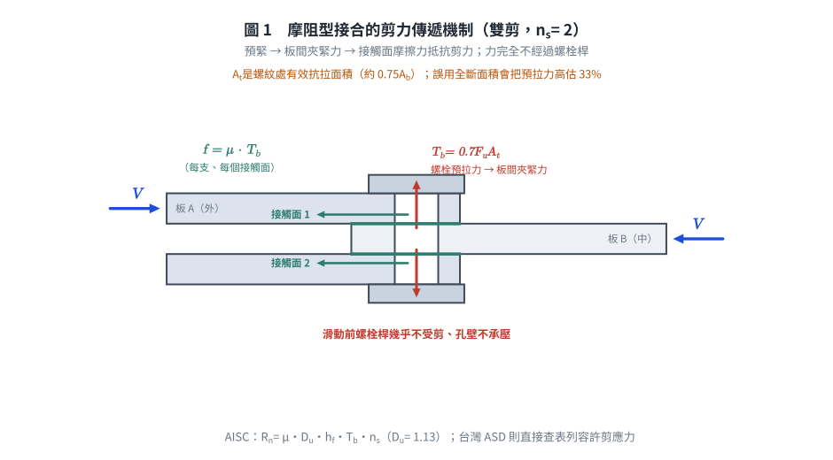
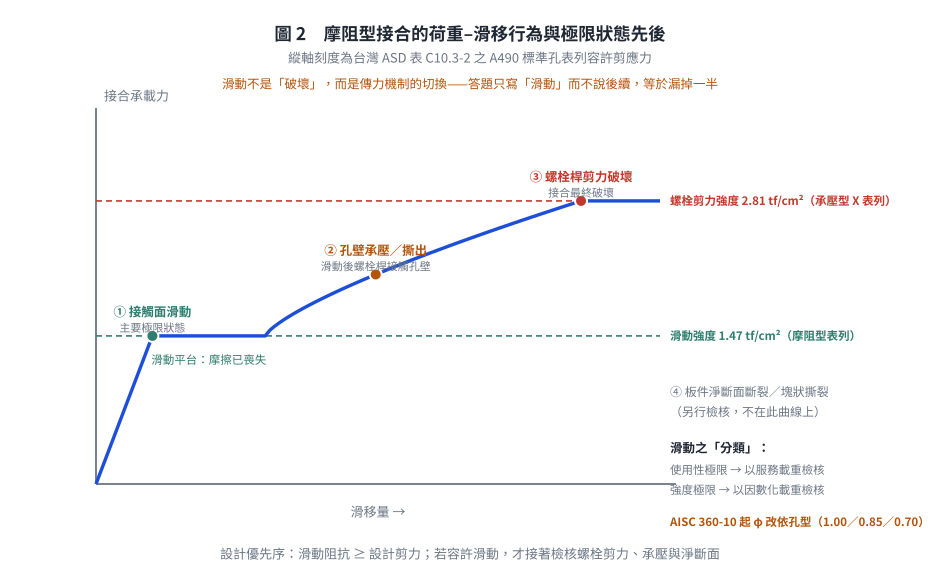

# SS-2017-2 — 摩阻型（Slip-critical）螺栓接合之剪力傳遞機制與極限狀態定義

**來源：** 專門職業及技術人員高等考試結構工程技師 · 鋼結構設計 · 第二題
**考年：** 2017（民國 106 年）
**主分類：** [[SS-U1-4]] 接合之分析與設計
**副分類：** 無
**設計法：** LRFD
**標籤：** `高強度螺栓` `摩阻型接合` `Slip-critical` `剪力傳遞機制` `極限狀態` `夾緊力` `摩擦係數` `滑動` `預拉力0.7Fu` `孔型係數` `規範版本差異`
**驗證狀態：** ⚠️ unverified

---

## 題幹摘要

請敘述高強度螺栓接合中摩阻型（Slip-critical）螺栓接合承受剪力時之**傳遞機制**及如何定義其**極限狀態**。（15 分）

---

---

## 核心考點

**核心觀念：高強度螺栓靠「夾力 → 摩擦」而非「螺栓直接承壓」來傳遞剪力**

此題測驗考生能否區分摩阻型（Slip-critical）與承壓型（Bearing-type）螺栓接合的根本差異，並正確定義滑動這個「極限狀態」的層面（使用性極限 or 強度極限？）。

**出題者測驗重點：**
- 高拉力預緊 → 夾緊力 → 摩擦力 的因果鏈
- 摩擦力的計算要素：夾緊力、摩擦係數（μ or ks）、接觸面數
- 極限狀態分類：滑動可能是 (a) 使用性極限狀態 或 (b) 強度極限狀態，依設計情境而定
- 摩阻型與承壓型的轉換關係

---

---

## 解題關鍵步驟

**步驟規劃：**
1. 說明「高拉力預緊」是摩阻型接合的先決條件
2. 說明剪力傳遞機制：摩擦力（非螺栓孔承壓）
3. 定義滑動極限狀態（主要）+ 其他極限狀態（次要）
4. 說明 LRFD 下的摩阻型設計公式

**關鍵陷阱：**

> ⚠️ **陷阱1：誤以為摩阻型螺栓靠螺栓桿傳力**
> 摩阻型設計的核心是**接觸面摩擦力**，不是螺栓桿的剪力或承壓。只要接合未滑動，螺栓桿實際上幾乎不受剪力（全靠夾緊力產生的摩擦）。

> ⚠️ **陷阱2：極限狀態只說「滑動」而未說明分類**
> 滑動在某些情況是使用性極限（服務載重下不能滑動，如：精密機械設備的接合，滑動後影響精度），在某些情況是強度極限（大地震或重要結構，滑動後立即破壞）。需要明確區分。

> ⚠️ **陷阱3：忘記「接觸面數（nf）」的影響**
> 一個螺栓可有單剪（nf = 1）或雙剪（nf = 2）接觸面，摩擦力與接觸面數成正比。

---

---

## 4. 步驟化詳細計算過程 (Step-by-Step Detailed Calculation)

### (一) 摩阻型螺栓接合承受剪力時的傳遞機制

#### 前提：高拉力預緊（High-Tension Preloading）

摩阻型接合的根本前提是螺栓在安裝時被施加高拉力（預緊力），在接合板間產生強大的**夾緊力（Clamping Force）**。

對於一支螺栓，其規定**最小預拉力** $T_b$ 依規範表列（台灣規範表 10.3-1 之原文：「等於最小抗拉強度之 **0.7 倍**」）：

$$T_b = 0.70 \times F_u^b \times A_t$$

其中 $F_u^b$ 為螺栓最小抗拉強度、$A_t$ 為**螺紋處有效抗拉面積**（$\approx 0.75 A_b$）。

*數值驗核（3/4 in A325，$F_u^b = 120$ ksi、$A_t = 0.334$ in²）：$0.70 \times 120 \times 0.334 = 28.1$ kips，與 AISC 表 J3.1 所列 28 kips 相符 ✓。若誤用全斷面積 $A_b = 0.442$ in² 則得 37.1 kips，高估 33%。*

日系扭剪型螺栓（F10T／S10T）之標準張力另依 JIS／CNS 表列（例如 M20 之設計軸力約 160 kN、M22 約 200 kN），台灣工程實務兩套系統並存，**須依設計圖說所指定之螺栓標準查表**。

#### 剪力傳遞機制：接觸面摩擦力

當接合承受水平剪力 $V$ 時：

```
 ─────────────────────────────────
 板 1（上）  |  ← V 受剪力
 ─────────────────────────────────
     ↑ 夾緊力 T₀        ← 螺栓高拉力預緊，使兩板緊密壓合
 ─────────────────────────────────
 板 2（下）  |
 ─────────────────────────────────
     接觸面存在摩擦力 f = μ × T₀
```

**傳遞步驟：**

1. **螺栓預緊**：安裝後，以扭力扳手、轉角法或直接張力指示器（DTI）等方式，將螺栓預緊至設計拉力 $T_o$。
2. **夾緊力形成**：螺桿拉伸 → 頭部和螺帽對鋼板形成夾緊壓力 $T_o$（正向力）。
3. **摩擦力抵抗剪力**：在接觸面（faying surface）上，摩擦力 $f = \mu \times T_o$ 抵抗外部剪力。
   - $\mu$（或 $k_s$）= 滑動係數，取決於接觸面處理方式（未塗裝 / 噴砂 / 熱浸鍍鋅等）
4. **不滑動狀態**：在外力未超過摩擦力總量之前，接合板不產生相對滑動，**螺栓桿本身幾乎不承受剪力或承壓力**。



*圖 1　剪力的傳遞路徑：預緊 → 夾緊力 → 接觸面摩擦，力完全不經過螺栓桿。這張圖攔的是「摩阻型靠螺栓桿傳剪」這個最根本的誤解，也標出 $T_b$ 要乘的是螺紋處有效抗拉面積 $A_t$。*

**設計滑動強度 —— 兩套規範寫法**

**(a) 台灣 2010 規範（容許應力設計法第十章）：表列容許剪應力**

台灣 ASD 規範**不用乘積公式**，而是直接表列摩阻型接合之螺栓容許剪應力（表 10.3-2／C10.3-2）：

| 螺栓 | 標準孔 | 超大孔／短槽孔 | 長槽孔 |
|------|-------|--------------|-------|
| A325 | 1.19 tf/cm²（17 ksi） | 1.05 | 0.84 |
| A490 | 1.47 tf/cm²（21 ksi） | 1.26 | 1.05 |

並於 §10.3.7 規定接觸面處理：「潔淨銹皮與噴氣清除及表面塗以護膜者，其**滑動係數應在 0.33 以上**」。

*（對照：同表之**承壓型** A490 螺紋不在剪力面者為 40 ksi = 2.81 tf/cm²——摩阻型僅為承壓型的 **52%**，這是摩阻型設計「較保守」的量化證據。）*

**(b) AISC 360 系列：乘積公式**

$$R_n = \mu \cdot D_u \cdot h_f \cdot T_b \cdot n_s$$

其中：
- $\mu$（或 $k_s$）= 平均滑動係數：**AISC 360-10 起** A 類（未塗裝軋製鋼）= **0.30**、B 類（噴砂）= **0.50**（360-05 之 A 類為 0.35；AISC LRFD 1993 與台灣規範為 0.33）
- $D_u = 1.13$ = 實際安裝預拉力與規定最小值之比
- $h_f$ = 填隙板（filler）係數（**360-10 起**取代 360-05 之孔型係數 $h_{sc}$）
- $T_b = 0.70F_u^bA_t$ = 規定最小預拉力
- $n_s$ = 接觸面（faying surface）數：單剪 = 1，雙剪 = 2

$$\phi R_n:\quad \begin{cases}
\text{AISC 360-05：} & \phi = 1.00\ (\text{使用性極限}),\quad \phi = 0.85\ (\text{強度極限}) \\[2pt]
\text{AISC 360-10／-16／-22：} & \phi = 1.00\ (\text{標準孔、短槽孔垂直力向}) \\
& \phi = 0.85\ (\text{超大孔、短槽孔平行力向}) \\
& \phi = 0.70\ (\text{長槽孔})
\end{cases}$$

> ⚠️ **這是本題最容易答錯的細節**：「$\phi = 1.0$ 用於使用性、$\phi = 0.85$ 用於強度」是 **AISC 360-05（及台灣規範所本之 LRFD 1999 附錄）**的規定；**AISC 360-10 起 $\phi$ 改依孔型取值**，孔型效應由 $h_{sc}$ 移入 $\phi$，而「使用性／強度」之區分則純粹決定**檢核時所用的載重組合**（使用載重 vs 因數化載重），不再影響 $\phi$。

**傳力機制示意（雙剪接合）：**

```
板A ──→ V ──→ 接觸面1（摩擦）──→ 板B ──→ 接觸面2（摩擦）──→ 板A
                nf = 2 → 總摩擦力 = 2 × μ × T₀（每支螺栓）
```

---

### (二) 極限狀態定義

摩阻型螺栓接合的**主要極限狀態**是**接合滑動（Slip）**，但依設計情境有不同分類：

#### 極限狀態 1：滑動（Slip）—— 主要極限狀態

**定義：** 當外部剪力超過接觸面摩擦阻力時，接合板產生相對位移（滑動），摩擦傳力失效。此為摩阻型接合的**設計控制極限狀態**。

| 滑動的設計分類 | 檢核載重 | 適用情境 | AISC 360-05 之 $\phi$ |
|--------------|---------|---------|---------------------|
| **使用性極限狀態（Serviceability）** | **服務載重**（未因數化） | 精密接合、疲勞接合、需避免板件相對位移影響幾何精度者；滑動後結構仍安全 | 1.00 |
| **強度極限狀態（Strength）** | **因數化設計載重** | 接合一旦滑動即危及結構安全（如超大孔或長槽孔使滑動量過大、或滑動後承壓型強度不足者） | 0.85 |

> 📌 **AISC 360-10 起之改變**：「使用性／強度」之區分**仍然存在**，但只決定**用哪一組載重去檢核**；$\phi$ 改依**孔型**取值（1.00／0.85／0.70）。台灣 2010 規範（ASD）則以表列容許剪應力涵蓋孔型效應（標準孔／超大孔／長槽孔三欄），概念一致。



*圖 2　滑動不是「破壞」，而是傳力機制的切換；滑動後接合轉為承壓型行為，還要再檢核螺栓剪力、孔壁承壓與淨斷面。這張圖攔的是極限狀態只答「滑動」而說不出後續與分類。*

#### 極限狀態 2：螺栓桿破壞（Bolt Shear Failure）

一旦接合滑動後（摩擦喪失），螺栓桿直接接觸孔壁，接合轉變為「承壓型行為」。繼續加載會導致螺栓桿剪力破壞：

$$R_n = F_{nv} \cdot A_b$$

其中 $F_{nv}$ = 螺栓剪力強度，$A_b$ = 螺栓截面積。

#### 極限狀態 3：承壓破壞（Bearing Failure）

螺栓孔壁承壓應力超過鋼板極限強度，孔壁擠壓擴孔：

$$R_n = 1.2 L_c t F_u \le 2.4 F_u d t \quad\text{（AISC 360-16 §J3.10；360-22 拆為承壓 §J3.11 + 撕出 §J3.12）}$$

#### 極限狀態 4：淨截面斷裂（Net Section Rupture）

接合板有孔，在螺栓排列方向的最危險斷面拉斷。

---

**各極限狀態的設計優先序（摩阻型）：**

```
摩阻型設計 → 首要控制：Slip Resistance ≥ 設計剪力
                     ↓（若滑動後）
                  轉承壓型行為 → 檢核：螺栓剪力 + 承壓 + 淨截面
```

$$\boxed{\text{主要極限狀態：接觸面滑動（Slip at faying surface）}}$$

---


*（詳見原始解析）*

---

## 涉及陷阱

**步驟規劃：**
1. 說明「高拉力預緊」是摩阻型接合的先決條件
2. 說明剪力傳遞機制：摩擦力（非螺栓孔承壓）
3. 定義滑動極限狀態（主要）+ 其他極限狀態（次要）
4. 說明 LRFD 下的摩阻型設計公式

**關鍵陷阱：**

> ⚠️ **陷阱1：誤以為摩阻型螺栓靠螺栓桿傳力**
> 摩阻型設計的核心是**接觸面摩擦力**，不是螺栓桿的剪力或承壓。只要接合未滑動，螺栓桿實際上幾乎不受剪力（全靠夾緊力產生的摩擦）。

> ⚠️ **陷阱2：極限狀態只說「滑動」而未說明分類**
> 滑動在某些情況是使用性極限（服務載重下不能滑動，如：精密機械設備的接合，滑動後影響精度），在某些情況是強度極限（大地震或重要結構，滑動後立即破壞）。需要明確區分。

> ⚠️ **陷阱3：忘記「接觸面數（nf）」的影響**
> 一個螺栓可有單剪（nf = 1）或雙剪（nf = 2）接觸面，摩擦力與接觸面數成正比。

---

---

## 圖形

| 檔案 | 類型 | 內容 |
|------|------|------|
| [SS-2017-2-fig-1-mechanism.svg](../../raw/solutions/SS-2017-2/figs/SS-2017-2-fig-1-mechanism.svg) | SVG 向量圖 | 摩阻型剪力傳遞機制（雙剪）（腳本 `gen_SS-2017-2.py` 產生） |
| [SS-2017-2-fig-2-slip-behavior.svg](../../raw/solutions/SS-2017-2/figs/SS-2017-2-fig-2-slip-behavior.svg) | SVG 向量圖 | 荷重–滑移行為與極限狀態先後（腳本 `gen_SS-2017-2.py` 產生） |
| [SS-2017-2-fig-3-strength-compare.svg](../../raw/solutions/SS-2017-2/figs/SS-2017-2-fig-3-strength-compare.svg) | SVG 向量圖 | 摩阻型 vs 承壓型容許剪應力（腳本 `gen_SS-2017-2.py` 產生） |

## 相關概念

[[CONNECTION-DESIGN]]

## 相關題目

*（請參閱 [原始解析](../../raw/solutions/SS-2017-2/SS-2017-2.md) 取得完整計算內容）*
