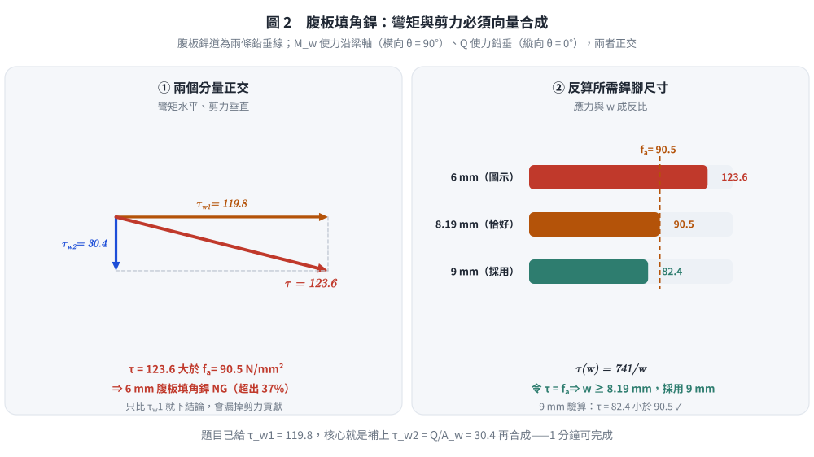

# SS-2018-3 — 箱型柱－H 型梁接頭之填角銲檢核（梁腹組合應力＋梁翼力偶）

**來源：** 專門職業及技術人員高等考試結構工程技師 · 鋼結構設計 · 第三題
**考年：** 2018（民國 107 年）
**主分類：** [[SS-U1-4]] 接合之分析與設計
**副分類：** [[SS-U2-3]]（涉及 SN 鋼材特性）
**設計法：** ASD
**標籤：** `填角銲` `梁柱接頭` `ASD` `銲道容許應力` `SN400B` `箱型柱` `H型梁` `梁翼彎矩` `梁腹彎矩` `組合應力` `翼板填角銲` `方向性強度` `日本AIJ容許應力`
**驗證狀態：** ⚠️ unverified

---

## 題幹摘要

**題目：** 試以容許應力設計法（ASD）檢核圖中 SN400B 鋼箱型柱-H 型梁接頭之銲接尺寸。梁翼與梁腹負擔彎矩分別為 $M_f = 124.5$ kNm 與 $M_w = 25.5$ kNm。（30 分）

**已知條件（題目給定）：**

| 參數 | 數值 |
|------|------|
| 梁翼負擔彎矩 | $M_f = 124.5$ kNm |
| 梁腹負擔彎矩 | $M_w = 25.5$ kNm |
| 總彎矩 | $M = M_f + M_w = 150$ kNm |
| 設計剪力 | $Q = 100$ kN |
| 銲道容許應力 | $f_a = 90.5$ N/mm² |
| 梁腹銲喉斷面模數 | $S_w = \dfrac{2 \times 6/\sqrt{2} \times 388^2}{6} \times 10^{-3} = 212.9$ cm³ |
| 銲道外側拉應力 | $\tau_{w1} = M_w/S_w = 119.8$ N/mm² |
| 鋼材 | SN400B（JIS G3136：$F_y \ge 235$ N/mm²、$F_u = 400\text{–}510$ N/mm²；基準強度 $F = 235$ N/mm²）|

**梁斷面（H 型，尺寸取自圖形）：**

| 部位 | 尺寸 |
|------|------|
| 總高度 | 500 mm（含翼板）|
| 翼板寬度 $b_f$ | 200 mm |
| 翼板厚度 $t_f$ | 16 mm |
| 腹板厚度 $t_w$ | 9 mm |

**銲接配置（2026-08-22 以 300 dpi 影像重新判讀原始試卷確認）：**
- 梁上翼板：**6 mm 填角銲**（圖中三角形銲接符號 + 「6」）
- 梁腹板：**6 mm 填角銲**（雙面），有效長度 388 mm
- 梁下翼板：**6 mm 填角銲**
- 柱為箱型斷面，於梁翼板高度處設內橫隔板（圖中柱內水平線）

> ⚠️ **重大更正**：舊版解析將梁翼板判為「完全熔透開槽銲（CJP）」並以母材強度 $0.6F_y$ 檢核，得「OK」。經重新判讀，**圖中三處銲接符號皆為填角銲、皆標註 6 mm**（上翼板、腹板、下翼板各一），故梁翼板必須以**填角銲喉面積**檢核。更正後梁翼板銲道亦為 **NG**（見 §4）。

*圖說：梁柱接頭圖。柱為 SN400B 箱型斷面（於梁翼板高度處設內橫隔板，圖中柱內兩條水平線）；梁為 SN400B H 型斷面（總高 500 mm、翼寬 200 mm、翼厚 16 mm、腹厚 9 mm）。圖中共三個銲接符號，**皆為填角銲且皆標註「6」（mm）**：上翼板一處、腹板中央一處、下翼板一處。腹板銲道上端另標「40」（mm），為腹板端部之扇形開孔（scallop）尺寸，故腹板銲道有效長度 $= 500 - 2\times(16+40) = 388$ mm（上下各扣 56 mm），與題目所給 $S_w$ 公式中的 388 mm 相符。作用力：$M = 150$ kN·m（順時針箭頭）、$Q = 100$ kN（向下箭頭）。右側為梁斷面尺寸圖，單位 mm。*

---

---

## 核心考點

**核心觀念：** 梁柱接頭將梁端彎矩分為「梁翼負擔部分 $M_f$」與「梁腹負擔部分 $M_w$」，兩者分別由不同類型的銲道承擔。腹板銲道同時承受 $M_w$（產生彎曲應力）與 $Q$（產生剪應力），需以向量合成計算組合應力。

**出題者意圖：**
1. 考核梁柱接頭彎矩分配（翼板 vs 腹板）的物理意義
2. 考核腹板填角銲在彎矩＋剪力作用下的組合應力計算
3. 考核翼板填角銲之強度驗算（由 $M_f$ 反算翼板拉／壓力偶）
4. $\tau_{w1} = 119.8 > f_a = 90.5$，引導學生計算所需銲道尺寸

---

---

## 解題關鍵步驟

**作戰計畫：**
1. 確認腹板銲道有效長度（188 mm 起迄計算）
2. 計算腹板銲道組合應力（$\tau_{w1}$：彎矩，$\tau_{w2}$：剪力，向量合成）
3. 判定 6 mm 腹板銲道 → NG，求所需最小銲道尺寸
4. 驗算梁翼接合（CJP 銲道對應翼板應力）

**關鍵陷阱：**

| 陷阱 | 說明 | 應對 |
|------|------|------|
| ❌ $\tau_{w1}$ 直接與 $f_a$ 比較即下結論 | 腹板銲道尚有剪力 $Q$ 貢獻的 $\tau_{w2}$，需向量合成才是真實應力 | 計算 $\tau_{w2}$ 後合成再比較 |
| ❌ 銲喉面積計算錯誤 | 填角銲有效喉厚 = $w/\sqrt{2} = 0.707w$，不是 $w$；且雙面銲需乘 2 | $A_w = 2 \times (w/\sqrt{2}) \times l_w$ |
| ❌ 腹板銲道長度直接用 500 mm | 銲道需留開口或返銲空間（40 mm）及翼板高度（16 mm），有效長 = 388 mm | 按題目所給 $S_w$ 公式中的 388 mm |
| ❌ 憑「彎矩接頭應為 CJP」的印象跳過翼板填角銲計算 | 本題圖面明確標示三處**皆為 6 mm 填角銲**；實務上彎矩接頭梁翼多採 CJP，但**考試須依圖作答** | 先數銲接符號、確認型式，再選公式；並可在答案中評論「實務建議改為 CJP」 |
| ❌ 誤用 $F_y = 245$ N/mm² | 245 是 **SM400A/B**（$t \le 16$ mm）之值；**SN400B 為 235** N/mm² | 由題目 $f_a = 90.5$ 反推 $F = 90.5 \times 1.5\sqrt{3} = 235$ N/mm² 可自我驗證 |

---

---

## 4. 步驟化詳細計算過程 (Step-by-Step Detailed Calculation)

### 【梁腹銲道檢核】（6 mm 填角銲，雙面）

#### Step 1：確認腹板銲道幾何

由題目 $S_w$ 公式反推：

$$S_w = \frac{2 \times (6/\sqrt{2}) \times 388^2}{6} \times 10^{-3}$$

可知腹板銲道有效長度 $l_w = 388$ mm（上下各留空 56 mm = 16 mm 翼板 + 40 mm 返銲空間）

有效喉厚：$t = 6/\sqrt{2} = 4.243$ mm

#### Step 2：彎矩引起之銲道應力 $\tau_{w1}$（題目已給）

$$\tau_{w1} = \frac{M_w}{S_w} = \frac{25.5 \times 10^6}{212,900} = 119.8 \text{ N/mm}^2$$

此為腹板銲道**外側極端纖維**的彎曲剪應力（水平向）。

#### Step 3：剪力引起之銲道應力 $\tau_{w2}$

腹板銲道截面積（雙面）：
$$A_w = 2 \times t \times l_w = 2 \times 4.243 \times 388 = 3{,}292 \text{ mm}^2$$

剪力應力（垂直向）：
$$\tau_{w2} = \frac{Q}{A_w} = \frac{100{,}000}{3{,}292} = 30.4 \text{ N/mm}^2$$

#### Step 4：向量合成最大組合應力

$\tau_{w1}$（水平）與 $\tau_{w2}$（垂直）方向正交，向量合成：

$$\tau = \sqrt{\tau_{w1}^2 + \tau_{w2}^2} = \sqrt{119.8^2 + 30.4^2} = \sqrt{14352 + 924} = \sqrt{15276}$$

$$\boxed{\tau = 123.6 \text{ N/mm}^2}$$

#### Step 5：與容許應力比較

$$\tau = 123.6 \text{ N/mm}^2 > f_a = 90.5 \text{ N/mm}^2 \quad \Rightarrow \text{ NG} ✗$$

**6 mm 腹板填角銲不符合 ASD 要求。**

---

*圖 2　彎矩與剪力必須向量合成才是真實應力。題目已給 $\tau_{w1}$，核心就是補上 $\tau_{w2} = Q/A_w$；這張圖攔的是直接拿 $\tau_{w1}$ 與 $f_a$ 比較就下結論。*

#### Step 6：求所需腹板填角銲尺寸

設所需銲腳尺寸為 $w_{\text{req}}$，喉厚 = $0.707 w_{\text{req}}$

$$S_w(w) = \frac{2 \times 0.707 w_{\text{req}} \times 388^2}{6} = 35{,}503 \, w_{\text{req}} \text{ mm}^3$$

$$A_w(w) = 2 \times 0.707 w_{\text{req}} \times 388 = 549.0 \, w_{\text{req}} \text{ mm}^2$$

組合應力：

$$\tau(w) = \sqrt{\left(\frac{M_w}{S_w}\right)^2 + \left(\frac{Q}{A_w}\right)^2} = \sqrt{\left(\frac{718.3}{w_{\text{req}}}\right)^2 + \left(\frac{182.1}{w_{\text{req}}}\right)^2}$$

$$= \frac{1}{w_{\text{req}}}\sqrt{718.3^2 + 182.1^2} = \frac{1}{w_{\text{req}}}\sqrt{515{,}995 + 33{,}160} = \frac{741}{w_{\text{req}}}$$

令 $\tau = f_a = 90.5$：

$$w_{\text{req}} = \frac{741}{90.5} = 8.19 \text{ mm} \quad \Rightarrow \text{採用 } \boxed{w = 9 \text{ mm}}$$

**驗算 9 mm 填角銲：**

| 參數 | 數值 |
|------|------|
| 喉厚 $t$ | $9 \times 0.707 = 6.364$ mm |
| $S_w$ | $2 \times 6.364 \times 388^2 / 6 = 319{,}404$ mm³ |
| $A_w$ | $2 \times 6.364 \times 388 = 4{,}938$ mm² |
| $\tau_{w1} = M_w/S_w$ | $25.5 \times 10^6 / 319{,}404 = 79.8$ N/mm² |
| $\tau_{w2} = Q/A_w$ | $100{,}000 / 4{,}938 = 20.3$ N/mm² |
| $\tau = \sqrt{\tau_{w1}^2 + \tau_{w2}^2}$ | $\sqrt{79.8^2 + 20.3^2} = \sqrt{6368+412} = 82.4$ N/mm² |
| 判定 | $82.4 < 90.5$ → **OK ✓** |

---

### 【梁翼銲道檢核】（6 mm 填角銲 —— 已更正，非 CJP）

#### Step 1：梁翼力偶臂與翼板力

梁總高度 $d = 500$ mm（含翼板），翼板厚度 $t_f = 16$ mm

$$\text{力偶臂} = d - t_f = 500 - 16 = 484 \text{ mm}$$

$$F_f = \frac{M_f}{\text{力偶臂}} = \frac{124.5 \times 10^6}{484} = 257{,}231 \text{ N} = 257.2 \text{ kN}$$

#### Step 2：翼板填角銲之有效銲長與喉面積

翼板端面頂住柱面，填角銲沿翼板**上表面與下表面**各一道：

$$L_f = 2 b_f = 2 \times 200 = 400 \text{ mm} \qquad(\text{保守取法，略去兩側端邊 } 2t_f)$$

$$A_{wf} = 0.707 w \times L_f = 0.707 \times 6 \times 400 = 1{,}697 \text{ mm}^2$$

#### Step 3：翼板銲道應力與判定

$$\tau_f = \frac{F_f}{A_{wf}} = \frac{257{,}231}{1{,}697} = \boxed{151.6 \text{ N/mm}^2} > f_a = 90.5 \text{ N/mm}^2 \;\Rightarrow\; \textbf{NG} ✗$$

#### Step 4：所需翼板銲腳尺寸

$$w_{req} = 6 \times \frac{151.6}{90.5} = 10.05 \text{ mm} \;\Rightarrow\; \text{採用} \boxed{w = 10 \text{ mm}}$$

**最大銲腳尺寸檢核**（沿 16 mm 板緣）：$w \le t_f - 2 = 14$ mm ✓

**若改採較寬鬆之有效長度** $L_f = 2b_f + 2t_f = 432$ mm：

$$\tau_f = \frac{257{,}231}{0.707 \times 6 \times 432} = 140.3 \text{ N/mm}^2 > 90.5 \;\Rightarrow\; \text{仍 NG}，\quad w_{req} = 9.30 \text{ mm} \to 10 \text{ mm}$$

兩種取法均為 NG 且均需 10 mm，結論不受有效長度取法影響。

#### Step 5：翼板母材檢核（不控制）

$$\sigma_f = \frac{F_f}{b_f t_f} = \frac{257{,}231}{200 \times 16} = 80.4 \text{ N/mm}^2 < 0.6F_y = 0.6 \times 235 = 141 \text{ N/mm}^2 \;\checkmark$$

母材有餘裕 —— **不足的是銲道，不是翼板**。這也說明：若把翼板改為 CJP 開槽銲（銲道強度等同母材），則此接頭即可成立，這正是實務上彎矩接頭梁翼採 CJP 的原因。

---

*（詳見原始解析）*

---

## 涉及陷阱

**作戰計畫：**
1. 確認腹板銲道有效長度（188 mm 起迄計算）
2. 計算腹板銲道組合應力（$\tau_{w1}$：彎矩，$\tau_{w2}$：剪力，向量合成）
3. 判定 6 mm 腹板銲道 → NG，求所需最小銲道尺寸
4. 驗算梁翼接合（CJP 銲道對應翼板應力）

**關鍵陷阱：**

| 陷阱 | 說明 | 應對 |
|------|------|------|
| ❌ $\tau_{w1}$ 直接與 $f_a$ 比較即下結論 | 腹板銲道尚有剪力 $Q$ 貢獻的 $\tau_{w2}$，需向量合成才是真實應力 | 計算 $\tau_{w2}$ 後合成再比較 |
| ❌ 銲喉面積計算錯誤 | 填角銲有效喉厚 = $w/\sqrt{2} = 0.707w$，不是 $w$；且雙面銲需乘 2 | $A_w = 2 \times (w/\sqrt{2}) \times l_w$ |
| ❌ 腹板銲道長度直接用 500 mm | 銲道需留開口或返銲空間（40 mm）及翼板高度（16 mm），有效長 = 388 mm | 按題目所給 $S_w$ 公式中的 388 mm |
| ❌ 憑「彎矩接頭應為 CJP」的印象跳過翼板填角銲計算 | 本題圖面明確標示三處**皆為 6 mm 填角銲**；實務上彎矩接頭梁翼多採 CJP，但**考試須依圖作答** | 先數銲接符號、確認型式，再選公式；並可在答案中評論「實務建議改為 CJP」 |
| ❌ 誤用 $F_y = 245$ N/mm² | 245 是 **SM400A/B**（$t \le 16$ mm）之值；**SN400B 為 235** N/mm² | 由題目 $f_a = 90.5$ 反推 $F = 90.5 \times 1.5\sqrt{3} = 235$ N/mm² 可自我驗證 |

---

---

## 圖形

| 檔案 | 類型 | 內容 |
|------|------|------|
| [SS-2018-3-fig-1.png](../../raw/solutions/SS-2018-3/SS-2018-3-fig-1.png) | PNG 附圖 | 題目附圖 |
| [SS-2018-3-fig-1-joint.svg](../../raw/solutions/SS-2018-3/figs/SS-2018-3-fig-1-joint.svg) | SVG 向量圖 | 接頭重繪：三處皆 6 mm 填角銲（腳本 `gen_SS-2018-3.py` 產生） |
| [SS-2018-3-fig-2-web-stress.svg](../../raw/solutions/SS-2018-3/figs/SS-2018-3-fig-2-web-stress.svg) | SVG 向量圖 | 腹板銲道應力之向量合成（腳本 `gen_SS-2018-3.py` 產生） |
| [SS-2018-3-fig-3-code-compare.svg](../../raw/solutions/SS-2018-3/figs/SS-2018-3-fig-3-code-compare.svg) | SVG 向量圖 | 三套規範之容許應力對照（腳本 `gen_SS-2018-3.py` 產生） |

## 相關概念

[[CONNECTION-DESIGN]] | [[SEISMIC-CONNECTION-DETAILS]] | [[WELDED-CONNECTION-DESIGN]]

## 相關題目

*（請參閱 [原始解析](../../raw/solutions/SS-2018-3/SS-2018-3.md) 取得完整計算內容）*
