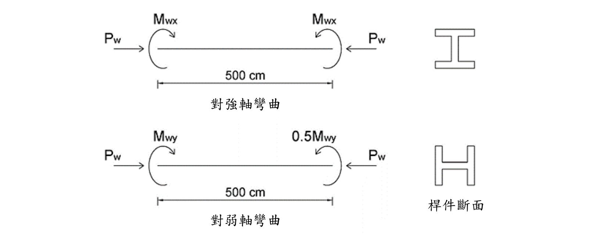

# SS-2020-3 — H400×400×12×22 梁柱桿件 LRFD 雙軸彎矩 + B1 放大（求最大 Mwy）

**來源：** 專門職業及技術人員高等考試結構工程技師 · 鋼結構設計 · 第三題
**考年：** 2020（民國 109 年）
**主分類：** [[SS-U1-3]] 梁柱桿件
**副分類：** 無
**設計法：** LRFD
**標籤：** `梁柱桿件` `P-M互制` `雙軸彎矩` `載重放大係數` `B1放大法` `有效長度` `柱強度` `弱軸彎矩` `LRFD互制方程式`
**驗證狀態：** ✅ verified

---

## 題幹摘要

H 400×400×12×22 梁柱桿件，承受工作載重：
- 軸力：$P_w = 150$ tf（兩端對壓）
- 強軸彎矩：$M_{wx} = 6$ tf·m（兩端等值，**單曲率**）
- 弱軸彎矩：$M_{wy}$（大端）與 $0.5M_{wy}$（小端），**單曲率**
- 桿長 $L = 500$ cm，兩端有側向支撐
- $K_x = 1.8$，$K_y = 1.2$；$F_y = 2.5$ tf/cm²；載重係數 $r = 1.6$

求弱軸尚可承受之最大工作彎矩 $M_{wy}$。



*圖說：強軸（上圖）：兩端等值端彎矩 $M_{wx}$，方向使桿件呈**單曲率**，$P_w$ 由兩端對向施加，桿長 500 cm；弱軸（下圖）：大端 $M_{wy}$、小端 $0.5M_{wy}$，同向（**單曲率**），$P_w$ 相同。桿件兩端均設有側向支撐。*

---

## 核心考點

1. **載重係數 $r$**：工作載重（軸力＋兩軸彎矩）全部乘以 $r=1.6$ 得設計載重
2. **強弱軸 $\lambda_c$ 各算取大**：弱軸控制（$\lambda_{cy} = 0.636 > \lambda_{cx} = 0.563$）
3. **B1 放大係數**：兩軸均為單曲率，$M_1/M_2$ 取負號，$B_1 > 1$ 須實際放大彎矩
4. **H1-1a 互制方程式**（$P_u/\phi_cP_n = 0.612 \geq 0.2$）：解出最大 $M_{wy}$

---

## 解題關鍵步驟

```
Step 1：設計載重換算
        Pu = 1.6 × 150 = 240 tf
        Mux,0 = 1.6 × 6 × 100 = 960 tf·cm

Step 2：細長比（強弱軸各算，取大）
        λcx = 1.8×500 / (π×17.56) × √(2.5/2100) = 0.563
        λcy = 1.2×500 / (π×10.36) × √(2.5/2100) = 0.636  ← 弱軸控制

Step 3：柱設計強度
        Fcr = exp(−0.419 × 0.636²) × 2.5 = 2.111 tf/cm²
        φcPn = 0.85 × 2.111 × 218.7 = 392.4 tf
        Pu/φcPn = 0.612 ≥ 0.2 → 用 H1-1a

Step 4：撓曲強度（Lb = 500 < Lp = 528.6 cm → 無 LTB → 直取 Mp）
        φbMnx = 0.9 × 2.5 × 3707 = 8,341 tf·cm
        φbMny = 0.9 × 2.5 × 1773 = 3,989 tf·cm

Step 5：B1 放大（兩軸單曲率，M1/M2 取負）
        Pe1x = π²×2100×67437 / 900² = 1,726 tf
        Pe1y = π²×2100×23473 / 600² = 1,353 tf
        B1x = 0.64/0.8609 × 2 − 0.32 = 1.167   (M1/M2 = −1)
        B1y = 0.64/0.8226 × 1.5 − 0.16 = 1.007 (M1/M2 = −0.5)
        Mux = 1.167 × 960 = 1,120.3 tf·cm
        Muy = 1.007 × 160Mwy = 161.1Mwy tf·cm

Step 6：互制方程式
        0.612 + (8/9)(1120.3/8341 + 161.1Mwy/3989) = 1.0
        → Mwy ≈ 7.5 tf·m  ✅
```

---

## 用到的公式

$$\lambda_c = \frac{KL}{\pi r}\sqrt{\frac{F_y}{E}} \quad,\quad F_{cr} = \exp(-0.419\,\lambda_c^2)\,F_y \quad (\lambda_c \leq 1.5)$$

$$\phi_c P_n = 0.85\,F_{cr}\,A_g$$

$$B_1 = \frac{0.64}{1-P_u/P_{e1}}\!\left(1-\frac{M_1}{M_2}\right) + 0.32\frac{M_1}{M_2} \geq 1.0$$

$$\frac{P_u}{\phi_c P_n} + \frac{8}{9}\!\left(\frac{M_{ux}}{\phi_b M_{nx}} + \frac{M_{uy}}{\phi_b M_{ny}}\right) \leq 1.0 \quad \text{（H1-1a，} P_u/\phi_cP_n \geq 0.2\text{）}$$

---

## 涉及陷阱

> ⚠️ **陷阱1：忽略載重係數 r**
> 所有工作載重（軸力＋兩軸彎矩）均需乘以 $r=1.6$，不可直接代入工作值。

> ⚠️ **陷阱2：強軸/弱軸 λc 混淆**
> $K_x \neq K_y$、$r_x \neq r_y$，需分別算出後取大值。本題弱軸控制但不可假設，需驗算。

> ⚠️ **陷阱3：M1/M2 符號（最常錯！）**
> 本題兩軸均為**單曲率**，$M_1/M_2$ 取**負號**（單曲率 = 「−」）。
> 強軸 $M_1/M_2 = -1$，弱軸 $M_1/M_2 = -0.5$ → $B_1 > 1$，彎矩須放大。
> 誤判為雙曲率（正值）→ $B_1 < 1$ 取 1.0 → 低估二階效應 → 答案偏不安全（8.0 vs 7.5 tf·m）。
> → 詳見 [[b1-m1m2-sign-convention]]

> ⚠️ **陷阱4：最終答案的單位還原**
> 題目問工作彎矩 $M_{wy}$；互制式中解出的是設計彎矩 $M_{uy}$，須除以 $r$ 才是答案。
> 本題設定 $M_{uy} = 1.6M_{wy}$，故解出 $M_{wy}$ 已是工作彎矩。

---

## 計算彙整

| 項目 | 數值 |
|------|------|
| 設計軸力 $P_u$ | 240 tf |
| 控制細長比 $\lambda_{cy}$（弱軸） | 0.636 |
| 柱臨界應力 $F_{cr}$ | 2.111 tf/cm² |
| 柱設計強度 $\phi_c P_n$ | 392.4 tf |
| $P_u/\phi_c P_n$ | 0.612（≥ 0.2 → H1-1a）|
| $\phi_b M_{nx}$ | 8,341 tf·cm |
| $\phi_b M_{ny}$ | 3,989 tf·cm |
| $B_{1x}$（單曲率，$M_1/M_2=-1$） | 1.167 |
| $B_{1y}$（單曲率，$M_1/M_2=-0.5$） | 1.007 |
| **最大弱軸彎矩 $M_{wy}$** | **≈ 7.5 tf·m** |

---

## 圖形

| 檔案 | 類型 | 內容 |
|------|------|------|
| [SS-2020-3-pm-viz.html](../../raw/solutions/SS-2020-3/SS-2020-3-pm-viz.html) | HTML 互動 | H400×400×12×22 LRFD 求最大 Mwy 互制圖 |
| [SS-2020-3-fig-1.png](../../raw/solutions/SS-2020-3/SS-2020-3-fig-1.png) | PNG 附圖 | 題目附圖（強軸/弱軸各別加載示意） |

---

## 相關概念

[[BEAM-COLUMN-INTERACTION]] | [[BIAXIAL-BENDING-BEAM]] | [[FLEXURAL-BUCKLING-GENERAL]] | [[MOMENT-AMPLIFICATION-B1-B2]]

## 相關知識點（code-ref）

[[b1-m1m2-sign-convention]] | [[column-buckling-lambda-boundary]] | [[pm-interaction-physical-meaning]]

## 相關題目

| 題號 | 相似點 |
|------|-------|
| [SS-2014-4](SS-2014-4.md) | 梁柱 B1/B2 放大 + P-M 互制（含地震組合）|
| [SS-2022-1](SS-2022-1.md) | 梁柱 + 柱強度曲線 + LTB |
| [SS-2013-4](SS-2013-4.md) | 梁柱 LRFD 互制 |

---

*（完整計算過程見 [原始解析](../../raw/solutions/SS-2020-3/SS-2020-3.md)）*
