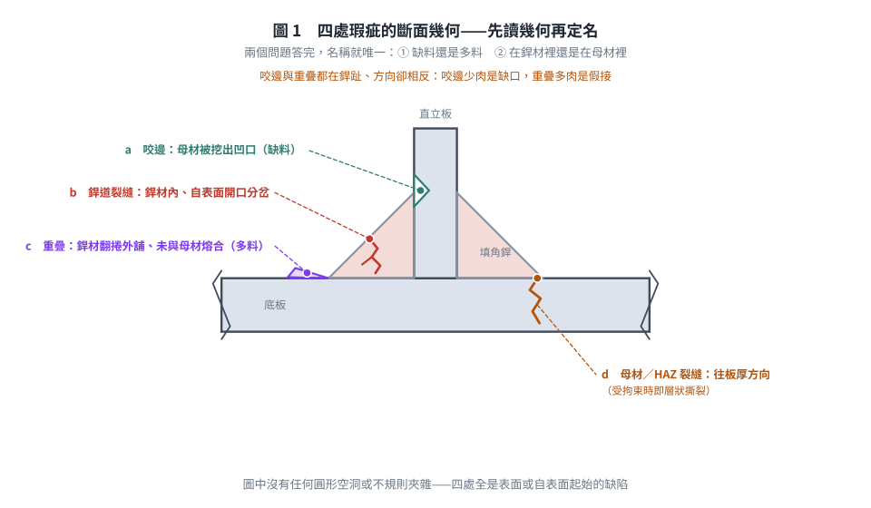
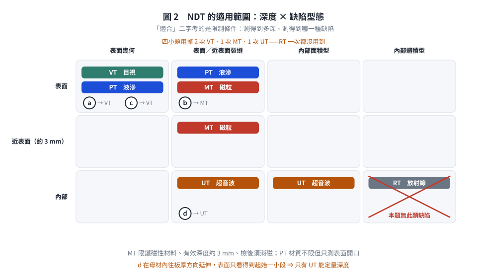
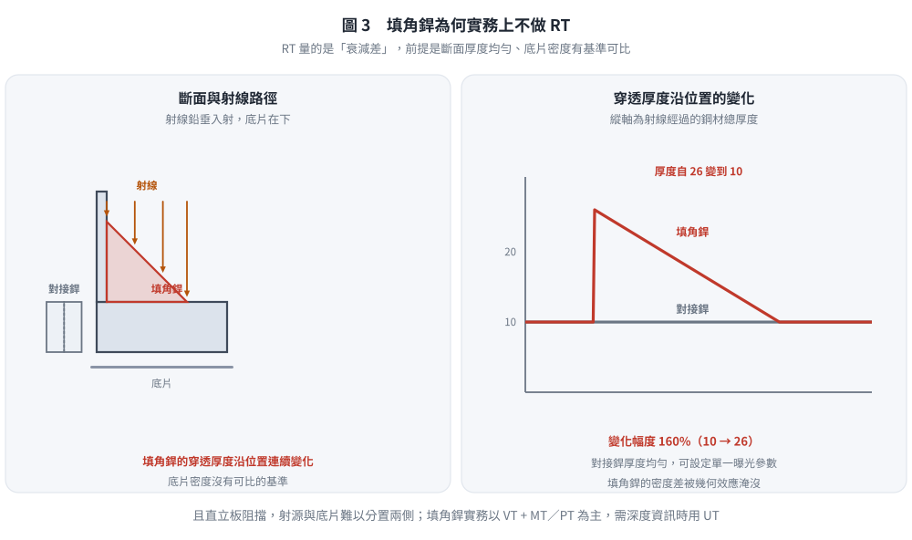

# SS-2021-1 — 請說明鋼結構銲道檢測常採用之五種非破壞檢測方法，若圖一中填角銲道銲接發現 a、b、c、d 四種瑕疵，請說明此四種瑕疵之名…

**來源：** 專門職業及技術人員高等考試結構工程技師 · 鋼結構設計 · 第一題
**考年：** 2021（民國 110 年）
**主分類：** [[SS-U2-3]] 設計規範對施工之要求
**副分類：** 無
**設計法：** 概念題
**標籤：** `施工規範` `非破壞檢測` `NDT` `銲道瑕疵` `咬邊` `重疊` `銲道裂縫` `層狀撕裂` `超音波檢測` `磁粒檢測` `液滲檢測` `目視檢測` `填角銲`
**驗證狀態：** ⚠️ unverified

---

## 題幹摘要

請說明鋼結構銲道檢測常採用之**五種非破壞檢測方法**，若圖一中填角銲道銲接發現 a、b、c、d 四種瑕疵，請說明此四種瑕疵之**名稱**及其對應適合之**一種非破壞檢測方式**。（25 分）

*圖說：圖一為 T 型接頭填角銲之斷面示意（手繪）。直立板（腹板）立於水平底板（翼板）之上，左右各一道填角銲，兩板均以折斷符號表示延續。四處標號的幾何特徵如下：*

- ***a** — 左側銲道**上銲趾**（銲道與直立板交會處）：直立板的輪廓線在該處被「挖」出一個內凹的缺口，母材斷面被削減。*
- ***b** — 左側銲道**銲面中段**：一條自銲道表面開口、向銲道內部延伸並分岔的鋸齒狀線條，位於銲材本體內。*
- ***c** — 左側銲道**下銲趾**（銲道與底板交會處）：銲材未與底板熔合，而是翻捲成一片唇狀突出、平舖在底板上表面之外側。*
- ***d** — 右側銲道**下銲趾正下方**：一條自銲趾起始、往**底板厚度方向**向下延伸且帶一個轉折的鋸齒狀線條，位置在**母材（底板）之內**，不在銲材內。*

*（圖中並無任何圓形空洞或斜線填充的內部夾雜物標示。）*

---

---

## 核心考點

**核心觀念：先讀「幾何」再讀「位置」——瑕疵長什麼樣決定它叫什麼，瑕疵在哪裡決定用什麼方法查**

本題圖中四個瑕疵**全部是表面或自表面起始的缺陷**，沒有一個是包在銲道內部的體積型缺陷。這正是出題者刻意設計的：填角銲的幾何（三角形斷面、厚度不均）使 **RT（放射線）幾乎不可用**，考生若反射性地把「氣孔／夾渣 → RT」套上去，等於沒有看圖。

**出題者測驗重點：**

1. 能完整說明五種常用 NDT 方法的原理、適用缺陷與限制
2. 能由**斷面幾何**辨識瑕疵名稱：母材被削 → 咬邊；銲材翻捲外舖 → 重疊；銲材內鋸齒線 → 裂縫；母材內鋸齒線 → 母材／熱影響區裂縫
3. 能為各缺陷配對「**適合之一種**」方法——「適合」二字是在考**限制條件**（材質是否磁性、缺陷是否表面開口、是否需要深度資訊）

---

---

## 解題關鍵步驟

**答題架構：**

1. 五種 NDT 方法（原理 + 適用缺陷 + 限制），建議以「由表面到內部」排序
2. 逐一辨識 a～d 之名稱（先描述幾何、再定名），各配一種方法並說明**為什麼是這一種**

---

## 4. 步驟化詳細計算過程 (Step-by-Step Detailed Calculation)

### 一、五種常用非破壞檢測方法（NDT）

#### ① 目視檢測（VT, Visual Testing）

**原理：** 以肉眼或輔助工具（放大鏡、內視鏡、**銲道量規**）直接觀察並量測銲道表面及其周邊母材。

**適用缺陷：** 咬邊、重疊、餘高過大／不足、銲腳尺寸不足、弧擊（銲蝕）、開口表面裂縫、飛濺與未清除之銲渣。

**限制：** 只能偵測**表面可見**缺陷，無法得知內部狀況。

**特點：** 最快速、成本最低，是**所有銲道的最低要求，不是可選項**；其他 NDT 都建立在 VT 已通過的前提上。

---

#### ② 液滲檢測（PT, Penetrant Testing）

**原理：** 於清潔的銲道表面施加有色或螢光滲透液，藉毛細作用滲入表面開口缺陷；清除多餘滲透液後施加顯像劑，將滲透液吸出而顯示缺陷。

**適用缺陷：** **表面開口**缺陷（表面裂縫、銲趾裂縫、開口氣孔、重疊翻捲下之縫隙），**材質不限**（含不鏽鋼、鋁等非磁性材料）。

*（詳見原始解析）*

---

*圖 1　四處瑕疵的斷面幾何。先問「缺料還是多料」「在銲材裡還是在母材裡」兩個問題，名稱就唯一。本圖攔的是把 a 與 c 這對「同在銲趾、方向卻相反」的瑕疵互換，以及把圖中根本沒有的圓形空洞讀成氣孔或夾渣。*

*圖 2　「適合」二字考的是限制條件：測得到多深、測得到哪一種缺陷。本圖攔的是把 MT 用在深度超過約 $3$ mm 的內部缺陷（d），以及在沒有體積型缺陷的填角銲上硬派 RT。*

*圖 3　填角銲的穿透厚度沿位置連續變化（本例 $10 \to 26$，變化 $160\%$），底片密度沒有可比的基準，加上直立板阻擋使射源與底片難以分置兩側。本圖攔的是「RT 適用於所有銲道」這個過度推廣。*

## 涉及陷阱

**關鍵陷阱：**

> ⚠️ **陷阱 1（本題最大的坑）：把四個標號直接套「氣孔／夾渣」**
> 圖中**沒有圓形空洞、也沒有斜線填充的不規則夾雜**。四處都是**表面幾何缺陷或裂縫**。填角銲斷面厚度連續變化，射線路徑長度不一致，底片對比失真，**RT 在填角銲上實務不採用**——本題四小題正確答案中不應出現 RT。

> ⚠️ **陷阱 2：咬邊（Undercut）vs 重疊（Overlap）分不清**
> 兩者都在銲趾、都是表面幾何缺陷，方向卻相反：
> - **咬邊**＝母材被電弧熔蝕掉、銲材**沒有填回來** ⇒ 斷面出現**凹口**（缺料）
> - **重疊**＝銲材流出銲趾、**未與母材熔合**而覆蓋其上 ⇒ 斷面出現**唇狀突出**（多料，但接不上）
>
> 記法：「**咬邊少肉、重疊多肉；少肉是缺口、多肉是假接**。」

> ⚠️ **陷阱 3：MT 與 PT 不是可以互換的同義詞**
> MT 限**鐵磁性材料**（碳鋼、低合金鋼），可測表面**及近表面約 3 mm 內**，靈敏度高，但檢後須消磁；PT 材質不限，卻**只能測表面開口**的瑕疵。本題母材為鋼，兩者皆可用，但要能講出「為什麼在這一處選它」。

> ⚠️ **陷阱 4：d 在母材裡，不是銲道問題**
> d 的鋸齒線起於銲趾但**往底板厚度方向走**，屬**母材／熱影響區裂縫**（板厚方向受拘束時即為層狀撕裂 Lamellar Tearing）。它會延伸到表面以下，**VT／MT 只看得到開口的那一小段**，要掌握深度與範圍必須用 **UT**。

---

---

## 圖形

| 檔案 | 類型 | 內容 |
|------|------|------|
| [SS-2021-1-fig-1.png](../../raw/solutions/SS-2021-1/SS-2021-1-fig-1.png) | PNG 附圖 | 題目附圖 |
| [SS-2021-1-fig-1-defects.svg](../../raw/solutions/SS-2021-1/figs/SS-2021-1-fig-1-defects.svg) | SVG 向量圖 | 四處瑕疵的斷面幾何與定名（腳本 `gen_SS-2021-1.py` 產生） |
| [SS-2021-1-fig-2-ndt-map.svg](../../raw/solutions/SS-2021-1/figs/SS-2021-1-fig-2-ndt-map.svg) | SVG 向量圖 | NDT 適用範圍（深度 × 缺陷型態）（腳本 `gen_SS-2021-1.py` 產生） |
| [SS-2021-1-fig-3-rt-fillet.svg](../../raw/solutions/SS-2021-1/figs/SS-2021-1-fig-3-rt-fillet.svg) | SVG 向量圖 | 填角銲為何實務上不做 RT（穿透厚度變化）（腳本 `gen_SS-2021-1.py` 產生） |

## 相關概念

[[WELD-INSPECTION-NDT]] | [[WELDED-CONNECTION-DESIGN]]

## 相關題目

*（請參閱 [原始解析](../../raw/solutions/SS-2021-1/SS-2021-1.md) 取得完整計算內容）*
